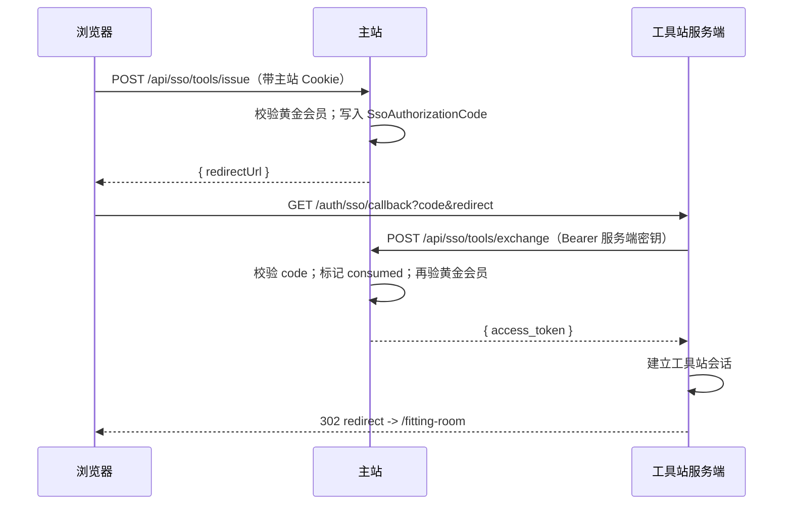

# 独立工具站 SSO 会话（逻辑说明）

## 参与者

- **浏览器**：仅持有主站 NextAuth 会话与工具站自有 Cookie（换票完成后）。  
- **主站**：签发一次性 `code`、签发/校验 JWT、`introspect` 复核黄金会员。  
- **工具站 BFF**（推荐）：接收浏览器、`exchange`、下发工具站 Session。

## 正常路径

## 失败分支（摘要）

| 情况 | 主站 / 工具站行为 |
|------|-------------------|
| 未登录调用 issue | HTTP 401 |
| 非黄金会员 | HTTP 403，`NOT_GOLD_MEMBER` |
| 环境变量未配置 | HTTP 503 |
| code 过期 / 已消费 / 伪造 | exchange HTTP 400 |
| exchange 后余额已不满足黄金会员 | HTTP 403，code 作废 |
| JWT 过期或伪造 | introspect HTTP 401 |

## 工具站实现清单（独立仓库）

1. 路由 **`GET /auth/sso/callback`**：仅服务端读取 query，**不把 `TOOLS_SSO_SERVER_SECRET` 发往浏览器**。  
2. `exchange` 使用 **`NEXT_PUBLIC_MAIN_ORIGIN` 或配置的主站 base URL** + `POST /api/sso/tools/exchange`。  
3. 敏感接口前调用 **`GET /api/sso/tools/introspect`**（Bearer `access_token`）。  
4. 生产 **HTTPS**；密钥与主站 **Deployment** 同步轮换。

## 与性能拆分的关系

推理/GPU 与 HTTP BFF 分离时：**鉴权仍在 BFF**，推理服务可用 **内网 mTLS** 或签发的 **短期服务令牌**，不由浏览器直连。
