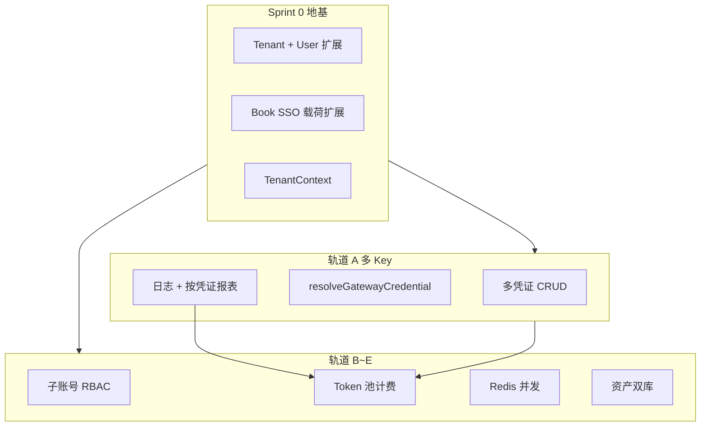

# Gateway 多凭证 + 租户体系 — 实施计划（待开发）

> **状态**：待开发  
> **创建**：2026-06-08  
> **关联产品草案**：`docs/imgs/AI工具平台 租户体系, 子帐号, 资产共享等, 需要设计.docx`  
> **平台约束**：[12-platform-app-federation.md](../product/12-platform-app-federation.md)、[gateway-user-guide.md](../product/gateway-user-guide.md)

---

## 0. 目标摘要

| 维度 | 目标态 |
|------|--------|
| **Gateway 多 Key** | 同一 `providerKind` 可绑多条厂商 Key（按 **渠道 channel** 区分）；使用前确定 **默认凭证** 或 **用户/项目覆盖** |
| **使用记录** | 每次请求必记 `credentialId` + 快照 + 用量/估价，支持 **按凭证汇总**（用户/渠道对账） |
| **模型范围** | 开启一条凭证 = 该厂商在 Gateway 目录中的 **全部模型** 可用（不一 Key 一模型）；上游权限不足时记失败日志 |
| **租户体系** | personal / team（主账号 + 子账号）、资产双库、套餐并发、Token 池计费 |
| **认证** | **扩展现有 Book SSO**（`introspect` 载荷），不新建 IdP |
| **并发** | 租户级 Redis 限流（托管服务，无需自购物理机） |

**计费分层（长期并存）**

| 租户 | 平台扣费 | 云厂商费 |
|------|----------|----------|
| personal（套餐 A） | 工具月费 / 年费 | BYOK 多 Key，日志估价供用户对账 |
| team（套餐 B/C/D） | 年费 + **Token 池** + 通道费 | 主账号管租户级多 Key；子账号只看个人明细 |

---

## 1. 实施策略：一层地基 + 五条轨道

不按「先租户还是先多 Key」硬排序，而是 **先铺共用地基**，再分轨交付。

```text
Sprint 0 · 平台地基（必做，个人用户无感）
  Tenant 表 / User 扩展 / SSO 载荷 / TenantContext / 凭证 ownerScope

轨道 A · Gateway 多 Key（1~2 周）← 近期优先价值
轨道 B · 子账号 RBAC（2 周）
轨道 C · 计费 Token 池 + 预冻结 + 双层账单（2~3 周，先 team）
轨道 D · Redis 租户并发（1 周）
轨道 E · 资产共享（2 周，偏 Story）
```

**推荐开发顺序**：`Sprint 0 → A → B → C → D → E`（两人可并行：0 完成后 A 与 E 方案并行）。

---

## 2. Sprint 0 — 共用地基

### 2.1 数据模型（Prisma · book-mall）

**Tenant**

```text
id, tenant_type (personal | team), package_level (A|B|C|D),
package_expire_time, max_concurrency, max_sub_users, ...
```

**User 扩展**（对齐租户 docx）

```text
tenant_id, parent_user_id, role_type (personal_user | team_admin | team_sub_user),
package_level, package_expire_time
```

**GatewayVendorCredential 扩展**

```text
owner_scope (USER | TENANT), owner_id, channel, sort_order, note
```

**GatewayApiKeyCredential 扩展**

```text
is_default_for_provider  // 每 apiKey + providerKind 至多一条 true
```

**GatewayRequestLog 扩展**

```text
tenant_id, actor_book_user_id,
credential_alias_snapshot, channel_snapshot
// credential_id 已有，成功请求禁止为空
```

**迁移策略**：为每个现有 Book 用户自动创建 `personal` 租户（1:1），行为与现网一致。

### 2.2 TenantContext（统一运行时）

所有生成入口（Canvas / Story / Ecom / Gateway 代理）读取：

```text
tenantId, tenantType, packageLevel, actorUserId, roleType,
gatewayAuth, billingMode (BYOK | TENANT_TOKEN)
```

### 2.3 SSO 扩展（非新 SSO）

| 接口 | 变更 |
|------|------|
| `POST /api/sso/tools/issue` | JWT 增加 `tenant_id`, `role_type`, `package_level`, `package_expire` |
| `GET /api/sso/tools/introspect` | 返回租户/角色/额度余量；套餐过期 `active: false` |
| `GET /api/sso/gateway/issue` | Gateway 控制台识别 `team_admin` |
| Book ↔ 子站转发链 | 不变；团队期 sk-gw 解析 **租户级** Key |

子账号仍通过 Book 登录 + SSO 进子站；`parent_user_id > 0` 标识子账号。

---

## 3. 轨道 A — Gateway 多 Key（待开发）

### 3.1 产品规则

1. 同厂商可添加多条凭证：`alias` + `channel`（渠道名，非「试用」语义）
2. **sk-gw 显式绑定**（停止 Personal Key 无脑全量自动同步）；支持「一键同步全部」
3. 每个 `providerKind` 在 sk-gw 上设 **默认凭证**
4. 产品侧（Canvas / Story / Ecom）可选「跟随默认 / 指定凭证」
5. 路由单一入口：`resolveGatewayCredential(apiKey, providerKind, modelKey, optionalCredentialId?)`

### 3.2 路由优先级

```text
1. 请求显式 credentialId（须属于本 sk-gw 绑定）
2. sk-gw 上该 providerKind 的 is_default_for_provider
3. sort_order 最小
4. 兼容：绑定列表第一条
```

### 3.3 权限（租户就绪后）

| 角色 | 凭证 |
|------|------|
| personal_user / team_admin | 增删改、设默认 |
| team_sub_user | 仅用；看个人明细；不可管 Key |

### 3.4 日志与结算 MVP

- 列表/导出含：凭证 alias、channel、model、tokens、estimatedVendorCostYuan
- 汇总 API：按 `credentialId` / `channel` / 时间范围聚合
- Gateway 控制台「用量 · 按凭证」Tab

### 3.5 验收标准

- [ ] 同厂商 ≥2 条 Key，channel 可区分
- [ ] sk-gw 勾选绑定 + 默认凭证
- [ ] 任意成功请求日志含 credentialId + 快照
- [ ] 按凭证导出/汇总
- [ ] `owner_scope` / `tenant_id` 字段存在且 personal 默认正确

**相关代码（现状待改）**

- `lib/gateway/gateway-credential-match.ts` — `pickCredentialIdForProvider` 仅取第一条
- `lib/gateway/api-key-service.ts` — Personal sk-gw 自动全绑
- `gateway-web/app/dashboard/keys/page.tsx` — 无绑定/默认编辑 UI

---

## 4. 轨道 B — 子账号 RBAC

对齐租户 docx §2、§7：

- 主账号创建/禁用子账号（上限随套餐 B/C/D）
- 子账号硬禁止：续费、充值、管 Key、管团队配置、删公共资产
- 所有写 API：`assertTenantPermission()`

---

## 5. 轨道 C — 计费（team 优先）

### 5.1 TenantWallet

```text
tenant_id, token_balance, cash_balance (通道费), ...
```

### 5.2 任务流（docx §6）

```text
提交 → preFreeze(estimate) → 余额不足拦截
成功 → settle；失败/取消 → release（Token 返还，失败不收通道费）
```

### 5.3 双层账单

| 视图 | 可见者 | 数据源 |
|------|--------|--------|
| 租户总账 | team_admin | `tenant_id` 聚合 |
| 个人明细 | 各成员 | `actor_book_user_id` + GatewayRequestLog |

多 Key 日志按 `credentialId/channel` 拆分，供渠道对账与平台算力差价核算。

**personal（套餐 A）**：维持现有 **月费 + BYOK**，不强制 Token 池。

---

## 6. 轨道 D — Redis 并发

### 6.1 现状

- 全站 **无 Redis**；Story 为进程内 semaphore，多副本不共享

### 6.2 目标（docx §5）

```text
tenant:{tenant_id}:run_num
tenant:{tenant_id}:max_concurrency   // A=2, B=5, C=10, D=35
tenant:{tenant_id}:queue_list
```

任务提交前原子校验；结束 `run_num--` 并 dequeue。

### 6.3 基础设施

| 环境 | 方案 |
|------|------|
| 生产 | 腾讯云 Redis 或 Upstash（托管，**无需自购服务器**） |
| 本地 | `docker-compose` 增加 `redis:7-alpine` 或 Upstash 免费档 |

Sprint 0 与轨道 A **不依赖** Redis。

---

## 7. 轨道 E — 资产共享（Story）

对齐 docx §3：

- `asset` 表：`tenant_id`, `owner_user_id`, `is_team_public`, `asset_type`
- team：公共库（主账号可删改）+ 子账号私有库
- personal：全部私有

与 Gateway 多 Key **无强依赖**，可与 B 并行。

---

## 8. 架构关系图



---

## 9. 与全站架构文档的同步点

完成各轨道后更新：

- `docs/全站架构图与配置表.md` §7 变更记录
- `doc/tech/gateway-volcengine-architecture.md` §7 多凭证（从「二期」改为本计划链接）
- `doc/product/gateway-user-guide.md` — 多凭证用户说明

---

## 10. 已拍板的产品决策（2026-06-08 讨论）

1. **渠道语义**：多 Key 用 `channel` / `alias` 区分，不绑定「试用/自用」产品标签。
2. **模型范围**：一凭证开通整厂商 Gateway 目录；上游 401/404 记失败，不做「一 Key 一模型」。
3. **personal 长期 BYOK**；team 用 Token 池 + 租户级多 Key（主账号管理）。
4. **SSO**：扩展现有 Book SSO，不新建登录体系。
5. **Redis**：轨道 D 引入托管 Redis，非新硬件。

---

## 11. 待办勾选（开发启动时复制到 PR）

### Sprint 0

- [ ] Prisma：Tenant、User 扩展、凭证/日志字段
- [ ] 迁移：现有用户 → personal 租户
- [ ] TenantContext + SSO introspect 扩展

### 轨道 A

- [ ] `resolveGatewayCredential` + 默认凭证
- [ ] sk-gw 绑定编辑 UI
- [ ] 日志快照 + 按凭证报表 API
- [ ] gateway-user-guide 多凭证章节

### 轨道 B ~ E

- [ ] （按上文分轨独立 PR）
