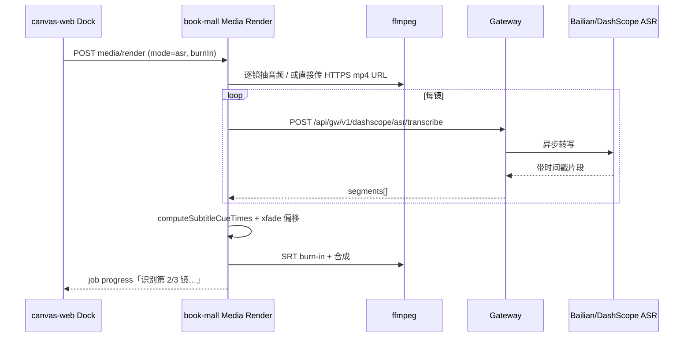

# 自动剪辑 · Gateway ASR 烧字幕 · 实施计划

> 状态：待实施 · MVP 范围 · 预估 3～5 人日  
> 关联：`media-render-service` · `jianying-media-render-actions` · Gateway 模型登记

## 背景

| 环节 | 现状 |
|------|------|
| 自动剪辑烧字幕 | ✅ 仅 `subtitle.mode: script`（分镜对白 → SRT → ffmpeg） |
| Gateway ASR | ❌ 未登记代理 |
| Media Render 协议 | `subtitle.mode`: `script` \| `none` |

目标：新增 **从各镜视频音频识别台词 → 按 xfade 时间线拼 SRT → 烧录**，全程经 **Gateway + sk-gw**，不在 book-mall 直连 DashScope Key。

## MVP 范围

- **模型**：`qwen3-asr-flash-filetrans`（百炼 · 文件/URL 转写 · 带时间戳）
- **模式**：`subtitle.mode = "asr"` + `burnIn: true`
- **入口**：画布 Pro2 / sbv1 · 自动成片 Dock
- **无语音镜**：跳过；可选 Phase 2 回退分镜对白
- **不做**：整段识别后再切分（与 xfade 难对齐）

## 架构



## 任务拆分

### Phase A · Gateway（1～1.5 天）

- [ ] 模型管理页登记 ASR：`qwen3-asr-flash-filetrans`（role: `ASR` 或 `LLM` 扩展）
- [ ] 凭证：走现有 BAILIAN/DASHSCOPE 池（平台代付 canonical 或用户 BYOK）
- [ ] 新增代理：`POST /api/gw/v1/dashscope/asr/transcribe`
  - 入参：`audioUrl` \| `file` · `language?` · `modelKey`
  - 出参：`segments: { startMs, endMs, text }[]`
  - 异步：提交 taskId → 轮询（与百炼 filetrans API 对齐）
- [ ] `GatewayRequestLog` · sk-gw 鉴权 · 错误映射
- [ ] 单元测试 / 沙箱 URL 验收

### Phase B · book-mall Media Render（1.5～2 天）

- [ ] 扩展 `RenderProfile`：

```ts
subtitle?: {
  mode: "script" | "asr" | "none";
  burnIn?: boolean;
  asrModelKey?: string; // 默认 qwen3-asr-flash-filetrans
};
```

- [ ] `runFfmpegMediaRender` 分支：`mode === "asr" && burnIn`
  - 逐镜：`ffmpeg -i clip.mp4 -vn -acodec pcm_s16le` 或 ASR 直接吃 OSS/HTTPS mp4
  - `resolveGatewayAuthForBookUser(userId)` 调 Gateway（`processMediaRenderJob` 已有 userId）
  - 进度：`progressLabel: "识别第 2/3 镜台词…"`
- [ ] 新增 `buildAsrSubtitleSrt(clips, segments, xfadeOffsets)` · 复用 `computeSubtitleCueTimes`
- [ ] 超时：`MEDIA_RENDER_JOB_TIMEOUT_SEC` 按镜数放宽，或 ASR 单独子超时
- [ ] 无语音镜：空 segments → 跳过；日志写 `GatewayRequestLog`
- [ ] API 契约写入 `book-mall/doc/tech/` · 回归测试（mock Gateway）

### Phase C · canvas-web UI（0.5 天）

- [ ] Dock「烧录台词字幕」下增加来源：
  - 分镜对白（现有 `script`）
  - 从视频音频识别（`asr`）
- [ ] 提交前检查 Gateway Key 关联（与生成视频相同 introspect）
- [ ] 进度文案透传 `progressLabel`
- [ ] 无 Gateway Key / ASR 失败 · 友好提示（非仅改 toast）

### Phase D · 测试与文档（0.5～1 天）

- [ ] 3 镜 xfade · 中英文 · 纯 BGM 镜跳过
- [ ] BYOK vs 平台代付各测一条
- [ ] 更新 `docs/ecom.md` 或产品说明（若对外）
- [ ] §7 变更记录（若动端口/ env 无则略）

## 关键设计

| 点 | 决策 |
|----|------|
| 逐镜 vs 整段 | **逐镜 ASR**，按剪辑顺序 + xfade 拼 SRT |
| 与 script 关系 | MVP 仅 `asr`；后续 `asr_with_script_fallback` |
| 费用 | ~0.00022～0.00026 元/秒 · BYOK 自担 · 平台走 canonical 池 |
| 质量 | 多人/环境音可能为空；允许跳过 |
| 鉴权 | 必须 Gateway · 禁止 book-mall `.env` 写厂商 Key |

## 验收标准

1. Dock 选「从视频音频识别」+ 勾选烧录 → 成片含识别字幕（非分镜表文案）
2. Gateway 控制台可见 ASR 请求日志
3. 无 sk-gw 时提交前拦截，文案明确
4. 3 镜任务总耗时在放宽超时内完成；失败可重试且 `failMessage` 可查

## 风险与依赖

- ASR 多为异步，Job 时长 +1～3 分钟/3 镜
- 本地 dev OSS 不稳定不影响 ASR（音频可走临时 HTTPS 或内存 buffer）
- Gateway 模型页需先登记，否则 introspect 不可见

## 后续（非 MVP）

- `asr_with_script_fallback`
- 电商分镜工作台复用同一 Gateway 代理
- 识别结果写入分镜表（反向填充对白列）
