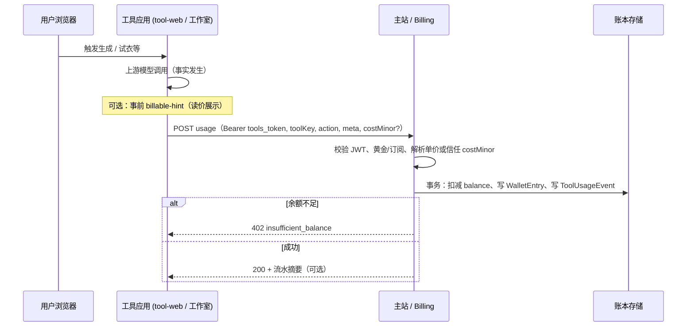

# 财务模块重构与工具联邦架构（草案）

> **状态**：架构讨论与设计意图；实现排期与接口冻结须另起迭代计划。  
> **通俗版整体方案（多域名、`m.ai-code8.com`、用户/后台/核算）**：[10-multimodal-studio-and-finance-master-plan.md](./10-multimodal-studio-and-finance-master-plan.md)。  
> **关联**：[`08-independent-tools-sso.md`](./08-independent-tools-sso.md)、[`02-users-billing-and-balance.md`](./02-users-billing-and-balance.md)、[`tech/tools-sso-environment.md`](../tech/tools-sso-environment.md)。**实施 checklist**：[2026-finance-billing-rollout.md](../plans/2026-finance-billing-rollout.md)。

---

## 1. 背景与目标

### 1.1 产品形态演进

- **主站（book-mall）**：账号、订阅、充值、管理后台、价目与策略配置；面向用户与运营。
- **工具站（tool-web）**：独立部署的工具套件入口；通过 SSO 与主站换票；**工具内的交互、调用模型、产生操作事实** 发生在工具站进程内。
- **未来的新能力**（例如「全模态工作室」）将延续 **与当前 tool-web 相同的模式**：**独立 Next 项目 / 独立仓库或 monorepo 子目录**，单独扩容与发布，**在信息架构上「挂」在工具站**（侧栏、统一壳、SSO 同域或同票据体系）。

### 1.2 动机

1. **重构财务模块**：将「钱、账、规则」从主站臃肿实现中 **边界化**，便于审计、迭代与合规。  
2. **新工具持续分离**：每个重型工具 / 工作室独立成应用，**不挤进主站**。  
3. **控制依赖**：工具侧尽量减少「主站随时在线 + 大量细粒度 HTTP」的耦合；同时 **不牺牲正确性**（扣款、流水、余额必须一致）。

### 1.3 已对齐的原则（共识）

- **写入与扣费规则只能有一份真相源（Single Writer / Single Policy）**：避免出现主站算一套、工具站算一套的 **双实现**。  
- **工具内发生的事实**：谁在什么时间对哪个 `toolKey` / 模型做了一次可计费动作——**事件起因在工具**；**是否入账、入多少、是否拒付**，由 **财务域统一裁决**（与当前「工具上报 `usage` + 主站在事务内扣款」的思想一致，只是实现形态可演进）。  
- **充值入口 vs 入账**：`tool` / 未来 `m` 可提供「去充值」链路至主站收银，**进账凭证与账本写入** 仍只经主站；**「当前可用余额是否够开跑」** 应与价目批量缓存 **分层**，门禁侧宜 **近实时**（产品口径见 [10 §4](./10-multimodal-studio-and-finance-master-plan.md)）。

---

## 2. 现状（简要）

- **权威数据**（`ToolBillablePrice`、钱包余额、流水等）在 **主站数据库**；工具站 **不直连主站库** 读价目时，通过 **`MAIN_SITE_ORIGIN` + `tools_token`** 调主站 ` /api/sso/tools/*`。  
- **方案 A 展示价**：工具站在部分路径上会 **本地公式 + 主站返回的零售系数**；主站不可用时 **catalog JSON 回退**（与主站不完全等价，属运维降级）。

该模式 **合理**，边界清晰、安全风险低；代价是 **工具侧对主站 HTTP 有运行时依赖**（可通过缓存与批拉缓解）。

---

## 3. 曾讨论的备选：同库 + 只拿 Token + 工具直连库

### 3.1 想法摘要

- 工具站只向主站换取 **token（或短时凭证）**，之后 **直接连同一 PostgreSQL** 读价目、写流水、扣余额。  
- 目的：减轻「每个动作都打主站 API」的依赖感。

### 3.2 结论（设计层）

| 层面 | 说明 |
|------|------|
| **Token 的含义** | 现有 SSO JWT 解决的是 **身份与粗粒度准入**；**不等于**「已获得在数据库上任意执行扣款的权利」。真正的扣款仍需 **同一套业务规则**。 |
| **同库直连** | 若工具站直接 `UPDATE Wallet`，则 **要么** 把 `resolveBillablePricePoints`、事务、幂等等 **复制/搬迁到工具站**，**要么** 抽成 **共享领域包** — 依赖从「HTTP」变为「代码 + schema + 迁移」强耦合，且工具站沦陷时的 **爆炸半径更大**。 |
| **「操作前先向主站拿钥匙」** | 可做到 **短时 DB 角色 / scoped 凭证**（运维复杂）；**不自动消灭**「谁实现扣款语义」问题，只是换凭证形态。 |

**因此**：同库直连 **不是默认推荐**；若将来采用，也应限定为 **只读副本或极少数只读表**，**入账仍经单一财务 API**。

---

## 4. 推荐演进方向（解决方案）

以下按 **侵入性从低到高** 排列，可与业务迭代穿插进行。

### 4.1 短期（保持单体，收敛边界）

在 **book-mall 内** 将财务相关代码收敛为清晰模块（例如 `lib/billing/*`、`lib/wallet/*`），对外暴露 **稳定的内部 API** 与 **对工具站的 HTTP 契约**（现有 `/api/sso/tools/billable-*`、`usage` 等可版本化）。  

**工具站**：继续只做 **事件上报 + 读价展示**；**扣款与流水写入** 仍只发生在主站侧实现（与今日一致）。

**收益**：不增加部署单元即可「重构财务模块」的 **代码边界**；依赖关系可控。

### 4.2 中期（财务边界服务化 — 推荐主线）

将「入账、价目解析、余额校验、流水、对账」收敛为 **Billing / Ledger 服务**（初期可仍是 **同一 Repo 的独立 Node 服务**，或 **book-mall 旁路的 Server**，再择机拆进程）：

| 角色 | 职责 |
|------|------|
| **工具应用**（tool-web / 未来 studio） | 产生 **计费意图**：`toolKey`、`action`、`meta`（任务 id、模型 id）、**建议金额或让服务端重算**；**不直接写钱包表**。 |
| **财务服务** | **唯一**执行「是否允许扣款 → 事务写 `WalletEntry` / `ToolUsageEvent`」；对外 **gRPC/HTTP**；鉴权仍基于 **tools_token 或 mTLS + 服务账号**（按需）。 |
| **主站 BFF / Admin** | 价目配置、人工调账、报表仍走主站 UI，**调用同一财务服务**。 |

**依赖形态**：工具对主站 **从「很多领域 HTTP」收窄为「认证/换票 + 少量 Billing API」**；价目可 **批量拉取 + 缓存**，扣款为 **单次幂等调用**。

### 4.3 读取路径优化（减少对主站在线的敏感）

在 **不破坏单点写入** 的前提下：

- **价目与配置**：工具侧 **短 TTL 缓存**；或 **只读副本 / 物化视图**（工具只读）；变更通过主站/财务服务发布。  
- **批量接口**：已有「价格表」类聚合接口方向正确，可继续合并请求、减少 chatty 调用。

### 4.4 与「新工具挂工具站」的衔接

- **导航与 SSO**：新应用与 tool-web 一致 — **统一壳或深度链接**，同一 `TOOLS_PUBLIC_ORIGIN` 体系或子路径反向代理；**换票仍经主站**。  
- **计费键**：每个新工具在 catalog / `toolKey` 上与主站 **单一注册**；工具内只发 **结构化 usage**，由财务服务解析。  
- **链接方式**：优先 **工具站作为「路由器」**（入口、登录态、计费上报约定），工作室独立域名可作为 **二级应用**（仍共享 cookie 域策略需在实现期定案）。

---

## 5. 概念辨析：「操作在工具」与「入账在一处」

| 概念 | 归属 | 说明 |
|------|------|------|
| **用户点了生成、模型被调用、任务 id 生成** | 工具 / 工作室 | **事实发生在工具侧**；适合记 `meta.taskId`、上游 trace。 |
| **是否黄金会员、余额是否够、单价行是否生效、扣多少点** | 财务域 | **策略与恒等式**；必须单点，否则对账困难。 |
| **持久化流水与余额** | 财务域（今：主站 DB + API） | 工具侧 **可发事件**，不应 **双写** 账本表。 |

共识可表述为：**工具拥有「动作与会话」；财务拥有「账」**。

---

## 6. 风险与待决问题

- **拆服务节奏**：过早拆进程会增加运维成本；建议 **先模块化 + API 稳定**，再拆部署。  
- **多工具重复计价逻辑**：方案 A 等 **应用层计算** 若保留在工具，须与财务服务 **同一算法源**（共享 npm 包或服务端重算为准）。  
- **跨域与 Cookie**：新工作室若独立子域，须与现有 SSO、**Secure / SameSite** 策略一起评审。

---

## 7. 建议的下一步（产品/技术）

1. **分阶段实施**：按 [`plans/2026-finance-billing-rollout.md`](../plans/2026-finance-billing-rollout.md) 勾选推进（模块化 → API 版本化 → 可选拆 Billing 进程）。  
2. **冻结 JSON 契约**：对 `usage`、`billable-prices`、`scheme-a-retail-multiplier` 做 **响应字段与错误码** 文档化后再引入 `/v1` 前缀或独立子域。  
3. **全模态工作室**：预留 `toolKey` 前缀、工具站 nav 注册、与 SSO 同源策略评审。

下文 **§8–§12** 为可直接进入评审的技术草案。

---

## 8. 序列图：工具侧一次可计费动作（单点入账）

目标态与现状一致的理想链路：**入账只经由主站（未来为 Billing 服务）一次事务**。

**要点**：工具 **不** 直接写入账本表；`meta.taskId`（若有）参与 **幂等**，防止重复扣款。

---

## 9. 现状 HTTP 与「Billing v1」概念映射

当前工具站依赖的主站路径（均以 **`MAIN_SITE_ORIGIN`** 为前缀、**`Authorization: Bearer <tools_token>`**，`exchange` 例外使用 Server Secret）与未来独立 Billing 服务的 **逻辑分组** 对应关系如下。

| 分组 | 现有路径（book-mall） | 职责 | v1 命名（草案） |
|------|----------------------|------|-----------------|
| **会话** | `POST /api/sso/tools/exchange` | 换票（Bearer **SERVER_SECRET**） | 保留在 Auth 边缘 |
| **会话** | `GET /api/sso/tools/introspect` | 活跃态、余额、角色 | `GET /v1/session` 或路径兼容 |
| **价目** | `GET /api/sso/tools/billable-prices` | 批量生效价目 | `GET /v1/pricebook` |
| **价目** | `GET /api/sso/tools/billable-price` | 单行解析 | `GET /v1/prices/resolve` |
| **方案 A** | `GET /api/sso/tools/scheme-a-retail-multiplier` | 零售系数 / billablePriceId | `GET /v1/scheme-a/multiplier` |
| **入账** | `POST /api/sso/tools/usage` | **唯一写路径**：扣款 + 流水 | `POST /v1/usage` |
| **查询** | `GET /api/sso/tools/usage` | 应用历史 | `GET /v1/usage/events` |

**版本策略**：可先增加 **`/api/sso/tools/v1/...`** 与旧路径并存；或 **Billing 独立 host** 由网关转发。

---

## 10. Billing HTTP v1 草案（OpenAPI 语义表）

下列为字段约定，供评审与后续 `openapi.yaml` 落地。鉴权：`Authorization: Bearer <tools_access_token>`（与今日工具 JWT 一致）。

### 10.1 `POST /v1/usage`

| 字段 | 类型 | 必填 | 说明 |
|------|------|------|------|
| `toolKey` | string | 是 | 与 `ToolBillablePrice.toolKey` 对齐 |
| `action` | string | 是 | 如 `try_on`、`invoke` |
| `costMinor` | number | 否 | 分；缺省时由服务端 **按价目重算** |
| `meta` | object | 否 | 可含 `taskId`、`modelId` 等 |
| `idempotencyKey` | string | 否 | 显式幂等；可回落 `meta.taskId` |

**响应（摘录）**：200 `{ "ok": true, "debitedMinor", "eventId?", "balanceMinor?" }`；402 `insufficient_balance`（不写流水）；401 无效 token；409 幂等冲突。

### 10.2 `GET /v1/pricebook`

**Query**：可选 `toolKeyPrefix`、`updatedSince`（增量同步）。

**Response**：与现有 `billable-prices` 列表结构对齐；后续可加 **ETag**。

### 10.3 `GET /v1/scheme-a/multiplier`

**Query**：`toolKey`、`modelKey`。响应对齐现 `scheme-a-retail-multiplier`。

### 10.4 `GET /v1/usage/events`

**Query**：`limit`（默认 50，最大 100）、`toolKeyPrefix`、可选 `cursor`。

---

## 11. 多工具 / 工作室注册（约定）

| 项 | 约定 |
|----|------|
| **toolKey** | 全局唯一；建议 `套件__子能力` 或工作室前缀 `multimodal-studio__*`。 |
| **侧栏** | 工具站 nav 或远程清单注册 **入口 URL + navKey**。 |
| **部署** | 独立构建上下文 / 容器；不并入 book-mall。 |
| **SSO** | 与 tool-web 相同 Origin/cookie 策略；必要时网关统一到 `tool.*` 域。 |

---

## 12. 分阶段实施清单

见 **[`plans/2026-finance-billing-rollout.md`](../plans/2026-finance-billing-rollout.md)**（可勾选、可随迭代增删）。

---

## 13. 修订记录

| 日期 | 变更 |
|------|------|
| 2026-05-13 | 初稿：讨论结论、演进方向、工具联邦前提。 |
| 2026-05-13 | 增补 §8–§12：序列图、API 映射、Billing v1 草案、多工具约定与 rollout 计划引用。 |
