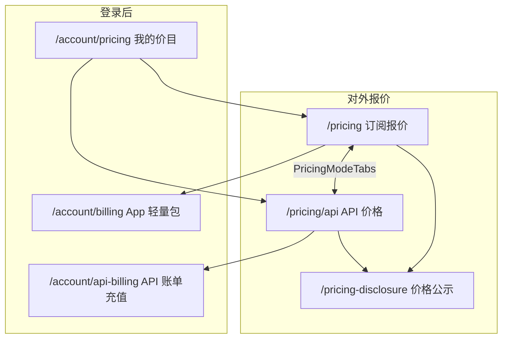

# API 会员 — 产品方案（定价 · 报价页 · 未实施）

> **状态**：产品口径与 **前台报价页结构** 已定稿（2026-08-17）；**不含代码实现**。
>
> **命名约定**
>
> | 用户叫法 | 系统 `billingPersona` | 说明 |
> |---------|----------------------|------|
> | **订阅会员 / 平台代付** | `PLATFORM_CREDIT` | App、工具站、画布；**订阅报价页** |
> | **API 会员** | `API_PLATFORM`（待定枚举名） | HTTP 调 `/api/gw/v1/*`；**API 价格页** + 随用随充 |
> | ~~自带 key 会员~~ | `BYOK` | C 端已下线；存量只读/迁移，不新开 |

---

## 1. 核心定价原则（已定稿）

### 1.1 三句话

1. **全站统一**：不管什么身份、什么会员，**同一模型扣减的积分相同**（一份 `ModelCreditPrice`）。
2. **价差在充值**：差别只在 **充 1 块钱能换多少积分**——**订阅贵、API 充值便宜**，鼓励 API 多调用。
3. **身份互斥**：一个账号 **只能是** 平台代付 **或** API 会员；两种都要 → **分身**（多个独立账号，架构预留）。

### 1.2 换算梯度（示意）

| 积分来源 | 折合 ¥/积分（示意） | 说明 |
|----------|---------------------|------|
| **App 会员月发** | 最高（如 ≈0.046） | 月费含 **工具与准入**，不单卖裸积分 |
| **App 轻量包充值** | 中等（如 ≈0.041，锚定 0.04 附近） | 纯加积分 |
| **API 充值** | **最低**（如 ≈0.036） | **多换积分**，鼓励 HTTP 调用 |

**模型调用**：人人扣同一积分数；API 用户因 **买积分更便宜**，同样预算可调用更多次。

参考竞品：[Kie.ai 账单页](https://kie.ai/zh-CN/billing)（余额 + 充值档位 + 模型单次积分；无 API 订阅套餐）。

### 1.3 非目标

- ❌ API 与 App **不同扣费价目**（不做 API 专用 M / 双价目表）
- ❌ API **订阅套餐**（月付/年付会员档）
- ❌ 同一账号 **双身份 / 双积分池**
- ❌ C 端新开 BYOK

---

## 2. 产品定义

### 2.1 订阅会员 vs API 会员

| 维度 | 订阅会员（App） | **API 会员** |
|------|----------------|--------------|
| 使用场景 | Canvas / Story / 工具站 UI | 外部 HTTP / 自建服务 |
| 前台报价 | **订阅报价** `/pricing` | **API 价格** `/pricing/api` |
| 付费方式 | 会员订阅（月/年）+ 轻量包 | **仅充值**（随用随充） |
| 积分入账 | 月发 + 轻量包（换算 **较贵**） | 充值档位（换算 **较便宜**） |
| 模型扣积分 | **与 API 相同** | **与 App 相同** |
| 用户可见 Key | 否（隐藏托管 sk-gw） | 是（Book 发放 sk-gw） |
| 登录后充值 | 个人中心 · 轻量包购买 | 个人中心 · **API 账单**（见 §3.4） |

### 2.2 身份与分身

- 注册时二选一：`PLATFORM_CREDIT` / `API_PLATFORM`；锁定后不自服务切换。
- **分身**：同一自然人可注册两个账号（一个 App、一个 API）；**每账号单一身份、单一积分账**。
- App 账号不能在同一账号上领 API Key；需 API 时使用 API 分身账号。

### 2.3 API 会员用户流程

```text
注册（API 身份）→ 浏览「API 价格」页
  → 个人中心 · API 账单：充值
  → 余额 > 0 → 创建平台 API Key（明文仅展示一次）
  → Bearer sk-gw → /api/gw/v1/*
  → 按 ModelCreditPrice 扣积分；不足 → 402
  → 失败/取消不扣
```

---

## 3. 前台报价页（订阅报价 · API 价格）

### 3.1 路由与命名

| 页面 | 路由 | 浏览器标题（metadata） | 说明 |
|------|------|------------------------|------|
| **订阅报价** | `/pricing` | 订阅报价 · 个人 / 团队会员 | **现网 `/pricing` 改名**；内容不变：订阅套餐 + App 轻量包 + 模型矩阵 |
| **API 价格** | `/pricing/api` | API 价格 · 充值与模型扣费 | **新增**；无订阅套餐，仅充值档位 + 统一模型价目 |
| 价格公示（既有） | `/pricing-disclosure` | 平台价目表 / 计费政策 | 法规公示；两报价页均可链到此处 |
| 个人中心价目（既有） | `/account/pricing` | 我的价目 | 登录用户快捷查看，链回对应报价页 |

**兼容**：`/pricing` **保留 URL**（外链、SEO、历史链接不断）；仅改 **页面内标题与导航文案** 为「订阅报价」。

**不采用** `/pricing/subscribe` 作为主 URL，避免全站改链；若将来需要，可加 302：`/pricing/subscribe` → `/pricing`。

### 3.2 共用组件：`PricingModeTabs`

两页顶部 **同一 Tab 条**，固定顺序：

```text
┌─────────────────────────────────────────────────────────┐
│  [ 订阅报价 ]    [ API 价格 ]                              │
│   /pricing         /pricing/api   ← 当前页高亮            │
└─────────────────────────────────────────────────────────┘
```

- 样式：与现网 `site-pricing-page` 同宽；Tab 切换 **整页跳转**（非单页内锚点）。
- 移动端：两 Tab 等分一行，可横向滚动。

### 3.3 页面结构

#### A. 订阅报价 `/pricing`（原报价页 · 改名）

| 区块 | 内容 | 变更 |
|------|------|------|
| Hero | 标题 **「订阅报价」**；副标题：画布 / 工具站 / 电商工具箱 · 会员订阅与轻量包 | 原「积分报价」等文案替换 |
| Tabs | `PricingModeTabs` | **新增** |
| 订阅套餐 | 个人 / 团队 × 月付 / 年付 · 套餐卡片 | 保持 |
| 轻量包购买 | App `CREDIT_TOPUP_PACKS` | 保持；标注「App 订阅会员轻量包」 |
| 模型消耗矩阵 | `ModelCreditPrice` 全表 | 保持；脚注：**「以下扣减积分全站统一，API 用户相同」** |
| 交叉引导 | 横幅或 Hero 下链接 | **新增**：「只做 HTTP 集成？查看 [API 价格](/pricing/api) — 充值更划算」 |

#### B. API 价格 `/pricing/api`（新增）

参考 [Kie 定价/账单](https://kie.ai/zh-CN/billing) 的信息层次，但 **报价页偏「营销 + 透明价目」**；登录后充值在 **账单页**（§3.4）。

| 区块 | 内容 |
|------|------|
| Hero | 标题 **「API 价格」**；副标题：HTTP 调用平台已上架模型 · 随用随充 · **模型扣费与订阅用户相同** |
| Tabs | `PricingModeTabs` |
| 三要点 | ① 充值积分长期有效 ② 失败任务不扣 ③ 余额不足 402 |
| **API 充值档位** | 5 档卡片（§4 表）；展示 ¥、到账积分、约合 ¥/积分、大额 bonus 角标 |
| CTA 行 | 未登录：**注册 API 账号**；已登录（API 身份）：**去充值** → `/account/api-billing`；已登录（App 身份）：提示「请使用 API 分身账号」+ 注册链接 |
| **模型扣费一览** | **同一张** `ModelCreditPrice` 表（与订阅页相同数据）；说明：「每次调用扣减下表积分，与订阅报价页一致」 |
| 换算对比（可选折叠） | 小表：订阅月发 vs App 轻量包 vs API 充值 的 ¥/积分；强调 **不是扣费不同，是买积分更便宜** |
| 开发者入口 | 链接：`/docs/api` 或 `doc/tech/platform-api-v1.md` 对应前台文档路由（实现时定） |
| 交叉引导 | 「需要画布与工具站？查看 [订阅报价](/pricing)」 |

**API 价格页不放**：会员订阅卡片、团队席位、App 轻量包 SKU。

#### C. 页面关系图



### 3.4 登录后页面（与报价页分工）

| 页面 | 路由 | 受众 | 作用 |
|------|------|------|------|
| App 轻量包 | `/account/billing` | `PLATFORM_CREDIT` | 现有；购 App 轻量包 |
| **API 账单** | `/account/api-billing` | `API_PLATFORM` | **新增**；余额 + 充值网格 + Key 管理入口；交互对齐 Kie Billing |
| API Key 管理 | `/account/api-keys` 或合并在 api-billing | `API_PLATFORM` | 创建 / 前缀 / 轮换 / 吊销 |

报价页 **可展示** 充值档位与「立即购买」；支付履约 **必须在** 对应账单页（身份校验 + 微信支付）。

### 3.5 全站入口（链接设计）

#### 顶部导航 `navbar-shell`

**方案（推荐）**：主 nav「报价」改为 **下拉 / 二级**：

| 菜单项 | 链接 | 说明 |
|--------|------|------|
| 订阅报价 | `/pricing` | 默认第一项 |
| API 价格 | `/pricing/api` | 第二项 |

未实现下拉前，可暂用两项并列：`订阅报价` | `API 价格`（窄屏收进「更多」）。

`site-home-nav` 与 `navbar-shell` **保持一致**。

#### 页脚 `footer.tsx`

| 原文案 | 新文案 | 链接 |
|--------|--------|------|
| 积分报价 | **订阅报价** | `/pricing` |
| （新增） | **API 价格** | `/pricing/api` |
| 价格公示 | 不变 | `/pricing-disclosure` |

#### 首页 Hero `site-home-hero`

- 主 CTA：**订阅报价** → `/pricing`
- 次 CTA：**API 价格** → `/pricing/api`（替换或补充现有「多种接入方式」文案）

#### 个人中心 `account-nav-menu-config`

| 身份 | 计费相关入口 |
|------|----------------|
| `PLATFORM_CREDIT` | 轻量包购买 · **订阅报价** `/pricing` · 积分用量… |
| `API_PLATFORM` | **API 账单** `/account/api-billing` · **API 价格** `/pricing/api` · 用量… |

原「会员套餐」链 `/pricing` 对 App 用户标签改为 **「订阅报价」**。

#### 注册 /  onboarding

| 注册身份 | 注册成功默认引导 |
|----------|------------------|
| 平台代付 | `/pricing`（订阅报价） |
| API 会员 | `/pricing/api` → 提示首充 → `/account/api-billing` |

注册页底部互链：「使用 HTTP API？查看 API 价格」「使用 App？查看订阅报价」。

#### 其它引用（实现时批量替换文案）

| 位置 | 调整 |
|------|------|
| `lib/platform-assistant/guardrails.ts` | 价格类问题引导：**订阅** → `/pricing`，**API** → `/pricing/api` |
| `lib/account-app-launch-gate.ts` | `ACCOUNT_APP_SUBSCRIBE_HREF` 仍为 `/pricing` |
| `app/admin/.../admin-nav-config` | 外链增加「API 价格页」`/pricing/api` |
| `components/publisher/...` | 「查看会员与定价」→ 订阅报价；可加 API 链接 |

### 3.6 文案规范（对外）

| 避免 | 改用 |
|------|------|
| 积分报价（作页面名） | **订阅报价** |
| 会员套餐（作 nav 名） | **订阅报价**（个人中心可保留「选购套餐」作按钮） |
| API 会员套餐 | **API 价格** / **API 充值** |
| 两套扣费 | **扣费相同；充值换算不同** |

---

## 4. API 充值档位（首版 SKU）

锚定参考 **¥0.04/积分**。API 充值 **同样 1 元换更多积分**。

| 售价 | 到账积分 | 约合 ¥/积分 | 备注 |
|------|----------|------------|------|
| **¥38** | 1,050 | ≈0.036 | 最低档 |
| ¥188 | 5,250 | ≈0.036 | |
| **¥368** | **10,500** | ≈0.035 | 角标「省 5%」 |
| ¥1,888 | 55,000 | ≈0.034 | |
| **¥4,688** | **140,000** | ≈0.033 | 角标「省 10%」 |

- 积分 **长期有效**（`CreditSource.TOPUP`）。
- 配置：`CreditTopupPack.audience = API`（与 App pack 分表或分字段）。
- **API 价格页**与 **API 账单页** 共用同一 pack 数据源。

App 轻量包（现有，订阅报价页展示）：

| id | 售价 | 积分 | 池 |
|----|------|------|-----|
| pack-light | ¥62 | 1,500 | GENERAL |
| pack-standard | ¥160 | 4,000 | GENERAL |
| pack-plus | ¥304 | 8,000 | GENERAL |

---

## 5. 技术方案（摘要 · 实现阶段）

### 5.1 报价页实现要点（Phase 1-UI）

1. 新建 `app/(site)/pricing/api/page.tsx` + `ApiPricingPageClient`  
2. 抽取 `PricingModeTabs`；`/pricing` 与 `/pricing/api` 均挂载  
3. 更新 `/pricing` metadata 与 Hero 文案 → **订阅报价**  
4. 模型表：复用 `ModelCreditPrice` 查询；**两页同组件、同数据**  
5. API 充值区：读 `API_CREDIT_TOPUP_PACKS`（新常量或 pack audience 过滤）  
6. 全站入口按 §3.5 改链（navbar / footer / hero / account nav）

### 5.2 已有可复用

| 模块 | 说明 |
|------|------|
| `/api/gw/v1/**` | HTTP 入口 |
| `ModelCreditPrice` | **唯一**扣费价目 |
| 积分账户 / Checkout / 微信 notify | 轻量包链路 |
| `GatewayRequestLog.clientSource=EXTERNAL` | API 用量 |

### 5.3 待开发（P0 业务）

1. `BillingPersona.API_PLATFORM` + 注册分流  
2. API topup packs + `/account/api-billing`  
3. `GatewayApiKey.apiAccessPurpose` + Key CRUD  
4. 开发者文档页 + offering 白名单  

### 5.4 计费

- 扣费：只读一份 `creditsPerUnit`。  
- 充值：按 persona 限制 pack audience。  

---

## 6. 风险与对策

| 风险 | 对策 |
|------|------|
| 用户混淆两报价页 | Tab 固定、Hero 副标题、交叉引导 |
| App 用户在 API 页误购 | Checkout 校验 persona；CTA 分流 |
| 套利 | 身份互斥 + pack audience |
| 外链仍指向 `/pricing` | URL 不变，仅改标题 |

---

## 7. 实施阶段

| 阶段 | 交付 |
|------|------|
| **Phase 0** | ✅ 本文：定价 + **双报价页 + 入口** |
| **Phase 1a** | ✅ 双报价页 UI：`/pricing` 订阅报价 + `/pricing/api` API 价格 + Tab + 顶栏对齐个人中心 |
| **Phase 1b** | API 身份、充值、Key、账单页 |
| **Phase 2** | 限流、用量视图、分身关联 |
| **Phase 3** | OpenAPI、SDK |

---

## 8. 仍待确认（实现前）

1. 开发者文档前台路由：`/docs/api` vs `/developers`  
2. API 注册礼：是否送体验积分  
3. Navbar 用下拉还是两项并列  
4. `/account/api-billing` 与 Key 管理是否单页两 Tab  

---

## 9. 参考

- [gateway-user-guide.md](./gateway-user-guide.md) §1.3  
- [platform-api-v1.md](../tech/platform-api-v1.md)  
- [Kie.ai 账单 / 定价](https://kie.ai/zh-CN/billing)  
- 现网订阅报价：`app/(site)/pricing/page.tsx`、`components/pricing/pricing-page-client.tsx`  
- 轻量包：`lib/billing/credit-topup-packs.ts`

---

## 附录 A · 订阅报价 vs API 价格 · 一页对照

| | 订阅报价 `/pricing` | API 价格 `/pricing/api` |
|--|---------------------|-------------------------|
| 目标用户 | App / 工具站用户 | 开发者 / 集成商 |
| 会员订阅 | ✅ | ❌ |
| App 轻量包 | ✅ | ❌ |
| API 充值档位 | ❌ | ✅ |
| 模型扣费表 | ✅ 同表 | ✅ 同表 |
| 登录后购买 | `/account/billing` + checkout 会员 | `/account/api-billing` |
| 注册身份 | `PLATFORM_CREDIT` | `API_PLATFORM` |
