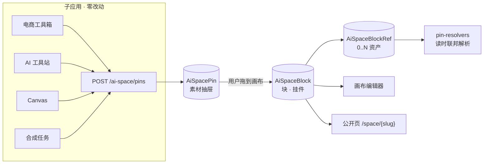

# AI 空间功能设计文档 · 全局资产库与自由画布

> **状态**：设计 + 实施中
> **创建**：2026-08-16
> **关联**：
> - 主文档：[我的AI空间.md](./我的AI空间.md)（Pin 指针模型、数字人/音频/视频库、合成台）
> - [12-platform-app-federation.md](./12-platform-app-federation.md)（平台联邦）
> - [16-project-assets-unified-design.md](./16-project-assets-unified-design.md)（`ProjectAsset` 1─N 参考形状）
> - [ai-space-broadcast-script.md](./ai-space-broadcast-script.md)（口播分镜）
> - 数据库登记：[../database/schema-changelog.md](../database/schema-changelog.md)

---

## 1. 需求

### 1.1 用户原话

> 我的 AI 空间，其实是所有 AI 作品的汇聚，可以便于用户自行布置。我希望要有一个全局的资产库：
>
> 1. 汇聚所有几个应用项目的已完成的资产，角色啊、图啊、视频啊、模特啊。
> 2. 然后这些资产，可以让我自行设计我的 AI 空间，进行布置。
> 3. 结合现在合成台，也可以引用这些资产，再次创作。
> 4. 同样，这里做的数字人、音频，同样在其他项目可以引用到。
>
> 这个很重要，里面应该可以放挂件、图片墙、视频等。
>
> 栅格吸附可以，但要有几种固定的布局供用户选择，实施时考虑好 5 种布局。

### 1.2 需求拆解

| # | 需求 | 交付 | 说明 |
|---|------|------|------|
| 1 | 汇聚各应用已完成资产 | **已交付（第二期）** | 14 种资产源 + 免收藏聚合浏览，见 §11 |
| 2 | 自行设计、布置空间 | **已交付（第一期）** | 自由画布 + 5 套模板 + 5 尺寸档位 + 12 挂件 |
| 3 | 合成台引用这些资产再创作 | 部分（合成台选材限自有库） | 任意图片转数字人需「物化」，见 §11.6 |
| 4 | 数字人/音频被其他项目引用 | 已有（Platform API 选用器） | 见主文档 §6.1 |

第一期（§2–§10）把「作品墙」从按来源分组的只读网格升级为自由画布；
第二期（§11）把资产源从 6 种扩到 14 种，并新增 **不需要先收藏** 的全局资产库聚合浏览。

### 1.3 现状与问题

现状（`?tab=wall`）：`AiSpacePin` 列表按 `sourceType` 分组，渲染固定响应式网格。

| 问题 | 说明 |
|---|---|
| 无法布置 | 分组与顺序由系统决定；`reorderPins` / `updatePinCaption` API 已存在但 UI 未接 |
| 一个 Pin 只能是一张卡 | `@@unique([userId, sourceType, sourceId])` + 1:1 语义，**做不出图片墙**（一个块引用 N 张图） |
| 只有资产、没有装饰 | 无标题、文字、名片、分隔线等非资产元素 |
| 对外不可见 | 只有本人在个人中心能看；无公开分享 |

---

## 2. 解决方案

### 2.1 核心决策：不动 `AiSpacePin`

`AiSpacePin` 已被 **5 处子应用**写入（电商 `pinAssetToAiSpace`、工具站 `tool-web/lib/ai-space-client.ts`、`canvas-web/lib/canvas-ai-space.ts`、合成任务页、管理后台），`cascadeDeletePinsBySource` 有 **7 处调用点**。直接改造会全线破坏。

因此把 `AiSpacePin` 的语义从「已展示在墙上」调整为「**已收进空间的素材**」，在编辑器里作为左侧素材抽屉；画布布局由新增的 `AiSpaceBlock` 承载。

**子应用零改动**，级联删除逻辑零改动。



### 2.2 三层数据模型

形状对齐仓库已有的 `ProjectAsset` 1─N `ProjectAssetRef`，用同一套心智模型，不引入新范式。

```
AiSpacePage   空间页（一人一页，slug 对外访问）
  └─ AiSpaceBlock      块 / 挂件（layoutX/Y/W/H/Z + sizeTier + config）
       └─ AiSpaceBlockRef  引用的资产 0..N（sourceApp/sourceType/sourceId + slotKey）
```

两个关键约束：

- **`AiSpaceBlockRef` 无 unique 约束** —— 同一张图可同时出现在封面块与图片墙里
- **保留 `@@index([sourceType, sourceId])`** —— 与 `AiSpacePin` 同款，级联删除逻辑可直接平移

### 2.3 资产解析：复用现有联邦注册表

[../../lib/ai-space/pin-resolvers.ts](../../lib/ai-space/pin-resolvers.ts) 的 `SOURCE_ADAPTERS` 是资产解析的唯一真源，`resolvePinSources` 按类型分组并行查询。画布**原样复用**，不新建第二套解析器。

第一期为 6 种源，第二期扩到 **14 种**（含影视角色、分镜、项目资产、画布产物、模特、衣柜、快速复制作品）——完整映射表见 §11.2。

新增资产源只需在该注册表加一条，画布、公开页、资产库聚合浏览自动支持。

### 2.4 布局：栅格吸附而非像素自由

12 列栅格，行高 72px + gap 16px。**不提供自由 resize 手柄**，块尺寸只能在 5 种固定档位中切换。

理由：

| | 像素级自由 | 栅格吸附 + 固定档位（采用） |
|---|---|---|
| 响应式 | 窄屏必崩，需另存移动端坐标 | 断点自动降级单列 |
| 观感 | 永远对不齐 | 天然整齐（bento 风格） |
| 实现 | 碰撞、推挤、层级全自写 | `react-grid-layout` 直接给 |

技术选型：`react-grid-layout`。`{i,x,y,w,h}` 与 `layoutX/Y/W/H` 1:1 映射，自带栅格吸附、碰撞推挤、断点响应式；`isResizable={false}` 关掉自由 resize 后正好配合档位选择器。用 book-mall 已有的 `framer-motion` 自建需重写碰撞推挤逻辑，约 400 行且易出 bug。

---

## 3. 五种尺寸档位

定义在 `lib/ai-space/space-blocks/size-tiers.ts`。

| 档位 | key | 栅格 w × h | 典型用途 |
|---|---|---|---|
| 小方 | `sm` | 3 × 3 | 缩略卡、按钮、分隔线 |
| 竖幅 | `portrait` | 3 × 6 | 竖图、数字人形象、竖版短视频 |
| 宽条 | `wide` | 6 × 3 | 文字、名片、音频播放器 |
| 大方 | `lg` | 6 × 6 | 主视觉图 / 视频 |
| 通栏 | `full` | 12 × 6 | 图片墙、前后对比、封面 |

每个挂件在注册表声明 `allowedTiers` 与 `defaultTier`；标题、分隔线这类用 `maxH` 夹紧高度（档位只控宽度）。

---

## 4. 五套整页模板

定义在 `lib/ai-space/space-blocks/page-templates.ts`，每套是一组预置块（含空槽位占位），用户选中后自动铺好骨架，再往槽位里填资产并可小幅拖拽微调。

| key | 名称 | 结构 | 适合 |
|---|---|---|---|
| `MAGAZINE` | 杂志封面 | 顶部 `full` hero 大图 + 叠加标题，下方 `lg` 图文左右交替 | 主打单件作品 |
| `PORTFOLIO` | 作品集网格 | 顶部 `wide` 名片条，下方 `lg` 三列等宽网格 + 一个 `full` 图片墙 | 大量作品平铺 |
| `BENTO` | 拼贴（默认） | 1 个 `full` 主视觉 + 若干 `sm` / `portrait` / `wide` 错落拼贴 | 现代感、混合内容 |
| `TIMELINE` | 时间线 | 单列纵向，每段「`sm` 日期标题 + `lg` 作品 + `wide` 说明」 | 创作历程 |
| `MINIMAL` | 极简单栏 | 居中窄栏大留白，`wide` 名片 + 少量 `lg` 精选 + `wide` 文字 | 个人名片页 |

套用模板经 `POST /ai-space/page/apply-template`，**二次确认**（会重排现有块位置）；已有块按顺序填入模板槽位，多出的追加到末尾，**不删除任何块**。

---

## 5. 十二种挂件

### 5.1 注册表模式（强制）

一个挂件 = 一个文件 + 一条注册表条目。编辑器、渲染器、工具箱面板全部遍历注册表生成，**禁止在编辑器里写 `blockType` 分支**。约束固化为 [../../../.cursor/rules/ai-space-space-blocks.mdc](../../../.cursor/rules/ai-space-space-blocks.mdc)。

```typescript
export type SpaceBlockDef<TConfig> = {
  type: SpaceBlockType;
  label: string;
  group: "asset" | "widget";
  /** refs 数量范围：heading {0,0}；gallery {1,60} */
  refs: { min: number; max: number };
  /** 可接受的资产媒体形态 */
  acceptKinds?: AiSpacePinMediaKind[];
  /** 命名槽位（before_after / character_card） */
  slots?: { key: string; label: string }[];
  allowedTiers: SpaceSizeTierKey[];
  defaultTier: SpaceSizeTierKey;
  maxH?: number;
  parseConfig(raw: unknown): TConfig;
};
```

### 5.2 资产型（7 种）

| type | 名称 | refs | 说明 |
|---|---|---|---|
| `image` | 单图卡 | 1 | 基础图片展示 |
| `video` | 视频播放器 | 1 | `preload="none"` + poster |
| `audio` | 音频播放器 | 1 | 复用 `AiSpaceAudioControls` 避免 hydration 错误 |
| `gallery` | 图片墙 | 1~60 | 网格 / 瀑布流 / 轮播三模式，轮播复用 `components/ui/carousel` |
| `before_after` | 前后对比 | 2 | `slotKey` = `before` / `after`，滑动对比条。试衣、精修、修图场景 |
| `character_card` | 角色卡 | 1~4 | `slotKey` = `face` / `full_body` / `outfit` / `extra` |
| `video_playlist` | 视频合集 | 1~20 | 缩略图列表 + 主播放区 |

### 5.3 装饰 / 功能型（5 种）

| type | 名称 | refs | 说明 |
|---|---|---|---|
| `heading` | 标题 | 0 | `content.text` + 级别 + 对齐 |
| `text` | 文字 | 0 | **纯文本**段落，不做富文本 HTML（公开页 XSS 风险） |
| `divider_spacer` | 分隔线 / 留白 | 0 | `config.variant` |
| `profile_card` | 个人名片 | 0~1 | 头像可选，标题与简介读 `AiSpacePage.title` / `bio` |
| `launch_button` | 继续创作按钮 | 1 | 复用 `WorkflowLaunchSpec` + `OPEN_ROUTE` 深链。**公开页不渲染**（SSO 深链只对本人有意义） |

---

## 6. 公开分享页

参考现网 `StorySpace`（`slug` unique + `publishStatus` DRAFT/PUBLISHED）的成熟形态。

| 项 | 规格 |
|---|---|
| 路由 | `/space/{slug}`，RSC 直读 + `revalidate = 300` |
| 可见性 | 仅 `PUBLISHED`；`DRAFT` 返回 404 |
| slug | 用户可改，唯一性校验，保留字黑名单 |
| 安全 | 剥离 `launch` 字段、不渲染 `launch_button`；`text` 挂件纯文本渲染；不提供 iframe embed 挂件 |
| 缓存 | 只读展示页可 ISR，DB 压力接近零 |

---

## 7. 级联删除与性能

### 7.1 删源级联

扩展 `cascadeDeletePinsBySource`，在删 Pin 的同时清理 `AiSpaceBlockRef`；**块本身保留**，渲染为「素材已删除」占位。

理由：删一张图不应导致整页布局塌陷。用户在编辑器里自行清理占位块。

`pins/check` 与 `refs/check` 的返回补上 `blockRefCount`，让子应用的删除二次确认文案能说清「该素材在空间画布中有 N 处引用」。

### 7.2 硬上限（服务端校验）

| 项 | 上限 | 原因 |
|---|---|---|
| 单页块数 | 60 | 编辑器 DOM 与拖拽性能 |
| 单个 `gallery` refs | 60 | 再多需虚拟化 |
| 单个 `video_playlist` refs | 20 | 媒体元素数量 |
| 单页总 refs | 500 | 解析成本上限 |

### 7.3 性能结论

- **DB 侧无压力**：500 个 ref 跨 6 种 `sourceType`，`resolvePinSources` 按类型分组后**只产生 6 次查询**
- **前端是真正瓶颈**：图片一律用 `thumbnailUrl` + `loading="lazy"`；视频/音频靠 `IntersectionObserver` 进视口才挂载真实元素
- **公开页 ISR**：`revalidate 300`，访客流量不打 DB

---

## 8. 实施分期

| 阶段 | 交付 |
|---|---|
| P0 | 本设计文档 |
| P1 | 三张表 + 迁移 + `db:generate` |
| P2 | 类型、5 尺寸档位、5 整页模板、挂件注册表骨架 |
| P3 | 服务层 + 5 组 Platform API 路由 |
| P4 | 12 个挂件的 View + Inspector |
| P5 | 画布编辑器（RGL 栅格吸附 + 素材抽屉 + 属性面板 + 模板选择） |
| P6 | 公开分享页 + 发布开关 |
| P7 | 级联删除扩展 + 性能收尾 |
| P8 | 文档回写 + schema-changelog + rule + lint/build |

---

## 9. 实施结果

按 §2～§7 设计全量落地，与设计无偏差。以下为最终形态。

### 9.1 数据库

迁移 `prisma/migrations/20260816160000_ai_space_canvas/`，经 `pnpm db:apply-pending` 落库（腾讯云 PostgreSQL 运行时连接池），`pnpm db:generate` 已重生成 Client。

| 对象 | 说明 |
|---|---|
| enum `AiSpacePageTemplate` | `MAGAZINE` / `PORTFOLIO` / `BENTO` / `TIMELINE` / `MINIMAL` |
| enum `AiSpacePagePublishStatus` | `DRAFT` / `PUBLISHED` |
| `AiSpacePage` | `userId` unique（v1 一人一页）、`slug` unique、`title` / `bio` / `templateKey` / `theme` / `publishStatus` / `publishedAt` |
| `AiSpaceBlock` | `pageId` + 冗余 `userId`、`blockType` / `sizeTier`、`layoutX/Y/W/H/Z` + `mobileOrder`、`config` / `content` |
| `AiSpaceBlockRef` | `blockId` + `sourceApp/sourceType/sourceId` + `slotKey` / `caption` / `sortOrder`；**无 unique**，同一资产可多处引用；保留 `@@index([sourceType, sourceId])` 供级联删除 |

`AiSpacePin` **未做任何改动**，5 处子应用写入与 7 处级联删除调用点零修改。

### 9.2 代码清单

| 层 | 文件 |
|---|---|
| 纯逻辑 | `lib/ai-space/space-blocks/`：`types.ts`（12 挂件定义 + `parseConfig` / `parseContent` 白名单）、`size-tiers.ts`（5 档位）、`page-templates.ts`（5 模板）、`theme.ts`（主题预设）、`registry.ts`（统一出口） |
| DTO | `lib/ai-space/ai-space-space-types.ts` |
| 服务 | `lib/ai-space/ai-space-space-service.ts`（`getOrCreateSpacePage` / `getSpacePageForOwner` / `getPublicSpaceBySlug` / `updateSpacePage` / `publishSpacePage` / `applySpaceTemplate` / `createSpaceBlock` / `updateSpaceBlock` / `deleteSpaceBlock` / `saveSpaceLayout`） |
| 级联 | `lib/ai-space/ai-space-space-refs.ts`（`cascadeDeleteBlockRefsBySource` / `countBlockRefsBySource`，只依赖 prisma，避免删源路径引入整个画布服务） |
| 深链 | `lib/ai-space/ai-space-launch.ts`（`launchHref`，从已删除的 `ai-space-pin-wall.tsx` 提炼） |
| 挂件 | `components/ai-space/space-blocks/`：`block-kit.tsx`（公共 props、占位、`useInView`、`SpaceImage` / `SpaceVideo`、Inspector 控件）、`media-blocks.tsx`、`collection-blocks.tsx`、`widget-blocks.tsx`、`renderers.tsx`（type → View / Inspector 映射） |
| 画布 | `components/ai-space/space-canvas/`：`space-canvas-editor.tsx`、`space-canvas-view.tsx` + `space-canvas.css`、`space-asset-drawer.tsx`、`space-block-inspector.tsx`、`space-block-frame.tsx`、`space-template-picker.tsx`、`space-page-settings.tsx`、`space-lightbox.tsx`、`space-client.ts` |
| 公开页 | `app/space/[slug]/page.tsx` |
| 资产源注册表 | `lib/ai-space/pin-resolvers.ts`（`SOURCE_ADAPTERS` 14 条，第二期从 resolver 重构为「一源一适配器」，同时服务按 id 取与按最近列举） |
| 聚合服务 | `lib/ai-space/ai-space-asset-library.ts`（`listAiSpaceLibraryAssets`：并发扫源 → 合并倒序 → 附加 `pinned` / `pinId` / `blockRefCount`） |
| 资产库 UI | `components/ai-space/ai-space-asset-library-desk.tsx`、`ai-space-asset-detail-dialog.tsx`、`asset-library/asset-library-browser.tsx`（`useAssetLibrary` / `AssetLibraryFilters` / `AssetLibraryGrid`）、`asset-library/asset-library-client.ts` |

`components/ai-space/ai-space-pin-wall.tsx` 已删除，`?tab=wall` 改挂 `SpaceCanvasEditor`。
`?tab=library` 为第二期新增的资产库聚合浏览。

**依赖新增**：`react-grid-layout`（自带类型，不装 `@types/react-grid-layout`——已 deprecated 为 stub）。

### 9.3 API

均在 `app/api/platform/v1/ai-space/` 下，鉴权走 `resolveAiSpaceActor`（NextAuth session 或 Bearer platform token）。

| 路由 | 方法 | 用途 |
|---|---|---|
| `page` | GET / PATCH | 读页（无则自动建页 + 套 `BENTO`）、改 title / bio / slug / theme |
| `page/publish` | POST | 发布 / 取消发布 |
| `page/apply-template` | POST | 套用 5 套模板之一 |
| `blocks` | POST / PATCH / DELETE | 建块 / 改块（档位、config、content、refs）/ 删块 |
| `blocks/layout` | PATCH | 批量存坐标（编辑器 debounce 800ms） |
| `pins/check` | GET | 返回新增 `blockRefs` / `blockRefCount` |
| `refs/check` | GET | 返回新增 `blockRefCount` |
| `assets` | GET | **第二期**：聚合资产库（`kind` / `source` / `keyword` / `perSource`），返回 `items` / `sourceCounts` / `truncatedSources` / `sourceOptions` |
| `assets/aifit-model/[id]/image` | GET | **第二期**：AI 试衣模特 base64 解码代理（仅本人，`Cache-Control: private`）|

数字人 / 音频 / 视频三个库的 `?checkRefsFor=` 引用检测同步补上 `blockRefCount`，删除第一次确认里显示「作品墙画布上有 N 处引用」。

### 9.4 编辑器与只读渲染的分工

| | 编辑器 | 只读（预览 / 公开页） |
|---|---|---|
| 布局引擎 | `react-grid-layout`，`isResizable={false}` | 原生 CSS Grid（`space-canvas.css`） |
| 窄屏 | <768px 切只读视图（拖拽在触屏不可用） | 媒体查询降级单列，按 `--space-order` 排 |
| 访客成本 | — | 不加载栅格库 |

### 9.5 已知限制

| 限制 | 说明 |
|---|---|
| 一人一页 | `AiSpacePage.userId` 为 unique；多页 / 多主题需再迁移 |
| 窄屏只读 | 移动端不支持拖拽布置，需回桌面端编辑 |
| 无自由 resize | 尺寸只能在 5 档位间切换（设计取舍，见 §2.4） |
| `gallery` 无虚拟化 | 60 张为硬上限，再多需引入虚拟滚动 |
| 占位块需手动清理 | 删源后块保留为「素材已删除」，不自动删块 |
| ~~素材抽屉只列 `AiSpacePin`~~ | 已解决：第二期新增「全部资产」聚合抽屉，见 §11 |

---

## 10. 变更记录

| 日期 | 摘要 |
|---|---|
| 2026-08-16 | 初稿：需求拆解、三层数据模型、5 尺寸档位、5 整页模板、12 挂件、公开分享页、级联删除与性能约束 |
| 2026-08-16 | 第二期：全局资产库补齐 —— 资产源 6 → 14 种、聚合浏览「资产库」tab、素材抽屉「全部资产」（免收藏取材） |
| 2026-08-16 | 第三期修复（§12）：模板套用改按类型配对 + 无重叠回流（含 14 例单测）、弹层统一 portal 覆盖层修白边、版式选择器加布局快照、合成台选材改客户端并行拉取 |

---

## 11. 第二期：全局资产库

第一期只解决了「怎么摆」，取材仍限于用户手动点过「展示到 AI 空间」的 6 种资产。
第二期解决「有什么可摆」：**扫各应用源表**，不要求先收藏。

### 11.1 两种取材语义

| | 素材抽屉「已收进」 | 素材抽屉「全部资产」 / 资产库 tab |
|---|---|---|
| 数据来源 | `AiSpacePin`（用户手动收藏） | 直接扫 14 张源表 |
| 是否需先收藏 | 是 | **否** |
| 放上画布 | 写 `AiSpaceBlockRef` | 写 `AiSpaceBlockRef`（同一条路径） |

`AiSpacePin` 由此降级为 **快捷收藏夹**，而非引用前置条件。画布上放过某素材并不会让它出现在「已收进」里，两者互不影响。

### 11.2 14 种资产源

`sourceType` 与源表映射见 [pin-resolvers.ts](../../lib/ai-space/pin-resolvers.ts) 的 `SOURCE_ADAPTERS`。

| sourceType | 源表 | 归属判定 | 形态 | 应用 |
|---|---|---|---|---|
| `ecom_asset` | `EcomAsset` | `userId` | image / video | 电商工具箱 |
| `t2i_library` | `TextToImageLibraryItem` | `userId` | image | AI 工具站 |
| `i2v_library` | `ImageToVideoLibraryItem` | `userId` | video | AI 工具站 |
| `ai_space_audio` | `AiSpaceAudioAsset` | `userId` | audio | AI 空间 |
| `ai_space_video` | `AiSpaceVideoMaterial` | `userId` | video | AI 空间 |
| `ai_space_digital_human` | `AiSpaceDigitalHuman` | `userId` | image | AI 空间 |
| `story_character` | `StoryCharacter` | `project.userId` | image | 影视项目 |
| `story_frame_image` | `StoryStoryboardFrame.imageUrl` | `project.userId` | image | 影视项目 |
| `story_frame_video` | `StoryStoryboardFrame.videoUrl` | `project.userId` | video | 影视项目 |
| `project_asset` | `ProjectAsset` | `ownerUserId` | image / video / audio | Pro2 · sbv1 · Story-Pro |
| `canvas_task` | `CanvasGenerationTask` | `actorUserId` 或 `project.userId` | image / video | Canvas |
| `aifit_model` | `AiFitCustomModel` | `userId` | image | AI 试衣（模特）|
| `aifit_closet` | `AiFitClosetItem` | `userId` | image | AI 试衣（衣柜）|
| `qr_template` | `QrTemplate` | `ownerUserId` | image / video | 快速复制 |

取材过滤规则：

- **软删与未完成一律不收**：`deletedAt` 非空、`status != SUCCEEDED`、URL 为空的行不进库
- **`canvas_task` 只收已落 OSS 的产物**：厂商 ephemeral 链接会过期
- **`project_asset` 跳过纯文字类**（`OUTLINE` / `STORYBOARD_SCRIPT` / `PROMPT` / `SCRIPT_PACKAGE`）：画布无从展示
- **`qr_template` 排除 `isPlatformCatalog`**：平台运营模板不是用户作品

### 11.3 一个源一个适配器（取代原「一个源一个 resolver」）

`SOURCE_ADAPTERS` 每条同时服务两种读法，共用同一段 `where` 与同一个行→展示字段映射：

| 读法 | 入口 | 用于 |
|---|---|---|
| 按 id 取 | `resolvePinSources` | Pin 卡片、画布块引用解析 |
| 按最近列举 | `listSourceAssets` | 资产库聚合浏览 |

**禁止**为聚合浏览另写一套查询——否则同一资产在抽屉与画布上会显示成两个样子。

### 11.4 base64 资产的处理（`aifit_model`）

`AiFitCustomModel.imageDataUrl` 存 base64 Data URL，单张可达数 MB：

- 列表查询 **不 select** 该字段，`mediaUrl` 给鉴权代理路由 `assets/aifit-model/[id]/image`
- 代理路由校验归属后解码输出，`Cache-Control: private`（禁 CDN 留存）
- `AI_SPACE_PIN_SOURCE_PUBLIC_SAFE.aifit_model = false`：**公开页跳过**这类引用，渲染「素材已删除」占位，避免访客拿到 401 破图

新增源若同样依赖鉴权代理，必须同步登记 `PUBLIC_SAFE = false`。

### 11.5 性能

| 措施 | 值 |
|---|---|
| 单源扫描上限 | 24 条（可调，硬上限 60） |
| 合并后返回上限 | 240 条 |
| 并发 | 4（`mapWithConcurrency`），避免打满连接池 |
| 按形态筛选 | 整源跳过（查音频不去扫图片源） |
| 关键词 | 前端 debounce 400ms，服务端截 60 字 |
| 单源失败 | 记日志后跳过，不让整个资产库空白 |
| 首屏 | 「资产库」tab 走客户端拉取，不拖慢 RSC |

列表只渲染 `thumbnailUrl` + `loading="lazy"`，原图 / 播放器只在详情弹层里加载。

### 11.6 剩余工作

| 项 | 说明 |
|---|---|
| 合成台取材仍限自有库 | 任意图片当数字人形象需先「物化」为 `AiSpaceDigitalHuman`（校验 + OSS 落库），非本期范围 |
| 部分新源无删源级联 | 已接：`project_asset` / `qr_template` / `aifit_closet`；未接：`story_*` / `canvas_task` / `aifit_model`（删除路径在子应用侧）。孤儿 Pin 读时静默跳过，画布块渲染占位，不影响正确性 |
| 无游标分页 | 单源 24 条窗口靠筛选与关键词补齐，未做 cursor 翻页 |
| facet 计数为窗口内计数 | `sourceCounts` 统计的是本次扫描窗口，不是全库总数 |

---

## 12. 第三期修复：套用错乱 / 弹层白边 / 合成台打不开

三个问题都不是「文案或提示」层面的，根因分别在排版算法、层叠上下文与数据加载路径。

### 12.1 套用整页版式后版面错乱（杂志封面 / 作品集）

**根因**：`applySpaceTemplate` 按 **下标** 把已有块塞进模板槽位——第 3 个块必占第 3 个槽位，不看类型。
槽位是按类型设计的（标题槽 2 行高、封面槽 6 行高），一张图落进标题槽后会按 `image` 自己的 `maxH` 长回 6 行，
直接压穿下方槽位，多块互相重叠，RGL 再做碰撞推挤 → 满屏错位。模板本身的几何是正确的（已由单测证明）。

**改法**：排版计算抽成纯函数 [space-blocks/template-apply.ts](../../lib/ai-space/space-blocks/template-apply.ts) 的 `planTemplateApply`：

1. **按块类型认领槽位**：图配图槽、标题配标题槽，先来先得；
2. 认领不到的已有块按原顺序追加到版式下方（用各自默认档位），仍 **不删块**；
3. 没被认领的槽位补建为空槽位（带模板预设 config / content）；
4. 最后统一 **无重叠回流**：按 (y, x) 排序逐块落位，x 不变、y 只向下顺延——几何合法时零位移。

服务层只负责把 placement 落库（`update` + `createMany` + `templateKey` 同一事务）。

**回归测试**：[test/unit/ai-space-template-apply.test.ts](../../test/unit/ai-space-template-apply.test.ts) 14 例，覆盖
「5 套模板槽位自身不重叠」「类型顺序完全错乱的画布套用后仍不重叠」「已有块类型不被改写」「mobileOrder 跟随阅读顺序」。

### 12.2 弹层四周露白边

**根因**：账号侧栏是 `z-[410]` 的 sticky 元素、顶栏另有层级，而 AI 空间的弹层写在组件树里用 `fixed inset-0 z-50`。
遮罩层级低于侧栏/顶栏，这两块就浮在遮罩之上保持白底——用户看到的「白边」。

**改法**：新增 [components/ai-space/ai-space-overlay.tsx](../../components/ai-space/ai-space-overlay.tsx)，
`createPortal` 到 `document.body` 并统一层级 `AI_SPACE_OVERLAY_Z`（dialog 460 / lightbox 470 / confirm 490，均高于侧栏 410 与合成任务悬浮窗 450），
顺带统一 Esc 与点遮罩关闭。已替换 6 处：确认框、空间信息、整页版式、灯箱、资产详情、合成任务详情。

> 新增 AI 空间弹层 **不要** 再写 `fixed inset-0 z-*`，一律挂 `AiSpaceOverlay`。

### 12.3 版式选择器加布局快照

弹层改为左右两栏：左侧列表点选（不再点一下就套用），右侧 [SpaceTemplatePreview](../../components/ai-space/space-canvas/space-template-preview.tsx)
按 12 列栅格等比画出骨架，蓝虚线块 = 需放素材的槽位、灰块 = 文字/装饰挂件，并给出块数与「其中几个需要素材」。
快照数据直接来自 `buildTemplateBlocks`，与真正落库的几何同源，模板一改快照自动跟着变。确认按钮为「套用此版式」，仍走二次确认。

### 12.4 合成台打不开

**根因**（dev 日志实证）：`?tab=compose` 一次 RSC 要跑 5 条 SQL——形象、口播音频、背景视频三份列表 + 两次收藏查询，
且写成 `Promise.all([f(await g())])`，前两条实际是串行；叠上 `dev:all` 多进程抢连接池，
出现过 `GET /account/ai-space?tab=compose 200 in 68602ms`，其中一次 `aiSpaceVideoMaterial.findMany` 直接 `Server has closed the connection`。
tab 链接默认预取又会在鼠标划过时把相邻 tab 的查询也跑一遍。

**改法**：

| 措施 | 位置 |
|---|---|
| 三份列表真并行 + 收藏合成一条查询（5 → 4 条并行 SQL） | [ai-space-compose-desk-data.ts](../../lib/ai-space/ai-space-compose-desk-data.ts) |
| 选材改客户端拉取，骨架先出、失败可原地重试 | `GET /api/platform/v1/ai-space/compose-options` + `AiSpaceComposeDeskLoader` |
| tab 链接 `prefetch={false}`，鼠标划过不再触发全表查询 | [ai-space-tab-nav.tsx](../../components/ai-space/ai-space-tab-nav.tsx) |

注：同期还有一段 `/api/auth/session` 500（`Cannot find module './vendor-chunks/jose'`）导致 `tab=compose` 307 回登录，
那是 dev server 运行中执行 `next build` 覆盖了同一个 `.next` 目录所致，重启后消失；**排查期间不要与 dev:all 共用 `.next`**。

### 12.5 变更记录补充

见 §10。
