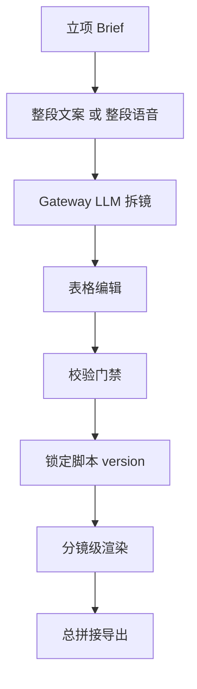
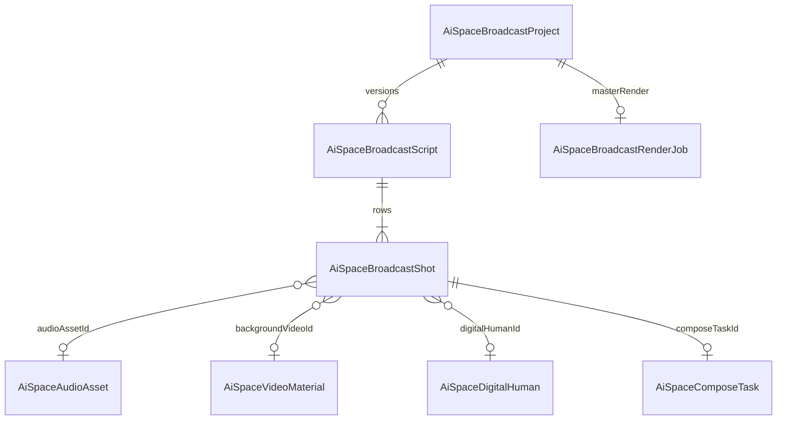
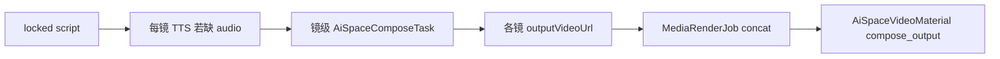

# 我的 AI 空间 · 口播分镜脚本

> **状态**：设计 + 分期实施中  
> **创建**：2026-08-16  
> **关联**：[我的AI空间.md](./我的AI空间.md) §4.5 · [../数字人.md](../数字人.md) · [../种草视频/table-format.md](../种草视频/table-format.md)

---

## 1. 产品定位

**口播分镜脚本**是 AI 空间 **合成台的上级编排层**：用户输入整段口播文案（v1）或整段语音（v2 预留），经 Gateway LLM 拆成多镜执行表，在表格中补充背景视频、数字人是否出镜及出镜时间段，锁定后按镜渲染并总拼接成片。

与现有 **单次合成台**（`AiSpaceComposeTask`：1 形象 + 1 音频 &lt;20s + 可选背景）是 **父子关系**，不是替换。



---

## 2. 文案拆镜 + 表格编辑（工作流）

### 2.1 Brief（立项）

| 字段 | 说明 |
|------|------|
| `platform` | 目标平台：抖音 / 视频号 / 小红书（影响画幅建议） |
| `aspectRatio` | `9:16` · `16:9` · `1:1` |
| `targetDurationSec` | 目标总时长（秒） |
| `tone` | 种草 / 讲解 / 带货 / 知识 |
| `presenterMode` | `always` · `partial` · `none`（数字人出镜策略） |

### 2.2 输入路径

| 路径 | v1 | 流程 |
|------|-----|------|
| **整段文案** | ✅ 先实现 | Brief → LLM 拆镜 → 每镜 TTS → **ffprobe 回写时长** |
| **整段语音** | 预留 | 上传音频 → ASR + 对齐 → LLM 拆镜 → 每镜切片 |

### 2.3 表格列（固定）

| 镜号 | 时间 | 口播文案 | 画面描述 | 背景视频 | 数字人 | 状态 |
|------|------|----------|----------|----------|--------|------|

### 2.4 编辑规则（强制）

1. **时间轴以真实音频为准**：LLM 初稿 `durationSec` 仅参考；TTS 或切片完成后用 `ffprobe` 回写 `durationSec` / `startSec` / `endSec`。
2. **单镜口播 &lt; 20 秒**：对齐 `AI_SPACE_S2V_MAX_AUDIO_SEC`；超长镜标红并禁止锁定。
3. **背景视频 v1**：仅引用 `AiSpaceVideoMaterial`（`ownedOnly` 本库上传）；v2 支持 Pin 视频。
4. **数字人每镜独立**：`presenter.enabled`、`appearFromSec`、`appearToSec`（相对本镜起点）、`overlay` 参数。
5. **脚本状态机**：`draft` → `locked` → `rendering` → `done`；**锁定后**才允许批量渲染。
6. **一镜一事**：每镜一个信息点；Hook 镜可 `presenter.enabled=false` 前 2–3 秒纯 B-roll。

---

## 3. 数据模型

### 3.1 ER 关系



### 3.2 Prisma（权威）

```prisma
model AiSpaceBroadcastProject {
  id     String @id @default(cuid())
  userId String
  title  String @default("未命名口播项目")

  /// text | voice（v2）
  sourceKind String @default("text")
  sourceText String? @db.Text
  sourceAudioAssetId String?

  brief Json @default("{}")
  targetDurationSec Int?
  aspectRatio String @default("9:16")

  /// draft | locked | rendering | done
  status String @default("draft")
  /// 当前生效脚本版本 id
  activeScriptId String?

  tenantId String?
  user User @relation(fields: [userId], references: [id], onDelete: Cascade)

  scripts AiSpaceBroadcastScript[]
  renderJobs AiSpaceBroadcastRenderJob[]

  createdAt DateTime @default(now())
  updatedAt DateTime @updatedAt

  @@index([userId, updatedAt])
}

model AiSpaceBroadcastScript {
  id        String @id @default(cuid())
  projectId String
  version   Int
  /// draft | locked
  status    String @default("draft")
  llmMeta   Json?

  project AiSpaceBroadcastProject @relation(fields: [projectId], references: [id], onDelete: Cascade)
  shots   AiSpaceBroadcastShot[]

  createdAt DateTime @default(now())

  @@unique([projectId, version])
  @@index([projectId, createdAt])
}

model AiSpaceBroadcastShot {
  id       String @id @default(cuid())
  scriptId String
  /// 镜号，从 1 递增
  index    Int

  startSec    Float @default(0)
  endSec      Float @default(0)
  durationSec Float @default(0)

  voiceoverText    String @db.Text
  sceneDescription String @db.Text @default("")

  presenter Json @default("{}")
  visual    Json @default("{}")

  audioAssetId      String?
  backgroundVideoId String?
  digitalHumanId    String?

  /// draft | tts_ready | rendering | done | failed
  shotStatus String @default("draft")
  composeTaskId String?
  outputVideoUrl String? @db.Text
  errorMessage String? @db.Text

  script AiSpaceBroadcastScript @relation(fields: [scriptId], references: [id], onDelete: Cascade)

  createdAt DateTime @default(now())
  updatedAt DateTime @updatedAt

  @@unique([scriptId, index])
  @@index([scriptId, index])
}

model AiSpaceBroadcastRenderJob {
  id        String @id @default(cuid())
  projectId String
  scriptId  String
  status    String @default("pending")
  finalVideoUrl String? @db.Text
  errorMessage  String? @db.Text
  meta Json?

  project AiSpaceBroadcastProject @relation(fields: [projectId], references: [id], onDelete: Cascade)

  createdAt DateTime @default(now())
  updatedAt DateTime @updatedAt

  @@index([projectId, createdAt])
}
```

### 3.3 TypeScript 类型（`lib/ai-space/ai-space-broadcast-types.ts`）

```typescript
import type { AiSpaceComposeOverlayOptions } from "./ai-space-compose-types";

export type BroadcastPresenterSpec = {
  enabled: boolean;
  digitalHumanId?: string;
  appearFromSec: number;
  appearToSec?: number | null;
  overlay: AiSpaceComposeOverlayOptions;
};

export type BroadcastVisualSpec = {
  type: "video" | "placeholder";
  backgroundVideoId?: string;
  sceneDescription: string;
  loopBackground?: boolean;
};

export type BroadcastShotValidation = {
  audioTooLong?: boolean;
  missingBackground?: boolean;
  missingAudio?: boolean;
};

export type BroadcastShotRow = {
  id: string;
  index: number;
  startSec: number;
  endSec: number;
  durationSec: number;
  voiceoverText: string;
  sceneDescription: string;
  presenter: BroadcastPresenterSpec;
  visual: BroadcastVisualSpec;
  audioAssetId?: string | null;
  backgroundVideoId?: string | null;
  digitalHumanId?: string | null;
  shotStatus: string;
  composeTaskId?: string | null;
  outputVideoUrl?: string | null;
  errorMessage?: string | null;
  validation?: BroadcastShotValidation;
};
```

### 3.4 示例 JSON（单镜）

```json
{
  "index": 2,
  "startSec": 5,
  "endSec": 17,
  "durationSec": 12,
  "voiceoverText": "今天这条连衣裙，腰线真的绝了。",
  "sceneDescription": "店内陈列，慢推镜头",
  "presenter": {
    "enabled": true,
    "digitalHumanId": "clxxx",
    "appearFromSec": 1,
    "appearToSec": null,
    "overlay": {
      "scale": 0.35,
      "position": "bottom-right",
      "marginPx": 20,
      "burnSubtitle": true,
      "resolution": "480P"
    }
  },
  "visual": {
    "type": "video",
    "backgroundVideoId": "clyyy",
    "sceneDescription": "店内陈列",
    "loopBackground": true
  }
}
```

---

## 4. LLM 拆镜契约

参考 [table-format.md](../种草视频/table-format.md)：**结构化 JSON 为唯一机器可读源**。

### 4.1 响应 JSON

```json
{
  "step": "broadcast_split",
  "action": "await_shot_edit",
  "briefEcho": {
    "targetDurationSec": 45,
    "aspectRatio": "9:16"
  },
  "shots": [
    {
      "index": 1,
      "durationSec": 5,
      "voiceoverText": "……",
      "sceneDescription": "……",
      "presenter": { "enabled": false },
      "visual": { "type": "placeholder", "sceneDescription": "……" }
    }
  ]
}
```

### 4.2 约束

- `shots[].index` 从 1 递增，至少 1 行。
- 每镜 `voiceoverText` 非空；初稿 `durationSec` 为 LLM 估计，TTS 后覆盖。
- Gateway LLM 经用户 `sk-gw` + 平台代付（与 TTS/S2V 一致）。

---

## 5. 编辑页原型（`?tab=broadcast`）

```
┌─────────────────────────────────────────────────────────────┐
│ [项目 ▼ 春季上新口播]  [+ 新建]     Brief ▾ 9:16 · 45s    │
├─────────────────────────────────────────────────────────────┤
│ 整段口播文案                                                 │
│ ┌─────────────────────────────────────────────────────────┐ │
│ │ 大家好，今天带大家看……                                   │ │
│ └─────────────────────────────────────────────────────────┘ │
│                                    [ AI 拆镜 ]              │
├─────────────────────────────────────────────────────────────┤
│ 累计 38s / 目标 45s   ⚠ 镜3 口播预估超 20s                  │
│ ┌───┬──────┬──────────┬──────────┬────────┬──────┬──────┐ │
│ │镜号│ 时间 │ 口播文案  │ 画面描述  │ 背景   │数字人│ 状态 │ │
│ ├───┼──────┼──────────┼──────────┼────────┼──────┼──────┤ │
│ │ 1 │0-5s  │ …        │ 门店外观  │ [选择] │ 否   │ draft│ │
│ │ 2 │5-17s │ …        │ 店内陈列  │ _walk  │ 1-11s│ draft│ │
│ └───┴──────┴──────────┴──────────┴────────┴──────┴──────┘ │
├─────────────────────────────────────────────────────────────┤
│ [保存草稿]  [锁定脚本]  [从脚本合成]（锁定后可用）            │
└─────────────────────────────────────────────────────────────┘
```

**行内操作**

- 背景：弹层选 `video-materials?ownedOnly=1`
- 数字人：开关 + 出镜 `appearFromSec`–`appearToSec` + 默认形象
- TTS：单行「生成配音」→ 写 `AiSpaceAudioAsset` 并回写时长
- 试听：`<audio>` 预览

---

## 6. Platform API

| 方法 | 路径 | 说明 |
|------|------|------|
| GET/POST | `/api/platform/v1/ai-space/broadcast-projects` | 列表 / 新建 |
| GET/PATCH/DELETE | `/api/platform/v1/ai-space/broadcast-projects?id=` | 详情 / 改 Brief / 删 |
| POST | `.../broadcast-projects/split?id=` | LLM 拆镜 → 新 Script + Shots |
| POST | `.../broadcast-projects/lock?id=` | 锁定 activeScript |
| GET/PATCH/POST/DELETE | `/api/platform/v1/ai-space/broadcast-shots?scriptId=` | 表格 CRUD |
| POST | `.../broadcast-shots/tts?id=` | 单镜 TTS |
| POST | `.../broadcast-projects/render?id=` | 批量镜级渲染 + 总拼接 |

鉴权：`resolveAiSpaceActor`（NextAuth + Bearer tools token）。

---

## 7. 渲染流水线（Phase 4）



- **镜级**：复用 `AiSpaceComposeTask`；`presenter.appearFromSec/appearToSec` 写入 `options` + `composite.overlay` 时间窗（FFmpeg `enable=between(t,...)`）。
- **总拼接**：`AiSpaceBroadcastRenderJob` → timeline `clips[]` concat。
- **失败重试**：单镜 `shotStatus=failed` 可单独重跑，不必整片重来。

---

## 8. 合成台分步进度（与单次合成并行）

单次 `AiSpaceComposeTask` 展示垂直步骤条（`ComposeProgressStep[]`）：

| id | 文案 |
|----|------|
| `queue` | 排队等待口播槽位 |
| `s2v_submit` | 提交对口型任务 |
| `s2v_vendor` | 厂商生成口播 |
| `s2v_persist` | 转存口播视频 |
| `composite` | 画中画合成 / 封装导出 |
| `save` | 写入视频创作库 |
| `done` | 完成 |

实现：`lib/ai-space/ai-space-compose-progress.ts`；`composing` 阶段 join `MediaRenderJob.progressLabel`。

---

## 9. 约束与风险

| 项 | 说明 |
|----|------|
| S2V &lt;20s | 编辑期门禁，禁止锁定超长镜 |
| S2V 并发 1 | 多镜串行排队；UI 显示镜级 + 任务级进度 |
| S2V 北京 Key | 数字人镜依赖华北2 凭证；无数字人镜可先验证背景+TTS 路径 |
| RSC 边界 | Broadcast 只读查询不得 import `ai-space-compose-service` |
| 定价 | `wan2.2-s2v` / CosyVoice 待 `ModelCreditPrice` |

---

## 10. 实施分期

| 阶段 | 交付 |
|------|------|
| P0 | 本文档 + 我的AI空间 §4.5 |
| P1 | 合成台分步进度 UI |
| P2 | Prisma 三表 + broadcast Tab + CRUD 骨架 |
| P3 | LLM 拆镜 + 表格编辑 + 单镜 TTS |
| P4 | 镜级 Compose + 总 concat + overlay 时间窗 |

---

## 11. 变更记录

| 日期 | 摘要 |
|------|------|
| 2026-08-16 | 初稿：拆镜工作流、Prisma/TS schema、编辑页 wireframe、API、渲染分期 |
