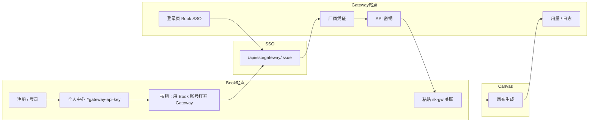

# Gateway 用户需知（Book · Canvas · Story · 工具站 · 用量）

本文面向 **Book 注册用户**，说明如何通过 Gateway 使用 Canvas、Story 创作幻想家、AI 试衣/文生图/视频实验室/分析室等 AI 能力，以及在哪里查看用量。

模型清单见 [story-gateway-models.md](./story-gateway-models.md)。

---

## 1. 整体流程

```text
Book 注册
  → 自动同步 Gateway 用户（同邮箱）
  → Book 个人中心「用 Book 账号打开 Gateway」→ 绑厂商 Key → 创建 sk-gw-...
  → 回到 Book 个人中心粘贴 sk-gw 验证关联（仅一次）
  → Canvas / Story / 工具站 运行生成（经 Gateway 代理，不在 Book 存厂商 Key）
```

### 分步说明

| 步骤 | 在哪里 | 做什么 |
|------|--------|--------|
| ① 注册 Book | Book `/register` | 注册账号；系统自动创建 **GatewayUser**（同邮箱） |
| ② 进入 Gateway | **Book 个人中心 → Gateway API Key →「用 Book 账号打开 Gateway」**（推荐）；或 Gateway 登录页 **「使用 Book 账号登录」** | SSO 单点登录，**不要**在 Gateway 对同一邮箱再注册 |
| ③ 绑定厂商凭证 | Gateway → **厂商凭证** | KIE / **火山方舟** / 百炼 / DeepSeek / DashScope / 混元 3D |
| ④ 创建 Gateway Key | Gateway → **API 密钥** | 创建 `sk-gw-...` 并绑定凭证；**明文只显示一次** |
| ⑤ 关联 Book | Book → **个人中心 → Gateway API Key** | 粘贴 sk-gw 验证；Book **只存关联 ID**，不存明文 |
| ⑥ 使用 Canvas | Canvas | 运行分镜 / 出图 / 视频；请求经 Gateway 转发 |

---

## 2. 流程入口（Book ↔ Gateway ↔ Canvas）

Book 与 Gateway **已 SSO 连通**。用户不需要在 Gateway 单独记一套 Book 密码；从 Book 一键跳转即可。



### 2.1 Book 侧入口

| 入口 | 位置 | 说明 |
|------|------|------|
| **用 Book 账号打开 Gateway**（主入口） | 个人中心 → **Gateway API Key** 卡片顶部按钮 | 已登录 Book 时一点即 SSO 进 Gateway（默认跳到「厂商凭证」） |
| 关联 sk-gw | 同上卡片输入框 | 验证并关联；已关联时显示 Key 前缀与绑定厂商 |
| 用户需知 / 用量链接 | 同上卡片内链接 | 跳转 Gateway `/dashboard/guide`、用量、日志 |
| SSO API（同按钮背后） | `GET /api/sso/gateway/issue?redirect=...` | 未登录 Book 会先跳 Book 登录，再回 Gateway |

本地：`http://localhost:3000/account#gateway-api-key`

### 2.2 Gateway 侧入口

| 入口 | 位置 | 说明 |
|------|------|------|
| **使用 Book 账号登录** | Gateway `/login` | 与 Book 按钮等价；需浏览器已登录 Book（或先跳 Book 登录） |
| 用户需知 | 左侧导航 **用户需知** | `/dashboard/guide` |
| 厂商凭证 | 左侧导航 | `/dashboard/credentials` |
| API 密钥 | 左侧导航 | `/dashboard/keys` |
| 用量 / 日志 | 左侧导航 | `/dashboard`、`/dashboard/logs` |

本地：`http://localhost:3005`

### 2.3 Canvas 侧入口

| 入口 | 位置 | 说明 |
|------|------|------|
| 未关联提示条 | Canvas 画布页顶部（未 link 时） | 链到 Gateway 用户需知、控制台、Book 个人中心 |
| 生成阻断 | 运行节点时 | 未关联 Gateway Key 时提示 `GATEWAY_KEY_REQUIRED` |

本地：`http://localhost:3004`

### 2.4 SSO 机制（简述）

1. Book 已登录用户访问 `/api/sso/gateway/issue?redirect=/dashboard/credentials`
2. Book 同步 `GatewayUser`、签发一次性 `code`
3. 浏览器跳转 Gateway `/auth/book/callback?code=...`
4. Gateway 换票后写入 session，进入控制台

Book **不会**把登录密码复制到 Gateway；Gateway 登录框的「邮箱+密码」仅适用于 **Gateway 本地注册** 且未在 Book 注册过的邮箱。

---

## 3. 登录方式（重要）

- **Book 注册用户（推荐）**：Book 个人中心 **「用 Book 账号打开 Gateway」**，或 Gateway **「使用 Book 账号登录」**。
- **不能**用「Book 邮箱 + Book 密码」在 Gateway 普通登录框登录（除非曾在 Gateway 单独设过密码）。
- 已在 Book 注册的邮箱 **不能** 在 Gateway 再注册。

本地开发：

- Book：http://localhost:3000
- Gateway：http://localhost:3005
- Canvas：http://localhost:3004

---

## 4. 数据存在哪里

| 数据 | 存放位置 |
|------|----------|
| 厂商 Key（KIE / **火山方舟** / 百炼 / DeepSeek 等） | **Gateway** 厂商凭证 |
| `sk-gw-...` 明文 | 仅创建时展示；之后 Gateway 只存哈希 |
| Book 与 Gateway 的关联 | Book `User.gatewayApiKeyId`（关联 ID，非明文） |
| Canvas 生成请求与 Token | **Gateway 请求日志 / 用量统计** |

Book **不再** 在个人中心保存三厂商 Key；Canvas **不再** 直连厂商 API。

---

## 5. 在哪里看用量

所有经 Gateway 代理的请求（含 **Canvas**、`clientSource=CANVAS`）都会写入 Gateway 请求日志。

### 5.1 汇总用量（推荐先看）

**Gateway 控制台 → 用量**（`/dashboard`）

近 30 天（可调）汇总：

- 请求总数
- Token 总量
- **预估厂商成本（元）**（按挂牌价估算，非 Book 钱包扣费）
- 按模型 Top 排行
- 按日趋势（请求数 / Token）

### 5.2 逐条请求明细

**Gateway 控制台 → 日志**（`/dashboard/logs`）

最近 50 条（可调 API 上限），每条包含：

- 时间、**来源**（如 Canvas 画布 · KIE / 百炼）、**状态**（排队 / 进行中 / 成功 / 失败）
- 类型（对话 / 图像 / 视频）、模型
- Token、耗时、单条预估成本
- 失败原因或异步 taskId（如有）

Canvas 触发的生成也会出现在同一列表中。

### 5.3 Book 个人中心能看到什么

**Book → 个人中心 → Gateway API Key** 仅显示：

- 是否已关联
- Key 前缀（如 `sk-gw-xxxx****`）
- 已绑定的厂商种类（KIE / **VOLCENGINE** / BAILIAN / DEEPSEEK 等）

**不包含** Token 汇总或费用明细；用量请到 Gateway 查看。

### 5.4 Book 钱包 / 工具用量

Book **钱包明细**、**工具站用量** 与 Gateway 厂商代理 **分开统计**。  
Canvas 当前走 Gateway BYOK 路径时，以 Gateway 用量页与日志为准。

---

## 6. 常见问题

### SSO 失败 exchange_401

- **原因**：Gateway 与 Book 的 `GATEWAY_SSO_SERVER_SECRET` 不一致（或 gateway-web 未配置）。
- **处理**：确保 `book-mall/.env.local` 与 `gateway-web/.env.local` 中该值 **完全相同**（可与 `TOOLS_SSO_SERVER_SECRET` 共用）；修改后 **重启** gateway-web / `pnpm dev:all`。
- 仍失败时检查 Book 是否已登录、code 是否过期（默认 120 秒）。

### sk-gw 关联失败

- 确认 sk-gw 是在 **当前 Book 邮箱对应的 Gateway 账号** 下创建的。
- 确认 sk-gw 已绑定至少一种厂商凭证。
- 若 Key 已在 Gateway **撤销**，需在 Gateway 新建 sk-gw 并在 Book **重新关联**。

### Book 解除关联 vs Gateway 撤销 Key

- **Book 解除关联**：仅断开 Book↔Key 关系；Gateway 侧 Key 仍有效。
- **Gateway 撤销 Key**：Canvas 立即不可用；需在 Book 重新关联新 Key。

### Canvas 提示「请关联 Gateway API Key」

1. 完成 Gateway 凭证 + sk-gw 创建  
2. Book 个人中心粘贴验证  
3. 刷新 Canvas 页面  

---

## 7. 相关入口速查

| 站点 | 入口 | 路径（本地开发） |
|------|------|------------------|
| Book | 个人中心 · Gateway 卡片 | http://localhost:3000/account#gateway-api-key |
| Book | **用 Book 账号打开 Gateway**（按钮） | 同上卡片内 → SSO |
| Book | SSO API | http://localhost:3000/api/sso/gateway/issue?redirect=/dashboard/credentials |
| Gateway | 用户需知 | http://localhost:3005/dashboard/guide |
| Gateway | 使用 Book 账号登录 | http://localhost:3005/login |
| Gateway | 厂商凭证 | http://localhost:3005/dashboard/credentials |
| Gateway | API 密钥 | http://localhost:3005/dashboard/keys |
| Gateway | 用量 | http://localhost:3005/dashboard |
| Gateway | 请求日志 | http://localhost:3005/dashboard/logs |
| Canvas | 画布（未关联时有提示条） | http://localhost:3004 |

---

## 8. 影视专业版（Canvas story-pro）

Canvas **影视专业版**与 **基础快手版** 为两套独立工作流；AI 能力同样 **仅经 Gateway**。

| 要求 | 说明 |
|------|------|
| 断直连 | 禁止 story-pro 直连厂商；规则见 `.cursor/rules/canvas-gateway-no-direct-connect.mdc` |
| clientPage | Gateway 日志来源：`canvas/{projectId}/story-pro` |
| 模型选型 | 与快手版共用 `model-router`；路由不了的模型须更换，不得加直连 fallback |
| 文档 | [story-pro-workflow-canonical.md](../../../canvas-web/docs/story-pro-workflow-canonical.md) |

---

## 9. 开发与运维

- 技术说明：[gateway-web/README.md](../../../gateway-web/README.md)
- 试点脚本（本地）：`book-mall/scripts/seed-pilot-gateway.ts`
- **全站架构、各子站端口、Gateway 与子站关系**：[docs/全站架构图与配置表.md](../../../docs/全站架构图与配置表.md) §3
