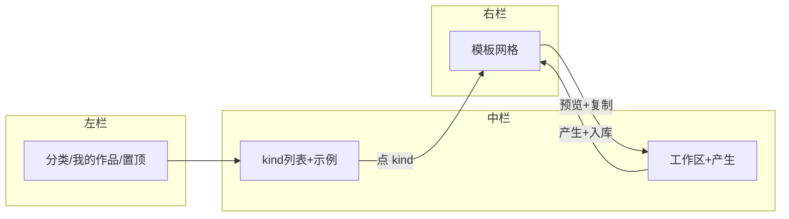

# 快速复制 · QuickReplica 产品设计

> **索引**：[docs/quick-replica.md](../../../docs/quick-replica.md)  
> **实施计划**：[2026-quick-replica-rollout.md](../plans/2026-quick-replica-rollout.md)  
> **联邦约束**：[12-platform-app-federation.md](./12-platform-app-federation.md)

## 1. 产品定位

**快速复制（QuickReplica）** 是独立部署的 AI 创作子站：用户按 **视频 / 图像 / 角色 / 场景 / 声音** 分类浏览官方或自己的 **示例模板**，点击后将参考素材与提示词载入 **中间工作区**，选择 Gateway 模型并生成新内容；**用户新生成结果优先出现在右侧模板区顶部**。

对标交互：OpenArt 式「发现 → 选示例 → 工作区 → 生成」流程（见参考图）。

| 项 | 值 |
|---|---|
| 工程 | `quick-replica-web` |
| 端口 | 3008 |
| SSO `app=` | `quick-replica` |
| navKey | `quick-replica` |
| 生产域名（目标） | `replica.ai-code8.com` |

## 2. 界面与参考图


| 区域 | 参考图 | 职责 |
|------|--------|------|
| 左栏导航 | 图 2 | Home、创造五类、**我的作品**、置顶工具 |
| 底部分类 Tab | 图 3 | 与左栏「创造」同步切换 `category` |
| **中栏** | 图 5、6 | **browse**：kind 列表 + 分类示例缩略图；**workspace**：复制后表单 + **产生** |
| **右栏**模板区 | 图 4、7–10 | 按 category/kind 过滤；点卡片 → 预览弹层 → **复制**（不切右栏） |

分类子类示例：

- 视频（图 7）：`frame-to-video`、`text-to-video`、`motion-sync` …
- 图像（图 8）：`create-image`、`edit-image`、`image-upscale` …
- 角色（图 9）：`create-character`、`character-video` …
- 场景（图 10）：`create-world`、`world-camera` …

## 3. 交互状态机



**联动规则**

1. 左栏分类与底 Tab 写入同一 `category`；中栏默认 **browse**，右栏展示该分类全部模板（`scope=all`）。
2. 中栏点某一 **kind** → 右栏按 `kind` 过滤；中栏保持 kind 列表并高亮当前项。
3. 右栏点模板 → **预览弹层** → **复制** → 中栏 workspace（右栏不重载）。
4. 置顶工具（如运动同步）→ 直达 workspace + 对应 `toolKey`/`kind`。
5. **我的作品** → 右栏 `scope=my`；中栏空态引导。
6. 中栏 **产生** → `POST …/jobs/generate` → 轮询 → 预览弹层 → 写入 `QrTemplate` 并 prepend 右栏。
7. 财务/超管可在预览弹层 **设为分类示例**（`QrKindFeatured`）；解析顺序：DB 推荐 → 内置 → public 用户模板。

## 4. 分类与 kind 枚举

### 4.1 QrCategory

| slug | 中文 | 图 |
|------|------|-----|
| `video` | 视频 | 7 |
| `image` | 图像 | 8 |
| `character` | 角色 | 9 |
| `world` | 场景 | 10 |
| `audio` | 声音 | 2（后续） |

### 4.2 QrKind（首版种子，可扩展）

**video**：`frame-to-video` · `text-to-video` · `smart-shot` · `edit-video` · `replace-background` · `relight-video` · `visual-effects` · `motion-sync` · `lip-sync` · `hd-video` · `replace-character` · `extend-video`

**image**：`create-image` · `image-variation` · `edit-image` · `expand-image` · `image-upscale` · `multi-view` · `camera-angle` · `face-swap`

**character**：`create-character` · `character-image` · `character-video` · `video-with-sound`

**world**：`create-world` · `world-camera` · `scene-actor`

### 4.3 置顶 toolKey

| toolKey | 中文 | 默认 kind |
|---------|------|-----------|
| `motion-sync` | 运动同步 | `motion-sync` |
| `lip-sync` | 唇语同步 | `lip-sync` |
| `edit-image` | 编辑图像 | `edit-image` |
| `edit-video` | 编辑视频 | `edit-video` |

## 5. 数据格式 · QrTemplate

`schemaVersion: 1`；内置 JSON 与 DB 行 **同构**。

```typescript
interface QrTemplate {
  schemaVersion: 1;
  id: string;
  category: "video" | "image" | "character" | "world" | "audio";
  kind: string;
  toolKey?: string;
  title: string;
  thumbnailUrl: string;
  badges?: ("new" | "hot" | "pinned")[];
  source: "builtin" | "user";
  ownerUserId?: string;
  visibility: "private" | "public";

  reference: {
    slots: {
      targetImage?: { url: string; ossKey?: string };
      referenceVideo?: { url: string; ossKey?: string };
      referenceAudio?: { url: string; ossKey?: string };
      sceneImages?: Array<{ url: string; label?: string }>;
      characterRefs?: Array<{ handle?: string; url: string }>;
    };
    prompt: { text: string; negative?: string; locale?: "zh" | "en" };
    model: {
      role: "IMAGE" | "VIDEO" | "LLM" | "AUDIO";
      providerId?: string;
      modelKey: string;
      params: Record<string, unknown>;
    };
  };

  output?: {
    mediaType: "image" | "video" | "audio";
    url: string;
    gatewayRequestLogId?: string;
    createdAt: string;
  };

  sortOrder: number;
  createdAt: string;
  updatedAt: string;
}
```

### 5.1 存储分层

| 层 | 位置 | 说明 |
|---|---|---|
| 内置种子 | `quick-replica-web/content/templates/*.json` | P1 只读；随版本发布 |
| 用户模板 | Prisma `QrTemplate` | P2 生成后写入；`sortOrder=0` prepend |
| 任务真源 | `GatewayRequestLog` | 禁止平行 task 表 |

### 5.2 schema 演进

- 读取时检查 `schemaVersion`；缺失视为 `1`。
- 破坏性变更递增版本并提供 migrate 函数（`lib/quick-replica/template-schema.ts`）。

## 6. Platform API（book-mall）

前缀：`/api/platform/v1/quick-replica`  
鉴权：`Authorization: Bearer {tools_token}` → `verifyToolsBearer` + `assertPlatformGatewayEntitlement(userId, { navKey: 'quick-replica' })`

| 方法 | 路径 | 说明 |
|------|------|------|
| GET | `/templates` | Query: `category`, `kind`, `toolKey`；合并 user（置顶）+ builtin |
| GET | `/templates/:id` | 单条 |
| POST | `/templates` | 用户生成后创建（P2） |
| POST | `/assets/upload` | `{ dataUrl, kind: image \| video }` → OSS URL |
| POST | `/jobs/motion-sync` | 创建 motion-control Gateway 任务 |
| GET | `/jobs/:logId` | 轮询 `GatewayRequestLog` 状态与结果 URL |

子站 BFF：`/api/book-mall/api/platform/v1/quick-replica/*`

## 7. Gateway 与日志

- `clientSource`: `QUICK_REPLICA`
- `clientPage`: `quick-replica/motion-sync` 等
- 运动同步模型：`kling-2.6/motion-control` / `kling-3.0/motion-control`（Gateway 登记；禁止前端硬编码列表，首版可由 API 返回默认 + Gateway providers）

## 8. 计费与准入

- 工具月费：`ToolServiceFeePlan.toolNavKey = quick-replica`
- 生成：Gateway BYOK（与 canvas/tool 一致）
- Admin 开发：`TOOLS_SSO_RELAX_MEMBERSHIP=1` 可本地放行

## 9. 布局与响应式

见 [quick-replica-web/doc/design.md](../../../quick-replica-web/doc/design.md)。

- 桌面：左 220px · 中 flex · 右 flex（min 400px）
- 移动：侧栏抽屉；底 Tab 固定；中栏全屏

## 10. 部署

- Dockerfile：`quick-replica-web/Dockerfile`
- Env：`deploy/tencent/quick-replica-web.env.example`
- 更新：[docs/全站架构图与配置表.md](../../../docs/全站架构图与配置表.md) §2/§7
