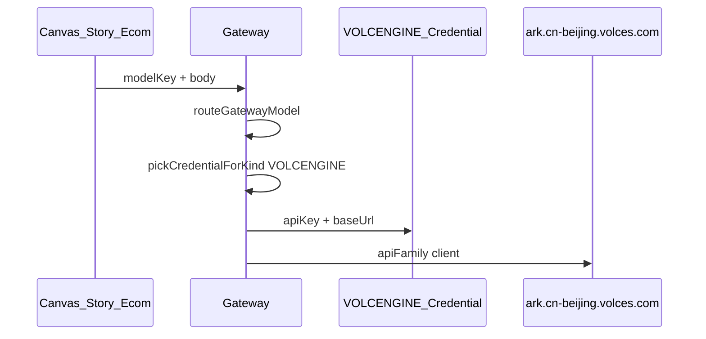

# Gateway · 火山方舟（VOLCENGINE）架构说明

> 单一真源：路由见 `book-mall/lib/gateway/model-router.ts`；模型目录见 `volcengine-chat-models.ts`、`model-catalog.ts`；用户流程见 [gateway-user-guide.md](../product/gateway-user-guide.md)。

## 1. 设计原则

### 1.1 不与 KIE 混合

- 平台在模型目录登记 **`modelKey` + `providerKind`**；运行时 `routeGatewayModel(modelKey)` 决定厂商。
- KIE Seedance（`bytedance/seedance-2`）与火山 Seedance（`doubao-seedance-2.0`、`ep-*`）是 **不同 modelKey**，各自扣对应厂商账户。
- 用户可同时绑定 KIE 与 VOLCENGINE 凭证到同一 `sk-gw`；前端按 **来源 Provider + 模型** 选择，Gateway 只取匹配 `providerKind` 的凭证。

### 1.2 系统先行、用户 BYOK

```text
GatewayModelCatalog / volcengine-chat-models（平台登记）
  → 用户 Gateway 控制台绑定 VOLCENGINE 凭证
  → sk-gw 勾选该凭证
  → Canvas / Story / 电商分镜 展示「Gateway · 火山方舟」下模型
```

### 1.3 地域与链接（三层）

| 层 | 作用 |
|----|------|
| **providerKind** | `VOLCENGINE` / `KIE` / `BAILIAN` … 决定用哪把 Key |
| **apiFamily** | 同一厂商内分 client：`chat`、`video_tasks`、`portrait_lib` |
| **baseUrl** | 凭证级可选覆盖；默认北京 `https://ark.cn-beijing.volces.com/api/v3` |

错误 baseUrl 会导致 401/404；**不能把不同 apiFamily 混在同一 HTTP 路径假设下**（阿里百炼 vs DashScope 已是先例）。

## 2. 路由链路



### 2.1 modelKey 规则（火山视频）

| modelKey | providerKind | 上游 model |
|----------|--------------|------------|
| `doubao-seedance-2.0` | VOLCENGINE / VIDEO | `doubao-seedance-2-0-260128`（别名表） |
| `doubao-seedance-1.5-pro` | VOLCENGINE / VIDEO | `doubao-seedance-1-5-pro-251215` |
| `ep-20260604145826-rsvt7` | VOLCENGINE / VIDEO | 原样透传（控制台接入点 ID） |

### 2.2 未知模型

未登记 modelKey **不得**默认落 KIE；`routeGatewayModel` 抛出 `UnknownGatewayModelError`，Gateway 返回 400。

## 3. apiFamily 与代码模块

| apiFamily | 上游路径 | 模块 |
|-----------|----------|------|
| `chat` | `POST /chat/completions` | `proxy-common.ts` → `forwardChatCompletions` |
| `video_tasks` | `POST/GET /contents/generations/tasks` | `volcengine-client.ts`, `volcengine-jobs.ts` |
| `portrait_lib` | `/{portrait/virtual\|real}/...`（透明代理） | `volcengine-portrait-client.ts` |

Gateway 对外：

- 视频任务：现有 `POST /api/gw/v1/jobs/createTask`（`providerKind=VOLCENGINE` 分支）
- 人像库：`/api/gw/v1/volcengine/portrait/virtual/*`、`.../real/*`

## 4. Seedance 2.0 多模态 body

`buildCanvasVideoVolcengineInput` 组装 `content[]`：

1. `text` — 提示词  
2. `image_url` + `role: first_frame` — 主分镜图  
3. `image_url` + `role: reference_image` — 额外参考图（最多 8）  
4. `video_url` + `role: reference_video` — 参考视频  
5. `audio_url` + `role: reference_audio` — 参考音频  
6. `asset://asset-xxx` — 人像库资产 URI（见 §5）

## 5. 人像库与 asset://

- **管理**：私域虚拟人像（9 接口）、真人人像库（2 接口）经 Gateway 透明代理，共用 VOLCENGINE 凭证。
- **使用**：视频生成 API 的 `content` 中引用 `asset://{AssetId}`，无需单独下载 URL。
- **产品 UI**：本期仅 Gateway API；Canvas/Story 人像库管理 UI 为二期。

官方文档：

- [私域虚拟人像](https://www.volcengine.com/docs/82379/2333601)
- [真人人像库](https://www.volcengine.com/docs/82379/2333602)
- [录入真人形象](https://www.volcengine.com/docs/82379/2315856)

## 6. KIE vs 火山对照（分镜视频）

| 维度 | KIE | 火山方舟 |
|------|-----|----------|
| modelKey | `bytedance/seedance-2` | `doubao-seedance-2.0` |
| 凭证 | KIE API Key | 火山 ARK API Key |
| 任务 API | `createTask` / `recordInfo` | `contents/generations/tasks` |
| 多视频/音频参考 | KIE input 字段 | Ark `content[]` 条目 |
| 接入点 | 无 | 支持 `ep-*` |

## 7. 多凭证与地域（二期）

同一 `providerKind` 绑多条凭证（如北京/其他 region）时，当前 `pickCredentialForKind` 取 **第一条**；二期可加 alias 或模型→凭证映射。

## 8. 相关文件

| 文件 | 说明 |
|------|------|
| `lib/gateway/model-router.ts` | 路由与 defaultBaseUrl |
| `lib/gateway/volcengine-chat-models.ts` | 目录与 upstream 别名 |
| `lib/gateway/volcengine-client.ts` | 视频 tasks HTTP |
| `lib/gateway/volcengine-portrait-client.ts` | 人像库代理 |
| `lib/canvas/canvas-video-volcengine.ts` | 产品层 body 构建 |
| `lib/canvas/canvas-gateway-providers.ts` | 前端虚拟 Provider `gateway:volcengine` |
