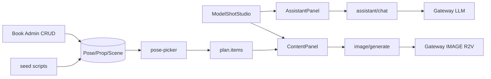

# 服装模特图 · 技术方案

- **创建日期**：2026-08-31
- **需求**：[requirements.md](./requirements.md)

## 1. 架构

## 2. 数据模型

### EcomModelShotProject

| 列 | 内容 |
|----|------|
| brief | platform, industry, styles[], poseCount |
| references | garment, model, scene, prop |
| plan | `{ status, items: [{ index, poseId, category, prompt, imageUrl? }] }` |
| meta | `{ phase, lastAssistantRaw }` |

### Catalog 表

- `EcomPoseLibraryEntry` — category A-M, baseDescription, tags
- `EcomPropLibraryEntry` — name, visualDescription, conflictTags, ossUrl?
- `EcomSceneLibraryEntry` — name, visualPrompt, tags

模式同 [`ecom-model-library-service.ts`](../../lib/ecom/ecom-model-library-service.ts)。

## 3. pose-picker（Hybrid）

1. LLM 负责对话采集 brief
2. 用户确认后 `POST .../poses/generate` 调用服务端 picker
3. picker：规则一抽库 → 规则二微调 → 规则三否决 → prompt-assembler

## 4. Prompt 拼装

`prompt-assembler.ts` 按 skill.md 占位符表填充：模特锁定、场景、道具、负面约束、平台倾向。

## 5. 出图

- `ecom-model-shot-image.ts`：ref 顺序 garment → model → scene
- `generateEcomImage` + `EcomAsset` module=`model-shot`
- 仅 `plan.status === confirmed` 可出图

## 6. API 清单

前缀：`/api/sso/tools/ecom/model-shot/`

| 路由 | 方法 |
|------|------|
| models | GET |
| projects | GET, POST |
| projects/[id] | GET, PATCH, DELETE |
| projects/[id]/assistant/chat | POST stream |
| projects/[id]/sync | POST |
| projects/[id]/poses/generate | POST |
| projects/[id]/plan/confirm | POST |
| projects/[id]/poses/[index]/prompt | PATCH |
| projects/[id]/image/generate | POST |
| projects/[id]/refs/upload | POST |
| projects/[id]/refs/attach | POST |

## 7. 前端组件

参照 hand-craft：`model-shot-studio`、`model-shot-assistant-panel`（`EcomAssistantCollapsibleLayout`）、`model-shot-content-panel`。

## 8. 参照模块

| 能力 | 参照 |
|------|------|
| Studio 壳 | hand-craft |
| Chat API | hand-craft/assistant/chat |
| Catalog | model-library |
| 助手 UI | storyboard + CHAT.md |
