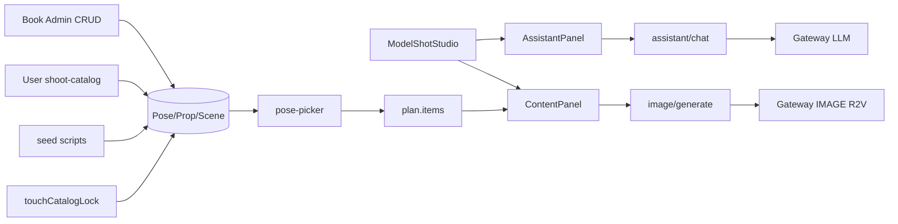

# 服装模特图 · 技术方案

- **创建日期**：2026-08-31
- **更新**：2026-08-31（V2）
- **需求**：[requirements.md](./requirements.md)

## 1. 架构

## 2. 数据模型

### EcomModelShotProject

| 列 | 内容 |
|----|------|
| brief | platform, industry, styles[], poseCount |
| references | garment, model, scene（无 prop 参考） |
| plan | `{ status, items: [{ index, poseId, category, poseDescription, sceneText, propText, sceneCatalogId?, propCatalogId?, prompt, imageUrl? }] }` |
| meta | `{ phase, wizard, lastAssistantRaw }` |

### Catalog 表（V2 扩展）

- `scope`: `platform` \| `user`（默认 platform）
- `userId`: 用户条目必填
- `lockedAt`: 首次被确认计划/成图引用时写入

| 表 | 字段 |
|----|------|
| EcomPoseLibraryEntry | category, baseDescription, tags |
| EcomPropLibraryEntry | name, visualDescription, conflictTags, ossUrl? |
| EcomSceneLibraryEntry | name, visualPrompt, tags.archetype |

## 3. pose-picker（Hybrid V2）

1. LLM 负责对话采集 brief（不含道具）
2. `POST .../poses/generate` 调用服务端 picker
3. picker：风格抽库 → **场景 tags 加权/禁止** → 微调 → 道具否决（仅 platform prop catalog，V2 采集无 prop 时跳过）

## 4. Prompt 拼装

`prompt-assembler.ts`：模特锁定、场景、道具（表内 propText）、负面约束、平台倾向。

## 5. 出图

- ref 顺序 garment → model → scene
- 仅 `plan.status === confirmed` 可出图
- 确认/成图成功后 `touchCatalogLockOnProjectUse`

## 6. API 清单

前缀：`/api/sso/tools/ecom/model-shot/`（项目）  
前缀：`/api/sso/tools/ecom/{pose,prop,scene}-library/`（catalog 读 + 用户 CRUD）

| 路由 | 方法 |
|------|------|
| `{pose,prop,scene}-library/catalog` | GET（platform + user） |
| `{pose,prop,scene}-library/entries` | POST, PATCH, DELETE（user scope） |
| model-shot/projects/... | 同 Phase 1 |

## 7. 前端

- `model-shot-studio` + 姿势表 picker
- `/ecom/shoot-catalog` 用户资产库

## 8. 参照模块

| 能力 | 参照 |
|------|------|
| Studio 壳 | hand-craft |
| 用户库页 | model-library |
| Catalog CRUD | admin-ecom-catalog-libraries |
