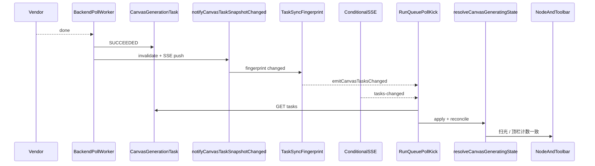

# Canvas 任务完成同步

> 解决「工具栏假生成中」与「Gateway 已完成但节点仍扫光」两类反复出现的问题。

## 1. 问题陈述

| 现象 | 根因 |
|------|------|
| 顶栏显示「生成中 · N 个任务」，画布无实际生成 | 角色列 `row.runtime` 与三视图节点 `runtime/uploading` 双轨计数；列 `pending` 未随 linked 节点 `done` 清除 |
| Gateway 日志已 SUCCEEDED，节点仍扫光 | 后端 poll 写库延迟 + 前端 poll 间隔 + **task-sync 指纹变化未触发 run-queue 立即拉任务** + stale `SUBMITTED` 挡住 `SUCCEEDED` |
| 修复反复出现 | DB task、column runtime、node runtime 三处状态无统一 SSOT |

## 2. 数据流（目标态）

## 3. 各层轮询间隔

| 层 | 机制 | 默认间隔 |
|----|------|----------|
| 后端 poll-loop | `canvas:poll-loop` 进程 | 10s |
| 后端 watchdog | `instrumentation.ts` resident | 30s |
| 后端 opportunistic | `GET .../tasks` 触发，单项目单飞 | 活跃项目 **3s** / 其余 **8s** |
| 后端 SUBMITTED | `pollOneSubmittedCanvasTask` | 同任务 ≥3s |
| 前端 run-queue | `nextPollIntervalMs` 自适应 | 1.5s / 5s / 8s |
| 前端 task-sync JSON | `useCanvasTaskEventStream` | 12s（有 inflight）/ 30s（空闲） |
| 前端条件 SSE | `useCanvasTaskSse`（inflight>0 且 tab visible） | 服务端 12s / 30s 快照 poll |
| task-sync 快照缓存 | `getCanvasProjectTaskSyncSnapshot` | 5s（`CANVAS_TASK_SNAPSHOT_CACHE_MS`） |

## 4. 修复清单

### Phase 0 · reconcile / pick（基线）

- [`story-column-runtime.ts`](../lib/canvas/story-column-runtime.ts) — 角色行与三视图不双计数
- [`task-pick.ts`](../lib/canvas/task-pick.ts) — 无 taskId 时终态仍写回；scope 内 SUCCEEDED 优先于 stale SUBMITTED
- [`sbv1-image-task-apply.ts`](../lib/canvas/sbv1-image-task-apply.ts) — 终态 patch 强制清 uploading
- [`story-inflight-reconcile.ts`](../lib/canvas/story-inflight-reconcile.ts) — stale runtime 清理、`pickStoryRowApplyTask`
- [`run-queue.ts`](../lib/canvas/run-queue.ts) — row apply 统一 pick
- [`task-pick.ts`](../lib/canvas/task-pick.ts) — terminal 不被 skip、abandoned inflight 过滤
- [`story-run-apply.ts`](../lib/canvas/story-run-apply.ts) — 三视图 reconcile

### Phase 1 · 事件驱动

- [`canvas-panel-sync-events.ts`](../lib/canvas/canvas-panel-sync-events.ts) — `subscribeCanvasTasksChanged` / `emitCanvasTasksChanged`
- [`use-canvas-task-event-stream.ts`](../lib/canvas/use-canvas-task-event-stream.ts) — 指纹变化 emit
- [`run-queue.ts`](../lib/canvas/run-queue.ts) — 订阅 → `pollKick()`
- [`canvas-task-event-stream.ts`](../../book-mall/lib/canvas/canvas-task-event-stream.ts) — `notifyCanvasTaskSnapshotChanged`
- [`canvas-task-service.ts`](../../book-mall/lib/canvas/canvas-task-service.ts) — 终态写库后 notify

### Phase 2 · 活跃项目加速

- [`canvas-active-project.ts`](../../book-mall/lib/canvas/canvas-active-project.ts) — `touchCanvasActiveProject`
- [`tasks/route.ts`](../../book-mall/app/api/canvas/projects/[id]/tasks/route.ts) · [`task-sync/route.ts`](../../book-mall/app/api/canvas/projects/[id]/task-sync/route.ts) — 读路径 touch

### Phase 3 · 条件 SSE

- [`use-canvas-task-sse.ts`](../lib/canvas/use-canvas-task-sse.ts) — inflight>0 连接，`hidden` 断开
- [`task-events/route.ts`](../../book-mall/app/api/canvas/projects/[id]/task-events/route.ts) — 注册 SSE 客户端、终态 push

### Phase 4 · 生成态 SSOT

- [`canvas-task-generating-state.ts`](../lib/canvas/canvas-task-generating-state.ts) — `resolveLibtvMediaGeneratingState`、`resolveCharacterRowGeneratingState`
- [`libtv-media-generating-state.tsx`](../components/canvas/libtv-media-generating-state.tsx) — 委托 SSOT
- [`story-column-runtime.ts`](../lib/canvas/story-column-runtime.ts) — 顶栏计数委托 SSOT

## 5. SSOT 决策规则

`resolveCanvasGeneratingState` 族函数优先级：

1. **服务端 inflight**（scope 内 `QUEUED`…`SUBMITTED`，非 stale/abandoned）→ generating
2. **乐观 session**（本地 run-session 短窗口，不与 terminal 冲突）→ generating
3. **Linked 三视图节点**（角色行 pending 时以组内节点为准）→ 与扫光一致
4. **runtime pending/running** 且无 persisted media → generating
5. **done + ossUrl** 或 idle/error → 非 generating

顶栏 `countCanvasInflightWork` 与节点 `isLibtvMediaGenerating` 均走同一 SSOT，避免双计数。

## 6. 环境变量（可选）

| 变量 | 默认 | 说明 |
|------|------|------|
| `CANVAS_ACTIVE_OPPORTUNISTIC_POLL_MS` | 3000 | 活跃项目 opportunistic poll 最短间隔 |
| `CANVAS_IDLE_OPPORTUNISTIC_POLL_MS` | 8000 | 非活跃项目 opportunistic poll 最短间隔 |
| `CANVAS_TASK_SNAPSHOT_CACHE_MS` | 5000 | task-sync 快照服务端缓存 |
| `CANVAS_DISABLE_OPPORTUNISTIC_POLL` | — | `1` 关闭读路径 opportunistic poll |

## 7. 排障手册

1. **查 DB**：`CanvasGenerationTask` 该 nodeId/scope 最新 status、updatedAt
2. **查 Gateway**：`GatewayRequestLog` 是否 SUCCEEDED
3. **后端是否写库**：book-mall 日志 `[canvas] gateway task succeeded`；poll worker 是否运行（`canvas:poll-loop` / opportunistic）
4. **指纹是否变**：`GET /api/canvas/projects/{id}/task-sync` 连续两次 fingerprint
5. **前端是否 kick**：指纹/SSE `tasks-changed` 后应触发 `pollKick` → `GET .../tasks`
6. **是否 stale SUBMITTED**：同 scope 已有更新 SUCCEEDED → `isStaleServerInflightTask` 会忽略旧 SUBMITTED
7. **顶栏仍计数**：检查 linked 三视图是否仍 `uploading`；运行 reconcile 路径

## 8. 相关文档

- 运行队列：[`story-eng.md`](./story-eng.md)
- 本地开发端口：[`docs/dev.md`](../../docs/dev.md)
