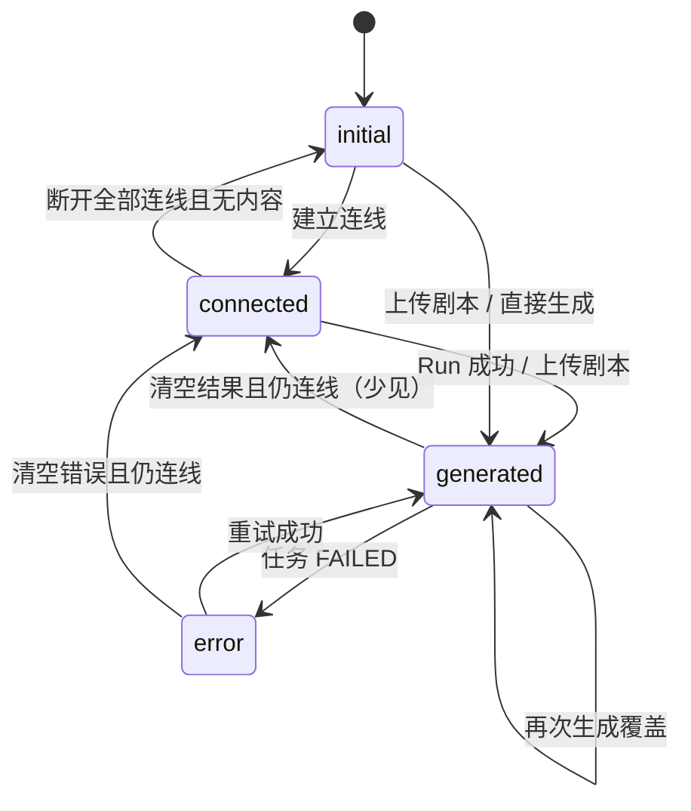

# LibTV 节点三态规范（Pro2 · sbv1）

> 适用于 **薄卡**（`story-pro2-starter` · `story-pro2-script-hub`）及同类控制节点。  
> 媒体卡（图片 / 视频）空态 / 生成中 / 结果态见 `libtv-unified-node-catalog.md` §5。

## 三态定义（通用）

| 态 | 代号 | 触发条件 | 判定函数 |
| --- | --- | --- | --- |
| **初始** | `initial` | 无连入/连出边，且无生成结果，且非进行中 | `resolveLibtvThinNodeDisplayState` |
| **连线** | `connected` | 存在连入 `in_*` 或连出 `text` 等，尚无结果，且非进行中 | 同上 · `pro2ThinNodeIsLinked` |
| **生成后** | `generated` | 已有正文/表格结果，或任务 `pending`/`running`/`done` | 同上 · `pro2StarterHasContent` / `pro2HubHas*Table` |

实现：`lib/canvas/pro2-thin-node-display-state.ts`

## 文本节点 · `story-pro2-starter`

| 态 | 节点标题 | 节点内 Stage | 底部 Dock |
| --- | --- | --- | --- |
| **initial** | `文本节点 N` | Logo +「尝试：」+ **单一**「上传剧本」按钮 | 模型 + 故事输入 + 发送（生成大纲） |
| **connected** | `文本节点 N` | Logo + 一句说明（如「已链接图片…」「已链接上游…」） | 上游 Chip + 输入 + 发送 |
| **generated** | `文本节点 N` | 大纲/剧本正文（可双击编辑）；**整卡可拖**；`pending`/`running` 时 Loader | 同上；有内容时可编辑 prompt |
| **error**（大纲任务失败） | 同上 | 红色提示 + 友好错误文案（覆盖 Stage） | 发送按钮恢复可点 |

- 初始态 **不**在节点内重复底部 Dock 的快捷工具（图片反推 / 视频反推 / 文生视频 → 见画布底部 `Pro2CanvasToolbar`）。
- 连线判定：`pro2ThinNodeIsLinked`（有边即 connected，不要求内容已同步）。

## 脚本生成器 · `story-pro2-script-hub`

用户可见名：**脚本生成器**（`PRO2_SCRIPT_HUB_NODE_LABEL`）。勿与列节点 `story-pro2-frame`（分镜脚本列）混淆。

| 态 | 节点标题 | 节点内 Stage | 底部 Dock |
| --- | --- | --- | --- |
| **initial** | **脚本生成器** | Logo +「尝试：」三条能力说明（剧本/视频参考/角色 → 分镜脚本）+ 底部引导文案 | `Pro2ScriptInputDock` · 模型 + 剧情输入 + 发送 |
| **connected** | **脚本生成器** | Logo + 连线说明（如「已链接文本节点 · 在下方 Dock 输入后发送」） | 上游 Chip + 输入 + 发送 |
| **generated** | **大纲主题**（来自 `resolvePro2HubTableTitle`） | **大纲 / 角色 / 脚本** Tab（`Pro2ScriptHubViewTabs`）+ GFM 预览；生成中 Loader | 输入 + 发送；选中且已有分镜表时显示 `Pro2ScriptHubToolbar` |
| **error** | 脚本生成器 或 主题标题 | 由 section runtime 写入（见 script-hub helpers） | Dock 可重试 |

- 初始/连线态 **不**展示空表格壳；仅 **generated** 使用 `Pro2ScriptHubContentPreview`。
- 连线判定：`pro2ThinNodeIsLinked`（有边即 connected；`outlineMd` 未同步也算 connected）。
- **生成逻辑（蓝色箭头 · Dock 发送）**：`enqueuePro2ScriptGeneration` 始终按序 LLM：`outline` → `character` → `storyboard`（完整脚本）。
- **工具栏按钮功能**：
  - 「重新生成」→ 重新生成完整脚本（同上）
  - 「生成分镜」→ 根据已有脚本表生成分镜 **图片**（`kickoffPro2FrameBoardFromHub`）
  - 「生成角色三视图」→ 根据已有角色表生成三视图
- 结构化 prompt 见 `story-pro2-theme-outline-prompt.ts`。

## 状态迁移



## 拖动

- 类型登记于 `LIBTV_DRAG_ANYWHERE_NODE_TYPES`（含 `story-pro2-starter` · `story-pro2-script-hub`）：**不得**设置 `node.dragHandle`。
- 外壳：`LIBTV_NODE_OUTER_CLASS` + `LIBTV_CARD_DRAG_CLASS`；标题栏 `PRO2_TEXT_NODE_TITLE_CLASS`（`cursor-grab`）。
- **整卡可拖**：初始 / 连线 / 已生成三种 Stage 全域可拖（含表格预览区）；标题行同步可拖。
- 仅 **按钮 / Tab / 输入** 加 `nodrag`（避免与节点拖动冲突）；表格区不加 `nodrag`，滚轮仍平移画布。

## 快捷预设组（画布底部 Dock）

由 `Pro2CanvasToolbar` 工具 Logo 触发，生成 **group + 已连线** 的 LibTV 2.0 节点：

| 预设 | 组标题 | 节点 | 连线 |
| --- | --- | --- | --- |
| 图片反推提示词 | 预设 - 图片反推提示词 | `story-pro2-image` → `story-pro2-starter` | `image` → `in_text` |
| 视频反推提示词 | 预设 - 视频反推提示词 | `sbv1-video-engine` → `story-pro2-starter` | `out_video` → `in_text` |
| 文生视频 | 预设 - 文生视频 | `story-pro2-starter` → `sbv1-video-engine` | `text` → `in_ref` |

实现：`lib/canvas/pro2-spawn-shortcut-presets.ts` · 建组后 `relayoutShortcutPresetGroup` 水平排布，避免子节点重叠。

## 状态闪烁问题（禁止）

**已知反复出现**：节点在生成过程中状态「先闪到初始/连线态，再恢复生成中」。根因通常是 **状态判断时序错误**。

### 常见陷阱

1. **判定顺序错误**：`isGenerating` 须放在状态判定 **最前**；若内容判定先于 running 判定，会导致任务刚启动（内容未到）时短暂闪为空态。
2. **runtime status 重置**：在任务发送前先清空 `runtime`，而 store 回调延迟写入 `pending`，导致中间帧闪空。
3. **hydrate 覆盖**：从服务端拉回旧快照覆盖了本地新状态。
4. **组件重渲染**：`useMemo` 依赖不完整，导致 selector 中间态泄露。

### 正确模式

```tsx
// ✅ 状态判定优先级：生成中 > 生成后 > 连线 > 初始
const isGenerating = d.runtime?.status === "pending" || d.runtime?.status === "running";
const hasContent = Boolean(d.resultMd?.trim());

// ✅ 渲染分支优先生成中
{isGenerating ? (
  <GeneratingState />
) : hasContent ? (
  <ResultContent />
) : isLinked ? (
  <LinkedPlaceholder />
) : (
  <EmptyState />
)}
```

```tsx
// ✅ 任务发送时原子设置 runtime
updateNodeData(nodeId, {
  runtime: { status: "pending" },
  // 不要先设空再异步设 pending
});
```

### Code Review 清单

- [ ] 状态判定把 `isGenerating` 放在 hasContent / isLinked **之前**
- [ ] `runtime` 写入是原子操作，无中间空状态帧
- [ ] hydrate 不覆盖本地 running 任务
- [ ] `useMemo` / `useEffect` 依赖完整，无延迟重算导致的闪烁

## Code Review

- [ ] 薄卡使用 `resolveLibtvThinNodeDisplayState`（或等价逻辑）
- [ ] 文本初始态仅「上传剧本」；脚本初始态为「尝试：」三条 + 引导文案
- [ ] 连线态不显示「尝试：」菜单
- [ ] 脚本 generated 才用表格预览；标题用大纲主题而非固定「分镜脚本」
- [ ] 整卡可拖；交互控件 `nodrag`
- [ ] 任务 FAILED 须写回 runtime（`shouldSkipStoryRowTaskApply` 勿误跳过无 taskId 的终态）
- [ ] **无状态闪烁**：生成中判定优先于内容判定，runtime 原子写入
