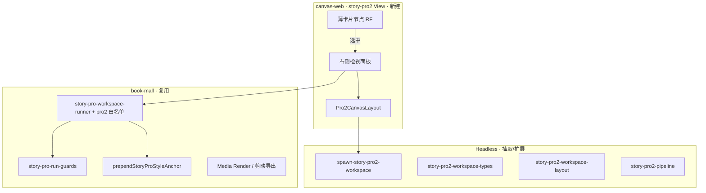

# 影视专业版 2.0（story-pro2）实施计划

> **来源**：LibTV 架构迁移评估 + `docs/新画布.md` 性能对比 + 现网 `story-pro` 痛点分析（[对话记录](https://www.liblib.tv/canvas) 对标）。  
> **关系**：本文档是 **第三条漫剧轨道** 的立项真源；**不修改** 冻结的 `story-comic` / `story-pro` 节点与布局逻辑。  
> **工作流真源**：[`story-pro2-workflow-canonical.md`](./story-pro2-workflow-canonical.md)

---

## 一、背景与目标

### 1.1 为什么要做 2.0

现网影视专业版（`story-pro`）在 **8+ 工作区节点 × 每列 30+ 镜 × 任务轮询** 场景下卡顿，主因是：

1. **巨型列节点**（约 560–1080 × 2100px）内嵌整表 UI，任何 `data` 变更触发整列重渲染  
2. **Zustand ↔ React Flow 双写** + `graphRevision` 连锁刷新  
3. **拖动/缩放触发** `normalizeCanvasNodes` + `reconcileStoryProWorkspace`  
4. **屏外节点仍挂载** 重型子树（列内虚拟列表不减轻 RF 节点包装开销）

`docs/新画布.md` 的 PixiJS + 混合 DOM 方案在 **平移缩放、屏外裁剪** 上上限更高，但 **连线语义、React 生态、持久化、专业版业务耦合** 迁移成本大（约 3–6 月）。

对标 [LibTV 画布](https://www.liblib.tv/canvas) 的结论：**同类产品大概率仍是 React Flow 类节点编辑器**，性能靠 **「画布轻、编辑重」** 产品架构，而非换渲染内核。

### 1.2 2.0 定位

| 项 | 取值 |
| --- | --- |
| 产品名 | **影视专业版 2.0** |
| 技术代号 | `story-pro2` |
| 节点前缀 | `story-pro2-*`（与 `story-pro-*` 完全并列） |
| 项目 edition | `pro2`（列表筛选、模板入口） |
| Graph 标记 | `schemaVersion: 3` · `meta.edition: "pro2"` |
| 与 1.0 关系 | **冻结维护** `story-pro`；新复杂需求只进 2.0 |

### 1.3 核心目标

1. **不改** 现网专业版 1.0 节点与 `normalize-graph-nodes` 列高逻辑  
2. **新建** LibTV 式交互：画布 **薄卡片** + **右侧检视面板** 承载行级编辑  
3. **复用** `book-mall` Gateway、runner、风格锚定、资产服务、自动剪辑数据协议  
4. **三轨互斥**：同画布仅允许 `comic` / `pro` / `pro2` 之一  

---

## 二、2.0 功能设计说明及要求

### 2.1 产品架构（LibTV 式 · 强制）

| 层级 | 1.0 专业版（现状） | 2.0 专业版（目标） |
| --- | --- | --- |
| 画布节点 | 2100px 高列，内嵌整表 | **摘要薄卡**（封面、镜数、状态、阶段徽标） |
| 行级编辑 | 节点内滚动 | **右侧检视面板**（Drawer，宽 420–480px） |
| Prompt / 生成 | 嵌在列底栏 | 检视面板底部 **Composer 区**（单镜/批量） |
| 阶段导航 | 多列同屏全展开 | 默认 **阶段聚焦**；非当前阶段折叠为摘要 |
| 助手 | 左侧剧本创作助手 | 保留；导入目标解析 `story-pro2-*` hub |

**对用户表述**：画布用于 **总览与连线**；双击或选中卡片后在右侧 **完整编辑**，不在卡片内滚长表。

### 2.2 五阶段 SOP（业务规则与 1.0 对齐）

业务规则 **不变**，仅 UI 容器迁移：

| 阶段 | 节点 type | 薄卡展示 | 检视面板内容 |
| --- | --- | --- | --- |
| 故事 | `story-pro2-starter` · `story-pro2-script-hub` | 阶段名、定稿状态、字数摘要 | 上传剧本、导演包、大纲/角色/分镜 Tab、定稿 |
| 风格 | `story-pro2-style` | 锚定词摘要、参考图数量 | 完整风格表单、`styleFinalized` 定稿 |
| 设计 | `story-pro2-character` · `story-pro2-scene` | 行数、生成进度 | 宫格/行表、三视图、场景参考 |
| 分镜 | `story-pro2-frame` | 镜号带缩略图条 | 景别/运镜/时长/难度、静帧生成 |
| 视频 | `story-pro2-video` · `jianying-export-pro2` | 视频条带、导出状态 | 生成/预览/TTS、剪映 ZIP、自动剪辑 |

**门禁（强制，与 1.0 一致）**：

- 未 `styleFinalized` → 禁止下游媒体 run  
- 故事定稿前 hub 可编辑；定稿后只读（删媒体列可解除，逻辑复用 pro guards）  
- 所有 LLM/生图/生视频/TTS **经 Gateway**，`clientPage`: `canvas/{projectId}/story-pro2`  
- 风格锚定经 `prependStoryProStyleAnchor` 注入，row 级不可关闭  

### 2.3 节点与尺寸要求

| 节点 | 薄卡尺寸（默认） | 最大高度 | 禁止 |
| --- | --- | --- | --- |
| 控制类（starter/hub/style） | 360 × 140 | 180 | 内嵌 Markdown 长文滚动 |
| 列摘要（character/scene/frame/video） | 320 × 120 | 160 | 2100px 列布局 |
| 导出（jianying-export-pro2） | 400 × 160 | 200 | 内层纵向滚动条（操作进检视面板） |

视觉：2.0 **仅紫罗兰**（`#a78bfa`），禁止 green/emerald/1.0 青；薄卡 **仅标题+徽标**（无副标题/描述行）；浮动检视与剧本助手同系。完整规范见 **[`story-pro2-design-spec.md`](./story-pro2-design-spec.md)**；常量真源 `story-pro2-node-chrome.ts`。

### 2.4 画布引擎要求

| 要求 | 说明 |
| --- | --- |
| 渲染内核 | **保留 React Flow**（`@xyflow/react`），首期不上 Pixi |
| 视口裁剪 | `onlyRenderVisibleElements` 对 pro2 **始终开启**（节点 ≥1 即启用） |
| 拖动 | 几何变更 **单写 RF**；`commit` 时再同步 store；拖动中 **跳过** normalize/reconcile |
| 选中态 | 单一 `selectedPro2NodeId`（检视面板与画布同步） |
| 轮询 | 仅 **选中 workspace / 视口内** 节点 poll 任务状态 |
| 持久化 | 沿用 `CanvasProject.canvas` JSON + autosave；`runtime` 剥离规则同 1.0 |
| 对话框 | 一律 `useDialogs()`，禁止原生 `alert/confirm` |

### 2.5 平台与数据要求

| 要求 | 说明 |
| --- | --- |
| 部署 | 首期仍在 `canvas-web` + `book-mall`，不新建子应用 |
| 任务表 | 沿用 `CanvasGenerationTask`，不新增 Prisma 表 |
| Runner | 首期 **A 策略**：`story-pro-workspace-runner` 白名单增加 `story-pro2-*`，映射同一 `mediaKind` |
| 类型 | `story-pro2-workspace-types.ts` 字段 **1:1 映射** `StoryPro*Row`（减少 runner 分叉） |
| 剪映/剪辑 | `collectJianyingFramesFromWorkspace` 增加 pro2 adapter；自动剪辑复用 Media Render 引擎 |
| Edition | `CanvasProjectEdition`: `standard` \| `pro` \| **`pro2`**；创建时写死，列表徽章区分 |

### 2.6 隔离与互斥（强制）

- `canAddStoryNodeType` 扩展第三条轨道：pro2 与 comic/pro **不可混用**  
- **禁止** migrate 将 `story-pro-*` 转为 `story-pro2-*`  
- **禁止** 修改 `story-pro-frame-column-node` 等 1.0 组件  
- 同画布 **不** 并存三套；靠 type 前缀 + `hasStoryPro2Pipeline` 检测  

### 2.7 非目标（首期不做）

- 全量 Pixi 画布替换  
- pro → pro2 自动迁移  
- 快手版 (`story-comic`) 改造  
- 用户自建 Provider（遵守 Gateway 断直连规则）  
- 团队协作 / 实时光标  

### 2.8 验收标准（MVP = Phase 4 结束）

1. 可新建 **影视专业版 2.0** 项目，与 pro/comic 列表分区  
2. 五阶段端到端：故事定稿 → 风格定稿 → 角色/场景 → 分镜静帧 → 视频 → 剪映/自动剪辑  
3. 30 镜项目拖动画布 **≥50fps**（目标机 Chrome），较 1.0 同项目拖动 latency **下降 ≥50%**  
4. Gateway `clientPage` 与费用明细正确归因 `story-pro2`  
5. 1.0 专业版回归：**零行为变更**  

---

## 三、架构分层



---

## 四、搬迁清单

### 4.1 直接复用

- `book-mall/lib/canvas/story-pro-workspace-runner.ts`（加 type 白名单）  
- `story-pro-run-guards.ts`、`prependStoryProStyleAnchor`  
- `story-pro-*-asset-service`、`resolveStoryProVideoRefUrls`  
- Gateway / `CanvasGenerationTask` / 计费  
- SSO、`/api/canvas/projects/*`、OSS 管线  
- `story-pro-script-pack.ts` 剧本结构约束  

### 4.2 新建（pro2 专用）

- 全部 **薄卡** React 组件（`components/canvas/pro2/*`）  
- `spawn-story-pro2-workspace.ts`、`story-pro2-workspace-layout.ts`  
- `Pro2CanvasLayout`、`Pro2InspectorPanel`  
- `jianying-export-pro2` 或 pro2 workspace 适配器  
- 内置模板 `builtin/story-pro2-pipeline`  
- `story-pro2-workflow-canonical.md`、本计划  

### 4.3 明确不搬

- 1.0 列节点组件与 `normalize-graph-nodes` pro 列高  
- 双轨文档 `story-pro-edition-requirements.md` 冻结范围  

---

## 五、分阶段实施

| 阶段 | 主题 | 周期 | 关键产出 | 状态 |
| --- | --- | --- | --- | --- |
| **0** | 立项与契约 | 1 周 | 本计划、`story-pro2-workflow-canonical`、edition 扩展设计 | 已完成 |
| **1** | 骨架与 LibTV 壳 | 2 周 | `story-pro2-starter` 薄卡、检视面板、新建入口、互斥 | 进行中 |
| **2** | 故事 + 风格 | 2–3 周 | hub/style 薄卡 + 检视完整表单、门禁 | 待开始 |
| **3** | 设计层 | 2–3 周 | character/scene 摘要卡 + 检视行编辑 | 待开始 |
| **4** | 分镜 + 视频 + 导出 | 3–4 周 | frame/video 时间轴条、剪映/自动剪辑 | 待开始 |
| **5** | 性能硬化 | 2 周 | 轮询节流、阶段聚焦、基线对比 ≥50% | 待开始 |
| **6** | 可选 | — | 只读从 pro 导入剧本 JSON；不做自动迁移 | 待开始 |

### Phase 1 任务勾选（当前迭代）

- [x] `plan-2.0.md` 与 `story-pro2-workflow-canonical.md`  
- [x] `CanvasProjectEdition` 扩展 `pro2`（前后端）  
- [x] `story-pro2-pipeline.ts` + `story-edition-isolation` 三轨互斥  
- [x] `story-pro2-starter` 薄卡 + `Pro2InspectorPanel` 壳  
- [x] 内置模板 `builtin/story-pro2-pipeline`  
- [x] 项目列表「新建 · 影视专业版 2.0」  
- [x] `FlowCanvas` pro2 模式：`onlyRenderVisibleElements` 常开（`forceOnlyRenderVisible`）  
- [ ] 拖动跳过 reconcile（推广 `deferStoreGraphSync` 为 pro2 默认）  
- [ ] `story-pro2-script-hub` 薄卡 + 检视审阅 Tab  

---

## 六、目录约定

```text
canvas-web/
  components/canvas/pro2/          # 薄节点 + Inspector + Layout
  lib/canvas/story-pro2-*.ts       # spawn / layout / types / pipeline
  docs/plan-2.0.md                 # 本文件
  docs/story-pro2-workflow-canonical.md

book-mall/lib/canvas/
  canvas-story-edition.ts          # + pro2 检测
  story-pro-workspace-runner.ts    # + story-pro2-* 白名单
```

---

## 七、风险与对策

| 风险 | 对策 |
| --- | --- |
| 双份 UI 维护（pro + pro2） | pro 冻结功能；新需求只进 pro2 |
| runner 分支膨胀 | 抽 `story-pro-headless` 纯函数包 |
| 检视与选中态不同步 | 单一 `selectedPro2NodeId` + RF `onSelectionChange` |
| Agent 规则冲突 | 更新 `story-editions-overview.md` 为三轨表 |
| Pixi 诱惑重走弯路 | 2.0 首期明确 **RF + 薄节点**；Pixi 仅作 Phase 5+ 局部预览备选 |

---

## 八、资源粗估

| 范围 | 人力（1 全栈 + 0.5 产品/UX） |
| --- | --- |
| Phase 0–1 | 2–3 周 |
| Phase 2–4（MVP） | 7–10 周 |
| Phase 5 | 2 周 |
| **合计 MVP** | **约 11–15 周** |

---

## 九、参考

- 性能评估对话：`docs/新画布.md`、LibTV 对标  
- 1.0 需求真源：`story-pro-edition-requirements.md`  
- 双轨对照：`story-editions-overview.md`  
- 自动剪辑：`docs/自动剪辑.md`、`book-mall/doc/tech/media-render-timeline-v1.md`  
- 设计规范：`design.md`（2.0 增补 §16 待 Phase 1 合入）
