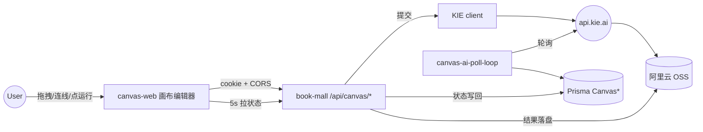
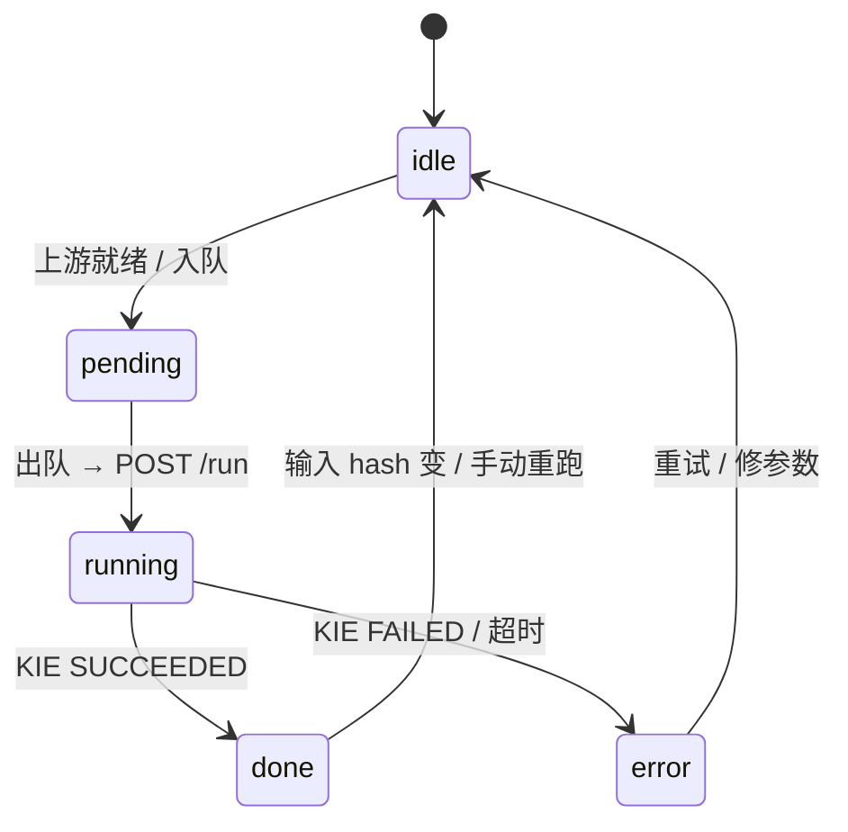

# canvas-web 实施计划

> 来源需求：仓库根 [docs/huabu.md](../../docs/huabu.md)（无限画布 AI 设计工具功能设计文档）
>
> 沿用骨架：与 [story-web](../../story-web) 同构 —— 独立 Next.js 站点；登录 / DB / KIE / OSS 全部归口 [book-mall](../../book-mall)。

---

## 一、定位与目标

| 项 | 取值 |
| --- | --- |
| 子站名称 | `canvas-web` |
| 端口 | `3004` |
| 路由根 | `https://canvas.example.com/`（开发：`http://localhost:3004`） |
| 后端 API 根 | `book-mall` `:3000`，`/api/canvas/*` |
| tool-web 入口 | 侧栏组「AI 海报画布」（路由 `/ai-poster-canvas/*`） |
| 工作流风格 | ComfyUI 节点 / 端口 / 连线，每节点可独立运行 |
| 单画布并发上限 | 5（前端运行队列 + 后端限流） |
| 主题 | 暗紫调（`--canvas-bg: #0b0b14` / `--canvas-accent: #a78bfa`） |

对齐 [docs/huabu.md](../../docs/huabu.md) §1.3 核心目标：

1. 可视化节点操作（React Flow + 自定义节点）
2. 全品类风格迁移（多图 reference + prompt 模板）
3. 工作流模板复用（系统模板 3 套 + 用户私有模板）
4. 多模型与 API 兼容（DB 注册表 + KIE 通用 client）

---

## 二、模块对应

| huabu.md 模块 | 实现位置 | 说明 |
| --- | --- | --- |
| §2.1 无限画布基础（缩放 / 平移 / 小地图 / 分组 / 自动布局） | `canvas-web/components/canvas/*` | React Flow 内建 + 自定义工具栏 |
| §2.2 节点系统（基础类型 / 端口 / 状态 / 复制） | `canvas-web/components/canvas/nodes/*` | 6 类节点 + zustand store |
| §2.3 风格迁移工作流 | 同上 + `book-mall/lib/canvas/canvas-task-service.ts` | 节点 → KIE 任务一一映射 |
| §2.4.1 模板管理 | `canvas-web/lib/canvas/templates/*` + `CanvasTemplate` 表 | 系统模板硬编码 JSON；用户模板存 DB |
| §2.4.2 多任务并行 | 前端 `useRunQueue` + 后端 `assertCanvasInflightCap` | 上限 5；超出排队 |
| §2.4.3 模型与 API 配置 | `canvas-web/app/models/*` + `CanvasEngineModel` 表 | DB 注册 + admin UI |
| §2.5 迭代规划 | （阶段 5+） | 视频节点 / 批量 / 协作 |

---

## 三、架构与数据流



---

## 四、节点系统

### 4.1 节点类型（与 huabu.md §2.3.1 对齐）

| 节点 | 输入 | 输出 | 主要参数 |
| --- | --- | --- | --- |
| `ImageNode`（产品 / 风格参考） | （根） | `image` | `urls[]`、`label`、`tag` |
| `TextNode` | （根） | `text` | `text` |
| `ProductParamsNode` | （根） | `text(json)` | `brand` / `name` / `specs[]` / `price` 等 |
| `AiTextNode` | `text` × N、`image` × N | `text` | `presetId`（智能口令）、`vars{}` |
| `ImageGenNode` | `image` × 1..N、`text` × 1 | `image` | `modelKey`、`size`、`n`、`fuseMode` |
| `OutputNode` | 任意 | （收藏/导出） | `title`、`saveToGallery` |

### 4.2 节点状态机



### 4.3 拓扑执行

- 用户点节点上的「运行」（或全图「运行所有输出」）：
  1. 前端 BFS 求节点拓扑闭包；
  2. 每个 `ImageGenNode` / `AiTextNode` 入队 `useRunQueue`；
  3. 队列并发 ≤ 5：`POST /api/canvas/projects/:id/nodes/:nodeId/run`；
  4. 后端 `submitCanvasTask` 写 `CanvasGenerationTask(PENDING)` → KIE `createTask` → `SUBMITTED`；
  5. `canvas:poll-loop` / `/api/canvas/kie/poll` 把结果回写 `SUCCEEDED + ossUrl`；
  6. 前端 5s 轮 `GET /api/canvas/projects/:id/tasks?nodeIds=...`，拿到 `ossUrl` 渲染。
- **缓存**：`inputHash = sha256(JSON.stringify(orderedInputs + params))`；hash 命中且 task `SUCCEEDED` 直接复用；变更则失效下游。

---

## 五、与 book-mall 的接口契约

### 5.1 路由表

| Method | 路径 | 用途 |
| --- | --- | --- |
| `GET` | `/api/canvas/viewer-session` | 读 NextAuth session（mirror story） |
| `GET` | `/api/canvas/engine-models` | 列出已启用模型 |
| `POST` `PATCH` | `/api/canvas/engine-models` `/:id` | admin 增改 |
| `GET` `POST` | `/api/canvas/projects` | 列 / 建画布项目 |
| `GET` `PATCH` `DELETE` | `/api/canvas/projects/:id` | 单项目 |
| `POST` | `/api/canvas/projects/:id/nodes/:nodeId/run` | 节点运行 |
| `GET` | `/api/canvas/projects/:id/tasks` | 批量取任务状态 |
| `POST` | `/api/canvas/uploads` | 直传 OSS（form-data） |
| `GET` `POST` | `/api/canvas/templates` | 用户模板 |
| `GET` | `/api/canvas/works` | gallery 数据 |
| `POST` | `/api/canvas/kie/poll` | cron / 本地 poll |
| `POST` | `/api/canvas/kie/callback/:kind` | KIE 回调 |
| `POST` | `/api/canvas/kie/cleanup` | OSS 清理队列 worker |

### 5.2 鉴权与 CORS

- 鉴权沿用 NextAuth cookie；本地 dev 走跨域（`credentials: include`），生产差源走 `/api/book-mall/*` proxy。
- CORS env：`CANVAS_WEB_ORIGINS=http://localhost:3004`、`CANVAS_CORS_IN_APP=1`（dev 默认开）。

### 5.3 数据模型（Prisma）

- `CanvasProject(id, userId, name, description, canvas Json, status, deletedAt, createdAt, updatedAt)`
- `CanvasTemplate(id, ownerUserId?, category, name, thumbnail, canvas Json, builtin)`
- `CanvasGenerationTask`（mirror `StoryGenerationTask`，外加 `nodeId`、`inputHash`）
- `CanvasEngineModel(modelKey, displayName, vendor, role, defaultParams Json, active, sortOrder)`
- `CanvasOssCleanupQueue`
- 枚举：`CanvasGenerationKind`（`IMAGE`/`TEXT`）、`CanvasGenerationStatus`（PENDING/SUBMITTED/SUCCEEDED/FAILED/CANCELLED）、`CanvasModelRole`（IMAGE/VIDEO/LLM）

---

## 六、性能 / 可用性目标（对齐 huabu.md §4）

| 指标 | 目标 | 落实 |
| --- | --- | --- |
| 拖拽 / 缩放响应 | ≤ 100 ms | React Flow 默认；节点 > 500 时启 `onlyRenderVisibleElements` |
| 单图生成 | ≤ 30 s（依模型） | UI 全异步；进度可视化在节点角标 |
| 3 流并行不卡 | 通过 | 队列上限 5；节点级独立轮询 |
| 兼容图片 | JPG / PNG / WEBP | 上传校验 + KIE 文档限制 |
| 故障弹窗 | 清晰 + 解决办法 | `failCode + failMessage` 角标；`/dev/canvas/tasks` 详情页 |

---

## 七、风险与缓解

1. **画布编辑器是单点工程量大头**：先冻结 6 类节点 + 1 套模板做 MVP，再扩；用 React Flow 官方 Workflow / Custom Nodes / Drag and Drop 例子派生。
2. **多图融合 / 三视图依赖模型能力**：先用 `nano-banana-pro` 验证 `image_urls` 多张入参，必要时再加 `gpt-image-1`。
3. **OSS 上传慢**：上传期间用 blob URL 占位，不阻塞节点连线 / 运行。
4. **历史数据兼容**：`CanvasProject.canvas` JSON 加 `schemaVersion`，前端无法识别即提示升级。
5. **节点连线类型错误**：连线时按端口类型校验，避免运行时炸。

---

## 八、命令与端口

```bash
pnpm install
pnpm dev:all              # 含 canvas / canvas-poll
# canvas-web: http://localhost:3004
# 任务面板:  http://localhost:3000/dev/canvas/tasks
```

后台进程：`pnpm --filter book-mall run canvas:poll-loop`（KIE 轮询；与 story 同模型）。

---

## 九、阶段验收

| 阶段 | 验收点 |
| --- | --- |
| 0 脚手架 | `canvas-web` 可启动，首页可访问；docs/plan.md / do.md 在仓 |
| 1 tool-web 菜单 | 侧栏 4 项可见；`/ai-poster-canvas/studio` 大图 + 跳转 OK |
| 2 后端基建 | Prisma 迁移成功；`/api/canvas/*` 全套；`/dev/canvas/tasks` |
| 3 canvas-web 主题 / 登录 | 暗紫主题；登录条 / 跳转登录正常 |
| 4 编辑器 + 节点 + 拓扑 | 拖图入画布；连线运行；并发上限 5 工作 |
| 5 模型 / 模板 / gallery | admin 增模型；3 套模板可建画布；gallery 列出 OutputNode 产物 |
| 6 验收 | dev:all 全绿；外部拖图；`/dev/canvas/tasks` 全链路 |
