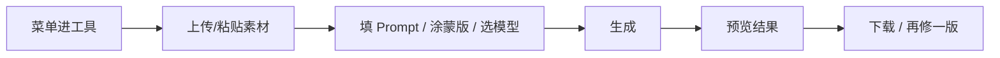

# 常用工具 · 使用指南

> **产品名**：常用工具（common-tools）  
> **更新日期**：2026-10-04  
> **读者**：需要 **单页、单任务** 图像 AI 处理的所有用户（修图、抠图、表情包等）。

## 流程总览

---

## 1. 常用工具是什么

常用工具是从电商工具箱等能力中 **独立出来的图像小工具合集**。特点是：

- **一个工具一个页面**：从菜单点进，上传/涂抹/填 Prompt → 生成 → 下载或继续编辑。
- **主站账号通用**：与 AI 画布、电商工具箱等同账号；登录一次即可使用。
- **无单独「工具月费」概念**：与主站 **积分/会员体系** 一致（具体扣减方式以页面提示为准，本文不展开计费规则）。

生产环境入口一般为 `com.ai-code8.com`；也可从主站 **常用工具** 跳转打开。

---

## 2. 怎么进入

| 方式 | 说明 |
|------|------|
| 独立站点首页 | 工具 **菜单网格**，按分类浏览 |
| 直达链接 | `/t/{工具 slug}`，例如 AI 修图、背景移除等 |
| 主站 / 电商侧栏 | 「常用工具」外链（电商内 **图片处理** 与常用工具部分能力类似，日常电商修图仍建议用电商侧 **图片处理** 入口） |

未登录时部分页面可浏览；**上传与生成** 需登录。

---

## 3. 页面结构（通用）

大多数已上线工具页包含：

1. **说明区**：这个工具解决什么问题、需要几张图。
2. **上传区**：拖拽、点击选择、或 **粘贴剪贴板图片**（会自动识别来源）。
3. **参数区**：Prompt、强度、模型（若该工具支持选模型）。
4. **蒙版/涂抹**（修图、移除类）：在图上涂抹要改/要删的区域。
5. **生成按钮**：提交后显示 **生成中** 状态；完成后 **结果区** 展示，可下载或 **再修一版**。
6. **积分提示**（若有）：顶栏或按钮旁显示余额预览，不足时引导回主站充值/会员（不展开价格）。

右下角可有 **AI 小智** 悬浮球，问「这个工具怎么用」。

---

## 4. 已上线工具一览（按菜单分类）

下列工具在菜单中标记为 **已上线（live）**，可直接使用：

### 4.1 图像编辑

| 工具 | 典型用法 |
|------|----------|
| **AI 修图** | 上传图 → 涂抹区域 → 用自然语言描述要改成什么 |
| **AI 图像编辑器** | 综合编辑入口（参数以页内为准） |
| **AI 图像增强器** | 提升清晰度、细节 |
| **AI 扩图** | 向外扩展画面，补全背景 |
| **图片修复** | 老照片、划痕、破损修复 |
| **背景移除器** | 抠出主体、透明或换底准备 |
| **物体移除器** | 涂抹去掉画面中不需要的物体 |
| **换脸** | 按规则替换人脸（请遵守肖像权与平台规范） |
| **AI 图像去模糊** | 减轻运动/对焦模糊 |
| **AI 相机角度** | 改变视角/机位类效果（以模型能力为准） |

### 4.2 图像生成

| 工具 | 典型用法 |
|------|----------|
| **AI 图像生成器** | 文生图，输入描述生成图片 |
| **AI 逼真图像生成器** | 偏写实风格文生图 |
| **AI 海报生成器** | 快速出海报底图（精排可去电商 **海报制作** 或画布） |

### 4.3 趣味创意

| 工具 | 典型用法 |
|------|----------|
| **AI 虚拟形象生成器** | 头像、虚拟形象 |
| **AI 表情包生成器** | 描述场景生成梗图，可叠加文字 |
| **GIF 生成器** | 生成或处理短 GIF |

### 4.4 菜单中尚未上线的项

菜单里可能还有 **AI 3D 生成器、动漫/卡通、Logo、二维码、风格迁移** 等 **占位或未开放** 项；点进去若是「即将推出」或无法提交，说明尚未对该 slug 开放，请改用已上线工具或 **AI 画布**。

---

## 5. 与 AI 画布「修图」的关系

- **底层能力同源**：常用工具与 AI 画布的局部修图/重绘走同一类 **Gateway 图像编辑** 能力。
- **界面不同**：画布是 **深色 LibTV 节点**；常用工具是 **浅色单页**。
- **怎么选**：单张图快速处理 → **常用工具**；要把修图结果接进复杂工作流 → **AI 画布** 修图节点或 spawn 新图节点。

---

## 6. 使用习惯与建议

1. **上传前**：尽量使用 **清晰、合法授权** 的素材；过大图片可先压缩以加快上传。
2. **修图类**：涂抹区域 **略大于** 要修改的范围，Prompt **具体**（材质、光线、颜色）。
3. **生成失败**：看页面错误提示（模型繁忙、内容审核、格式不支持）；换图或改 Prompt 再试。
4. **结果保存**：及时 **下载**；重要项目建议回主站相关 **历史/资产** 入口确认是否已入库（视工具是否写入历史）。
5. **粘贴上传**：从微信/浏览器复制的图片可直接 **Ctrl+V / Cmd+V** 进上传区。

---

## 7. 登录、门户与退出

- 支持本域 **登录 / 注册**（与主站账号互通）。
- 顶栏 **门户导航** 可跳转到 AI 画布、电商、主站等（与全站联邦导航一致）。
- 退出登录会清理本域会话；再次进入其他子站时可能需 **静默续登** 或点一次登录。

---

## 8. 常见问题

**Q：和电商「图片处理」重复吗？**  
A：能力相近；**电商日常** 请在电商工具箱 **图片处理** 用，便于和商品项目在一起；**非电商** 零散需求用 **常用工具** 即可。

**Q：为什么菜单里工具数量比 16 多？**  
A：菜单包含 **规划中的 slug**；只有带 **live** 的才是当前可用，以提交按钮能否用为准。

**Q：能否批量处理？**  
A：多数工具是 **单次任务**；批量请用电商/画布/workflow 类应用。

---
