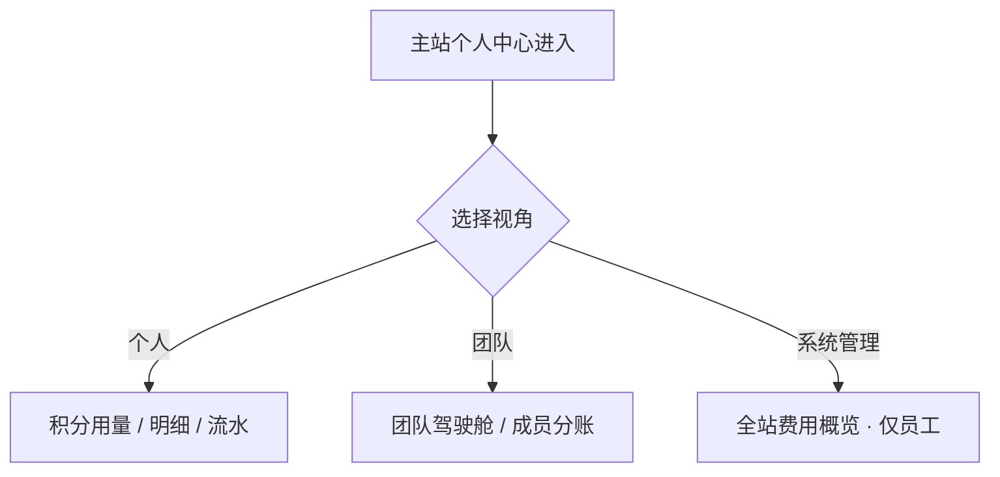

# 财务管理 · 使用指南

> **产品名**：财务控制台（finance-web）  
> **更新日期**：2026-10-04  
> **读者**：希望 **看清自己或团队用了多少、用在哪、谁用的** 的普通用户与团队管理员。  
> **本文刻意不讲**：厂商成本、毛利、积分换算公式、套餐定价策略——那些属于运营/财务内部或主站 **报价页**，不在本用户使用指南范围。

## 流程总览

---

## 1. 财务控制台是什么

财务控制台是挂在 **主站账号** 下的 **「用量与账单可视化」** 站点。它帮你回答：

- 我最近 **调用了多少次** AI 能力？
- **积分余额** 大概还能用多久（以页面展示为准）？
- 消耗 **集中在哪些工具、哪些模型**？
- 若是团队：**每个成员** 用了多少？**本月趋势** 如何？

它 **不是** 创作工具本身；创作仍在 AI 画布、电商、快速复制等应用里完成。

---

## 2. 怎么进入

1. 在 **主站登录**。
2. 打开 **个人中心**，进入与 **积分 / 费用 / 财务** 相关的菜单项（具体文案以线上一致为准）。
3. 浏览器会跳到 **财务控制台**，并在 URL 上带有 **从个人中心进入** 的校验参数（请勿随意收藏去掉参数的链接，否则可能被 middleware 拦回）。

财务控制台顶栏通常有三个视角（按权限显示）：

| 视角 | 谁看得见 | 用途 |
|------|----------|------|
| **个人** | 所有登录用户 | 自己的用量与流水 |
| **团队** | 加入了团队的用户 | 团队驾驶舱与成员分账 |
| **系统管理** | 平台员工（运营/财务/管理员） | 全站费用概览、对账等 **内部驾驶舱** |

普通创作者只需熟悉 **个人**；小团队负责人重点看 **团队**。

---

## 3. 个人视角（/fees）

侧栏一般包含：

| 页面 | 帮你看什么 |
|------|------------|
| **积分用量** | 当前 **积分余额**、近期 **总调用次数**、**总消耗**；按 **工具（应用/模块）** 汇总；按 **模型** 汇总；**最近一条条的生成记录**（时间、工具名、模型、状态、消耗积分） |
| **费用明细** | 更偏 **账单式** 的明细列表，便于按月/按条件筛选某类消费 |
| **积分流水** | **入账与出账** 流水：何时增加积分、何时因某次生成扣减、是否有退还记录 |

### 3.1 怎么读「积分用量」页

- **余额 / 冻结**：页头展示可用积分；若有 **进行中任务**，可能有 **冻结** 显示（表示已预留、尚未结算）。
- **按工具**：例如 AI 画布、电商某模块、快速复制、常用工具等，看 **哪个应用最耗**。
- **按模型**：看 **哪个模型** 调用最频繁，便于你调整创作习惯（换更轻的模型或换工作流）。
- **近期记录**：像 **银行短信** 一样逐条对照：「我下午三点那次失败有没有扣费？」——以 **状态** 列为准（成功/失败/进行中等）。

### 3.2 团队上下文提示

若你 **同时属于某个团队**，个人用量页可能显示 **团队名称、团队余额** 等上下文，避免你误以为个人与团队账混在一起。具体以页面卡片为准。

---

## 4. 团队视角（/team）

侧栏一般包含：

| 页面 | 帮你看什么 |
|------|------------|
| **团队驾驶舱** | **选定账期** 内：团队 **发放/消耗/退还/充值** 汇总、**当前余额**、**席位使用**（已用/上限）、按 **业务类别** 聚合、**按日趋势曲线**、**按成员** 消耗排行、**按模型** 分布、**最近动态** 列表 |
| **团队账单** | 团队维度的账单总览入口 |
| **费用明细** | 团队级明细，支持筛选 |
| **积分流水** | 团队积分池流水 |
| **积分用量** | 团队维度的用量统计（与个人页类似，但 scope 为团队） |
| **成员分账** | 按成员查看消耗，便于 **内部考核或成本分摊**（不涉及平台内部成本，只看 **积分消耗数**） |

### 4.1 团队驾驶舱怎么用

1. 顶部选择 **账期（月份）**；若你属于多个团队，选择 **租户/团队名称**。
2. 看 **汇总卡片**：本月消耗是否异常偏高、余额是否见底。
3. 看 **席位**：成员数是否触顶，需否在 **主站团队管理** 增购席位。
4. 看 **按日趋势**：是否某几天 campaign 导致尖峰。
5. 看 **成员排行**：谁消耗最多，是否与项目阶段匹配。
6. 点 **最近动态** 某条，可联想到 Gateway/应用里的具体操作（必要时去 Gateway 日志对时间戳）。

### 4.2 谁该看团队财务

| 角色 | 建议 |
|------|------|
| 团队 **Owner / 管理员** | 常看驾驶舱 + 成员分账 |
| 普通成员 | 主要看 **个人** 视角；团队总览只读与否以权限为准 |
| 财务同事（公司方） | 导出明细（若页面提供 CSV/筛选）做 **内部报表** |

---

## 5. 系统管理视角（/admin）— 仅平台员工

若你的主站角色是 **运营 / 财务 / 超管**，顶栏会出现 **系统管理**，内含例如：

- **费用概览**：全站按工具/模型/用户聚合；
- **对账、支付核对、团队列表** 等 **运营驾驶舱**；
- **盈亏预警、模型成本、积分报价计算器** 等 **内部页面**。

**普通用户不会看到也不应依赖这些页面** 来管理自己的创作；若误进，说明账号带有员工权限。

---

## 6. 与其他控制台的分工

| 问题 | 建议先看 |
|------|----------|
| 某次 **HTTP 请求** 参数、厂商异步 taskId | **Gateway → 日志** |
| **积分扣了多少、剩多少、团队谁用的** | **财务控制台**（本文） |
| **能不能生成、GateWay Key 是否关联** | **主站个人中心 Gateway 卡片** |
| **会员/充值/套餐选择** | 主站 **报价 / Checkout**（不在 finance 用户指南展开） |

---

## 7. 常见使用场景

### 7.1 「我感觉积分掉很快」

1. 打开 **个人 → 积分用量** → 看 **按工具** 与 **按模型**。
2. 打开 **积分流水**，按时间找大额扣减。
3. 若是团队项目，切 **团队驾驶舱** 看是否 **他人任务** 在跑。

### 7.2 「我要向老板汇报本月 AI 使用情况」

1. 团队 **驾驶舱** 截图：汇总 + 趋势 + 成员排行。
2. 导出或筛选 **费用明细**（若功能已开放）。
3. 用 **业务语言** 描述（例如「电商详情模块占 60%」），不必引用内部成本表。

### 7.3 「某次生成失败了，扣没扣积分？」

1. **积分流水** 找对应时间点。
2. **积分用量 → 近期记录** 看该条 **状态**。
3. 若显示失败且无扣减，一般 **不会重复扣**；若有疑问，记下 **记录 ID/时间** 联系客服。

---

## 8. 权限与隐私

- 你只能看到 **自己有权限的** 个人与团队数据。
- **成员分账** 可能暴露同事用量数字，团队管理员应 **内部规范** 使用，勿对外泄露。
- 系统管理数据 **严禁** 对外分享。

---

## 9. 常见问题

**Q：财务控制台要单独注册吗？**  
A：**不要**。用主站同一账号，从个人中心进入。

**Q：为什么打不开 /fees？**  
A：须从 **个人中心带参数入口** 进入；直接输 URL 可能被重定向。

**Q：这里能改套餐价吗？**  
A：**不能**。定价在主站运营侧；财务控制台是 **看数**，不是改价。

**Q：和 Gateway「用量」重复吗？**  
A：**互补**。Gateway 偏 **请求与 Token/厂商维度**；财务偏 **积分与工具/团队管理维度**。

---
