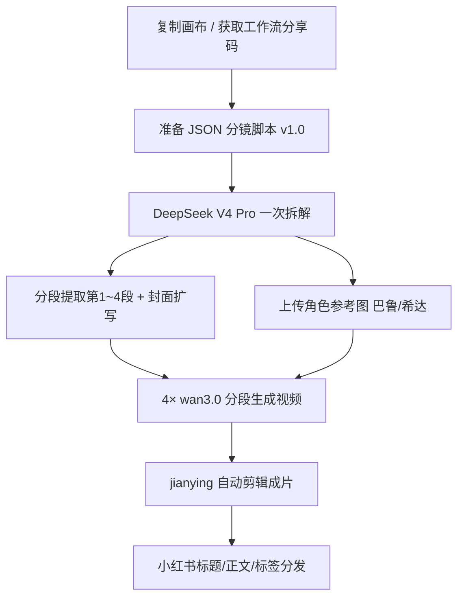
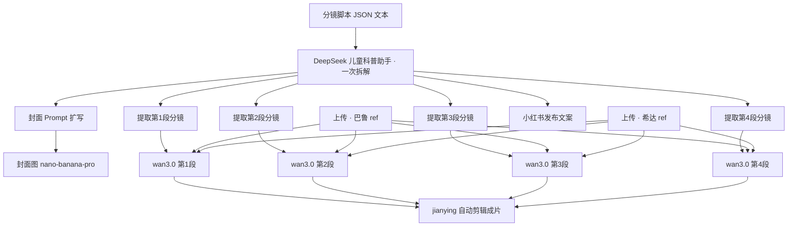

# 画布使用案例 · 儿童科普《为什么不能憋屎憋尿？》

> **案例来源**：真实画布项目  
> **项目 ID**：`cmuc5vf140mt8ys01huehtm8o`  
> **项目名称**：为什么不能憋屎憋尿？  
> **文档日期**：2026-10-04  
> **读者**：做 **儿童科普竖屏短视频**、需要 **JSON 分镜脚本 → LLM 拆解 → 角色参考图 + 分段 wan3.0 → 自动剪辑成片** 的创作者  

本文依据 **`CanvasProject` 连线、节点 Prompt 与 `CanvasGenerationTask`** 还原数据流；不涉及计费。

---

## 流程总览

---

## 1. 案例在解决什么问题

这是一条 **吉卜力风儿童科普** 工作流，用固定 IP **希达（红发女孩）+ 巴鲁（棕发男孩）** 讲「憋尿憋便的危害与正确习惯」：

1. **输入结构化脚本**：在文本节点放入 **「儿童科普短视频分镜脚本 JSON v1.0」**（含 meta、4 段 segment、每段 4 镜共 **16 镜** 量级脚本；本成片按 **4 段 × 4 镜** 拆成 **4 条视频** 生成）。
2. **一次 LLM 拆解**：**DeepSeek V4 Pro** 按固定助手规则输出：封面提示词、分镜表（画面/对白/音效）、TTS 旁白、小红书标题正文标签等（用 `===` 分段）。
3. **分支提取**：多个文本节点分别从拆解结果里 **抽第 1～4 段分镜**、**扩写封面生图 Prompt**、**抽小红书文案**。
4. **角色锁定**：**巴鲁 / 希达** 两张 **用户上传参考图**（非本库生成任务），所有 **wan3.0-video** 节点 Prompt 写「角色: 巴鲁@ref、希达@ref，请根据@文本节点 生成」。
5. **分段出片 + 合成**：**4 个 wan3.0-video**（每组一段 4 镜）→ **1 个自动剪辑成片**（`jianying-auto-render-pro2`）。

**打开**：`/canvas/cmuc5vf140mt8ys01huehtm8o`（需登录与权限）。  
本项目 **未** 上门户精选/案例墙，适合 **复制工作流结构** 后替换 JSON 与角色图。

---

## 2. 结构一览

| 指标 | 本项目 |
|------|--------|
| 版本 | Pro2 文本链 + **sbv1 视频合成** + **剪映自动成片** |
| 节点 | **18**（**9** 文本 + **3** 图 + **4** 视频 + **1** 剪辑 + **1** 分组） |
| 连线 | **31** |
| 生成任务 | **11** 次，**全部成功**（**7** TEXT · **deepseek-v4-pro**，**4** · **wan3.0-video**） |
| 视觉风格 | 竖屏 **9:16**，**吉卜力风格动画**，教室/科普示意小插画 |

---

## 3. 内容结构（科普四段）

从任务中的 JSON **meta** 与拆解输出可还原叙事：

| 段 | 目标 | 要点（对白摘要） |
|----|------|------------------|
| **第 1 段** | 现象 | 上课憋得难受 → 下课冲厕所 →「以后再也不憋了」 |
| **第 2 段** | 原因 | 膀胱像气球撑大、细菌；便便变干硬卡住 →「原来憋着这么可怕」 |
| **第 3 段** | 预防（行为） | 有尿意/便意就去，课间、回家不拖延 |
| **第 4 段** | 习惯工具 | 「便便时间表」、晨起喝水、金句卡片、结尾互动（点赞收藏） |

**核心知识点**（脚本 `core_knowledge`）：憋尿 → 膀胱撑大、细菌、尿路感染风险；憋便 → 干硬、便秘、腹痛；**有感觉就去**。

---

## 4. 文本层：JSON → 拆解 → 分段

### 4.1 根脚本（JSON）

- 上游文本节点（`story-pro2-starter`）在生成时引用整段 JSON，字段包括：`meta.title`（与本项目同名）、`meta.core_knowledge`、`script.segment_1`～`segment_4` 及每镜 `visual` / `narration` / `sound`。
- 画布保存后根节点正文可能为空；**复现时把 JSON 贴回根节点或直连拆解节点**。

### 4.2 拆解助手（节点 `n_fa64183c` · DeepSeek V4 Pro）

固定 Prompt 角色：**「儿童科普短视频制作助手」**，要求按规则输出 6 块（封面、分镜表、时长汇总、分段 TTS、完整 TTS、小红书发布），分镜行格式示例：

`第1段-镜1 | 4秒 | 画面：… | 对白：… | 音效：…`

一次生成后 **扇出** 连到多个下游文本节点（同一拆解结果多路引用）。

### 4.3 下游文本分支

| 分支 | 作用 |
|------|------|
| **提取第 1～4 段** | Prompt「请根据 提取视频分镜第 N 段」，输出该段 4 镜表格，直连对应 **wan3.0** 的 `@<sbv1-text-…>` |
| **封面扩写** | 以「===封面提示词===」为输入，扩成完整 **9:16 吉卜力封面** 生图描述 → **nano-banana-pro** 封面节点 |
| **小红书** | 提取 `publish` 类内容 → 标题《为什么不能憋屎憋尿？》+ 四步结构正文 + 话题标签 |

本案例 **7 次 TEXT 任务均成功**；TTS 全文在拆解结果里，**成片节点侧未再登记 TTS 任务**（配音可在剪映节点或外部工具按拆解文案制作）。

---

## 5. 图像层：角色 ref + 封面

| 节点 | 标签 | 说明 |
|------|------|------|
| **巴鲁** | `n_60ceeabc` | **用户上传**角色参考（任务 payload 中为 canvas/user-upload OSS） |
| **希达** | `n_ca41a4f2` | 同上 |
| **封面图** | `n_76a17068` | **nano-banana-pro**，9:16，由封面 Prompt 扩写节点驱动；**1 次 IMAGE 任务成功** |

视频 Prompt 统一句式：

`角色: 巴鲁@<sbv1-ref-n_60ceeabc>, 希达@<sbv1-ref-n_ca41a4f2> 请根据@<sbv1-text-…> 生成`

复制项目后须 **重新 @ 选参考** 或替换为你的角色图。

---

## 6. 视频层：4 段 wan3.0 + 自动剪辑

- 分组 **「wan 3.0」** 内：**4× `sbv1-video-engine`（wan3.0-video）** + **1× `jianying-auto-render-pro2`（自动成片）**。
- 每段视频节点 **文本入边** 来自对应「提取第 N 段」节点；**双 ref 入边** 来自巴鲁、希达图节点。
- **4 路视频出边** 全部接入 **自动成片**（另有重复边连到剪辑节点，与香水 TVC 案例相同模式）。
- 任务表 **4 次 wan3.0-video 均 SUCCEEDED**；每段 Prompt 内含该段 **4 镜** 的画面/对白/音效说明，由模型合成 **一段连续视频**（非 16 个独立节点）。

---

## 7. 推荐复现步骤（儿童科普模板）

1. **复制画布**  
   打开本项目 → **复制到我的画布**，或向作者索取 **工作流分享码**。

2. **准备 JSON 脚本**  
   按 v1.0 schema 写新选题（改 `meta.title`、`core_knowledge`、`script` 各段 shots）；贴到 **根文本节点**，连线到 **拆解助手** 节点。

3. **跑拆解**  
   生成 **DeepSeek** 拆解全文；检查 `===视频分镜（含对白）===` 是否 **段/镜/秒数** 完整。

4. **上传角色 ref**  
   替换 **巴鲁 / 希达** 为你的 IP 或本集定妆图（竖屏友好、正脸清晰）。

5. **分段提取 + 封面**  
   依次生成「提取第 1～4 段」与封面扩写；封面节点出 **9:16 无字图**（标题金句后期加）。

6. **生成 4 段视频**  
   在分组内对 **4 个 wan3.0** 分别生成；Prompt 保持 **双角色 @ref + @分镜文本**。

7. **自动剪辑**  
   确认 4 路视频已连 **自动成片**，运行剪辑节点得到 **一条完整科普片**；旁白可用拆解里的 **TTS 分段/完整版** 在剪映轨对齐。

8. **分发**  
   使用「小红书发布」节点输出之 **标题/正文/标签**（本集标题即项目名）。

---

## 8. 与其他案例的对比

| | 香水 TVC | 色卡换装 | **本案例（儿童科普）** |
|--|----------|----------|------------------------|
| 剧本 | 无 JSON，手写分镜 Prompt | 几乎无文本链 | **JSON 脚本 + LLM 拆解** |
| 静帧 | 8 张 nano 资产 | 大量融图/色卡 | **2 上传角色 + 1 封面** |
| 视频 | 4 镜 wan3.0 | HappyHorse 母带 + wan 换人 | **4 段 wan3.0（每段 4 镜）** |
| 剪辑 | jianying 合成 | 无 | **jianying 合成** |
| 门户 | 案例墙 | 精选 | **未上门户** |

---

## 9. 常见问题

**Q：为什么有 9 个文本节点？**  
A：1 个放 JSON、1 个拆解助手、4 个 **分段提取**、1 个 **封面扩写**、1 个 **小红书**；另有个别 **gpt-5-5** 配置节点可作备用大纲，本案例实际跑通以 **DeepSeek** 为准。

**Q：16 镜为什么只有 4 个视频节点？**  
A：**每段 4 镜合并为 1 次 wan3.0 生成**（Prompt 内列齐 4 镜），不是 16 个视频节点。

**Q：TTS 在哪里？**  
A：在 **拆解输出** 的「TTS配音（分段/完整版）」；画布未单独登记 TTS 生成任务，需在剪辑或外部 TTS 使用。

**Q：内容审核**  
A：儿童健康科普涉及身体与如厕，发布到公域平台时请遵守各平台 **未成年与医疗科普** 规范；脚本用语已口语化、无恐怖写实。

---

## 10. 相关文档

- 《AI 画布 · 使用指南》（见本节点）  
- 《香水专业级TVC广告 · 使用指南》（见本节点）（4 镜 wan + 自动剪辑，无 JSON 剧本）  
- 《分享功能 · 使用指南》（见本节点）  

---

## 11. 变更记录

| 日期 | 说明 |
|------|------|
| 2026-10-04 | 初版：基于 `cmuc5vf140mt8ys01huehtm8o` 追踪 |
