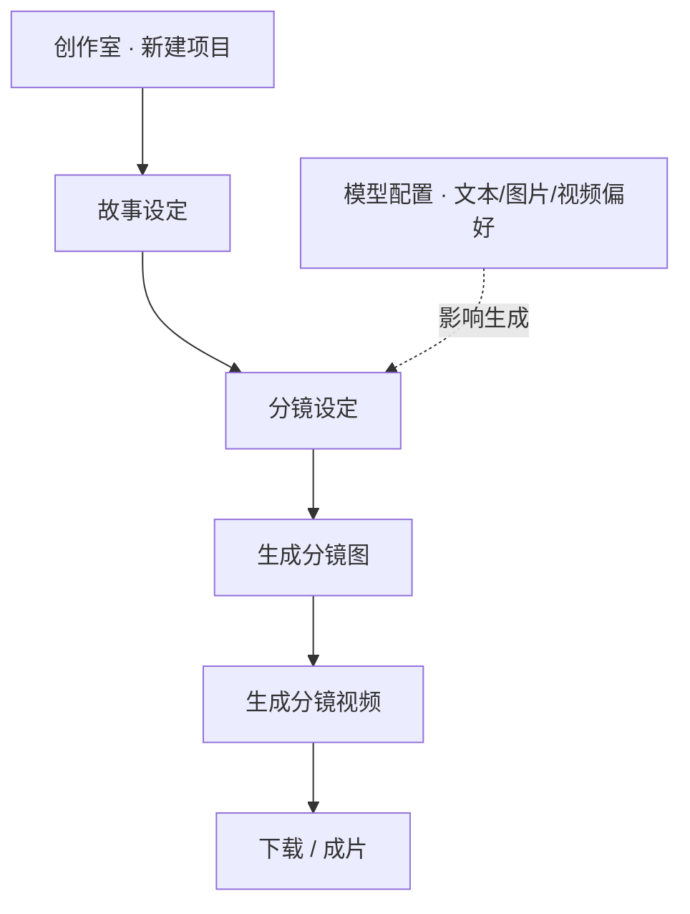

# 漫剧空间 · 使用指南

> **产品名**：漫剧空间（story-web）· 门户中亦称漫剧创作个人空间。  
> **更新日期**：2026-10-04  
> **读者**：做横屏/竖屏漫剧、短剧分镜的用户。

## 流程总览

---

## 1. 漫剧空间是什么

漫剧空间是面向 **漫剧 / AI 短剧** 的 **项目制创作门户**。与 AI 画布的「无限节点工作流」不同，这里用 **更清晰的两步向导**：

1. **故事设定** — 定片名、比例、故事与角色等；
2. **分镜设定** — 管理分镜列表、生成或调整分镜图与分镜视频。

同一主站账号下，漫剧项目与 **AI 画布 Pro2** 数据互通，你可以按习惯选 **门户线性流程** 或 **画布深度编排**。

---

## 2. 顶栏导航

| 菜单 | 作用 | 当前状态（使用预期） |
|------|------|----------------------|
| **首页 / 创作室** | 我的项目 + 精品漫剧发现 | **主要工作入口** |
| **影像室** | 素材上传、版本与成片预览 | 规划中，页面会提示后续能力 |
| **模型配置** | 查看与偏好各 **文本 / 图片 / 视频** 引擎 | **可用**，影响项目内生成时的默认模型 |

登录后还可进入 **账户** 相关页（与主站账号一致）。

---

## 3. 创作室（首页）

### 3.1 我的项目

- 项目按 **画幅** 分组展示：
  - **横屏漫剧 · 16:9**
  - **竖屏漫剧 · 9:16**
- 每个项目卡片显示封面、名称、进度等；点击进入 **项目工作区**。
- **新建项目**：从「新建项目」进入表单，选择名称、画幅等（以创建页字段为准）。

### 3.2 精品漫剧（发现）

- 展示平台精选的公开/示例项目，按同样 **16:9 / 9:16** 分组。
- **未登录** 时可浏览卡片；悬停可能有 **预览视频**（官方配置的演示片段）。
- 登录后可 **打开学习** 或按产品规则 **复制/创建自己的项目**（以卡片上按钮为准）。

### 3.3 访客与登录

- 访客可逛发现区；**创建项目、生成、保存** 需登录。
- 登录/注册页在漫剧站本域完成，账号与 **主站相同**。

---

## 4. 项目工作区（核心）

进入某个项目后，顶部有 **两步 Tab**：

| 步骤 | 名称 | 你在这里做什么 |
|------|------|----------------|
| 1 | **故事设定** | 填写或生成故事梗概、角色设定、封面等「立项」信息 |
| 2 | **分镜设定** | 编辑分镜表：每镜的文案、画面、生成 **分镜图** / **分镜视频** |

### 4.1 故事设定

- 集中完成 **片名、题材、角色、故事文本** 等，为分镜提供依据。
- 若有 **封面生成** 任务，提交后卡片/页头会显示 **生成中**；系统会自动刷新状态（进行中约每数秒更新一次）。
- 完成故事侧内容后，切换到 **分镜设定** 继续。

### 4.2 分镜设定

- 以 **分镜列表/表格** 形式管理每一镜。
- 典型操作：
  - 增删改镜号、旁白/对白、画面描述；
  - 对单镜或批量 **生成分镜图**；
  - 在分镜图基础上 **生成分镜视频**；
  - 打开 **分镜视频编辑** 相关弹层（裁剪、模型选择等，以界面为准）。
- 进行中的任务会在项目状态中体现；请耐心等待，避免重复点击导致多任务排队。

### 4.3 删除项目

- 删除需 **确认**；项目会进入 **回收/软删** 状态，创作室列表中不再显示（具体恢复策略以产品为准）。

---

## 5. 模型配置页

路径：**模型配置**（`/models`）。

- 展示平台为漫剧登记的 **LLM / IMAGE / VIDEO** 等模型列表（只读平台配置 + 你的可见范围）。
- 你可在此 **了解各模型用途说明**，并在项目生成弹层中选择具体模型（与画布类似，**不要假设固定某一个模型名**）。
- 若列表为空或生成报错，请检查主站 **Gateway 关联** 与账号权限。

---

## 6. 影像室（规划）

- 当前为 **占位说明页**：未来用于 **素材上传、版本管理、成片预览**，并与主站作品/OSS 互通。
- 你现在可把 **成片与分镜结果** 先在项目工作区查看与下载；全局素材库能力上线后会在影像室集中管理。

---

## 7. 与 AI 画布（Pro2）如何配合

| 场景 | 建议 |
|------|------|
| 快速按步骤做一集漫剧 | **漫剧空间** 项目工作区 |
| 复杂多分支、工业化脚本、剪映导出、组内协作 | **AI 画布 Pro2** |
| 同一账号 | 两处登录一致；素材与项目 ID 不同，需 **手动复制** 或通过资产/下载衔接 |

漫剧空间偏 **「项目管理 + 两步向导」**；画布偏 **「节点流水线 + 团队剧本包」**。

---

## 8. 画幅选择建议

| 画幅 | 常见用途 |
|------|----------|
| **16:9 横屏** | B 站、横屏短剧、电脑端观看 |
| **9:16 竖屏** | 抖音、快手、竖屏漫剧 |

创建时选定后，分镜预览与生成比例会跟随项目设置；中途改画幅若产品不支持，请新建项目。

---

## 9. 常见问题

**Q：生成一直转圈？**  
A：查看项目是否有多条 **进行中任务**；网络稳定等待自动刷新。仍失败则看错误文案（模型不可用、素材不合规等）。

**Q：和「电商口播故事版」是一回事吗？**  
A：**不是**。电商口播故事版在 **电商工具箱** 内，面向带货脚本与成片；漫剧空间面向 **漫剧/短剧** 项目。

**Q：精品漫剧可以下载吗？**  
A：以卡片操作与版权说明为准；自己的项目可在工作区 **下载生成结果**。

---
