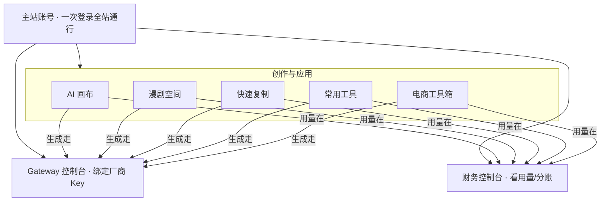

# 全站功能概述

> **适用读者**：第一次使用平台的创作者、运营与小团队负责人。  
> **更新日期**：2026-10-04  
> **说明**：本文只讲「能做什么、从哪里进」，不涉及内部计费规则与成本口径。更细的专题见文末「分应用指南」。

## 流程总览

---

## 1. 平台是什么

这是一个把 **AI 课程学习** 与 **多块创作应用** 整合在一起的创作平台。你在 **主站** 注册并登录一次，即可进入 AI 画布、漫剧空间、电商工具箱、快速复制、常用工具等子应用，**同一账号、同一套个人中心与团队关系**，在各应用之间切换时无需重复注册。

你可以把它理解成：

- **主站**：账号、个人中心、课程、团队入口、部分全局能力（如「我的 AI 空间」、AI 小智导览）。
- **创作应用**：各自有独立首页与品牌，但登录态互通。
- **Gateway 控制台**：管理 AI 模型调用凭证与查看调用记录（进阶用户与 API 开发者常用）。
- **财务控制台**：从个人中心进入，查看 **积分用量、流水与团队驾驶舱**（管理视角，不是报价页）。

---

## 2. 一次登录，全站通行

| 能力 | 你会感受到什么 |
|------|----------------|
| 统一登录 | 在主站或任一子站登录后，打开其他子站一般会 **静默续登** 或一键回到已登录状态。 |
| 个人中心 | 在主站 **个人中心** 集中查看账号、手机绑定、Gateway 关联、团队、积分相关入口。 |
| 团队 | 若你加入了 **团队**，可在团队财务里看到 **成员消耗、周期汇总与驾驶舱**（详见《财务管理 · 使用指南》）。 |
| AI 小智 | 各应用右下角 **悬浮助手**，可问「平台有哪些功能、某应用怎么用」；回答以对外功能说明为准。 |

---

## 3. 应用地图（按创作场景）

### 3.1 影视与漫剧

| 应用 | 适合谁 | 核心能力（一句话） |
|------|--------|-------------------|
| **AI 画布** | 海报、电商视觉、影视分镜、可复用工作流 | 无限画布 + 节点连线；**影视专业版 2.0** 从故事到分镜图/视频；发现区可复制他人工作流。 |
| **漫剧空间** | 漫剧、竖屏短剧 | **创作室** 管理项目；**故事设定 → 分镜设定** 两步；横屏 16:9 / 竖屏 9:16；精品漫剧浏览与模型偏好配置。 |
| **3D 导演台** | 需要先摆机位再出图的人 | 3D 场景摆位与截图，可在 **AI 画布** 内嵌打开，截图作为下游生图参考。 |

专题指南：《AI 画布 · 使用指南》（见本节点） · 《漫剧空间 · 使用指南》（见本节点）

### 3.2 电商与带货

| 应用 | 适合谁 | 核心能力（一句话） |
|------|--------|-------------------|
| **电商工具箱** | 卖家、带货团队 | 主图/套图、详情页（A+、长图分屏、模板/复刻/学结构）、拆解与拉片、口播故事版、种草与短视频模板、IP/海报/品牌等。 |

### 3.3 快速出图 / 快速复刻

| 应用 | 适合谁 | 核心能力（一句话） |
|------|--------|-------------------|
| **快速复制** | 想「照着示例做同款」的人 | 左栏分类 → 中栏选类型/示例 → 右栏模板 → 复制到工作区 → 换素材与模型 → 生成；**我的作品** 优先展示新结果。 |
| **工具站** | 单点试衣、文生图、图生视频 | 试衣间、文生图、图生视频、视觉实验室等，用完即走。 |
| **常用工具** | 零散修图、表情包、海报 | 菜单进入 16+ 图像小工具（修图、抠图、扩图、换脸、海报等），账号通用。 |

专题指南：《快速复制 · 使用指南》（见本节点） · 《常用工具 · 使用指南》（见本节点）

### 3.4 内容与分发

| 应用 | 适合谁 | 核心能力（一句话） |
|------|--------|-------------------|
| **提示词优化器** | 想写好 Prompt 的人 | 把粗略想法整理成更适合生图/生视频/文本的结构化提示词。 |
| **一键发布** | 多平台运营 | 图文/视频配合浏览器扩展或桌面端，向多个社交平台分发（需单独安装扩展/客户端）。 |

### 3.5 平台层与进阶

| 应用 | 适合谁 | 核心能力（一句话） |
|------|--------|-------------------|
| **主站 book-mall** | 所有人 | 课程、个人中心、Checkout、团队、AI 空间、AI 小智等。 |
| **Gateway 控制台** | 需自管厂商 Key、或 HTTP 调 API 的用户 | 绑定厂商凭证、管理 `sk-gw`、看用量与日志；API 会员通过 Key 调用平台模型接口。 |
| **财务控制台 finance-web** | 个人与团队管理员 | **积分用量、费用明细、流水**；团队 **驾驶舱、成员分账**（可视化与管理，不是报价页）。 |

专题指南：《Gateway 控制台 · 使用指南》（见本节点） · 《财务管理 · 使用指南》（见本节点）

---

## 4. 主站个人中心：常去的入口

登录主站后，个人中心通常包含（以实际菜单为准）：

| 入口类型 | 你可以做什么 |
|----------|--------------|
| 账号与安全 | 手机绑定、密码、登录设备等。 |
| 团队 | 创建/加入团队、席位与成员（与团队财务联动）。 |
| Gateway API Key | 查看是否已关联 Key；**用 Book 账号打开 Gateway**（一键 SSO）。 |
| 积分 / 费用 | 跳转到 **财务控制台** 的个人侧栏：积分用量、费用明细、积分流水。 |
| 我的 AI 空间 | 作品墙指针、数字人/音频/视频素材、口播合成与分镜口播项目（与工具站等互通）。 |
| 课程与学习 | 会员课程与学习进度（与工具创作分开理解即可）。 |

---

## 5. 创作结果的保存与找回（全站习惯）

各创作应用普遍遵循：

- **生成或保存** 后，结果会落在 **云端（图/视频链接）** 与 **项目/工作区快照**，刷新页面后仍可继续编辑。
- **历史 / 我的项目 / 我的作品** 等入口因应用而异：画布叫「我的画布」，快速复制叫「我的作品」，漫剧叫「创作室」项目列表。
- 从 **资产库、本地上传、粘贴、其他应用带入** 的素材，系统会记录来源，便于后续合规与追溯（你无需手动选择）。

---

## 6. 怎么选第一个应用

| 你的目标 | 建议起点 |
|----------|----------|
| 做海报、复杂工作流、影视 2.0 长链路 | **AI 画布** |
| 做竖屏/横屏漫剧、分步故事+分镜 | **漫剧空间** |
| 电商主图、详情、带货视频 | **电商工具箱**（先看选型指南） |
| 照着官方示例快速出同款 | **快速复制** |
| 抠图、修图、表情包 | **常用工具** |
| 只看自己或团队用了多少、谁用的 | **财务控制台** |
| 自己写程序调 AI 模型 | **Gateway** + 主站 API Key 流程 |

---

## 7. 分应用详细指南（本批文档）

| 文档 | 内容 |
|------|------|
| 《AI 画布 · 使用指南》（见本节点） | 门户、Pro2、分镜视频 1.0、发现与分享、节点与生成、项目资产等 |
| 《快速复制 · 使用指南》（见本节点） | 三栏交互、分类与模板、工作区产生、我的作品 |
| 《漫剧空间 · 使用指南》（见本节点） | 创作室、新建项目、故事/分镜两步、模型配置、与画布关系 |
| 《常用工具 · 使用指南》（见本节点） | 工具菜单、已上线能力、通用操作习惯 |
| 《Gateway 控制台 · 使用指南》（见本节点） | 控制台、凭证与 Key、用量日志、API 应用场景 |
| 《财务管理 · 使用指南》（见本节点） | 个人/团队视图、驾驶舱、明细与流水（用户管理视角） |

---
