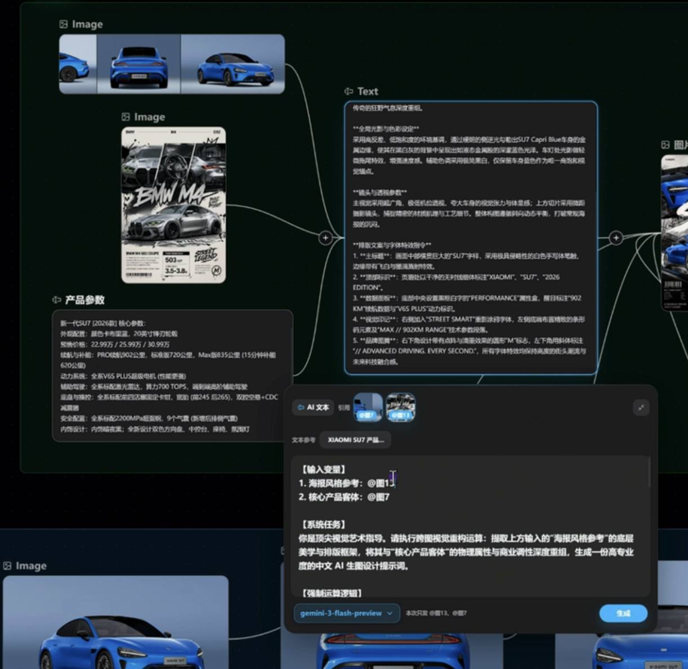
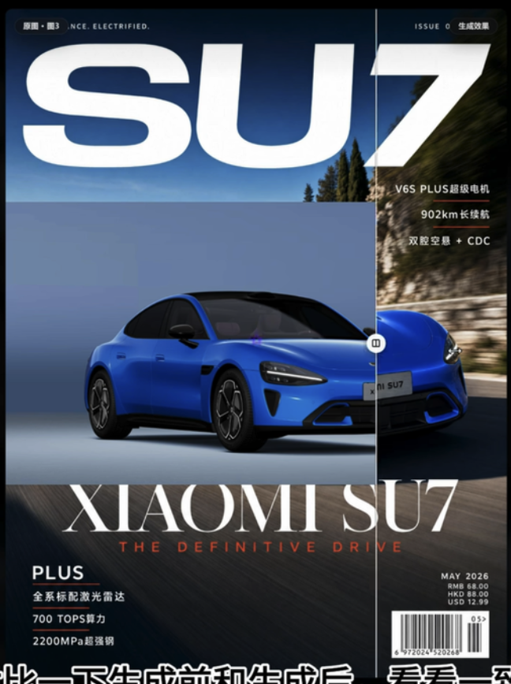
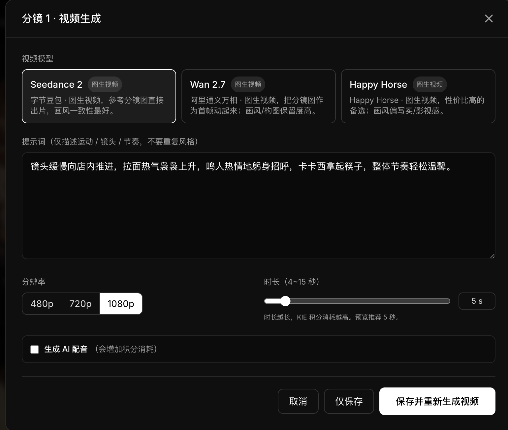

1. 生成设计方案
a. 产品图, 通过图片节点, 链接 至 AI 文本; 可以多个不同角度产品图
b. 风格参考图, 通过图片节点, 链接 至 AI 文本
c. 产品参数, 通过文本节点, 写清楚参数, 链接 至 AI 文本
b. 链接后, 在 AI 文本, 下方 应该显示上个链接节点为的 综合缩略图, 用户自行填写关联 @某个节点. 缩略图即点亮, 否则只是灰色.
e. AI 文本链接成功后, 显示缩略图, 产品参数. 下面就是模型的选择, 点击生成. 然后通过大模型对 风格参考图, 产品图, 就进行图片识别, 分析, 生成产品风格化的设计方案, 
e. 链接至 文本. 可以生成设计方案.

所以, AI 文本, 应该是一个引擎. 
文本是两边可以链接.
效果可以看

2. 生成海报, 同样类似有一个 生图引擎. 链接最后的 生成. 生图引擎等同于 AI 引擎, 生图引擎 也可以上游链接 设计方案及方案里的元素外, 还可以 再链接上游的图片.

3. 生成的图, 要可以前后做对比.效果参考 

4. 引擎的参数需要尽可能的让用户选择, 就是把参数放出来, 可以参照 