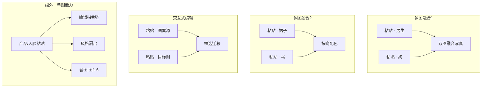

# 画布使用案例 · 图片编辑、多图融合、交互式编辑

> **案例来源**：真实画布项目  
> **项目 ID**：`cmtcodqgx009vifohrf3xci4i`  
> **项目名称**：图片编辑, 多图融合, 交互式编辑  
> **文档日期**：2026-10-04  
> **读者**：在 Pro2 画布上做 **单图指令编辑**、**双图/多图融合**、**产品套图**、**人脸一致换风格** 的创作者  

本文依据 **`CanvasProject` 连线、Dock Prompt 与 `CanvasGenerationTask`** 整理；不涉及计费。  
节点顶栏/Dock/`@` 操作见 [AI画布-图片与视频节点编辑-使用指南-20261004](../AI画布-图片与视频节点编辑-使用指南-20261004.md)。

**打开**：`/canvas/cmtcodqgx009vifohrf3xci4i`（需登录与权限）。  
项目为 **门户「案例」**（`portalCase`），可在发现区「案例」复制学习。

与同主题的 [使用案例-图片编辑涂鸦融图配饰-20261004](./使用案例-图片编辑涂鸦融图配饰-20261004.md)（`cmtcfrr1b0009if6m3dytn9dz`）相比，本案 **更集中用万相 2.7 编辑系**（`wan2.7-image-pro` / `wan2.7-image`），并单独拆出 **三个打组实验区**。

---

## 1. 案例在解决什么问题

这是一张 **纯图片节点** 的 Pro2 实验台（**无视频、无剧本中心**）：

1. **单图编辑**：上传一张图 → 一条 Prompt → **检测/分割/去水印/改字/换镜头/加字/抽 flat lay** 等。  
2. **一图多产出**：同一张 **产品参考** 连到多个下游，按 **图1～图6** 脚本出 **商业套图**（主视觉、微距、爆炸图、佩戴、光影、生活方式）。  
3. **一脸多风格**：同一张 **人脸参考** 扇出到 **民国 / 英伦 / 港风 / 新中式** 等造型 Prompt。  
4. **双图融合**（打组）：**人+宠写真**、**服装+鸟配色**、**框选图案迁移**（交互式编辑组）。  

全案 **45 节点**（**40** 图 + **3** 组 + **2** 标签占位），**28** 条连线；**25** 次 IMAGE 任务（**22** 成功、**2** 失败已重试成功、**1** 取消后成功）。

---

## 2. 结构一览

| 指标 | 本项目 |
|------|--------|
| 主模型 | **wan2.7-image-pro**（23 次任务）、**wan2.7-image**（1）、**nano-banana-pro**（1 次微距 + 多处 **upload** 节点配置） |
| 打组 | **多图融合1**、**多图融合2**、**交互式编辑** |
| 数据流 | 几乎全是 **`粘贴的图片` → `图片`（img2img）**，`in_image` 连线 |

---

## 3. 三个打组 · 多图融合怎么写 Prompt

共同模式：**组内 2 张「粘贴的图片」** 都连到 **1 个生成节点**；Prompt 用 **「图1 … 图2 …」** 或 **`@<up-img-节点id>`** 点名；任务 payload 为 **「上游附带 2 张参考图」**。

| 组名 | 参考 A | 参考 B | 生成 Prompt（摘要） | 节点 id（便于对照画布） |
|------|--------|--------|---------------------|-------------------------|
| **多图融合1** | 男生 | 狗 | 给图1男生和图2狗拍写真，男生搂狗，棚拍柔光、蓝色纹理背景 | `n_5FKX7K_B` |
| **多图融合2** | 裙子模特 | 鸟 | 给图1裙子按图2 **鸟的颜色** 配色，款式与模特不变 | `n_D0ANpsFw` |
| **交互式编辑** | 带图案区域 | 目标载体 | 将 **图1框选的图案** 放到 **图2框选处** | `n_PjWpfA7R` |

**交互式编辑组** 另有 2 张未连线的粘贴节点，作备用素材；核心 fusion 只消费 **图案源 + 目标图** 各 1 张。

**复现提示**：框选类指令需在源图上 **标出区域**（画布 **魔术 → 重绘/擦除** 的框选，或模型支持的交互编辑流程），再生成；复制项目后 **重新框选 + 检查 @ 引用**。

---

## 4. 组外 · 单图「图片编辑」指令库

每组都是 **1 粘贴 → 1 生成**，模型 **wan2.7-image-pro**，Prompt 为 **自然语言编辑句 + @ 参考**：

| 能力 | Prompt 示例（摘要） |
|------|-------------------|
| **目标检测标注** | 检测笔记本电脑和闹钟，**画框并标注** laptop / clock |
| **分割** | 分割图中的 **玻璃杯** |
| **穿搭 flat lay** | 从照片 **提取穿搭单品**，白底平铺，电商风 |
| **去水印** | 去除 **全图水印** |
| **镜头** | 用 **鱼眼镜头** 重新拍摄 |
| **局部加字** | 在沙滩上手写 **「Time for Holiday？」** |
| **改字改数** | 把 **18 改成 29**，**JUNE 改成 SEPTEMBER** |
| **创意套图** | **4 宫格季节变迁** 拍立得，同一棵树四季，摆餐桌 |

这些链路适合当作 **「万相编辑一句话模板」** 直接换图复用。

---

## 5. 组外 · 一脸多风格（人脸参考扇出）

- **根粘贴**：`n_syISEowH`（东亚男性人脸/半身参考）。  
- **扇出连线** 到多个 **wan2.7-image-pro** 节点，各写一种风格 Prompt，并 **`@` 同一参考** 保脸。  

| 下游节点 | 风格 |
|----------|------|
| `n_MnQ97I5o` | 长 Prompt 含 **民国文人 / 英伦 / 港风 / 新中式** 等设定（可作 Prompt 库；实际生成按当时节点一次输出） |
| `n_C7s6QPdd` | **英伦绅士** 单风格 |
| `n_E7Juk0wq` | **90s 港风复古** 全身 |
| `n_7bjSY516` | **新中式禅意** |

任务侧均带 **「第 1 张为产品主体（必保）」** 类说明——此处 **「主体」= 人脸身份**，写法与电商融图相同。

---

## 6. 组外 · 一产品多镜（耳机商业套图）

- **根粘贴**：`n_fykOadC7`（耳机产品图）。  
- **扇出** 到 7 个下游（含 1 次 **nano-banana-pro** 微距任务 `n_yu6eciB_`），其余多为 **wan2.7-image-pro** / 一次 **wan2.7-image** 爆炸图。

| 镜号 / 节点 | 内容（摘要） |
|-------------|--------------|
| 图1 `n_AKJwbo-2` | 商业主视觉封面，耳机悬浮石膏体（曾 **失败 1 次** 后带参考重试成功） |
| 图2 `n_yu6eciB_` | **100mm 微距** 伸缩臂金属纹理（nano） |
| 图3～6 | 耳罩皮质微距、**爆炸拆解**、佩戴场景、百叶窗光影静物、生活方式全家福 |

Prompt 统一 **「参考图 + 图N：…」**，适合 **3C / 耳机详情页** 从 **一张 SKU 图** 扩成 **六张商拍**。

---

## 7. 标签节点

画布上有 **2 个 `story-pro2-tag`**，当前 **无正文**（可能曾作长 Prompt 备忘后清空）。长文案 **民国/英伦** 等已直接写在 **`n_MnQ97I5o`** 的 Dock 里；复制时可把 tag 当 **Prompt 仓库** 自行恢复。

---

## 8. 推荐复现步骤

1. **复制案例** → 发现区「案例」或 `/canvas/cmtcodqgx009vifohrf3xci4i`。  
2. **先练单图编辑**：替换任一组外「粘贴的图片」，保留 Prompt 句式，只改 `@` 指向。  
3. **再练双图融合**：在 **多图融合1/2** 换自己的 **人+宠 / 服装+配色参考**，保持 **两线进、一线出**。  
4. **交互式编辑**：准备 **图案源 + 目标图**，在源/目标上 **框选**，用 §3 句式生成。  
5. **产品套图**：1 张产品粘贴 → **复制多个图片节点** → 改 **图2～图6** 描述，模型优先 **wan2.7-image-pro**。  
6. **失败/取消**：本案 `n_AKJwbo-2`、`n_7bjSY516` 有失败记录；**检查参考是否附上** 后 **重新生成**，勿只改友好提示。  

电商站内 **分层抠图/擦除** 可配合 [图片处理-使用指南](../图片处理-使用指南.md)；画布侧侧重 **多图参考 + 一句话编辑**。

---

## 9. 与「涂鸦融图配饰」案例的对比

| | `cmtcfrr1b…` 涂鸦融图配饰 | **本案** `cmtcodqgx…` |
|--|---------------------------|------------------------|
| 组数 | 5 组（插图/涂鸦/融合/文创/草图） | **3 组**（融合×2 + 交互编辑） |
| 主力模型 | qwen / nano / gpt 混用 | **wan2.7-image-pro** 为主 |
| 特色 | 多模型并行实验 | **编辑指令模板库** + **产品六镜** + **框选迁移** |
| 门户 | 案例 | **案例** |

---

## 10. 常见问题

**Q：为什么很多节点配置 nano-banana-pro 但任务是 wan2.7？**  
A：**粘贴节点** 常用 nano 配置占位；**实际生成** 以下游节点所选模型为准（任务表为准）。

**Q：双图融合必须画两条线吗？**  
A：本案 **必须** 两条 `in_image` 进同一节点；仅 Dock 粘贴不连线时，复制后易丢参考，建议 **连线 + @ 图1/图2** 双保险。

**Q：和电商「图片处理」分工？**  
A：**图片处理** = 单项目分层修图；**本画布** = 多节点工作流、多图参考、风格扇出、可分享复制。

---

## 11. 相关文档

- [AI画布-使用指南-20261004](../AI画布-使用指南-20261004.md)  
- [AI画布-图片与视频节点编辑-使用指南-20261004](../AI画布-图片与视频节点编辑-使用指南-20261004.md)  
- [使用案例-图片编辑涂鸦融图配饰-20261004](./使用案例-图片编辑涂鸦融图配饰-20261004.md)  

---

## 12. 变更记录

| 日期 | 说明 |
|------|------|
| 2026-10-04 | 初版：基于 `cmtcodqgx009vifohrf3xci4i` 追踪 |
