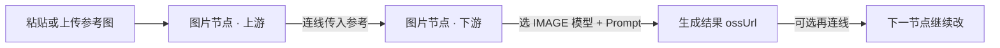

# 画布使用案例 · 图片编辑、涂鸦、融图与配饰

> **案例来源**：真实画布项目（影视专业版 2.0 引擎 · 自由编排）  
> **项目 ID**：`cmtcfrr1b0009if6m3dytn9dz`  
> **项目名称**：图片编辑, 涂鸦, 融图, 配饰  
> **文档日期**：2026-10-04  
> **读者**：希望在 **同一张画布** 里并行试多种「参考图 → 改图/融图/文创」链路的创作者  

本文根据该项目的 **画布 JSON、节点连线与生成任务记录** 整理，描述 **数据怎么流、你该怎么照着做**；不涉及计费与内部接口。

---

## 1. 这个案例在解决什么问题

这不是「从剧本到分镜视频」的标准 Pro2 长片流程，而是一套 **多工作区并行的图像实验台**：

- 把 **粘贴/上传的参考图** 作为起点；
- 用 **不同 IMAGE 模型** 做局部改图、风格化、多图融合、文创延展、草图细化；
- 用 **打组** 把五条实验线分开，避免画布混乱；
- 用 **标签节点** 存放一段完整的场景/人物 Prompt（便于复制到多个生图节点）。

项目已标记为 **门户「案例」**（`portalCase`），适合在发现区「案例」Tab 学习整体编排思路。

**打开方式**（需登录且有权限）：AI 画布 → `/canvas/cmtcfrr1b0009if6m3dytn9dz`。

---

## 2. 画布整体结构（一眼看懂）

| 指标 | 本项目实际情况 |
|------|----------------|
| 版本 | **Pro2**（`meta.edition: pro2`） |
| 节点 | 约 **40** 个（含 **5 个组** + 大量 **图片节点**） |
| 连线 | **27** 条，几乎全是 **图片 → 图片**（上游结果喂下游） |
| 生成任务 | **19** 次 IMAGE 任务，**18** 成功、**1** 取消 |
| 其他节点 | **1** 个「音效设计」音频节点、**1** 个 **标签**（长文案 Prompt） |

五个 **组（分镜板样式）** 名称与用途：

| 组名 | 你在这一区通常做什么 |
|------|----------------------|
| **插图** | 参考图 → **修图/编辑**（如 qwen-image-edit）→ 再 **文生/图生** 多版（qwen-image-3.0-pro） |
| **涂鸦** | 参考图 → **万相 2.7** 等模型做涂鸦感或风格化 |
| **多图融合** | 多张 **粘贴图** 汇入 → **qwen-image-3.0-pro** 做融合出图 |
| **文创生成** | 参考 → **qwen-image-3.0-pro** 链式迭代（含节点间互连再生成） |
| **草图创作** | 参考 → **qwen-image-3.0-pro** 把草图/概念推成成稿 |

组外还有一条 **未分组** 区域：同样以 **nano-banana-pro / gpt-image-2 / wan2.7-image-pro** 等组合做 **粘贴图 → 成图** 的对比实验。

---

## 3. 数据流模式（全案通用）

本项目重复最多的模式可以概括成 **三步**：

**用户操作对应关系：**

1. **输入**：在图片节点上传/粘贴（标题常为「粘贴的图片」）→ 数据写入节点 `ossUrl`。
2. **传递**：从上游 **右侧 +** 拖线到下游 → 下游 Dock/面板会把上游图当作 **参考图**（@ 引用）。
3. **生成**：在下游选中 **IMAGE 模型**（如 nano-banana-pro、qwen-image-3.0-pro、wan2.7-image-pro、gpt-image-2、qwen-image-edit）→ 点生成 → 任务写入 `CanvasGenerationTask`，成功后回写该节点 `ossUrl`。
4. **迭代**：下游节点可再连到下一个图片节点，形成 **A→B→C** 链（「文创生成」组里甚至有 **qwen 成图 → 再连 qwen** 的二次迭代）。

**本项目没有** 走「分镜脚本中心定稿 → 角色/场景/分镜视频列」的标准 Pro2 电影线；**没有** 成功的 VIDEO/TEXT 类任务记录。

---

## 4. 分工作区说明（按组）

### 4.1 插图

**数据流（从连线还原）：**

- 多条：**nano-banana-pro（粘贴图）→ qwen-image-edit**（典型 **修图/改图** 链）。
- 多条：**nano-banana-pro → qwen-image-3.0-pro**（在参考基础上 **再出插画向成稿**）。

**你怎么复现：**

1. 在「插图」组内新建或复制 **图片节点**，粘贴产品/人像图。
2. 连到第二个图片节点，模型选 **偏编辑** 的 IMAGE（本案例为 qwen-image-edit）。
3. 再 spawn 第三个节点，模型选 **qwen-image-3.0-pro**，Prompt 写插画风格与构图。
4. 对比同一参考图下 **edit vs 直接 3.0 出图** 的差异。

---

### 4.2 涂鸦

**数据流：**

- **nano-banana-pro（粘贴）→ wan2.7-image-pro**（出现 **2** 条并行链）。

**你怎么复现：**

1. 准备线稿或简单涂鸦/照片。
2. 上游用 **nano-banana-pro** 做构图或第一版色彩。
3. 下游 **wan2.7-image-pro** 强化风格或细节（以你账户内模型说明为准）。
4. 两条链可试 **不同 Prompt**，对比涂鸦感。

---

### 4.3 多图融合

**数据流：**

- 组内 **3** 张 **nano-banana-pro 粘贴图** 作为多源；
- 连线汇聚到 **qwen-image-3.0-pro** 节点出 **融合图**。

**你怎么复现：**

1. 在同一组放 **多张** 参考（人物 + 场景 + 配饰等）。
2. 分别连到 **同一个** 下游图片节点（或多下游各试一版）。
3. Prompt 中写清 **以哪张为主、哪张提供背景/道具**。
4. 用 **qwen-image-3.0-pro**（或你 Gateway 里同等能力的融图模型）生成。

---

### 4.4 文创生成

**数据流：**

- **nano-banana-pro → qwen-image-3.0-pro**（多入口）；
- 其中一条为 **qwen-image-3.0-pro → qwen-image-3.0-pro**（用上一版成图再改一版）。

**你怎么复现：**

1. 先出 **文创主体**（海报、周边、纹样等）第一版。
2. 把第一版 **连线** 到第二个 qwen 节点，做 **细化/变体**（颜色、排版留白、材质）。
3. 适合「同一 IP 多方案」而不是一次定稿。

---

### 4.5 草图创作

**数据流：**

- **nano-banana-pro → qwen-image-3.0-pro**（两条链）。

**你怎么复现：**

1. 上传 **草图/线稿** 到上游节点。
2. 下游用 **qwen-image-3.0-pro** 做写实或商业成稿。
3. 两条链可试 **不同细节程度**（少改结构 vs 大幅细化）。

---

### 4.6 组外区域 + 标签 Prompt

- **未分组** 节点：主要是 **nano-banana-pro / gpt-image-2 / wan2.7-image-pro** 的 **粘贴 → 成图** 对比（与本案例任务记录一致）。
- **标签节点**（`story-pro2-tag`）：内嵌一段 **完整的胶片感户外露台人像** 描述（景别、光线、人物姿态、中式庭院风格等）。用法建议：
  - 作为 **公共 Prompt 库**：复制到多个图片节点的生图 Prompt；
  - 与 **插图/文创** 组联动，保证多节点 **同一场景语义**。

- **音效设计** 节点：本项目中 **无音频生成任务**；可忽略或自行扩展为成片配乐实验。

---

## 5. 本案例用过的 IMAGE 模型（任务统计）

从 **19** 条生成任务归纳（便于你对照「这条链当时用的什么引擎」）：

| 模型（modelKey） | 大致用途（结合节点位置） |
|------------------|---------------------------|
| **qwen-image-3.0-pro** | 文创/草图/多图融合/插图后续成稿（使用最多） |
| **wan2.7-image-pro** | 涂鸦组、组外风格化 |
| **qwen-image-edit** / **qwen-image-edit-max** | 插图组改图 |
| **gpt-image-2** | 组外对比出图 |
| **nano-banana-pro** | 多作 **上游参考/首版**（节点配置与粘贴图） |

实际可选模型以你 Gateway **IMAGE 列表** 为准；本案例说明 **同一画布可混用多模型做 AB**。

---

## 6. 推荐操作顺序（新手照着做）

1. **复制案例**：发现区「案例」找到本项目 → **复制到我的画布**（或向作者索取 **工作流 10 位分享码**）。
2. **先读标签节点**：打开标签里的长文案，理解目标画面。
3. **按组玩一条线**：建议从 **插图** 或 **草图创作** 开始，只跑通 **粘贴 → 一连 → 一生成**。
4. **再看组外对比链**：同一参考图换 **gpt-image-2 vs wan2.7** 看差异。
5. **保存资产**：满意节点用顶栏 **保存为项目资产**，供其他组 @ 引用。
6. **投稿/分享**：若你要对外展示，可走 **投稿案例** 或 **分享工作流**（见 [平台分享功能-使用指南-20261004](../平台分享功能-使用指南-20261004.md)）。

---

## 7. 与标准 Pro2 影视流程的区别

| 标准 Pro2 影视 | 本案例 |
|----------------|--------|
| 故事 → 脚本定稿 → 风格 → 角色/场景 → 分镜 → 视频 | **未使用** 脚本中心定稿链 |
| 单列时间线生产 | **五组并行** + 组外实验 |
| 分镜视频/剪映导出 | **仅 IMAGE** 出图 |

你可以 **在同一 Pro2 画布** 里混合两种玩法：本案例是「**设计实验室**」范式；另开项目可走 `story-pro2-script-hub` 标准线。

---

## 8. 常见问题

**Q：为什么很多节点叫「粘贴的图片」？**  
A：来自 **剪贴板/上传** 的参考，系统默认标题；可在节点标题里改成「人物参考」「场景参考」等便于管理。

**Q：连线了但下游没用到上图？**  
A：检查下游是否 **选中上游为参考**、Prompt 是否说明引用关系；重新生成前看浮动 Dock 参考槽。

**Q：任务取消了一次？**  
A：本案例有 **1** 次 qwen-image-3.0-pro 任务为 **CANCELLED**，属正常重试行为；以节点上最终 `ossUrl` 为准。

**Q：能否只学某一组？**  
A：可以。复制整画布后 **删除其他组** 或 **解组**，只保留「多图融合」等单线。

---

## 9. 相关文档

- [AI画布-使用指南-20261004](../AI画布-使用指南-20261004.md)  
- [平台分享功能-使用指南-20261004](../平台分享功能-使用指南-20261004.md)  
- Pro2 节点交互：`canvas-web/docs/libtv-unified-node-catalog.md`  

---

## 10. 变更说明

| 日期 | 说明 |
|------|------|
| 2026-10-04 | 初版：基于 `CanvasProject` + `CanvasGenerationTask` 数据流追踪撰写 |
