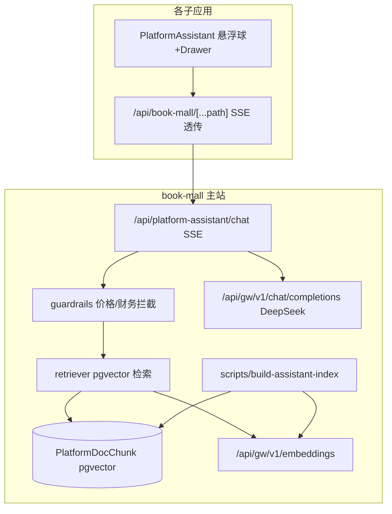

# 平台 AI 导览助手 · 设计文档

> 单层 RAG 导览助手：全站悬浮头像球 → 右侧 Drawer → DeepSeek 流式对话。
> 面向全部注册用户、平台代付、无积分、无订阅门禁。知识来自主站 doc 白名单子集。

相关规则：`platform-app-federation.mdc`、`gateway-platform-vendor-credentials.mdc`、`no-native-dialogs.mdc`、`site-architecture-doc.mdc`、`agent-db-and-config-execution.mdc`。

---

## 1. 目标与边界

| 维度 | 结论 |
|------|------|
| 面向对象 | 全部**注册用户**（登录即用，经 `tools_token`） |
| 计费 | **平台代付 DeepSeek**（Platform Admin Key + platform-pool 凭证），对用户免费、无积分、无订阅门禁 |
| 知识来源 | 主站 doc 的**白名单子集**，分类 `functional` / `operational` / `intro` |
| 拒答 | 价格 / 计费 / 财务 / 平台计算规则 → 固定话术「请见平台的报价体系」+ 报价页链接 |
| 图片/视频生成 | **不在助手内执行** → 返回引导卡，深链到对应应用 |
| 交互 | 悬浮头像球 → 右侧 Drawer → 流式气泡（DeepSeek 风格） |
| 接入范围 | 全站子应用统一挂载共享组件 |

非目标（本期不做）：工具调用 / MCP、图生图、生视频、积分扣费、会话持久化落库。

---

## 2. 架构



平台代付：`CHAT` 与 `IDX` 均用 `findPlatformAdminApiKey()` 解析的 Platform Admin `apiKeyId` 直接调 Gateway（`gatewayV1ChatCompletionsStream` / `gatewayV1Embeddings`），不依赖用户个人 sk-gw、不校验订阅。

---

## 3. 数据流（一次问答）

1. 用户在任意子站点开助手，输入问题；前端 POST 本站 `/api/book-mall/api/platform-assistant/chat`（浏览器带 `tools_token` cookie，BFF 转 `Authorization: Bearer`）。
2. 主站端点 `verifyToolsBearer(request)` 校验登录（未登录 401 → 前端提示登录）。
3. **护栏 guardrails**：命中价格/计费/财务/平台计算规则关键词 → 直接 SSE 回固定话术 + 报价页链接，不进模型、不检索。
4. **检索 retriever**：对问题做 embedding（Gateway `text-embedding-v3`）→ pgvector 余弦相似度取 top-k（可按 `category` 过滤）。
5. **意图**：识别到图片/视频「生成」诉求 → 在回答中附引导卡（深链对应应用）。
6. 组装 system prompt（人设 + top-k 知识 + 约束）→ 平台代付 DeepSeek 流式 → SSE 透传回前端逐字渲染。

---

## 4. 数据模型（pgvector）

`book-mall/prisma/schema.prisma` 新增：

```prisma
model PlatformDocChunk {
  id          String   @id @default(cuid())
  source      String   // 相对路径，如 "book-mall/doc/product/00-overview.md"
  category    String   // functional | operational | intro
  heading     String   // 所属标题层级路径
  content     String   @db.Text
  tokens      Int      @default(0)
  contentHash String   // 用于增量 upsert 去重
  // embedding 由原生迁移添加 vector(1024) 列 + ivfflat 索引（Prisma 不识别 vector 类型）
  createdAt   DateTime @default(now())
  updatedAt   DateTime @updatedAt

  @@unique([source, heading, contentHash])
  @@index([category])
}
```

原生迁移 `migration.sql`（经 `pnpm db:apply-pending`）：

```sql
CREATE EXTENSION IF NOT EXISTS vector;
-- Prisma 建表后补 vector 列（Prisma 不支持 vector 类型）
ALTER TABLE "PlatformDocChunk" ADD COLUMN IF NOT EXISTS "embedding" vector(1024);
```

> **检索用精确 KNN，不建 ivfflat（重要）**：初版曾建 `ivfflat (lists=100)` 近似索引，但语料仅数百块时每个 list ≈2 条、默认 `probes=1` 只扫一个 cluster，会把召回压缩到 2~3 条候选，导致「AI 画布」「有哪些应用」等问题检索不到最相关块。已在迁移 `20260813120000_platform_doc_chunk_drop_ivfflat` 中 `DROP INDEX`。此规模下 `ORDER BY embedding <=> q LIMIT 8` 走顺序扫描 + 距离排序即毫秒级且召回准确；待语料增长到数万级再改用 HNSW（`m/ef_construction` 可调），届时同步提高 `LIMIT` 前的候选。

> 前置：腾讯云 PG 须允许 `CREATE EXTENSION vector`。若不可用，退化方案：`embedding` 存 `jsonb`/`float8[]`，检索改应用层余弦（语料小可接受），其余不变。

维度 1024 对应百炼 `text-embedding-v3`（可选 512/768/1024）。

---

## 5. 知识白名单（草稿，供审阅增删）

`book-mall/lib/platform-assistant/knowledge-allowlist.ts` 显式列出可对外文件 + 分类。

**纳入（intro / functional / operational）**

| 文件 | 分类 |
|------|------|
| `docs/platform-apps-catalog.md`（**权威应用清单**，回答「有哪些应用/某应用做什么」以此为准） | intro |
| `book-mall/doc/product/00-overview.md` | intro |
| `book-mall/doc/product/e-commerce-toolkit.md` | functional |
| `book-mall/doc/product/quick-replica-platform.md` | functional |
| `book-mall/doc/product/prompt-optimizer-platform.md` | functional |
| `book-mall/doc/product/08-independent-tools-sso.md` | operational |
| `book-mall/doc/product/04-user-center.md` | operational |
| `book-mall/doc/product/06-flows.md` | operational |
| `book-mall/doc/product/16-project-assets-unified-design.md` | functional |
| `docs/canvas.md` / `docs/新画布.md` / `canvas-web/docs/canvas-portal-product-requirements.md` | functional |
| `canvas-web/docs/story-editions-overview.md` / `canvas-web/docs/storyboard-video-1.0-requirements.md` | functional |
| `docs/ecom.md` | functional |
| `docs/director.md` | functional |
| `docs/quick-replica.md` | functional |
| `docs/一键发布平台.md` | functional |
| `docs/自动剪辑.md` | functional |

> **知识覆盖**：初版只纳入少数文档且切块过少（如 `docs/canvas.md` 仅 1 块），叠加 ivfflat 近似召回，导致「AI 画布是做什么的」「平台有哪些应用」答不出。已新增 `docs/platform-apps-catalog.md`（对外可讲、只讲功能不含价格）作为强锚点，并补入画布/漫剧/发布/剪辑等功能文档，重建后共约 200+ 块。新增/修改文档后需 `pnpm --dir book-mall assistant:index` 重建。

**严格排除（不入库）**：`book-mall/doc/plans/**`、`book-mall/doc/finance/**`、`02-users-billing-and-balance.md`、`03-metering-llm-and-tools.md`、`0516-finance-major-refactor.md`、`09-finance-refactor-and-tool-federation.md`、`11-ai-tryon-cost-template-v1.0.md`、`13-tool-service-fee-and-wallet.md`、`18-vip-package.md`、`19-credit-expiry.md`、`points-wallet-topup-spec.md`、`gen-hotcold-policy.md`、`百炼模型与kie壳的问题.md`、`docs/price/**`、`docs/全站架构图与配置表.md`（含端口/内部配置）、`docs/100人团队扩展方案.md`、`book-mall/doc/model-api.md`。

---

## 6. 护栏（拒答规则）

`book-mall/lib/platform-assistant/guardrails.ts`：

- 关键词命中（价格/收费/多少钱/计费/结算/积分/额度/退款/发票/成本/毛利/定价/computeCredits 等）→ 直接返回：
  > 关于价格与计费规则，请见平台的报价体系：<报价页链接>。我可以帮你了解各应用的功能与使用方式。
- 报价页链接：主站 `${MAIN_SITE_ORIGIN}/pricing`。
- system prompt 内additionally约束：不得推测价格/财务/平台计算规则；无知识依据时明确「未收录」。

三层：不入库 + 前置关键词拦截 + system prompt 约束。

---

## 7. 图片/视频引导映射

`book-mall/lib/platform-assistant/redirect-map.ts`：意图关键词 → 应用深链（`NEXT_PUBLIC_*_ORIGIN`，回退站点域名）。

| 意图 | 目标应用 | Origin env |
|------|----------|-----------|
| 电商主图/详情/带货视频 | 电商工具箱 | `NEXT_PUBLIC_ECOMMERCE_WEB_ORIGIN` |
| 海报/画布/分镜节点 | Canvas | `NEXT_PUBLIC_CANVAS_WEB_ORIGIN` |
| 试衣/文生图/图生视频 | 工具站 | `NEXT_PUBLIC_TOOL_WEB_ORIGIN`（回退主站 re-enter tool） |
| 漫剧/短剧分镜 | Story | `NEXT_PUBLIC_STORY_WEB_ORIGIN` |
| 3D 分镜摆位 | 导演台 | `NEXT_PUBLIC_DIRECTOR_WEB_ORIGIN` |
| 常用图像小工具 | 常用工具 | `NEXT_PUBLIC_COMMON_TOOLS_ORIGIN` |

引导卡以结构化标记随 SSE 文本返回（`[[assistant-redirect:{json}]]`），前端解析渲染为可点击卡片。

---

## 8. Gateway 改动（embedding 支持）

现有 `/api/gw/v1/*` 为显式路由，无 embeddings。新增：

- `book-mall/lib/gateway/model-router.ts`：`text-embedding-v3` / `text-embedding-v4` → `{ providerKind: "BAILIAN", requestKind: "OTHER" }`。
- `book-mall/lib/gateway/proxy-common.ts`：新增 `forwardEmbeddings`（POST `${base}/embeddings`，OpenAI 兼容，body `{ model, input, dimensions? }`）。
- `book-mall/app/api/gw/v1/embeddings/route.ts`：`requireGatewayV1Auth` → 路由 BAILIAN → `pickCredentialForKind` → `createRequestLog` → `forwardEmbeddings` → 回 JSON + `x-gateway-log-id`。
- `book-mall/lib/gateway/gateway-v1-http-client.ts`：新增 `gatewayV1Embeddings({ apiKeyId, body, meta })`。
- 平台代付：BAILIAN 凭证已在 platform-pool 绑定（`platform-credential-seed.ts` CREDENTIALS 含 BAILIAN）。embedding 模型登记入 `model-catalog.ts` 供管理页可见（可选）。

---

## 9. 后端模块（book-mall/lib/platform-assistant/）

| 文件 | 职责 |
|------|------|
| `knowledge-allowlist.ts` | 白名单文件清单 + 分类 |
| `platform-gateway.ts` | 经 Gateway 平台代付调 `text-embedding-v3`（build + query 复用）+ DeepSeek 流式；embedding 带 `AbortSignal.timeout`（query 20s / index 60s）防内部链路挂死 |
| `retriever.ts` | pgvector 精确 KNN（`<=>` 升序 top-8）+ category 过滤；query embedding 进程内 LRU 缓存（256）+ 失败重试 1 次 |
| `guardrails.ts` | 敏感话题识别 + 固定话术 |
| `redirect-map.ts` | 图片/视频意图 → 应用深链 |
| `system-prompt.ts` | 人设「AI 小智」+ 知识拼装 + 约束（有相关知识时不轻易「未收录」；被问总览时按目录列出主要应用） |
| `config.ts` | 模型/维度/`TOP_K=8`/限流；`isPureGreeting()` 纯寒暄跳过检索 |

API：`book-mall/app/api/platform-assistant/chat/route.ts`
- `runtime = "nodejs"`, `dynamic = "force-dynamic"`, `maxDuration = 60`
- 鉴权/限流/解析后**立即返回 SSE 流**：`start()` 先刷心跳注释 `: open`（前端秒显「正在输入」），随后在流内做 guardrails → retriever → 组 prompt → 平台代付 DeepSeek 流式；网关/检索错误以 assistant 文本回流（不再中途改 HTTP 状态码）。
- 限流：进程内 per-user 简单令牌桶（20 次/分钟）；`max_tokens` 上限 1024。

### 响应速度优化（本轮）

慢的构成：多跳网络（子站→BFF→主站→Gateway→厂商）+ 同步 embedding + DeepSeek 首字延迟 + dev 编译/DB 连接池拥塞。已做：

1. **首字即时**：连接建立即刷 SSE 心跳，UI 立刻显示打字动效，掩盖 embedding/检索耗时。
2. **纯寒暄跳过检索**：`isPureGreeting()` 命中「你好/在吗」等直接进模型，省一次 embedding 往返。
3. **query embedding LRU 缓存**：重复问题免二次向量化。
4. **超时兜底 + 重试**：embedding `AbortSignal.timeout` 防 socket 挂死；瞬时 TLS 断连重试 1 次（入库脚本重试 3 次）。
> 注：dev `dev:all` 下远端 PG 连接池拥塞会使 `/api/gw/v1/embeddings` 单次耗时冲到 ~15s（生产健康 DB 下为 1~2s）；见 `no-vpn-networking.mdc` 连接池预算。

入库脚本：`book-mall/scripts/build-assistant-index.ts`（`pnpm assistant:index`）
- 读白名单 → 按 Markdown 标题切块（~500 token，重叠 ~50）→ `contentHash` 去重 → `gatewayV1Embeddings` 批量 → upsert `PlatformDocChunk`。

---

## 10. 共享 UI 包 `@private/platform-assistant`

`shared/platform-assistant/`（结构参照 `shared/federated-portal-nav`）：

- `package.json`：`name: "@private/platform-assistant"`, `main/types: ./index.ts`, peerDeps react。
- `index.ts`：导出 `PlatformAssistant`、类型。
- `platform-assistant.tsx`（`"use client"`）：悬浮头像球（右下角，**可拖拽 + `localStorage` 记忆位置**）→ 右侧 Drawer；流式气泡、输入框、引导卡渲染；SSE 消费参考 `e-commerce-toolkit/components/product-design/product-design-assistant-panel.tsx`。
- 拖拽：指针位移 < 4px 视为「点击」打开，≥4px 视为「拖动」并夹取到可视区，松手写 `platform-assistant-ball-pos`；resize 自动夹回。
- 对外显示名默认 **「AI 小智」**（`title` 默认值 + system prompt 人设同步）。
- Props：`chatEndpoint`（默认 `/api/book-mall/api/platform-assistant/chat`）、`avatarSrc?`、`title?`（默认「AI 小智」）、`accentColor?`、`greeting?`。
- 不使用原生弹窗（`no-native-dialogs.mdc`）；自带样式，尽量少依赖宿主 Tailwind 主题。

---

## 11. 全站接入（实际落地）

每站三步：

1. `next.config.mjs`：`transpilePackages` 增加 `@private/platform-assistant`（ecom/publisher 另有 webpack alias，沿用即可；其余仅 `transpilePackages` + `file:` 依赖即可，无需 alias）。
2. `package.json`：`"@private/platform-assistant": "file:../shared/platform-assistant"`，`pnpm install` 建立 symlink（TS 类型解析所需）。
3. root `app/layout.tsx`（或 shell）挂 `<PlatformAssistant />`。
4. BFF：`app/api/book-mall/[...path]/route.ts` 对**响应** `Content-Type: text/event-stream` 走原样透传（不 buffer）。本端点返回该 content-type，故凡有该判断的 BFF 自动流式；story/publisher/gateway/finance 已补齐该判断。

**鉴权**：子站经本站 BFF 携带 `tools_token`（BFF 转 `Authorization: Bearer`）；主站 `book-mall` 浏览器无 Bearer，端点回退 `getServerSession(authOptions)`。gateway/finance BFF 已补 `tools_token` cookie → Bearer 转换。

| 应用 | 端口 | chatEndpoint | 状态 |
|------|------|--------------|------|
| book-mall | 3000 | `/api/platform-assistant/chat`（直连 + session 回退） | ✅ |
| tool-web | 3001 | `/api/platform-assistant/chat`（**专用代理**转发主站，因无通用 BFF） | ✅ |
| finance-web | 3002 | `/api/book-mall/api/platform-assistant/chat` | ✅ |
| story-web | 3003 | `/api/book-mall/api/platform-assistant/chat` | ✅ |
| canvas-web | 3004 | `/api/book-mall/api/platform-assistant/chat` | ✅ |
| gateway-web | 3005 | `/api/book-mall/api/platform-assistant/chat` | ✅ |
| e-commerce-toolkit | 3007 | `/api/book-mall/api/platform-assistant/chat` | ✅ |
| quick-replica-web | 3008 | `/api/book-mall/api/platform-assistant/chat` | ✅ |
| common-tools | 3010 | `/api/book-mall/api/platform-assistant/chat` | ✅ |
| publisher-web | 3011 | `/api/book-mall/api/platform-assistant/chat` | ✅ |
| prompt-optimizer-platform | 3006 | — | ⏸ 延后（Vue/Vite SPA 壳，非 React 页面布局；需 Vue 侧单独接入） |
| director-web | 3009 | — | ⏸ 延后（纯前端 iframe 编辑器，无 book-mall 访问） |

---

## 12. 环境变量

| 变量 | 用途 | 位置 |
|------|------|------|
| `PLATFORM_ASSISTANT_CHAT_MODEL` | DeepSeek 模型 key（默认 `deepseek-chat`） | book-mall |
| `PLATFORM_ASSISTANT_EMBED_MODEL` | 默认 `text-embedding-v3` | book-mall |
| `PLATFORM_ASSISTANT_EMBED_DIM` | 默认 `1024` | book-mall |
| `NEXT_PUBLIC_*_ORIGIN` | 各子站深链（已存在） | 各站 |

DeepSeek / BAILIAN 厂商凭证走 Gateway platform-pool，**不写 .env**（`gateway-platform-vendor-credentials.mdc`）。

---

## 13. 风险 / 前置确认

- 腾讯云 PG 允许 `CREATE EXTENSION vector`（否则用 jsonb + 应用层余弦回退）。
- Gateway platform-pool 已绑 BAILIAN + DEEPSEEK 凭证（seed 已含）。
- 平台代付有成本 → 限流 + `max_tokens` + 常见问答可缓存（后续）。
- 白名单务必排除内部 plans/财务/定价。

---

## 14. 交付顺序

1. 本设计文档 + 架构文档同步。
2. RAG 基建（pgvector 表 + embedding 路由/客户端 + 白名单 + 入库脚本）。
3. L1 问答 API（护栏 + 检索 + 平台代付 DeepSeek 流式）。
4. 共享 UI 包。
5. 全站接入。
6. 联调 + 文档同步。
