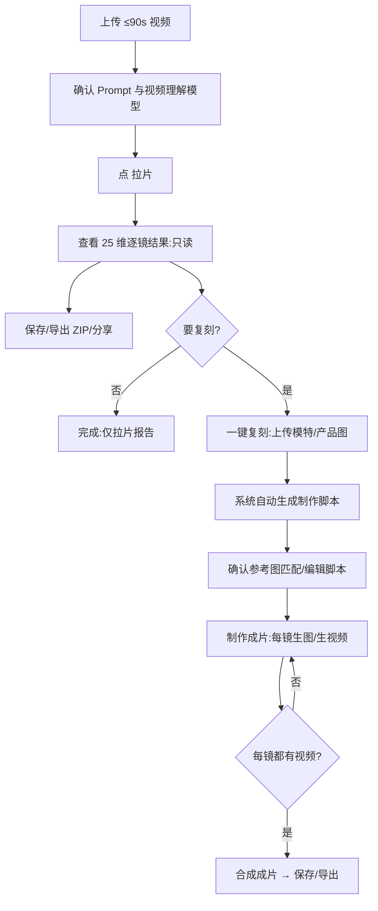

# 专业拉片·使用指南

把一条参考视频「拉」成工业级逐镜分析报告，再换成你自己的模特和产品复刻成新片的一条龙工具。上传**不超过 90 秒**的参考视频，AI 做约 **25 维**的逐镜专业拉片（运镜、布光、叙事功能等，结果只读），然后在同一页内走「一键复刻 → 制作脚本 → 制作成片 → 合成」，按原片镜头语言复刻出一条新 MP4。适合要做进阶复刻、按镜生图生视频并合成成片的视频创作。

## 一、开始前准备

- 入口：电商工具箱 → 电商 → 拆解与拉片 → **专业拉片**
- 准备一条**不超过 90 秒**的参考视频（更长请先自己剪段，当前不支持自动分段拉片）
- 复刻阶段才需要：你的模特图、产品图（可多张）

## 二、操作步骤

**第一步：上传视频并拉片**
点进「专业拉片」，上传 ≤90 秒视频（界面会提示时长上限）。确认拉片 Prompt 和视频理解模型，点「拉片」。分析可能较久，可留意后台任务和页内进度，进行中可中止。

**第二步：查看拉片结果（只读）**
成功后看到全片叙事/节奏/风格/音频设计、拍摄准备（场地/服装/道具/设备），以及逐镜大表（镜号、起止时间、景别、角度、运镜、布光、叙事功能、音频、视觉隐喻等约 25 维）。结果是只读的——要改叙事就换 Prompt 重新拉片，别在表里找编辑入口。可顺手保存项目、导出 ZIP、分享工作流副本。

**第三步：一键复刻 + 上传参考素材**
点「一键复刻」，在参考素材面板上传模特图、产品图（拖放/粘贴/我的资产/模特库；@图片1 起是模特，其后是产品），用「AI 识产品」或手填产品描述/卖点。

**第四步：系统生成制作脚本**
素材齐后后台自动生成制作脚本（读取拉片结构 → 分配参考图 → 组装画布/光影/运镜 → 写生图/生视频 Prompt）。平台会自动为每镜匹配用哪些参考图，确认前可按需在参考图匹配表里改任意镜的参考组合。

**第五步：制作成片**
打开制作脚本表（在拉片结构上加了生图/生视频 Prompt 列），可编辑各镜 Prompt，确认后进入「制作成片」工作区。每镜可只生视频（参考图 + 生视频 Prompt），或先生图再生视频，或改 Prompt 多次重试；支持勾选多镜批量生成，任务进后台生成 Dock。

**第六步：合成成片**
当每一镜都有分镜视频后，点「合成成片」，预览整条视频，可保存到「我的资产」或导出 ZIP 取回。

## 三、流程图

## 四、小贴士 & 常见坑

- **90 秒硬上限**：超长素材先剪辑；制作阶段也不能改拉片定下的镜数和时长，只能换 Prompt、换参考、重生成。
- **拉片只读**：专业字段是分析产物，要改分析请重新拉片或改 Prompt，不要找结果表里的编辑入口。
- **先脚本后生成**：没「确认制作脚本」前别跳过直接批量出片，否则 Prompt 和参考图可能没对齐。
- **换角只用自有图**：出图/出视频只用你上传的模特与产品，不会把参考原片当生图输入。
- **计费**：拉片、识产品、生图、生视频、合成都走 Gateway，归属电商工具箱月费体系。
- 和「拆图拆视频」的区别：专业拉片只收视频、做 25 维 + 合成成片；拆图拆视频收图或视频、分析更轻量。只有一张静态图或只想快速出分镜表，选拆图拆视频更合适。
