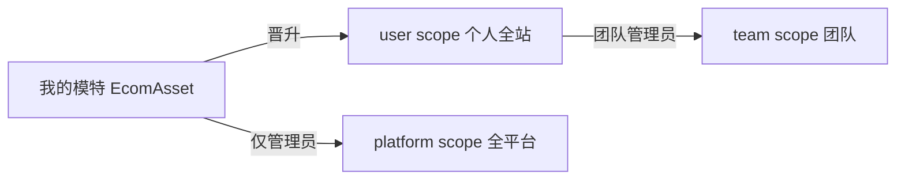

# 全局资产库 · 统一弹层与平台素材

> **状态**：实施中（GAL-100～108）  
> **管理入口**：Book [`/admin/pending-features`](http://localhost:3000/admin/pending-features) → **待处理** · 从 docs 导入或 seed 后可见「全局资产库」  
> **共享 UI 真源**：[`e-commerce-toolkit/docker-shared/global-asset-library/`](../e-commerce-toolkit/docker-shared/global-asset-library/)  
> **同步脚本**：[`scripts/sync-global-asset-library.mjs`](../scripts/sync-global-asset-library.mjs)  
> **关联**：[`文生试衣.md`](./文生试衣.md) · [`book-mall/doc/product/AI 空间功能设计文档.md`](../book-mall/doc/product/AI%20空间功能设计文档.md) · [`14-tenant-team-design.md`](../book-mall/doc/product/14-tenant-team-design.md) · [`e-commerce-toolkit/design/MEDIA.md`](../e-commerce-toolkit/design/MEDIA.md)

---

## 1. 产品目标

1. **一个全局弹层** `GlobalAssetLibraryDialog`（GALD）：电商、Canvas、个人 AI 空间共用，业务侧只 `open()` + `onPick` / `onSave`。
2. **两类内容**：
   - **我的作品**：各应用已完成的成图/成片（复用 AI 空间 14 源聚合）。
   - **平台素材**：姿势库 · 模特头像库 · 服装库 · 全身模特（catalog + scope）。
3. **全员入库**：任意登录用户可将成图保存到姿势/头像/服装/全身 catalog，默认 **个人全站可用**（`scope: user`）。
4. **管理员**：可设为 **全平台**（`scope: platform`）。
5. **团队管理员**（租户就绪后）：可设为 **团队可见**（`scope: team` + `tenantId`）。
6. **「我的模特」**（`EcomAsset` 私有）不变；可晋升为 **全身模特** catalog 条目。

### 1.1 命名

| 旧称 | 新称 | 存储 |
|------|------|------|
| 平台模特库 | **模特头像库** | `EcomModelLibraryEntry`（platform） |
| — | **全身模特** | `EcomFullBodyModelEntry` |
| — | **服装库** | `EcomGarmentLibraryEntry` |
| 姿势库 | **姿势库** | `EcomPoseLibraryEntry` |

---

## 2. 权限模型（scope）

| scope | 含义 | 谁可写入 | 谁可读 |
|-------|------|----------|--------|
| `platform` | 全平台 | 平台管理员 | 所有用户 |
| `team` | 团队库 | 团队 OWNER/ADMIN | 该 tenant 成员 |
| `user` | 个人全站 | 条目 owner；管理员可代写 | owner；选用时跨应用可见 |



Picker 可见列表：

```text
platform + team(当前 tenant) + user(本人)
```

---

## 3. UI 规范（纯灰阶）

弹层内 **禁止 hue 装饰**（无蓝条、无彩色 scope、无蓝选中框）。

| 层级 | Light |
|------|-------|
| 弹层底 | `#ffffff` |
| 侧栏 / 筛选条 / 底栏 | `#fafafa` |
| 卡片 hover | `#f5f5f7` |
| 卡片选中 | `#f0f0f2` + 描边 `#1d1d1f` |
| 默认描边 | `#e8e8ed` |
| 标题 / 正文 / 辅助 | `#1d1d1f` / `#424245` / `#86868b` |

- **主 Tab**：灰轨 segmented（选中白底 `#fff` + shadow，非选中 `#86868b`）。
- **侧栏选中**：`bg #f0f0f2` + `font-semibold`，无左侧色条。
- **Scope pill**：统一 `bg #f0f0f2` + `text #6e6e73`，文案区分（平台/团队/我的）。
- **主 CTA「确认选用」**：`#1d1d1f` 填充 + 白字（全灰阶，不用蓝）。
- **Canvas**：`variant: dark` 用 `#1c1c1e` / `#2c2c2e` / `#f5f5f7` 同级灰阶。

布局：`max-w-[960px]` · `max-h-[88vh]` · 左栏 200px · 网格 `ECOM_LIBRARY_MEDIA_GRID_CLASS`（5 列）。

---

## 4. 调用 API

```tsx
const { openGlobalAssetLibrary } = useGlobalAssetLibrary();

await openGlobalAssetLibrary({
  mode: "pick",           // pick | browse | save
  media: "image",         // image | video | all
  maxSelect: 1,
  defaultTab: "catalog",  // works | catalog
  defaultCatalog: "full-body", // pose | avatar | garment | full-body
  sourceImage: { url, prompt? }, // save 模式
  onPick: (items) => { … },
});
```

Provider：`GlobalAssetLibraryProvider` 挂载于电商根布局、Canvas 根布局、AI 空间页。

---

## 5. 电商入库入口（一个 logo）

**位置**：图片 **hover 操作行**，与 Eye 并列（[`media-card-hover-actions.mdc`](../.cursor/rules/media-card-hover-actions.mdc)）。

| 组件 | 场景 |
|------|------|
| `StoryboardPanelImageHoverActions` | 故事版/分镜成图 |
| `VtonResultImageHoverActions` | 试衣结果（含文生试衣成片） |
| `VtonTryonLibraryPanel` | **试衣库** `/library/tryon` |
| `generation-workspace` tile | 通用成图 |
| `model-shot-pose-card` | 模特图姿势卡 |

- **图标**：`Archive`（lucide），灰阶圆钮，`title="保存到库"`。
- **行为**：`openGlobalAssetLibrary({ mode: "save", sourceImage, defaultTab: "catalog" })`。

**Studio 顶栏**：`EcomIconToolbar` 增加 `Package` 图标 → `mode: "pick"`（选用，与 hover 入库互补）。

---

## 6. 实施台账（GAL-*）

> 完成项：更新本表状态 → Book `/admin/pending-features` 勾选 → 计划 todos 同步。

| ID | 任务 | 关键路径 | 验收 | 状态 |
|----|------|----------|------|------|
| GAL-100 | 文档 SSOT + Admin 待处理 | 本文档 + seed | 待处理列表可见 | 完成 |
| GAL-101 | GALD 壳 + Provider + 灰阶 theme | `docker-shared/global-asset-library/` | open/close 可用 | 完成 |
| GAL-102 | Garment/FullBody schema + catalog API | `prisma` + `/api/.../global-asset-library` | 四库列表可拉取 | 完成 |
| GAL-103 | 平台素材 Panel | `catalog-panel.tsx` | 四库 grid + 筛选 | 完成 |
| GAL-104 | 我的作品 Panel | `works-panel.tsx` | 聚合列表可展示 | 完成 |
| GAL-105 | SaveToCatalogDialog | `save-to-catalog-dialog.tsx` | 全员入库 + scope | 完成 |
| GAL-106 | 电商 hover + 顶栏 | storyboard/vton/toolbar | Archive 可打开 GALD | 完成 |
| GAL-107 | Canvas dark 接入 | `canvas-web` + SaveToCatalog | dark 弹层可用 | 完成 |
| GAL-108 | AI 空间平台素材 Tab | `ai-space-asset-library-desk` | 子 Tab 可浏览 | 完成 |
| GAL-109 | 替换旧 Picker | 逐步迁移 Asset/Model picker | 调用 GALD | 待办 |
| GAL-110 | 模特头像库 UI 改名 | 侧栏/admin/文案 | 无「平台模特库」旧文案 | 待办 |
| GAL-125 | team scope 完整 | tenant API | 团队管理员可选 team | 待办 |

---

## 7. 后端 API

| 方法 | 路径 | 说明 |
|------|------|------|
| GET | `/api/platform/v1/global-asset-library/catalog` | catalog 聚合（kind/scope/gender/keyword） |
| GET | `/api/platform/v1/ai-space/assets` | 我的作品（已有，GALD works 复用） |
| POST | `/api/sso/tools/ecom/catalog/import-from-image` | 用户/管理员入库（pose/avatar/garment/full-body） |

---

## 8. 验收清单

- [x] `docs/全局资产库.md` 存在且含 GAL 台账
- [x] `/admin/pending-features` → **待处理** 可见「全局资产库」
- [x] GALD Provider + Dialog 在电商可 open
- [x] catalog API 返回四库条目
- [x] 电商成图 hover 有「保存到库」图标
- [x] Canvas 可打开 dark 变体 GALD
- [x] AI 空间资产库有「平台素材」子 Tab
- [ ] 旧 Picker 全部迁移至 GALD（GAL-109）
- [ ] 团队 scope 端到端（GAL-125）

---

## 9. 变更记录

| 日期 | 说明 |
|------|------|
| 2026-09-10 | 初版 SSOT：GALD、四库、灰阶 UI、全员入库、GAL-100～108 实施 |
