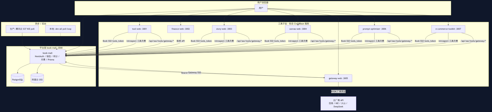
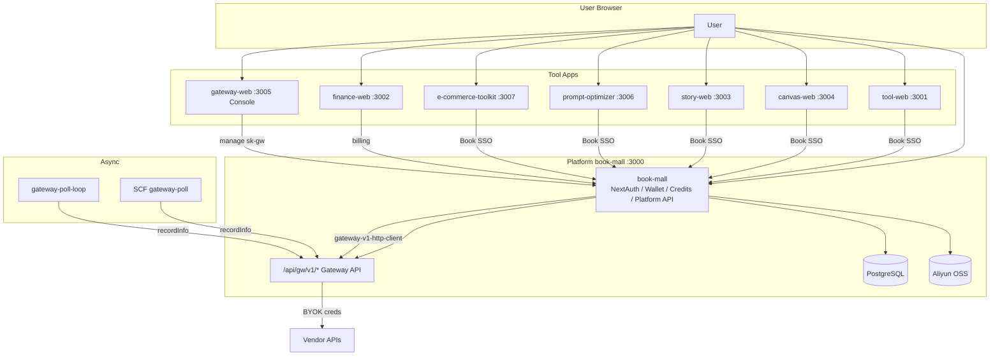
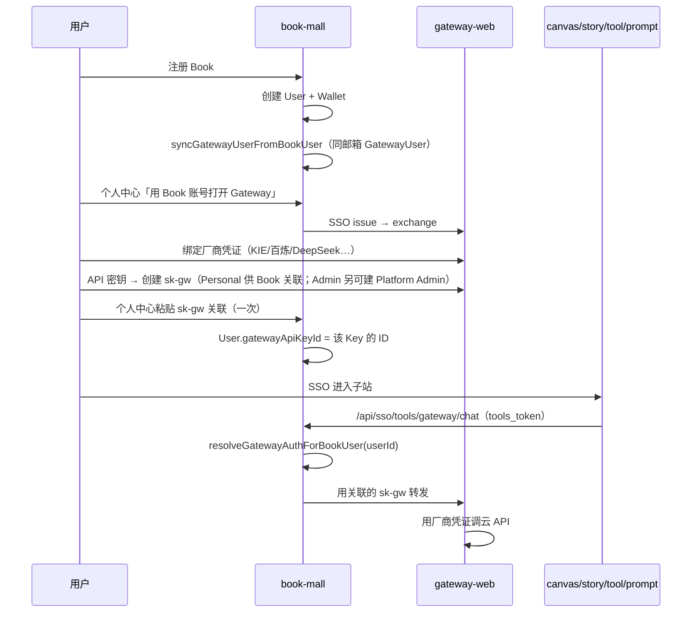

# 全站架构图与配置表

> **维护要求**：Monorepo 内 **新增/退役可部署子应用**、变更端口/域名/SSO/Gateway 契约时，须同步更新本文档。  
> 规则见 `.cursor/rules/site-architecture-doc.mdc`。

**相关文档**

| 文档 | 说明 |
|------|------|
| [dev.md](./dev.md) | 本地 `pnpm dev:all`、端口、prompt vendor 构建 |
| [prompt-optimizer.md](./prompt-optimizer.md) | 提示词优化器专项 |
| [deploy.md](../deploy.md) | 部署总览 |
| [deploy/tencent/README.md](../deploy/tencent/README.md) | CloudBase 控制台字段 |
| [gateway-user-guide.md](../book-mall/doc/product/gateway-user-guide.md) | **Gateway 用户流程（权威）** |
| [12-platform-app-federation.md](../book-mall/doc/product/12-platform-app-federation.md) | 平台联邦约束 |

---

## 1. 架构总图

**图形版（可直接打开 / 分享）**

| 格式 | 文件 |
|------|------|
| PNG（推荐分享） | [全站架构图.png](./全站架构图.png) |
| PNG（Mermaid 导出） | [全站架构图-mermaid.png](./全站架构图-mermaid.png) |
| SVG（浏览器打开可缩放） | [全站架构图.svg](./全站架构图.svg) |
| Mermaid 源（可改图后重导） | [全站架构图.mmd](./全站架构图.mmd) |





---

## 2. 各项目职责与端口

| 工程 | 本地端口 | CloudBase 容器端口 | 生产域名（目标） | Monorepo 目标目录 | 功能摘要 |
|------|----------|-------------------|------------------|-------------------|----------|
| **book-mall** | 3000 | 3000 | book.ai-code8.com | `book-mall` | 主站、登录、钱包、工具月费、Platform API、Story/Canvas 后端、Prisma |
| **tool-web** | 3001 | 3001 | tool.ai-code8.com | `tool-web` | 试衣、文生图、图生视频、Visual Lab、工具站导航 |
| **finance-web** | 3002 | 3002 | f.ai-code8.com | `finance-web` | 账单明细控制台 |
| **story-web** | 3003 | 3003 | story.ai-code8.com | `story-web` | 漫剧空间门户 |
| **canvas-web** | 3004 | 3004 | canvas.ai-code8.com | `canvas-web` | AI 海报画布、Story-Pro 节点工作流 |
| **gateway-web** | 3005 | 3005 | gateway.ai-code8.com | `gateway-web` | Gateway BYOK：厂商凭证、模型管理、API 密钥、用量/日志 |
| **prompt-optimizer-platform** | 3006 | 3006 | prompt.ai-code8.com | `prompt-optimizer-platform` | 提示词优化器（Vue + Next 壳） |
| **e-commerce-toolkit** | 3007 | 3007 | ecom.ai-code8.com | `e-commerce-toolkit` | 电商主图/详情/带货视频、**微剧情分镜故事版**、品牌 VI；双计费（6a 代付按次 / 6b 月费 BYOK） |

**内嵌、不单独部署**

| 路径 | 说明 |
|------|------|
| `prompt-optimizer-platform/prompt-optimizer/` | 上游 Vue vendor；Docker 多阶段构建 |

**本地一键启动**：根目录 `pnpm dev:all` → http://localhost:3000/dev

---

## 3. 身份与 Gateway 密钥（重要）

### 3.1 结论（先读）

| 问题 | 答案 |
|------|------|
| Canvas / Story / Tool / Prompt 各有一套 sk-gw 吗？ | **否**。全站共用 **Book 用户关联的那一把** `sk-gw`。 |
| Gateway 控制台为何只看到一条「Canvas Pilot」？ | 已统一为 **Platform Admin**（全站管理员密钥）；Book 子站应关联 **Personal** 个人密钥。管理员可同时持有两把。 |
| 各子站如何调用 AI？ | 浏览器 **不持 sk-gw**；持 `tools_token` → 调 Book `/api/sso/tools/gateway/*` → Book 用 `User.gatewayApiKeyId` 解析 sk-gw → 转发 Gateway。 |
| sk-gw 是给谁用的？ | ① Book 个人中心「关联」验证；② 外部直接调 Gateway `/api/v1`（`Authorization: Bearer sk-gw-...`）。子站 UI **不需要**也不应各自申请 Key。 |

### 3.2 用户生命周期



### 3.3 两类「密钥」

| 类型 | 存在哪 | 用途 |
|------|--------|------|
| **厂商 API Key** | Gateway → 模型管理 / 厂商凭证 | DeepSeek、百炼、KIE 等；**只在 Gateway 维护** |
| **Gateway API Key (`sk-gw-...`)** | Gateway → API 密钥；Book 只存 **关联 ID** | 标识「哪个 Gateway 用户 + 绑定了哪些厂商凭证」；Book/子站代理 AI 时用 |

### 3.4 数据模型（简化）

```text
Book User (1) ──bookUserId──► GatewayUser (1)
Book User.gatewayApiKeyId ──► GatewayApiKey (当前关联 1 把，可更换)
GatewayUser ──► 多条 GatewayApiKey（scope: PLATFORM 管理员 / PERSONAL 个人；Book 关联 PERSONAL）
GatewayUser ──► 多条 GatewayCredential（厂商 Key）
GatewayApiKey ──bindings──► GatewayCredential
```

代码入口：`book-mall/lib/gateway/book-gateway-link.ts`（注释：**Canvas / Story / 工具站共用**）。

子站调用链：

- Canvas：`lib/canvas/canvas-gateway-client.ts` → `gateway-v1-http-client` → Book `/api/gw/v1/*`
- Story：`lib/story/story-gateway-client.ts` → 同上
- Tool / 电商：`tool-gateway-client` / `ecom-tool-gateway-client` → 同上
- Prompt：`/api/sso/tools/gateway/chat` → 同上

### 3.6 厂商零旁路（Gateway API 边界）

| 层级 | 允许做什么 |
|------|------------|
| **业务层**（`canvas-gateway-client`、`story-gateway-client`、`tool-gateway-client`、`ecom-tool-gateway-client`、`poll-service.runGatewayPollWorker`） | 只调 `lib/gateway/gateway-v1-http-client.ts`（`Gateway-Internal` + `apiKeyId`） |
| **Gateway API**（`book-mall/app/api/gw/v1/*`） | 唯一可解密厂商凭证、直连 KIE / DashScope / 百炼 / 火山 / 混元 HTTP |
| **gateway-web :3005** | 控制台 UI + 反向代理；**不**承载业务侧厂商 HTTP |

内部鉴权：`Authorization: Gateway-Internal {GATEWAY_INTERNAL_INVOKE_SECRET}:{apiKeyId}`（密钥见 `GATEWAY_INTERNAL_INVOKE_SECRET`，可回退 `GATEWAY_SSO_SERVER_SECRET`）。

异步轮询：`scripts/gateway-poll-loop.ts` / 生产 SCF 均经 `runGatewayPollWorker` → `gatewayV1RecordInfo`，不再业务层直连 `kie-client` / `dashscope-client`。

### 3.5 控制台里「只有一条 Key」是否正常？

**正常**，若你只创建过一条。若创建多条，Gateway **API 密钥** 页会列出全部；Book 个人中心显示 **当前关联** 的那一条前缀与名称。

要换 Key：在 Gateway 新建 sk-gw → Book 个人中心重新粘贴关联。

---

## 4. Book SSO 与子站

| app 参数 | 子站 |
|----------|------|
| `tool` | tool-web |
| `canvas` | canvas-web |
| `story` | story-web |
| `prompt-optimizer` | prompt-optimizer-platform |

**全站一致**：`TOOLS_SSO_SERVER_SECRET`、`TOOLS_SSO_JWT_SECRET`（book、tool、canvas、story、prompt）。

---

## 5. 环境变量速查（生产）

模板：`deploy/tencent/*.env.example`、各工程 `.env.example`。

### book-mall

| 变量 | 说明 |
|------|------|
| `DATABASE_URL` | PostgreSQL |
| `NEXTAUTH_URL` / `NEXTAUTH_SECRET` | 主站登录（手机号 + 密码/验证码） |
| `SMS_PROVIDER` / `TENCENT_SMS_*` | 短信验证码（默认 `mock`；生产 `tencent`） |
| `ALLOW_DEV_AUTH` | 非 development 时开启 `/dev/auth` 测试登录 |
| `ADMIN_PHONES` | seed 时按手机号提升管理员 |
| `TOOLS_SSO_*` / `TOOLS_PUBLIC_ORIGIN` | 工具 SSO |
| `NEXT_PUBLIC_*_ORIGIN` | 各子站外链（story/canvas/prompt/gateway/finance） |
| `STORY_WEB_ORIGINS` / `CANVAS_WEB_ORIGINS` | CORS |
| `BOOK_MALL_ORIGIN` | Book 服务端自调 `/api/gw/v1`（本地 `http://localhost:3000`） |
| `GATEWAY_INTERNAL_INVOKE_SECRET` | 业务层 → `/api/gw/v1` 内部鉴权（可与 `TOOLS_SSO_SERVER_SECRET` 相同） |
| `KIE_*` / OSS | KIE 回调、资源删除（**生成任务不经 env 直连**） |
| `CREDIT_BILLING_OFF` | =`1` 关闭统一积分计费（回退旧钱包；默认开启积分，二者互斥） |
| `SINGLE_SESSION_ENFORCE` | =`1` 开启单会话「挤下线」（新登录使旧会话失效）；默认关闭 |
| `SINGLE_SESSION_RECHECK_SEC` | 单会话核对间隔秒（默认 60，降低每请求查库成本） |
| `MEDIA_RENDER_MAX_CLIPS` | 云端自动剪辑单任务最大镜数（默认 30） |
| `MEDIA_RENDER_MAX_OUTPUT_DURATION_SEC` | 成片最大时长秒（默认 600） |
| `MEDIA_RENDER_MAX_SOURCE_BYTES_PER_CLIP` | 单镜源片最大字节（默认 200MB） |
| `MEDIA_RENDER_MAX_CONCURRENT_PER_USER` | 每用户并发剪辑任务数（默认 2） |
| `MEDIA_RENDER_JOB_TIMEOUT_SEC` | 单任务超时秒（默认 900） |
| `MEDIA_RENDER_EPHEMERAL_RETENTION_DAYS` | 成片限时保留天数（默认 7） |
| `CANVAS_VOLCENGINE_VIDEO_TIMEOUT_MIN` | 火山长视频超时（默认 **45** 分钟，一般不必改） |
| `GENERATION_POLL_*` / `TEAM_MAX_CONCURRENCY_CAP` | **高级调优**，见 `docs/100人团队扩展方案.md` 附录 |

### 子站（canvas / story / prompt / tool）

| 变量 | 说明 |
|------|------|
| `MAIN_SITE_ORIGIN` / `BOOK_MALL_URL` | 主站 |
| `TOOLS_SSO_*` | 与 book **完全相同** |
| `NEXT_PUBLIC_*_ORIGIN` | 本服务公网地址 |

### gateway-web

| 变量 | 说明 |
|------|------|
| `BOOK_MALL_ORIGIN` | 主站 API / SSO |
| `GATEWAY_PUBLIC_ORIGIN` | 本服务 |
| `GATEWAY_SSO_SERVER_SECRET` | 可与 `TOOLS_SSO_SERVER_SECRET` 相同 |

### finance-web

| 变量 | 说明 |
|------|------|
| `NEXT_PUBLIC_BOOK_MALL_URL` | 浏览器调主站 API |

---

## 6. 部署模式

- **Git**：`priceLiu/book-mall`，分支 `main`
- **CloudBase**：每子站一个服务，**目标目录** = 上表「Monorepo 目标目录」
- **容器端口** = 上表「CloudBase 容器端口」（**勿填 80**）
- **book-mall** 启动时 `prisma migrate deploy`

---

## 7. 变更记录

| 日期 | 变更 |
|------|------|
| 2026-06-19 | **移除 Redis**：删除 `lib/redis-service.ts` 与 `ioredis`；租户/视频并发限流改待 PostgreSQL 方案；Gateway 仍保留批量上限等无 Redis 风控。 |
| 2026-06-19 | **视频并发少配 env**：团队并发随席位、席≥20 保底 20；单画布默认 5 进行中；poll 并行/分片内置；文档 `docs/100人团队扩展方案.md`。 |
| 2026-06-19 | 火山视频超时默认 45min；脚本 `sync-team-max-concurrency.ts`。 |
| 2026-06-15 | **积分换算 1.0**：权威文档 `docs/积分换算 1.0.md`；财务后台 `/admin/model-credit-ledger`（测算→改 M→发布）；sbv1 视频分档 canonical + Dock 积分预览；PLATFORM 选模须 `ModelCreditPrice.active`；**退役 BYOK 技术服务费**（checkout/byok → 会员订阅；准入=订阅+Gateway Key+轻量包超额）。 |
| 2026-06-14 | book-mall：手机号注册/登录（密码或验证码）、老用户绑手机、团队邀请改短信、`/dev/auth` 测试入口；`SMS_PROVIDER` / `TENCENT_SMS_*` |

| 日期 | 变更 |
|------|------|
| 2026-06-10 | **云端自动剪辑（Media Render）**：`MediaRenderJob` + `UserMediaStorageGrant`；`book-mall/lib/media/*`（Timeline v1、xfade/ffmpeg、7 天 ephemeral OSS）；API `POST /api/canvas/projects/[id]/media/render`、`GET /api/canvas/media/render/[jobId]`、`POST /api/sso/tools/ecom/.../video/render`、`POST /api/sso/tools/media/render`（Platform）；画布剪映节点第三按钮「自动剪辑成片」；电商合并改同一引擎；清理脚本 `pnpm media-render:expire`。见 `docs/自动剪辑.md`、`book-mall/doc/tech/media-render-timeline-v1.md`。 |
| 2026-06-10 | **Gateway 统一模型注册表**：`GatewayModelRoute` + `ModelCatalog.appTags`；`AppModelOffering` 按 `canonicalModelKey` 唯一；候选 = 同 canonical 多厂商（默认最低净成本）；各应用经 `GET /api/sso/tools/gateway/models/registry` 按 tag 选模；去除 ecom 独立 scenario registry。见 `docs/releases/2026-06-gateway-unified-model-registry.md`。 |
| 2026-06-10 | **Billing Persona + Finance 2.0 全链路**：`User.billingPersona` 互斥（PLATFORM_CREDIT / BYOK）；平台代付自动 per-user/per-team 隐藏 sk-gw（`managedByPlatform`）；注册/onboarding 选身份；`/pricing` → `/checkout/*`；移除 Admin 工具 bypass（`staffFlag` 仅报表）；Finance API（billing/ledger/byok-bill/usage 修复）+ finance-web 账单/流水/BYOK/团队用量页；Gateway 控制台分 persona。迁移 `20260610120000_billing_persona_finance20`；存量 `scripts/backfill-billing-persona.ts`。见 `docs/releases/2026-06-billing-persona-finance20.md`。 |
| 2026-06-08 | **Gateway 厂商零旁路**：Canvas TTS / 百炼图片分割、电商 DashScope·百炼、Story/Tool 异步任务全部经 `gateway-v1-http-client` → Book `/api/gw/v1/*`；`poll-service.runGatewayPollWorker` 改 HTTP `recordInfo`；删除 `kie-client` 的 `createKieTask`/`getKieTask` env 直连。见 §3.6。 |
| 2026-06-08 | **报价页加油包 + 单会话测试启用**：`/pricing` 新增三档积分加量包（1000/3000/5000）与「团队管理入口」；模拟充值 `POST /api/dev/mock-credit-topup`；生成前积分门禁 `lib/billing/credit-pre-check.ts`（用完即停）。本地 `.env.development` / `.env.local` 默认 `SINGLE_SESSION_ENFORCE=1`。 |
| 2026-06-08 | **租户/团队体系 + Gateway 多 Key 全量实现**：Prisma 迁移 `20260714120000_tenant_system`（`Tenant/TenantMember/Seat/TenantInvite` + `User.primaryTenantId/sessionVersion` + 凭证 `ownerScope/ownerId/channel/sortOrder/isDefaultForProvider` + `GatewayRequestLog` 租户/渠道快照）、`20260715090000_asset_sharing`（6 张资产表加 `tenantId/ownerUserId/visibility`）。新增 `lib/tenant/*`（context/permission/tenant-service/tenant-invite-service/asset-sharing-service）、`/account/team` 与 `/account/team/billing`（总账+成员下钻+CSV）、多 Key 默认凭证路由 + 渠道×租户对帐、积分扣费接入生成链路（`finalizeRequestLog` 结算/返还，旧钱包按 `billingMode` 互斥）、月度发放脚本 `scripts/grant-monthly-credits.ts`（`pnpm credits:grant-monthly`）。新增 env：`CREDIT_BILLING_OFF`/`REDIS_URL`/`SINGLE_SESSION_ENFORCE`/`SINGLE_SESSION_RECHECK_SEC`。**待跟进**：Canvas/Story/电商项目库的公共/私有 UI 切换（后端已就绪，按子站逐个接 UI）。 |
| 2026-06-08 | **租户/团队体系设计 + 使用手册**（待评审）：`book-mall/doc/product/14-tenant-team-design.md`、`15-team-usage-manual.md`（租户/席位/RBAC/资源共享/财务对账/使用明细/单会话；与轨道 A 多 Key 衔接） |
| 2026-06-08 | **统一积分计费体系**（替换旧扣点，AI 课程除外）：Prisma 新增 `PlatformPricingConfig/ModelCostProfile/ModelCreditPrice/MembershipPlan/TeamSeatTier/CreditAccount/CreditLedger/ByokServiceConfig/ResourceMeterRate/ResourceMeterEvent`（迁移 `20260713120000_unified_credit_billing`）；计算引擎 `lib/pricing/credit-pricing-{formulas,engine}.ts`；账户/席位/对帐/防护 `lib/billing/*` + `lib/gateway/credit-billing-guard.ts`；后台 `/admin/finance/{model-cost,credit-pricing,membership-plans,byok}`；对外报价页 `app/(site)/pricing`；用量中心 `account/usage`。详见 `book-mall/doc/plans/2026-06-08-gateway-multi-credential-and-tenant-rollout.md` §5.4 |
| 2026-06-08 | **待开发计划**：Gateway 多凭证 + 租户/子账号/计费/Redis/资产 — `book-mall/doc/plans/2026-06-08-gateway-multi-credential-and-tenant-rollout.md` |
| 2026-06-06 | **火山方舟 Gateway 全量补齐**：`ep-*` 路由、Seedance 多模态 body、Story 火山视频、人像库 API 代理；见 `book-mall/doc/releases/2026-06-06-volcengine-gateway-full.md` |
| 2026-06-05 | 电商工具箱 **M5 微剧情分镜**：`EcomStoryboardProject`、`ecom-toolkit__storyboard`、BFF `/api/sso/tools/ecom/storyboard/*` |
| 2026-06-04 | 新增 **e-commerce-toolkit**（:3007 / ecom.ai-code8.com）；Book 登记 navKey `e-commerce-toolkit`、双计费 `EcomBillingMode` |
| 2026-05-30 | 初版：7 个子站 + Gateway 身份模型 + 端口/配置表 |

<!-- 新增子应用或改端口时，在此追加一行并更新 §2、§5、§6 -->
