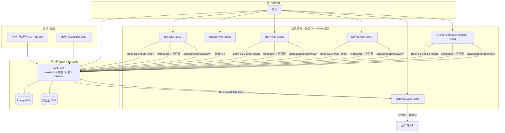
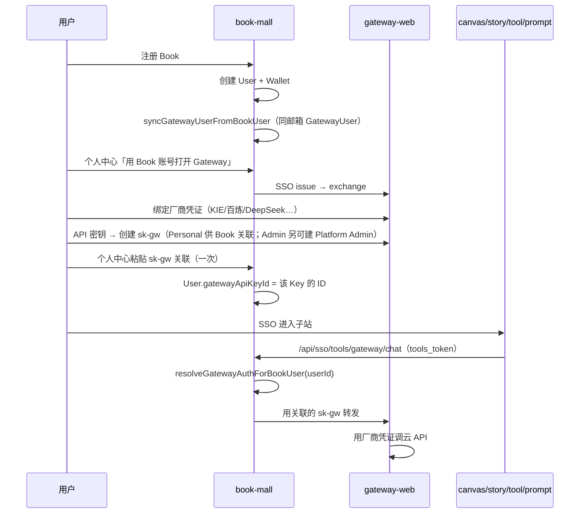

# 全站架构图与配置表

> **维护要求**：Monorepo 内 **新增/退役可部署子应用**、变更端口/域名/SSO/Gateway 契约时，须同步更新本文档。  
> 规则见 `.cursor/rules/site-architecture-doc.mdc`。

**相关文档**

| 文档 | 说明 |
|------|------|
| [dev.md](./dev.md) | 本地 `pnpm dev:all`、端口、prompt vendor 构建 |
| [prompt-optimizer.md](./prompt-optimizer.md) | 提示词优化器专项 |
| [deploy.md](../deploy.md) | 部署总览 |
| [deploy/tencent/README.md](../deploy/tencent/README.md) | CloudBase 控制台字段 |
| [gateway-user-guide.md](../book-mall/doc/product/gateway-user-guide.md) | **Gateway 用户流程（权威）** |
| [12-platform-app-federation.md](../book-mall/doc/product/12-platform-app-federation.md) | 平台联邦约束 |

---

## 1. 架构总图



---

## 2. 各项目职责与端口

| 工程 | 本地端口 | CloudBase 容器端口 | 生产域名（目标） | Monorepo 目标目录 | 功能摘要 |
|------|----------|-------------------|------------------|-------------------|----------|
| **book-mall** | 3000 | 3000 | book.ai-code8.com | `book-mall` | 主站、登录、钱包、工具月费、Platform API、Story/Canvas 后端、Prisma |
| **tool-web** | 3001 | 3001 | tool.ai-code8.com | `tool-web` | 试衣、文生图、图生视频、Visual Lab、工具站导航 |
| **finance-web** | 3002 | 3002 | f.ai-code8.com | `finance-web` | 账单明细控制台 |
| **story-web** | 3003 | 3003 | story.ai-code8.com | `story-web` | 漫剧空间门户 |
| **canvas-web** | 3004 | 3004 | canvas.ai-code8.com | `canvas-web` | AI 海报画布、Story-Pro 节点工作流 |
| **gateway-web** | 3005 | 3005 | gateway.ai-code8.com | `gateway-web` | Gateway BYOK：厂商凭证、模型管理、API 密钥、用量/日志 |
| **prompt-optimizer-platform** | 3006 | 3006 | prompt.ai-code8.com | `prompt-optimizer-platform` | 提示词优化器（Vue + Next 壳） |
| **e-commerce-toolkit** | 3007 | 3007 | ecom.ai-code8.com | `e-commerce-toolkit` | 电商主图/详情/带货视频、品牌 VI；双计费（6a 代付按次 / 6b 月费 BYOK） |

**内嵌、不单独部署**

| 路径 | 说明 |
|------|------|
| `prompt-optimizer-platform/prompt-optimizer/` | 上游 Vue vendor；Docker 多阶段构建 |

**本地一键启动**：根目录 `pnpm dev:all` → http://localhost:3000/dev

---

## 3. 身份与 Gateway 密钥（重要）

### 3.1 结论（先读）

| 问题 | 答案 |
|------|------|
| Canvas / Story / Tool / Prompt 各有一套 sk-gw 吗？ | **否**。全站共用 **Book 用户关联的那一把** `sk-gw`。 |
| Gateway 控制台为何只看到一条「Canvas Pilot」？ | 已统一为 **Platform Admin**（全站管理员密钥）；Book 子站应关联 **Personal** 个人密钥。管理员可同时持有两把。 |
| 各子站如何调用 AI？ | 浏览器 **不持 sk-gw**；持 `tools_token` → 调 Book `/api/sso/tools/gateway/*` → Book 用 `User.gatewayApiKeyId` 解析 sk-gw → 转发 Gateway。 |
| sk-gw 是给谁用的？ | ① Book 个人中心「关联」验证；② 外部直接调 Gateway `/api/v1`（`Authorization: Bearer sk-gw-...`）。子站 UI **不需要**也不应各自申请 Key。 |

### 3.2 用户生命周期



### 3.3 两类「密钥」

| 类型 | 存在哪 | 用途 |
|------|--------|------|
| **厂商 API Key** | Gateway → 模型管理 / 厂商凭证 | DeepSeek、百炼、KIE 等；**只在 Gateway 维护** |
| **Gateway API Key (`sk-gw-...`)** | Gateway → API 密钥；Book 只存 **关联 ID** | 标识「哪个 Gateway 用户 + 绑定了哪些厂商凭证」；Book/子站代理 AI 时用 |

### 3.4 数据模型（简化）

```text
Book User (1) ──bookUserId──► GatewayUser (1)
Book User.gatewayApiKeyId ──► GatewayApiKey (当前关联 1 把，可更换)
GatewayUser ──► 多条 GatewayApiKey（scope: PLATFORM 管理员 / PERSONAL 个人；Book 关联 PERSONAL）
GatewayUser ──► 多条 GatewayCredential（厂商 Key）
GatewayApiKey ──bindings──► GatewayCredential
```

代码入口：`book-mall/lib/gateway/book-gateway-link.ts`（注释：**Canvas / Story / 工具站共用**）。

子站调用链：

- Canvas：`lib/canvas/canvas-gateway-client.ts` → `resolveGatewayAuthForBookUser`
- Story：`lib/story/story-gateway-client.ts` → 同上
- Tool：`lib/gateway/tool-gateway-client.ts` → 同上
- Prompt：`/api/sso/tools/gateway/chat` → 同上

### 3.5 控制台里「只有一条 Key」是否正常？

**正常**，若你只创建过一条。若创建多条，Gateway **API 密钥** 页会列出全部；Book 个人中心显示 **当前关联** 的那一条前缀与名称。

要换 Key：在 Gateway 新建 sk-gw → Book 个人中心重新粘贴关联。

---

## 4. Book SSO 与子站

| app 参数 | 子站 |
|----------|------|
| `tool` | tool-web |
| `canvas` | canvas-web |
| `story` | story-web |
| `prompt-optimizer` | prompt-optimizer-platform |

**全站一致**：`TOOLS_SSO_SERVER_SECRET`、`TOOLS_SSO_JWT_SECRET`（book、tool、canvas、story、prompt）。

---

## 5. 环境变量速查（生产）

模板：`deploy/tencent/*.env.example`、各工程 `.env.example`。

### book-mall

| 变量 | 说明 |
|------|------|
| `DATABASE_URL` | PostgreSQL |
| `NEXTAUTH_URL` / `NEXTAUTH_SECRET` | 主站登录 |
| `TOOLS_SSO_*` / `TOOLS_PUBLIC_ORIGIN` | 工具 SSO |
| `NEXT_PUBLIC_*_ORIGIN` | 各子站外链（story/canvas/prompt/gateway/finance） |
| `STORY_WEB_ORIGINS` / `CANVAS_WEB_ORIGINS` | CORS |
| `KIE_*` / OSS | 漫剧/画布异步、资源删除 |

### 子站（canvas / story / prompt / tool）

| 变量 | 说明 |
|------|------|
| `MAIN_SITE_ORIGIN` / `BOOK_MALL_URL` | 主站 |
| `TOOLS_SSO_*` | 与 book **完全相同** |
| `NEXT_PUBLIC_*_ORIGIN` | 本服务公网地址 |

### gateway-web

| 变量 | 说明 |
|------|------|
| `BOOK_MALL_ORIGIN` | 主站 API / SSO |
| `GATEWAY_PUBLIC_ORIGIN` | 本服务 |
| `GATEWAY_SSO_SERVER_SECRET` | 可与 `TOOLS_SSO_SERVER_SECRET` 相同 |

### finance-web

| 变量 | 说明 |
|------|------|
| `NEXT_PUBLIC_BOOK_MALL_URL` | 浏览器调主站 API |

---

## 6. 部署模式

- **Git**：`priceLiu/book-mall`，分支 `main`
- **CloudBase**：每子站一个服务，**目标目录** = 上表「Monorepo 目标目录」
- **容器端口** = 上表「CloudBase 容器端口」（**勿填 80**）
- **book-mall** 启动时 `prisma migrate deploy`

---

## 7. 变更记录

| 日期 | 变更 |
|------|------|
| 2026-06-04 | 新增 **e-commerce-toolkit**（:3007 / ecom.ai-code8.com）；Book 登记 navKey `e-commerce-toolkit`、双计费 `EcomBillingMode` |
| 2026-05-30 | 初版：7 个子站 + Gateway 身份模型 + 端口/配置表 |

<!-- 新增子应用或改端口时，在此追加一行并更新 §2、§5、§6 -->
