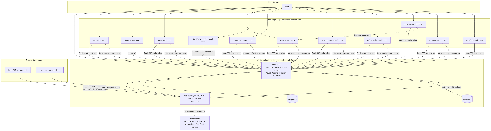
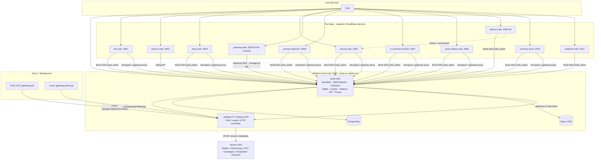
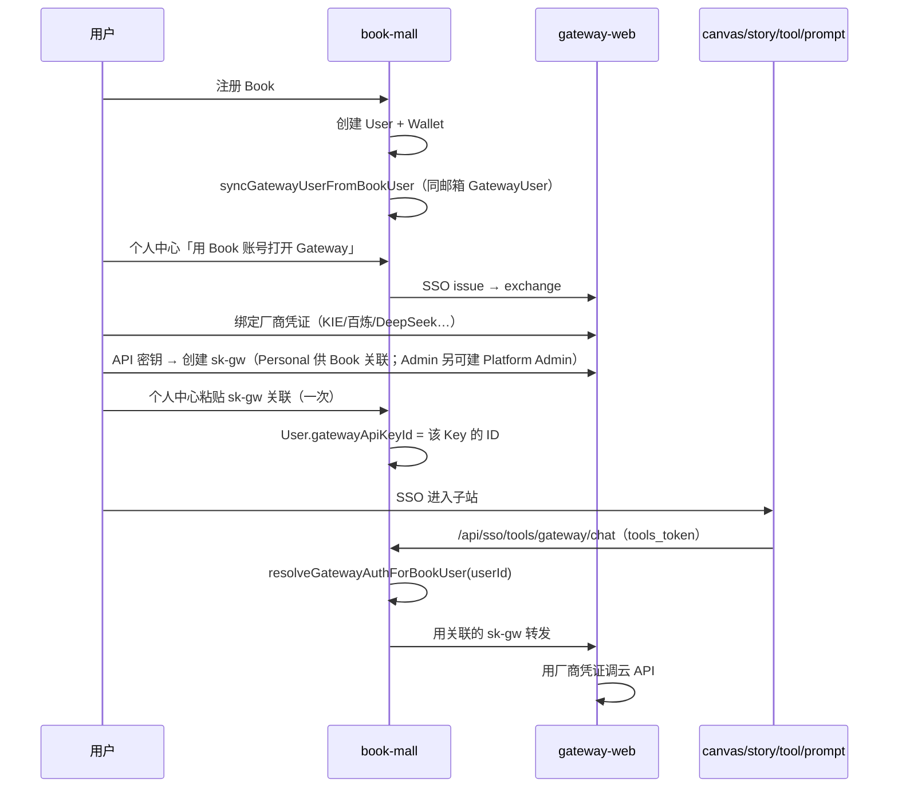

# 全站架构图与配置表

> **维护要求**：Monorepo 内 **新增/退役可部署子应用**、变更端口/域名/SSO/Gateway 契约时，须同步更新本文档。  
> 规则见 `.cursor/rules/site-architecture-doc.mdc`。

**相关文档**

| 文档 | 说明 |
|------|------|
| [dev.md](./dev.md) | 本地 `pnpm dev:all`、端口、prompt vendor 构建 |
| [prompt-optimizer.md](./prompt-optimizer.md) | 提示词优化器专项 |
| [deploy.md](../deploy.md) | 部署总览 |
| [deploy/tencent/README.md](../deploy/tencent/README.md) | CloudBase 控制台字段 |
| [gateway-user-guide.md](../book-mall/doc/product/gateway-user-guide.md) | **Gateway 用户流程（权威）** |
| [12-platform-app-federation.md](../book-mall/doc/product/12-platform-app-federation.md) | 平台联邦约束 |
| [手机验证码 todo.md](./手机验证码%20todo.md) | 腾讯云短信开通、bypass 关闭 checklist |
| [deploy/tencent/wechat-pay-setup.md](../deploy/tencent/wechat-pay-setup.md) | 企业微信支付 CloudBase 私钥注入 |
| [releases/2026-06-wechat-pay-platform-models.md](./releases/2026-06-wechat-pay-platform-models.md) | 微信个人收款 Checkout + 平台模型自动上架 |

---

## 1. 架构总图

**图形版（可直接打开 / 分享）**

| 格式 | 文件 |
|------|------|
| PNG（推荐分享，与 Mermaid 导出同步） | [site-architecture-diagram.png](./site-architecture-diagram.png) · [全站架构图.png](./全站架构图.png) |
| SVG（浏览器打开可缩放） | [site-architecture-diagram.svg](./site-architecture-diagram.svg) · [全站架构图.svg](./全站架构图.svg) |
| Mermaid 源（改图后 `pnpm arch:diagram` 重导） | [全站架构图.mmd](./全站架构图.mmd) |



> 源文件：[全站架构图.mmd](./全站架构图.mmd)。改图后执行：`pnpm arch:diagram`（或见下方 Mermaid 块）。


```mermaid
flowchart TB
  subgraph users ["User Browser"]
    U[User]
  end

  subgraph platform ["Platform book-mall :3000 · book.ai-code8.com"]
    BM["book-mall<br/>NextAuth · SMS/Captcha · Checkout<br/>Wallet · Credits · Platform API · Prisma"]
    GWAPI["/api/gw/v1/* Gateway API<br/>ONLY vendor HTTP boundary"]
    DB[(PostgreSQL)]
    OSS[(Aliyun OSS)]
    BM --> GWAPI
    BM --> DB
    BM --> OSS
  end

  subgraph tools ["Tool Apps · separate CloudBase services"]
    TW["tool-web :3001"]
    FW["finance-web :3002"]
    SW["story-web :3003"]
    CW["canvas-web :3004"]
    GWC["gateway-web :3005 BYOK Console"]
    PO["prompt-optimizer :3006"]
    EC["e-commerce-toolkit :3007"]
    QR["quick-replica-web :3008"]
    DR["director-web :3009 3D"]
    CT["common-tools :3010"]
    PW["publisher-web :3011"]
  end

  subgraph bg ["Async / Background"]
    SCF["Prod: SCF gateway-poll"]
    POLL["Local: gateway-poll-loop"]
  end

  VEND["Vendor APIs<br/>Bailian / DashScope / KIE / Volcengine / DeepSeek / Hunyuan"]

  U --> BM
  U --> TW & FW & SW & CW & GWC & PO & EC & QR & DR & CT & PW

  TW & CW & SW & PO & EC & QR & DR & CT & PW -->|"Book SSO tools_token"| BM
  TW & CW & SW & PO & EC & QR & CT -->|"introspect / gateway proxy"| BM
  DR -.->|"iframe + screenshot"| CW
  BM -->|"gateway-v1-http-client"| GWAPI
  GWAPI -->|"BYOK vendor credentials"| VEND

  FW -->|"billing API"| BM
  GWC -->|"Gateway SSO · manage sk-gw"| BM

  SCF -->|"POST /api/gw/v1/jobs/recordInfo"| GWAPI
  POLL -->|"runGatewayPollWorker"| GWAPI
```

---

## 2. 各项目职责与端口

| 工程 | 本地端口 | CloudBase 容器端口 | 生产域名（目标） | Monorepo 目标目录 | 功能摘要 |
|------|----------|-------------------|------------------|-------------------|----------|
| **book-mall** | 3000 | 3000 | book.ai-code8.com | `book-mall` | 主站、登录、钱包、工具月费、Platform API、Story/Canvas 后端、Prisma |
| **tool-web** | 3001 | 3001 | tool.ai-code8.com | `tool-web` | 试衣、文生图、图生视频、Visual Lab、工具站导航 |
| **finance-web** | 3002 | 3002 | f.ai-code8.com | `finance-web` | 账单明细控制台 |
| **story-web** | 3003 | 3003 | story.ai-code8.com | `story-web` | 漫剧空间门户 |
| **canvas-web** | 3004 | 3004 | canvas.ai-code8.com | `canvas-web` | AI 海报画布、Story-Pro 节点工作流 |
| **gateway-web** | 3005 | 3005 | gateway.ai-code8.com | `gateway-web` | Gateway BYOK：厂商凭证、模型管理、API 密钥、用量/日志 |
| **prompt-optimizer-platform** | 3006 | 3006 | prompt.ai-code8.com | `prompt-optimizer-platform` | 提示词优化器（Vue + Next 壳） |
| **e-commerce-toolkit** | 3007 | 3007 | ecom.ai-code8.com | `e-commerce-toolkit` | 电商主图/详情/带货视频、**微剧情分镜故事版**、品牌 VI；双计费（6a 代付按次 / 6b 月费 BYOK） |
| **quick-replica-web** | 3008 | 3008 | cp.ai-code8.com | `quick-replica-web` | 快速复制：模板浏览 + 运动同步（Gateway BYOK） |
| **director-web** | 3009 | 3009 | director.ai-code8.com | `director-web` | 3D导演台（Three.js 分镜摆位/机位/截图）；Next 壳 + Vite vendor；**纯前端、无 Gateway**；canvas 节点以 iframe 内嵌并回传截图 |
| **common-tools** | 3010 | 3010 | com.ai-code8.com | `common-tools` | **常用工具**：AI 图像小工具菜单（修图/表情包/海报等 16 项）；Book SSO + Platform API；图像处理 API 在 book-mall；**统一积分、无单独月费** |
| **publisher-web** | 3011 | 3011 | publish.ai-code8.com | `publisher` / `social-publisher` | **一键发布**：fork MultiPost-Extension；门户 + 浏览器扩展 + Electron 桌面端；Book SSO + ClientDevice 长效凭证；`navKey=social-publisher` 月费预留；发布不扣积分 |

**内嵌、不单独部署**

| 路径 | 说明 |
|------|------|
| `prompt-optimizer-platform/prompt-optimizer/` | 上游 Vue vendor；Docker 多阶段构建 |
| `director-web/director-desk/` | 3D导演台上游 Vite/Three.js vendor；Docker 多阶段构建拷贝 dist 到 `public/` |

**本地一键启动**：根目录 `pnpm dev:all` → http://localhost:3000/dev

---

## 3. 身份与 Gateway 密钥（重要）

### 3.1 结论（先读）

| 问题 | 答案 |
|------|------|
| Canvas / Story / Tool / Prompt 各有一套 sk-gw 吗？ | **否**。全站共用 **Book 用户关联的那一把** `sk-gw`。 |
| Gateway 控制台为何只看到一条「Canvas Pilot」？ | 已统一为 **Platform Admin**（全站管理员密钥）；Book 子站应关联 **Personal** 个人密钥。管理员可同时持有两把。 |
| 各子站如何调用 AI？ | 浏览器 **不持 sk-gw**；持 `tools_token` → 调 Book `/api/sso/tools/gateway/*` → Book 用 `User.gatewayApiKeyId` 解析 sk-gw → 转发 Gateway。 |
| sk-gw 是给谁用的？ | ① Book 个人中心「关联」验证；② 外部直接调 Gateway `/api/v1`（`Authorization: Bearer sk-gw-...`）。子站 UI **不需要**也不应各自申请 Key。 |

### 3.2 用户生命周期


```mermaid
sequenceDiagram
  participant U as 用户
  participant B as book-mall
  participant G as gateway-web
  participant App as canvas/story/tool/prompt

  U->>B: 注册 Book
  B->>B: 创建 User + Wallet
  B->>B: syncGatewayUserFromBookUser（同邮箱 GatewayUser）

  U->>B: 个人中心「用 Book 账号打开 Gateway」
  B->>G: SSO issue → exchange
  U->>G: 绑定厂商凭证（KIE/百炼/DeepSeek…）
  U->>G: API 密钥 → 创建 sk-gw（Personal 供 Book 关联；Admin 另可建 Platform Admin）

  U->>B: 个人中心粘贴 sk-gw 关联（一次）
  B->>B: User.gatewayApiKeyId = 该 Key 的 ID

  U->>App: SSO 进入子站
  App->>B: /api/sso/tools/gateway/chat（tools_token）
  B->>B: resolveGatewayAuthForBookUser(userId)
  B->>G: 用关联的 sk-gw 转发
  G->>G: 用厂商凭证调云 API
```

### 3.3 两类「密钥」

| 类型 | 存在哪 | 用途 |
|------|--------|------|
| **厂商 API Key** | Gateway → 模型管理 / 厂商凭证 | DeepSeek、百炼、KIE 等；**只在 Gateway 维护** |
| **Gateway API Key (`sk-gw-...`)** | Gateway → API 密钥；Book 只存 **关联 ID** | 标识「哪个 Gateway 用户 + 绑定了哪些厂商凭证」；Book/子站代理 AI 时用 |

### 3.4 数据模型（简化）

```text
Book User (1) ──bookUserId──► GatewayUser (1)
Book User.gatewayApiKeyId ──► GatewayApiKey (当前关联 1 把，可更换)
GatewayUser ──► 多条 GatewayApiKey（scope: PLATFORM 管理员 / PERSONAL 个人；Book 关联 PERSONAL）
GatewayUser ──► 多条 GatewayCredential（厂商 Key）
GatewayApiKey ──bindings──► GatewayCredential
```

代码入口：`book-mall/lib/gateway/book-gateway-link.ts`（注释：**Canvas / Story / 工具站共用**）。

子站调用链：

- Canvas：`lib/canvas/canvas-gateway-client.ts` → `gateway-v1-http-client` → Book `/api/gw/v1/*`
- Story：`lib/story/story-gateway-client.ts` → 同上
- Tool / 电商：`tool-gateway-client` / `ecom-tool-gateway-client` → 同上
- Prompt：`/api/sso/tools/gateway/chat` → 同上

### 3.6 厂商零旁路（Gateway API 边界）

| 层级 | 允许做什么 |
|------|------------|
| **业务层**（`canvas-gateway-client`、`story-gateway-client`、`tool-gateway-client`、`ecom-tool-gateway-client`、`poll-service.runGatewayPollWorker`） | 只调 `lib/gateway/gateway-v1-http-client.ts`（`Gateway-Internal` + `apiKeyId`） |
| **Gateway API**（`book-mall/app/api/gw/v1/*`） | 唯一可解密厂商凭证、直连 KIE / DashScope / 百炼 / 火山 / 混元 HTTP |
| **gateway-web :3005** | 控制台 UI + 反向代理；**不**承载业务侧厂商 HTTP |

内部鉴权：`Authorization: Gateway-Internal {GATEWAY_INTERNAL_INVOKE_SECRET}:{apiKeyId}`（密钥见 `GATEWAY_INTERNAL_INVOKE_SECRET`，可回退 `GATEWAY_SSO_SERVER_SECRET`）。

异步轮询：`scripts/gateway-poll-loop.ts` / 生产 SCF 均经 `runGatewayPollWorker` → `gatewayV1RecordInfo`，不再业务层直连 `kie-client` / `dashscope-client`。

### 3.5 控制台里「只有一条 Key」是否正常？

**正常**，若你只创建过一条。若创建多条，Gateway **API 密钥** 页会列出全部；Book 个人中心显示 **当前关联** 的那一条前缀与名称。

要换 Key：在 Gateway 新建 sk-gw → Book 个人中心重新粘贴关联。

---

## 4. Book SSO 与子站

| app 参数 | 子站 |
|----------|------|
| `tool` | tool-web |
| `canvas` | canvas-web |
| `story` | story-web |
| `prompt-optimizer` | prompt-optimizer-platform |
| `quick-replica` | quick-replica-web |
| `e-commerce` | e-commerce-toolkit |
| `director` | director-web |
| `common-tools` | common-tools |
| `publisher` / `social-publisher` | publisher-web |

**全站一致**：`TOOLS_SSO_SERVER_SECRET`、`TOOLS_SSO_JWT_SECRET`（book、tool、canvas、story、prompt、director…）。
director-web 为纯前端编辑器，**不登记 navKey、不接 Gateway、不收月费**；SSO 仅用于独立访问，画布内以 iframe 内嵌时凭宿主上下文使用。

---

## 5. 环境变量速查（生产）

模板：`deploy/tencent/*.env.example`、各工程 `.env.example`。

### 5.1 book-mall · 支付（Checkout 中台）

**用户入口**：`/checkout/*`（会员 / BYOK / 积分包 / VIP 预充）  
**API**：`POST /api/payments/checkout` · 企业微信 `POST /api/payments/wechat/create-order` · 异步通知 `POST /api/payments/wechat/notify`  
**运营**：Book **`/admin/payments`**（6 位备注码检索、待核对、确认到账）· finance-web **`/admin/reconciliation`** 支付明细

**渠道选择**（创建 Checkout 时自动判定，见 `app/api/payments/checkout/route.ts`）：

| 渠道 | 条件 | 用户侧体验 |
|------|------|------------|
| **`WECHAT_ENTERPRISE`** | `WECHAT_PAY_*` 配齐且 `isWechatPayConfigured()` 为 true | Native 扫码；**以 notify 验签为准**自动到账 |
| **`WECHAT_PERSONAL`** | 未配企业微信支付 | 静态个人收款码 + **6 位转账备注码**；点「我已完成支付」→ **待管理员核对**，不自动入账 |
| **`MOCK`** | 开发 / `ALLOW_MOCK_PAYMENT=true` | 模拟收银；**生产禁止**开启 `ALLOW_MOCK_PAYMENT` |

**企业微信支付 `WECHAT_PAY_*`**

| 变量 | 说明 |
|------|------|
| `WECHAT_PAY_MCHID` | 商户号 |
| `WECHAT_PAY_MCH_NAME` | 商户展示名（可选） |
| `WECHAT_PAY_APP_ID` | 微信 AppID |
| `WECHAT_PAY_API_V3_KEY` | APIv3 密钥 |
| `WECHAT_PAY_SERIAL_NO` | 商户 API 证书序列号 |
| `WECHAT_PAY_NOTIFY_URL` | 异步通知 URL，须与商户平台一致，如 `https://book.ai-code8.com/api/payments/wechat/notify` |
| `WECHAT_PAY_PRIVATE_KEY_B64` | **推荐**（CloudBase 单行）：`cd book-mall && pnpm wechat-pay:cloudbase-env` |
| `WECHAT_PAY_PRIVATE_KEY` | 商户私钥 PEM 原文（换行写 `\n`） |
| `WECHAT_PAY_KEY_PATH` | 私钥文件路径，默认 `certs/apiclient_key.pem`（entrypoint 可从 env 物化） |
| `WECHAT_PAY_PUB_KEY_PATH` | 微信支付公钥，默认 `certs/wechat_pay_pub_key.pem` |
| `WECHAT_PAY_PUBLIC_KEY` / `WECHAT_PAY_PUBLIC_KEY_B64` | 可选：公钥 inline，优先于文件 |

**微信个人收款（`WECHAT_PERSONAL` 回退通道）**

| 变量 | 说明 |
|------|------|
| `WECHAT_PAYEE_NAME` | 收银页展示的收款人姓名 |
| `WECHAT_PERSONAL_QR_URL` | 静态收款码 URL，默认 `/payments/wechat-personal-qr.png`（文件放 `book-mall/public/payments/`） |
| `PAYMENT_CHECKOUT_EXPIRE_HOURS` | Checkout 过期小时数，默认 **24** |

**开发与过渡**

| 变量 | 说明 |
|------|------|
| `ALLOW_MOCK_PAYMENT` | `true` 时非 `development` 仍允许 `/api/dev/mock-*`；**真实生产必须关闭** |

权威：`deploy/tencent/wechat-pay-setup.md` · `book-mall/doc/process/real-payment-integration.md` · `book-mall/doc/process/mock-payment-checkout.md`

### 5.2 book-mall · 短信验证码与图形验证码

**能力**：手机号注册 / 验证码登录 / 绑手机 / 重置密码 / 团队邀请短信；发码前须通过 **加减法图形验证码**（`MathCaptcha`，无独立 env，令牌由 `NEXTAUTH_SECRET` HMAC 签名，5 分钟有效）。

**短信 Provider**

| 变量 | 说明 |
|------|------|
| `SMS_PROVIDER` | `mock`（默认，写库校验）或 `tencent`（腾讯云 SMS） |
| `TENCENT_SMS_SECRET_ID` / `TENCENT_SMS_SECRET_KEY` | 腾讯云 API 密钥 |
| `TENCENT_SMS_REGION` | 默认 `ap-guangzhou` |
| `TENCENT_SMS_SDK_APP_ID` | 短信应用 SdkAppId |
| `TENCENT_SMS_SIGN_NAME` | 已审核通过的签名文字 |
| `TENCENT_SMS_TEMPLATE_REGISTER` | 注册 / 登录 / 重置密码 **共用**（模板变量 `{1}` = 6 位验证码） |
| `TENCENT_SMS_TEMPLATE_BIND` | 绑定手机 |
| `TENCENT_SMS_TEMPLATE_TEAM_INVITE` | 团队邀请（`{1}` 验证码，`{2}` 团队名，`{3}` 邀请链接） |
| `SMS_ALLOW_BYPASS_CODE` | 未显式设为 **`0`** 时允许 **8 位临时 bypass**（6 字母 + 2 数字，顺序不限）；短信正式开通后生产 **必须 `SMS_ALLOW_BYPASS_CODE=0`** |

**阶段建议**（见 `deploy/tencent/book-mall.env.example`）：

| 阶段 | 配置 |
|------|------|
| A · 短信未开通 | `SMS_PROVIDER=mock`，bypass 默认开启，可先上生产联调 |
| B · 短信已开通 | `SMS_PROVIDER=tencent` + 填齐 `TENCENT_SMS_*` + **`SMS_ALLOW_BYPASS_CODE=0`** |

Mock 号段：`13800000001`–`13800000009` 固定验证码 **`888888`**（仅 dev/mock）。

权威：`docs/手机验证码 todo.md` · `book-mall/doc/product/16-phone-auth-and-sms.md`

### 5.3 book-mall · 其它环境变量

| 变量 | 说明 |
|------|------|
| `DATABASE_URL` | PostgreSQL |
| `NEXTAUTH_URL` / `NEXTAUTH_SECRET` | 主站登录（手机号 + 密码/验证码）；**图形验证码 HMAC 亦依赖 `NEXTAUTH_SECRET`** |
| `ALLOW_DEV_AUTH` | 非 development 时开启 `/dev/auth` 测试登录 |
| `ADMIN_PHONES` | seed 时按手机号提升管理员 |
| `TOOLS_SSO_*` / `TOOLS_PUBLIC_ORIGIN` | 工具 SSO |
| `NEXT_PUBLIC_*_ORIGIN` | 各子站外链（story/canvas/prompt/gateway/finance） |
| `STORY_WEB_ORIGINS` / `CANVAS_WEB_ORIGINS` | CORS |
| `BOOK_MALL_ORIGIN` | Book 服务端自调 `/api/gw/v1`（本地 `http://localhost:3000`） |
| `GATEWAY_INTERNAL_INVOKE_SECRET` | 业务层 → `/api/gw/v1` 内部鉴权（可与 `TOOLS_SSO_SERVER_SECRET` 相同） |
| `KIE_*` / OSS | KIE 回调、资源删除（**生成任务不经 env 直连**） |
| `CREDIT_BILLING_OFF` | =`1` 关闭统一积分计费（回退旧钱包；默认开启积分，二者互斥） |
| `CREDITS_CRON_SECRET` | 积分到期清扫 / 月度重置 cron 鉴权（缺省回退 `CRON_SECRET`）；见 `doc/product/19-credit-expiry`。Vercel Cron 走 `x-vercel-cron` 头，无需密钥 |
| `SINGLE_SESSION_ENFORCE` | =`1` 开启单会话「挤下线」（新登录使旧会话失效）；默认关闭 |
| `SINGLE_SESSION_RECHECK_SEC` | 单会话核对间隔秒（默认 60，降低每请求查库成本） |
| `MEDIA_RENDER_MAX_CLIPS` | 云端自动剪辑单任务最大镜数（默认 30） |
| `MEDIA_RENDER_MAX_OUTPUT_DURATION_SEC` | 成片最大时长秒（默认 600） |
| `MEDIA_RENDER_MAX_SOURCE_BYTES_PER_CLIP` | 单镜源片最大字节（默认 200MB） |
| `MEDIA_RENDER_MAX_CONCURRENT_PER_USER` | 每用户并发剪辑任务数（默认 2） |
| `MEDIA_RENDER_JOB_TIMEOUT_SEC` | 单任务超时秒（默认 900） |
| `MEDIA_RENDER_EPHEMERAL_RETENTION_DAYS` | 成片限时保留天数（默认 7） |
| `CANVAS_VOLCENGINE_VIDEO_TIMEOUT_MIN` | 火山长视频超时（默认 **45** 分钟，一般不必改） |
| `GENERATION_POLL_*` / `TEAM_MAX_CONCURRENCY_CAP` | **高级调优**，见 `docs/100人团队扩展方案.md` 附录 |
| `TRAFFIC_CONTROL_OFF` | =`1` 关闭视频 QUEUED 交通控流（恢复同步 submit） |
| `ACTOR_DISPATCH_MIN_MS` / `TRAFFIC_TOKENS_PER_SEC` | 交通控流：车间距 / 流速（默认 2500ms、0.5/s） |
| `GATEWAY_LOG_HOT_RETENTION_HOURS` | Gen-HotCold-R3：Gateway 主表热保留小时（默认 **1**）；归档 cron 与 `mode=live` 热区 |
| `GATEWAY_LOG_ARCHIVE_QUERY_RETENTION_DAYS` | 归档表可查天数参考（默认 730） |
| `CANVAS_TASK_TERMINAL_HOT_HOURS` | 画布 `/tasks` 轻量读终态窗（默认 **6**） |
| `CANVAS_OPPORTUNISTIC_POLL` | =`1` 读路径 opportunistic poll 兜底（生产保持关闭） |
| `DATABASE_REPLICA_URL` | 可选只读副本；仪表盘聚合走 `prismaRead` |
| `PLATFORM_ASSISTANT_CHAT_MODEL` | 平台 AI 导览助手对话模型（默认 `deepseek-chat`，平台代付） |
| `PLATFORM_ASSISTANT_EMBED_MODEL` | 助手 RAG 向量模型（默认 `text-embedding-v3`，经 Gateway `/v1/embeddings` → BAILIAN 平台代付） |
| `PLATFORM_ASSISTANT_EMBED_DIM` | 向量维度（默认 `1024`，须与 `PlatformDocChunk.embedding vector(N)` 一致） |
| `APP_INSTANCE_LABEL` | 实例标签，写入 PlatformErrorLog `context.runtime`（多容器定位来源实例） |
| 日志与保险丝配置 | **已收管理后台 `/admin/settings`**（`PlatformConfig`）：单模型日上限 / 按模型覆盖 / 直连阻断名单 / 常驻对账开关与间隔。env 回退：`GATEWAY_MODEL_DAILY_LIMIT`(_OVERRIDES) / `VENDOR_DIRECT_BLOCK_HOSTS` / `USAGE_RECON_RESIDENT`(_INTERVAL_MS)。见 `docs/日志记录.md` §5 |

### 子站（canvas / story / prompt / tool）

| 变量 | 说明 |
|------|------|
| `MAIN_SITE_ORIGIN` / `BOOK_MALL_URL` | 主站 |
| `TOOLS_SSO_*` | 与 book **完全相同** |
| `NEXT_PUBLIC_*_ORIGIN` | 本服务公网地址 |

### director-web（3D导演台）

| 变量 | 说明 |
|------|------|
| `MAIN_SITE_ORIGIN` / `BOOK_MALL_URL` | 主站（SSO exchange） |
| `TOOLS_SSO_SERVER_SECRET` / `TOOLS_SSO_JWT_SECRET` | 与 book **完全相同**（SSO 换票 / 校验） |
| `DIRECTOR_WEB_PUBLIC_ORIGIN` / `NEXT_PUBLIC_DIRECTOR_WEB_ORIGIN` | 本服务公网地址（默认 `https://director.ai-code8.com`） |
| `NEXT_PUBLIC_CANVAS_WEB_ORIGIN` | 允许以 iframe 嵌入本站的宿主（CSP `frame-ancestors`） |

canvas-web 侧新增 `NEXT_PUBLIC_DIRECTOR_WEB_ORIGIN`（节点 iframe src；默认 `http://localhost:3009` / `https://director.ai-code8.com`）。

### common-tools（常用工具）

| 变量 | 说明 |
|------|------|
| `MAIN_SITE_ORIGIN` / `BOOK_MALL_URL` | 主站（SSO exchange） |
| `TOOLS_SSO_*` | 与 book **完全相同** |
| `COMMON_TOOLS_PUBLIC_ORIGIN` / `NEXT_PUBLIC_COMMON_TOOLS_ORIGIN` | 本服务公网地址（默认 `https://com.ai-code8.com`） |

book-mall 侧：`NEXT_PUBLIC_COMMON_TOOLS_ORIGIN`；SSO 入口 `/common-tools-open?path=/`；图像处理 API `/api/sso/tools/common-tools/image-processing/*`。

### gateway-web

| 变量 | 说明 |
|------|------|
| `BOOK_MALL_ORIGIN` | 主站 API / SSO |
| `GATEWAY_PUBLIC_ORIGIN` | 本服务 |
| `GATEWAY_SSO_SERVER_SECRET` | 可与 `TOOLS_SSO_SERVER_SECRET` 相同 |

### finance-web

| 变量 | 说明 |
|------|------|
| `NEXT_PUBLIC_BOOK_MALL_URL` | 浏览器调主站 API |

---

## 6. 部署模式

- **Git**：`priceLiu/book-mall`，分支 `main`
- **CloudBase**：每子站一个服务，**目标目录** = 上表「Monorepo 目标目录」
- **容器端口** = 上表「CloudBase 容器端口」（**勿填 80**）
- **book-mall** 启动时 `prisma migrate deploy`

---

## 7. 变更记录

| 日期 | 变更 |
|------|------|
| 2026-08-31 | **电商工具箱 · 服装模特图 Studio**：`/ecom/model-shot` 升级为进度轨 + 中栏确认 + 右栏助手（折叠交互对齐故事版）；新增平台 **姿势库 / 道具库 / 场景库** catalog（Prisma + Book `/admin/templates?tab=ecom` 管理）与 `EcomModelShotProject`；模特引用既有模特库；MVP 出图经 Gateway 支持参考图的 IMAGE 模型。无新端口 / navKey。文档 `book-mall/doc/模特姿势/`。 |
| 2026-08-30 | **全站后台生成 Dock 规范**：`docs/generation-background-dock.md` + `.cursor/rules/background-generation-dock.mdc`；电商故事版整图成片接入 `BackgroundGenerationDock`（light）；Canvas 沿用 `CanvasBackgroundVideoPanel`（dark）。策略常量 `book-mall/lib/generation/background-generation-dock-policy.ts`。 |
| 2026-08-24 | **平台可观测性加固（canvas Key 3.5k 次事件复盘）**：① boot 哨兵——检出废弃厂商直连 env（`DEEPSEEK_API_KEY`）即落 PlatformErrorLog（`LEGACY_VENDOR_ENV`，含实例 + key 指纹）；② 常驻用量对账（`usage-recon-scheduler`，每日 CST 01:00 后审计昨日 平台业务表 vs Gateway，差异落 `USAGE_RECON_MISMATCH`；Finance CSV 上传对账即时告警）；③ 业务层直连厂商出口审计（`OpenAiCompatGateway` chat/image 入口，`VENDOR_DIRECT_EGRESS`；`VENDOR_DIRECT_BLOCK_HOSTS` 可硬阻断）；④ PlatformErrorLog 统一注入 `context.runtime`（host / commitSha / `APP_INSTANCE_LABEL`）；⑤ **单模型日调用上限保险丝** `GATEWAY_MODEL_DAILY_LIMIT`（默认 300/模型/CST 日，超限 429；`0` 关闭；`GATEWAY_MODEL_DAILY_LIMIT_OVERRIDES` 按模型覆盖），新增索引迁移 `20260824210000_gateway_log_model_submitted_idx`。详见 `docs/用量管理明细.md` §6.7 / UM-109~111。 |
| 2026-08-22 | **quick-replica-web 生产域名**：`replica.ai-code8.com` / `rp.ai-code8.com` → **`cp.ai-code8.com`**（§2 端口表、代码 fallback、`platform-apps`、部署模板）；book-mall `docker-entrypoint` 增补 `QUICK_REPLICA_*` patch。 |
| 2026-08-22 | **common-tools 生产域名**：`common.ai-code8.com` → **`com.ai-code8.com`**；`getCommonToolsOrigin()` 默认、`common-tools` Dockerfile/entrypoint（含旧域自动纠正）、`deploy/tencent/common-tools.env.example`、§2 端口表与 §5 环境变量说明同步。 |
| 2026-08-21 | **架构图重导**：`全站架构图.mmd` / PNG / SVG 与 §1 对齐（11 个子站 :3001–:3011、Gateway API 边界、SMS/Checkout）；Markdown 嵌入改用 ASCII 文件名 `site-architecture-diagram.png`（避免预览器中文路径加载失败）；根目录 `pnpm arch:diagram`（Kroki 导出）。Admin 文档预览新增 `/api/admin/pending-features/doc/asset` 解析相对图片。 |
| 2026-08-21 | **§5 补全支付与验证码配置**：新增 §5.1 Checkout 中台（`WECHAT_ENTERPRISE` Native / `WECHAT_PERSONAL` 个人码+备注码 / `MOCK` + `ALLOW_MOCK_PAYMENT`）、§5.2 腾讯云短信 + `SMS_ALLOW_BYPASS_CODE` + 发码前图形验证码；§4 SSO 表补 `publisher`。关联 `docs/手机验证码 todo.md`、`deploy/tencent/wechat-pay-setup.md`。 |
| 2026-08-15 | 新增 **我的 AI 空间**（book-mall 个人中心 `/account/ai-space`，**无新子站 / 无新端口 / 无新 navKey**）：作品墙 `AiSpacePin` **仅存指针**（`sourceType` + `sourceId`，删源经 `cascadeDeletePinsBySource` 级联移除展示）；Book 真源素材库 `AiSpaceDigitalHuman` / `AiSpaceAudioAsset` / `AiSpaceVideoMaterial`；数字人口播合成台 `AiSpaceComposeTask`（`pending → generating_human → composing → completed`，S2V 厂商并发 1 用 `pg_try_advisory_xact_lock` 单飞排队）。新增 Platform API `/api/platform/v1/ai-space/{pins,pins/check,pins/reorder,digital-humans,audio-assets,audio-assets/upload,audio-assets/tts,video-materials,compose-tasks,refs/check}`，双模鉴权（NextAuth session + Bearer tools token）；tool-web 经同域 BFF `/api/ai-space/*` 代理。Gateway 新增登记 **`wan2.2-s2v`**（DASHSCOPE image2video，`dashscopeCreateS2vTask`）与 **CosyVoice 系列**（`cosyvoice-v3-flash` / `-plus` 等，新建 `lib/gateway/cosyvoice-tts-proxy.ts`，走 `SpeechSynthesizer` 非流式路径），凭证仍在 Gateway 模型管理页绑定，**不写 `.env`**。`MediaTimelineV1` 新增可选 `composite`（背景循环 + overlay + 音轨 + 字幕）→ `render-ffmpeg.runCompositeRender`。迁移 `20260815020000_ai_space`；文档 `book-mall/doc/product/我的AI空间.md`。 |
| 2026-08-15 | **AI 空间合成链路实机验证与加固**：Gateway 凭证按 `providerKind` 绑定，`DASHSCOPE` / `BAILIAN` 已挂 Platform Admin + Personal + `platform-*` 托管 Key，新增模型无需单独绑定；CosyVoice TTS 与 composite 渲染（背景循环 + 小窗 + 音轨 + 中文字幕）已跑通实机。修复三处：S2V 进程内 20min 硬超时改「10min 交队列泵 + `AI_SPACE_S2V_HARD_TIMEOUT_MS` 默认 3h 硬上限」（厂商排队实测可达 1h，原逻辑会把在跑任务误判失败）、对账终态补写 Gateway 日志、终态后自动放行下一条排队任务；composite 字幕按 ASS 脚本坐标抬高 `MarginV` 以避开底部小窗。新增运维脚本：`pnpm gateway:verify-ai-space`（模型/单价/凭证自检）、`gateway:ai-space-worker`（无前端时推进队列，支持 `--resume` / `--cancel`）、`gateway:smoke-ai-space`、`gateway:smoke-composite`、`scripts/debug-s2v-task.ts`。**遗留**：`wan2.2-s2v` / `cosyvoice-v3-flash` 尚无 `ModelCreditPrice`，平台代付调用暂不扣积分。 |
| 2026-08-15 | Gateway 新增登记 **`wan2.2-s2v-detect`**（DASHSCOPE 同步接口 `image2video/face-detect`，0.004 元/张）作为数字人形象图预检：AI 空间形象上传即检、合成前门禁、UI 可「重新预检」，结果缓存在 `AiSpaceDigitalHuman.meta.detect`（记录 `imageUrl`，换图自动失效），不通过置 `detect_failed`。新增 `lib/ai-space/ai-space-s2v-detect-service.ts` 与共用凭证解析 `ai-space-gateway-auth.ts`、回填脚本 `pnpm gateway:detect-digital-humans`。**已知阻塞**：`wan2.2-s2v` 在当前 Key 上排队 60min 后固定返回 `InternalError`（官方示例素材同样复现，detect 同步接口正常），疑因该模型要求华北2（北京）地域 Key + `{WorkspaceId}.cn-beijing.maas.aliyuncs.com` 端点；失败提示已改为指向凭证地域。 |
| 2026-08-15 | **修复 `archiver` 打包报错（阻断 `next build` 与 `/account/ai-space` 页面编译）**：`lib/zip/create-zip-archive.ts` 由 `require("archiver")` 改为 `await import("archiver")`（archiver@8 为 ESM-only，`serverComponentsExternalPackages` 只对运行时外置，编译期仍解析），`createZipArchive()` 随之改 async，剪映导出与电商产品设计导出三处调用点在 `new Promise` 外先 `await`。同时拆出 `lib/ai-space/ai-space-compose-query.ts`（只读查询，仅依赖 Prisma），`/account/ai-space` 等 **Server Component 不得** 再 import `ai-space-compose-service`（会经 `media-render-service → render-ffmpeg → canvas-jianying-export` 把 archiver 拉进 RSC 图）。 |
| 2026-08-13 | **电商产品创作拆为两个入口**：「电商产品创作」改名 **电商产品主图创作**（`/ecom/product-creation` 路径不变），新增 **电商产品详情页创作**（`/ecom/detail-page-creation`）。产线不再是同项目双 Tab，改由 `EcomProductDesignProject.module` 决定（`main-image` / `detail-page`，旧值 `product-creation` 归主图），建成后不可切换；`meta.activeTrack` 退役。`GET/POST .../product-design/projects` 支持 `module`；`POST` 新增 `importFrom`，建详情页项目时快照拷贝源主图项目的 `brief`（Step0）+ `design` 的 Step1–3 字段 + `role=product` 参考图 + 主图成品（转 `detail-style`，≤3 张），写 `meta.importedFrom`，不拷 `chatHistory` 与出图产物。**无 DB 迁移、navKey 不变**（`ecom-toolkit__main-image` / `ecom-toolkit__detail-page` 同属 `e-commerce-toolkit`，仍一份月费）。 |
| 2026-08-16 | **我的 AI 空间 · 口播分镜 + 合成台分步进度**：新增 [`book-mall/doc/product/ai-space-broadcast-script.md`](book-mall/doc/product/ai-space-broadcast-script.md)（整段文案 LLM 拆镜 → 表格编辑 → 镜级渲染 + 总拼接）；Prisma 四表 `AiSpaceBroadcastProject` / `Script` / `Shot` / `RenderJob`；个人中心 Tab `?tab=broadcast`；Platform API `/api/platform/v1/ai-space/broadcast-{projects,shots}`。合成台 `AiSpaceComposeTaskDto` 扩展 `steps[]`（排队 / S2V 提交 / 厂商生成 / 转存 / 画中画 / 入库），`composing` 阶段 join `MediaRenderJob.progressLabel`。 |
| 2026-08-16 | **积分清零运维台（Credit Expiry Ops）**：新增 `CreditOpsJobRun` / `CreditOpsWorkItem`（迁移 `20260816120000_credit_ops`）；`lib/billing/credit-ops-service.ts` 工单生成/执行/对账 + `credit-ops-alerts.ts` 预警；Cron API `/api/admin/credits/ops/*`（CloudBase 00:05/00:15/00:30）；finance-web **`/admin/credit-expiry-ops`** 运维台 + 顶栏预警；需求 `docs/积分清零控制台.md`。 |
| 2026-08-13 | **电商产品创作 · Prompt 计划工作流**：book-mall 新增 `POST/PATCH .../product-design/projects/[id]/image/plan/{decompose,derive,confirm}` + `PATCH .../image/plan`；`design.imageGenPlans` 存草稿/已确认 N 条生图 Prompt；`generateProductDesignImages` 硬门禁 `status=confirmed`。e-commerce-toolkit 中间区 `ProductDesignPromptPlanWorkspace`；参考图路径取消「先选张数/预建空槽」。用户文档 `book-mall/doc/product/ecom-product-creation-workflow.md` 入库 AI 小智 RAG。 |
| 2026-08-13 | **平台 AI 导览助手（AI 小智）· 知识与性能修复**：新增权威应用清单 `docs/platform-apps-catalog.md`（对外可讲、只讲功能不含价格）+ 补入画布/漫剧/发布/剪辑等功能文档，重建后约 200+ 块，修复「AI 画布是做什么的 / 平台有哪些应用」答不出；**删除 ivfflat 近似索引**（迁移 `20260813120000_platform_doc_chunk_drop_ivfflat`），语料仅数百块时改精确 KNN（`lists=100`+`probes=1` 只召回 2~3 条导致漏检）。悬浮球更名「AI 小智」+ 可拖拽记忆位置；响应提速：SSE 心跳首字即时、纯寒暄跳过检索、query embedding LRU 缓存、embedding 超时兜底 + 重试。 |
| 2026-08-13 | 新增 **平台 AI 导览助手**（全站共享）：`shared/platform-assistant`（`@private/platform-assistant`）悬浮头像球 + 右侧 Drawer + DeepSeek 流式对话；主站 `/api/platform-assistant/chat`（`verifyToolsBearer` → 护栏 → pgvector 检索 → 平台代付 DeepSeek SSE）；新增 pgvector 表 `PlatformDocChunk` + Gateway `/api/gw/v1/embeddings`（`text-embedding-v3` → BAILIAN 平台代付）+ 白名单入库脚本 `pnpm assistant:index`。面向全部注册用户、平台代付、无积分；价格/财务类问题拒答引导报价页，图片/视频生成引导到对应应用。设计文档 `docs/platform-assistant-design.md`。新增 env：`PLATFORM_ASSISTANT_CHAT_MODEL` / `PLATFORM_ASSISTANT_EMBED_MODEL` / `PLATFORM_ASSISTANT_EMBED_DIM`。 |
| 2026-08-11 | 新增 **publisher-web**（:3011 / publish.ai-code8.com）「一键发布」：fork `MultiPost-Extension` → `publisher-extension`；`publisher-desktop` Electron 多账号矩阵；共享包 `shared/publisher-client` / `shared/publisher-sync-core`；Book 增 `ClientDevice` / `UserDeviceSessionVersion`、`/api/sso/client/*`、`/api/sso/tools/publisher/jobs`；`navKey=social-publisher`；电商工具箱资产页接入「一键发布」入口。详见 `docs/一键发布平台.md`。 |
| 2026-08-04 | **Canvas 任务完成同步**：终态写库 `notifyCanvasTaskSnapshotChanged` + task-sync/SSE → run-queue `pollKick`；活跃项目 opportunistic poll 3s；条件 SSE（inflight>0）；生成态 SSOT `canvas-task-generating-state.ts`。文档 `canvas-web/docs/canvas-task-completion-sync.md`。 |
| 2026-07-31 | **Canvas 增量保存**：`PATCH /api/canvas/projects/:id` 新增 **`canvasDelta`**（`upsertNodes` / `removeNodeIds` / 边 / viewport / `baseUpdatedAt` 乐观锁）；autosave 与 OSS 上传 drain 改发节点级 delta，手动保存仍整图 `canvas`；契约 `book-mall/doc/tech/canvas-delta-patch.md`，实施 `canvas-web/docs/canvas-incremental-persist.md`。 |
| 2026-07-29 | 新增 **common-tools**（:3010 / common.ai-code8.com）「常用工具」：从 e-commerce-toolkit 拆出 16 个图像处理小工具（菜单 + `/t/[slug]`）；Book 登记 SSO `app=common-tools`、`getCommonToolsOrigin()`、`/common-tools-open`、API 别名 `/api/sso/tools/common-tools/image-processing/*`（复用 book-mall 图像处理 lib；Gateway `clientPage` 前缀 `common-tools/`）；**统一 PLATFORM_CREDIT 积分、无 ToolServiceFeePlan 月费**；e-commerce 侧栏改外链常用工具；`dev-all`/`dev-preflight` 加 :3010。 |
| 2026-07-28 | 新增 **director-web**（:3009 / director.ai-code8.com）「3D导演台」：Next 壳 + Vite/Three.js vendor（`director-web/director-desk/`，复刻自 storyai-3d-director-desk）；Book 登记 SSO `app=director`、`getDirectorWebOrigin()`、`/director-open` 入口页、`dev-hub-services`。canvas-web 新增节点 `story-pro2-3d-desk`（双击全屏 iframe 内嵌导演台 → 宿主通信桥 postMessage 回传截图 → `uploadCanvasImage` 落 `ossUrl` → 参考图接线喂下游生图/生视频）。**纯前端、无 navKey/Gateway/月费**；`dev-all`/`dev-preflight` 加 :3009。 |
| 2026-07-11 | **门户独立开发（画布/快速复制/电商）**：各门户自域承载品牌化 登录/注册/个人中心（复用 Book 单套认证逻辑，只换皮）；Book 抽取共用 `verifyCredentialsLogin()`（`lib/auth/verify-credentials.ts`），新增门户校验端点 `POST /api/sso/portal/verify`（server secret → `autoLoginToken`）与登录桥接页 `/portal-signin`（复用 NextAuth `autologin` 建立 Book 会话 → `re-enter`）。准入解耦：`tools-sso-token.ts` 增 `member` tier，`exchange`/`issue-tools-access-token-for-user`/`issue-tools-sso-redirect` 未开通不再 403 而签发 `member` 令牌，`introspect` 有效令牌+会话即 `active:true` 并新增 `entitled`；生成路径仍由 `assertPlatformGatewayEntitlement` 拦。子应用新增 BFF `/api/auth/{login,register,sms/send}` 转发、品牌页 `/login`·`/register`·`/account`、`RequireAuth` 未认证跳本域、SEO `sitemap`/`robots`/metadata、跨门户 `PortalNav`。用户与积分单账本天然互通、无感切换。文档 `docs/门户独立开发需求.md`、`book-mall/doc/product/12-platform-app-federation.md`。 |
| 2026-07-09 | **积分清零 1.0（CreditLot 批次到期）**：新增 `enum CreditSource` + `model CreditLot`（迁移 `20260720120000_credit_lot`…）。文档 `book-mall/doc/product/19-credit-expiry.md`。 |
| 2026-07-05 | **Gen-HotCold-R3**：Gateway `mode=live\|history`、主表热保留 1h（`GATEWAY_LOG_HOT_RETENTION_HOURS`）、归档 cron 小时级；gateway-web 实时/历史 + 无动停轮询；画布 `/tasks` 6h 终态窗 + 生成记录 30d。策略 `book-mall/doc/product/gen-hotcold-policy.md`。 |
| 2026-06-23 | **PgBouncer 就绪 + 连接层抗压**：`schema.prisma` datasource 加 `directUrl`（运行时走 `DATABASE_URL`/PgBouncer，迁移走 `DIRECT_DATABASE_URL` 直连）；落地 `deploy/tencent/pgbouncer/`（`pgbouncer.ini` transaction 模式 + 空闲回收、`docker-compose.yml`、`userlist.txt.example`）。dev 连接池 10→30；DB 重试加墙钟预算 `DB_RETRY_BUDGET_MS`（止住池超时叠加）；DISPATCHING 活锁修复；`background-video-tasks` 读端点动静分离（终态限近 6h + canvas 懒加载）。详见 `deploy/tencent/pgbouncer/README.md`。 |
| 2026-07-16 | **Gen-HotCold-R2 动静分离**：在飞**部分索引**（poll/dispatch 不再全表扫）；读路径默认不重 poll（`CANVAS_OPPORTUNISTIC_POLL` 兜底）；状态投影计数表 `GatewayStatsCounter`（增量 bump + 短 TTL 自愈，脚本 `gateway:stats-reconcile`）；账户 `pg_advisory_xact_lock` 串行写消除 P2034 雪崩；前端自适应轮询 `nextPollIntervalMs`；历史归档 `GatewayRequestLogArchive`/`CreditLedgerArchive`（`hotcold:archive`，幂等/dry-run）；连接预算所有环境注入 + 只读副本 `DATABASE_REPLICA_URL`/`prismaRead`。迁移 `20260716130000`/`140000`/`150000`；原生月分区模板 `prisma/manual/genhotcold-r2-native-partition.sql.template`（后置）。Release `book-mall/doc/releases/2026-07-16-gen-hotcold-r2.md`。 |
| 2026-06-22 | **DB-Resilience-R1**：扣费 30s 事务 + `SYSTEM_BUSY` 误标修复；canvas/story dispatch 503 重排队；poll DB 退避；Gateway Logs「Canvas 排队」；QUEUED 前积分预检。Release `docs/releases/2026-06-db-resilience-r1.md`；PgBouncer `deploy/tencent/pgbouncer/README.md`。 |
| 2026-06-19 | **生成交通式控流 P0–P3**：`QUEUED`/`DISPATCHING`、`GenerationTrafficState`、poll dispatch、积分 RELEASE 对账；文档 `book-mall/doc/plans/2026-06-19-generation-traffic-control*.md`。 |
| 2026-06-19 | **生成交通式控流设计**：`book-mall/doc/plans/2026-06-19-generation-traffic-control.md`（QUEUED、延迟 RESERVE、PG 三层控流）。 |
| 2026-06-19 | **移除 Redis**：删除 `lib/redis-service.ts` 与 `ioredis`；租户/视频并发限流改待 PostgreSQL 方案；Gateway 仍保留批量上限等无 Redis 风控。 |
| 2026-06-19 | **视频并发少配 env**：团队并发随席位、席≥20 保底 20；单画布默认 5 进行中；poll 并行/分片内置；文档 `docs/100人团队扩展方案.md`。 |
| 2026-06-19 | 火山视频超时默认 45min；脚本 `sync-team-max-concurrency.ts`。 |
| 2026-06-15 | **积分换算 1.0**：权威文档 `docs/积分换算 1.0.md`；财务后台 `/admin/model-credit-ledger`（测算→改 M→发布）；sbv1 视频分档 canonical + Dock 积分预览；PLATFORM 选模须 `ModelCreditPrice.active`；**退役 BYOK 技术服务费**（checkout/byok → 会员订阅；准入=订阅+Gateway Key+轻量包超额）。 |
| 2026-06-14 | book-mall：手机号注册/登录（密码或验证码）、老用户绑手机、团队邀请改短信、`/dev/auth` 测试入口；`SMS_PROVIDER` / `TENCENT_SMS_*` |

| 日期 | 变更 |
|------|------|
| 2026-06-10 | **云端自动剪辑（Media Render）**：`MediaRenderJob` + `UserMediaStorageGrant`；`book-mall/lib/media/*`（Timeline v1、xfade/ffmpeg、7 天 ephemeral OSS）；API `POST /api/canvas/projects/[id]/media/render`、`GET /api/canvas/media/render/[jobId]`、`POST /api/sso/tools/ecom/.../video/render`、`POST /api/sso/tools/media/render`（Platform）；画布剪映节点第三按钮「自动剪辑成片」；电商合并改同一引擎；清理脚本 `pnpm media-render:expire`。见 `docs/自动剪辑.md`、`book-mall/doc/tech/media-render-timeline-v1.md`。 |
| 2026-06-10 | **Gateway 统一模型注册表**：`GatewayModelRoute` + `ModelCatalog.appTags`；`AppModelOffering` 按 `canonicalModelKey` 唯一；候选 = 同 canonical 多厂商（默认最低净成本）；各应用经 `GET /api/sso/tools/gateway/models/registry` 按 tag 选模；去除 ecom 独立 scenario registry。见 `docs/releases/2026-06-gateway-unified-model-registry.md`。 |
| 2026-06-10 | **Billing Persona + Finance 2.0 全链路**：`User.billingPersona` 互斥（PLATFORM_CREDIT / BYOK）；平台代付自动 per-user/per-team 隐藏 sk-gw（`managedByPlatform`）；注册/onboarding 选身份；`/pricing` → `/checkout/*`；移除 Admin 工具 bypass（`staffFlag` 仅报表）；Finance API（billing/ledger/byok-bill/usage 修复）+ finance-web 账单/流水/BYOK/团队用量页；Gateway 控制台分 persona。迁移 `20260610120000_billing_persona_finance20`；存量 `scripts/backfill-billing-persona.ts`。见 `docs/releases/2026-06-billing-persona-finance20.md`。 |
| 2026-06-08 | **Gateway 厂商零旁路**：Canvas TTS / 百炼图片分割、电商 DashScope·百炼、Story/Tool 异步任务全部经 `gateway-v1-http-client` → Book `/api/gw/v1/*`；`poll-service.runGatewayPollWorker` 改 HTTP `recordInfo`；删除 `kie-client` 的 `createKieTask`/`getKieTask` env 直连。见 §3.6。 |
| 2026-06-08 | **报价页加油包 + 单会话测试启用**：`/pricing` 新增三档积分加量包（1000/3000/5000）与「团队管理入口」；模拟充值 `POST /api/dev/mock-credit-topup`；生成前积分门禁 `lib/billing/credit-pre-check.ts`（用完即停）。本地 `.env.development` / `.env.local` 默认 `SINGLE_SESSION_ENFORCE=1`。 |
| 2026-06-08 | **租户/团队体系 + Gateway 多 Key 全量实现**：Prisma 迁移 `20260714120000_tenant_system`（`Tenant/TenantMember/Seat/TenantInvite` + `User.primaryTenantId/sessionVersion` + 凭证 `ownerScope/ownerId/channel/sortOrder/isDefaultForProvider` + `GatewayRequestLog` 租户/渠道快照）、`20260715090000_asset_sharing`（6 张资产表加 `tenantId/ownerUserId/visibility`）。新增 `lib/tenant/*`（context/permission/tenant-service/tenant-invite-service/asset-sharing-service）、`/account/team` 与 `/account/team/billing`（总账+成员下钻+CSV）、多 Key 默认凭证路由 + 渠道×租户对帐、积分扣费接入生成链路（`finalizeRequestLog` 结算/返还，旧钱包按 `billingMode` 互斥）、月度发放脚本 `scripts/grant-monthly-credits.ts`（`pnpm credits:grant-monthly`）。新增 env：`CREDIT_BILLING_OFF`/`REDIS_URL`/`SINGLE_SESSION_ENFORCE`/`SINGLE_SESSION_RECHECK_SEC`。**待跟进**：Canvas/Story/电商项目库的公共/私有 UI 切换（后端已就绪，按子站逐个接 UI）。 |
| 2026-06-08 | **租户/团队体系设计 + 使用手册**（待评审）：`book-mall/doc/product/14-tenant-team-design.md`、`15-team-usage-manual.md`（租户/席位/RBAC/资源共享/财务对账/使用明细/单会话；与轨道 A 多 Key 衔接） |
| 2026-06-08 | **统一积分计费体系**（替换旧扣点，AI 课程除外）：Prisma 新增 `PlatformPricingConfig/ModelCostProfile/ModelCreditPrice/MembershipPlan/TeamSeatTier/CreditAccount/CreditLedger/ByokServiceConfig/ResourceMeterRate/ResourceMeterEvent`（迁移 `20260713120000_unified_credit_billing`）；计算引擎 `lib/pricing/credit-pricing-{formulas,engine}.ts`；账户/席位/对帐/防护 `lib/billing/*` + `lib/gateway/credit-billing-guard.ts`；后台 `/admin/finance/{model-cost,credit-pricing,membership-plans,byok}`；对外报价页 `app/(site)/pricing`；用量中心 `account/usage`。详见 `book-mall/doc/plans/2026-06-08-gateway-multi-credential-and-tenant-rollout.md` §5.4 |
| 2026-06-08 | **待开发计划**：Gateway 多凭证 + 租户/子账号/计费/Redis/资产 — `book-mall/doc/plans/2026-06-08-gateway-multi-credential-and-tenant-rollout.md` |
| 2026-06-06 | **火山方舟 Gateway 全量补齐**：`ep-*` 路由、Seedance 多模态 body、Story 火山视频、人像库 API 代理；见 `book-mall/doc/releases/2026-06-06-volcengine-gateway-full.md` |
| 2026-06-05 | 电商工具箱 **M5 微剧情分镜**：`EcomStoryboardProject`、`ecom-toolkit__storyboard`、BFF `/api/sso/tools/ecom/storyboard/*` |
| 2026-06-20 | 财务团队列表/详情：**剩余积分**改为通用+视频池可用余额；新增**到期日**、**续期次数**（含首期，每 monthly_grant +1）；`dev:preflight` 增加 :3008 |
| 2026-06-20 | 新增 **quick-replica-web**（:3008 / replica.ai-code8.com）；Book 登记 navKey `quick-replica`、Platform API `/api/platform/v1/quick-replica/*`、`QrTemplate` 表、`GatewayClientSource.QUICK_REPLICA` |
| 2026-06-20 | QuickReplica **三栏交互**：`QrKindFeatured`、kind 注册表、`GET …/kinds`、`POST …/jobs/generate`、`scope=my` 我的作品、财务/超管分类示例推荐 |
| 2026-06-04 | 新增 **e-commerce-toolkit**（:3007 / ecom.ai-code8.com）；Book 登记 navKey `e-commerce-toolkit`、双计费 `EcomBillingMode` |
| 2026-05-30 | 初版：7 个子站 + Gateway 身份模型 + 端口/配置表 |

<!-- 新增子应用或改端口时，在此追加一行并更新 §2、§5、§6 -->
