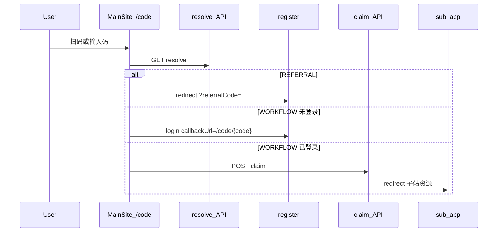

# 分享链接 3.0 · 码优先 + 统一兑换（SSOT）

> **状态**：已完成  
> **关联**：[`docs/分享规则.md`](./分享规则.md)（奖励规则 2.0，不变）· [`book-mall/doc/product/17-referral-sharing.md`](../book-mall/doc/product/17-referral-sharing.md)

---

## 1. 目标

- **码优先**：用户复制/口述 8 位（邀请）或 10 位（工作流）短码即可分享。
- **链接 + 微信 QR**：同码对应主站 `https://{主站}/code/{code}`，QR 编码同上 URL。
- **统一兑换**：主站 `/code`、`/code/{code}` 解析后分流注册或工作流 claim。
- **前缀不透明**：普通用户无法从码推断应用；管理员在后台查看 `ShareCodePrefix` 映射。

---

## 2. 码制

| 类型 | 总长 | 结构 | 示例前缀（seed） |
|------|------|------|------------------|
| 邀请注册 | 8 | 2 前缀 + 6 随机 | `RK` |
| 工作流分享 | 10 | 4 前缀 + 6 随机 | `CVAS` / `ECOM` / `QREP` |

字符集：`ABCDEFGHJKLMNPQRSTUVWXYZ23456789`（去掉 I/O/0/1）。

---

## 3. 前缀注册表

Prisma 模型 `ShareCodePrefix`：

| 字段 | 说明 |
|------|------|
| `prefix` | 2 或 4 字符，全站唯一 |
| `kind` | `REFERRAL` \| `WORKFLOW`（复用 `ShareRewardChannel`） |
| `app` | 工作流必填 `CANVAS` / `ECOM` / `QUICK_REPLICA`；邀请为 null |
| `enabled` | 停用后新码不可用；resolve 统一报错 |

管理页：主站 `/admin/share-code-prefixes`（仅管理员可见映射）。

---

## 4. 入口与兼容

| 入口 | 用途 |
|------|------|
| `/code` | 手动输入码 |
| `/code/{code}` | 扫码/点链兑换 |
| `/r/{code}` | **兼容** 邀请注册（保留） |
| `{子站}/share/w/{token}` | **兼容** 工作流长 token 链接 |

---

## 5. 分享物（UI）

### 5.1 邀请 · 弹层（快捷分享）

| 入口 | 行为 |
|------|------|
| 个人中心概览 · 账户身份卡片 | 「分享得积分」→ `ReferralShareDialog`（码+链+QR+统计摘要） |
| 侧栏 · 订阅与积分 | 「分享得积分」→ 同上弹层；「邀请明细」→ `/account/referral` |
| 订阅页 `/pricing` | 「去分享」下方「分享与领取说明」→ `ShareGuideDialog`（不跳转） |

弹层数据：`GET /api/account/referral/dashboard`（`eligible=false` 仍 200，便于展示门禁原因）。

### 5.2 邀请 · 明细页（`/account/referral`）

- 异步加载 + skeleton；完整 `ReferralPanel`（邀请列表、统计）
- 8 位码（大号展示 + 复制）
- 主站链接 `/code/{code}`
- QR 图：`GET /api/platform/share-code/qr?code=`

### 5.3 工作流（canvas / ecom / quick-replica 分享弹层）

- 10 位码 + 主站 `/code/{code}` + QR（主站 API）
- 折叠保留旧 token 深链（高级）

---

## 6. 兑换流

---

## 7. 安全

- `resolve` / `claim` IP 限流（内存桶，生产可换 Redis）。
- 无效/过期/达上限：**统一文案**「分享码无效或已失效」。
- 工作流 claim 须 platform 登录；邀请注册走现有 `referralCode` 归因。

---

## 8. 存量兼容

- **邀请码**：存量 8 位纯随机码不改列；resolve 时前缀未命中则 fallback 查 `ReferralProfile.code`。
- **工作流**：`WorkflowShareLink.shortCode` 可空；回填脚本为存量链接生成 10 位码；长 `token` 仍可用。

---

## 9. 实施清单（SC-*）

- [x] SC-301 ShareCodePrefix 注册表（schema + seed + admin）
- [x] SC-302 share-code resolve/claim 服务 + 限流
- [x] SC-303 主站 `/code` 页面 + QR API
- [x] SC-304 邀请分享 UI（referral-panel + register 可选码）
- [x] SC-305 工作流 shortCode 生成 + create API 返回
- [x] SC-306 三应用分享弹层
- [x] SC-307 存量回填 shortCode（`scripts/backfill-workflow-short-codes.ts`）
- [x] SC-308 单元测试
- [x] SC-309 个人中心分享弹层（概览/侧栏 + 异步明细页 + pricing 说明弹层）

---

## 10. 变更记录

| 日期 | 说明 |
|------|------|
| 2026-08-23 | 3.0 规格：码优先、统一 `/code`、前缀注册表、QR |
| 2026-08-23 | SC-309：个人中心「分享得积分」弹层、侧栏 action、pricing 分享说明弹层 |
