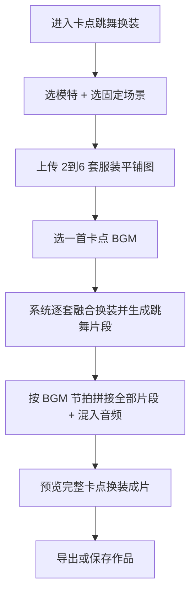

# 卡点跳舞换装视频 · 使用指南（传多套服装，出卡点换装跳舞短视频）

> 这篇是写给**已经注册好、登录进去就能用**的你看的。不讲技术，只讲「点哪里、传什么、会出什么」。

---

## 这个功能是干嘛的？

一句话：你上传 **2–6 套服装平铺图**，AI 自动帮你生成「音乐卡点 + 模特跳舞 + 逐套换装」的短视频，抖音 / 快手风格，适合服装流量种草。

> 侧栏名字叫「**卡点跳舞换装**」，认这个名字就能找到。

---

## 开工前：先备好这几样

1. **模特**：三选一 —— 文字创建 / 从模特库挑 / 上传一张模特图。
2. **场景**：三选一 —— 文字自定义 / 场景库挑 / 上传场景图。**全程固定不变**（保证人脸和背景不跳）。
3. **服装**：必填，上传 **2–6 套**服装平铺图（每套一套）。
4. **BGM**：系统内置卡点音乐，挑一首喜欢的就行（不做复杂音乐编辑）。

---

## 流程图（一眼看懂全流程）

---

## 第一步：进对地方

左边菜单点「电商工具箱」→「电商」→「短视频」→「卡点跳舞换装」。

---

## 第二步：填好表单

- 选模特（文字创建 / 模特库 / 上传图）。
- 选场景（文字 / 场景库 / 上传图），**这一项全程不变**。
- 上传 2–6 套服装平铺图，每套一张。
- 挑一首内置卡点 BGM。

---

## 第三步：点生成，等出片

点「生成」后系统会：先给每套服装分别做换装融合，再每套生成一段跳舞片段，最后按 BGM 节拍把片段拼起来、混入音乐，输出完整成片。

---

## 第四步：预览与导出

出片后在预览页看效果，满意就导出或「保存作品」。

---

## 几个贴心小贴士

- **画面不跳变**：所有片段共用同一个模特、同一个场景，只换衣服，所以人脸和背景始终统一。
- **「近似卡点」**：AI 动作和 BGM 节拍是**近似对齐**，做不到 100% 卡死，界面会提示，属正常现象。
- **动作幅度**：模特是「轻微活力跳舞、卡点律动」，不会大幅舞蹈，这样更不容易崩坏。
- **想改默认文案**：融合 / 视频 / 负面提示词都有系统预填，可在工作台里改，改坏了点「恢复系统默认」即可。
- **成片比例**：9:16 竖屏，时长跟着你选的 BGM 自动匹配。
