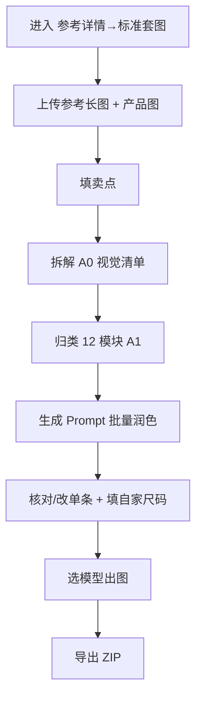

# 参考详情 → 标准套图 · 使用指南（上传参考长图，拆进固定 12 模块）

> 这篇是写给**已经注册好、登录进去就能用**的你看的。不讲技术，只讲「点哪里、传什么、会出什么」。

---

## 这个功能是干嘛的？

一句话：你**已经有一张想借鉴的详情长图**（自家旧款、供应商样稿、已授权同行版式等），让 AI **按画面顺序拆解**，再**归入与服装模板相同的 12 大模块**，用**你家的产品图 + 卖点**重新出图。**不是**像素级复刻，也**别**指望 OCR 还原参考图上的品牌与 SKU 文案。

> 侧栏名字叫「**参考详情 → 标准套图**」，在「电商工具箱」下，认这个名字就能找到。

---

## 开工前：准备这三样

1. **进对地方**：电商工具箱 → **参考详情 → 标准套图**。
2. **给参考长图**（拆解必填）：整页截图，Vision 只读这一张做拆解；尽量清晰、完整、自上而下可读（上传后服务端会缩放控成本）。
3. **给产品实拍**（强烈建议）：锁定款式颜色，**不参与**拆解阶段；可选**模特图**学气质。

---

## 流程图（一眼看懂全流程）

---

## 第一步：上传 + 卖点

- 先传**参考长图**；产品图、模特图可在拆解前或后补。
- **卖点**：手填或**多图识图**（需产品图）；卖点进阶段 B 润色，**禁止**模型照抄参考图上的促销句。

---

## 第二步：拆解（两阶段）

- **阶段 A0**：视觉清单，自上而下切分 `segments`（布局、元素描述，不写最终 Prompt）。
- **阶段 A1**：自动归类到 12 模块；置信度高的写入对应模块，其余可在 UI **手动改模块归属**。
- 完成状态为**已拆解**；中区可核对「参考里哪段归到哪个模块」，没识别到的模块显示「无」。

---

## 第三步：生成 Prompt + 出图

- 勾选要处理的模块（可全选 12）→ **单次**批量文本润色 → 写入下区各 slot。
- **尺码模块**：参考图里的表格**不会**被抠成尺码数据；和模板套图一样，尺码总表需你填**自家尺码**后程序化出图。
- 下区可改单条 Prompt、编尺码表；出图走模型选择器，长任务进后台 Dock；出图**仅用 product / model**，不会把参考长图当生图输入（避免抄竞品画面）。

---

## 做完之后：导出

- 顶栏可**素材打包导出**（ZIP 含你方出图与说明，不含参考图二次传播——请自行合规使用参考素材）。

---

## 几个贴心小贴士

- 某模块拆解是「无」？说明 AI 没在参考里找到对应段落，可手动调整归类或接受该模块不出图。
- 可以不上传产品图就拆解，但**识图卖点与出图质量**会明显变差。
- 和「学竞品结构 · 原创详情」不同：本工具落**固定 12 模块**、卖点来自你的 sellPoints 润色；竞品类请用后者。
- 和「详情长图分屏创作」不同：本工具**必须**有参考长图且落 12 模块；分屏创作是助手 + 自由屏数。删项目需二次确认。
