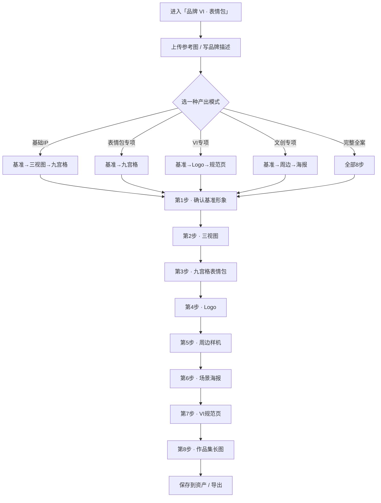

# 品牌 VI · 表情包 · 使用指南（做一套 2D 品牌 IP）

> 这篇是写给**已经注册好、登录进去就能用**的你看的。不讲技术，只讲「点哪里、传什么、会出什么」。

---

## 这个功能是干嘛的？

一句话：你上传一张参考图（或写段品牌描述），系统帮你生成一套**平面风格**的品牌 IP 物料——基准形象、三视图、表情包、Logo、周边、场景海报、规范页、作品集长图，适合做社媒头像、表情包和品牌视觉。

> 和「手办创作」的区别：这里是**平面 2D** 风格，偏头像 / 表情包 / 品牌规范；手办那边是**盲盒 3D** 实物向全案。

---

## 开工前：准备这三样

1. **进对地方**：左边菜单点「营销」→「品牌 VI · 表情包」。
2. **传图或写描述**：
   - 传 1～3 张参考图（人物图 / 线稿 / 头像 / Logo 草图）；
   - 或者纯文字写 Brief：品牌名、角色气质、主色、用途。
3. **选一种产出模式**（下面讲），决定系统帮你做哪些步骤。

---

## 先选模式：你想做多少？

创建时挑一种（单选），系统只会显示对应步骤：

| 模式 | 系统帮你做 | 适合 |
|------|------------|------|
| **基础 IP** | 基准 → 三视图 → 九宫格表情包 | 只想快速要形象 + 表情 |
| **表情包专项** | 基准 → 九宫格表情包 | 只做社交表情 |
| **VI 专项** | 基准 → Logo → VI 规范页 | 只做品牌识别系统 |
| **文创专项** | 基准 → 周边 → 场景海报 | 只做周边 / 海报 |
| **完整全案** | 全部 8 步 | 一次性出整套（推荐） |

---

## 流程图（一眼看懂全流程）

---

## 第一步：确认基准形象（最关键的一步）

系统先生成一张**基准 IP 形象图**。

- 觉得 OK → 点「确认」，这张图就定下来了，**后面所有图都照它来**。
- 没传参考图、纯文字也能生成并确认。
- 想调光线 / 颜色 → 点「重画」，只调光影配色，不改角色长相。

---

## 第二步：三视图

出正面 / 侧面 / 背面三张图，横向排好，比例和颜色统一。

---

## 第三步：九宫格表情包

出 9 个表情（开心、呆萌、害羞、生气、撒娇、加油、犯困、探头、摆手），发微信、小红书都能用。

---

## 第四步：Logo

从角色头部提炼一个简洁的**图形标识**（不是把整个角色当 Logo），配上品牌名，适合做头像、水印。

---

## 第五步：周边样机

出一张整版样品图：手机壳、帆布包、亚克力立牌、马克杯、贴纸、眼罩、笔记本、钥匙扣，统一摆在一起。

---

## 第六步：场景海报

出品牌场景海报，角色保持基准样子不变，适配社媒封面和品牌宣传（科技办公、四季、节日等方向）。

---

## 第七步：VI 规范页

自动拼一张规范页：主色 / 辅助色 / 点缀色色卡 + 角色头部和服装拆解 + Logo、表情包、周边使用建议，方便以后统一管品牌。

---

## 第八步：作品集长图

自动拼一张竖版长图（9:16），把前面的成果集在一起，用来发小红书、接单展示。

---

## 做完之后：保存和导出

- 每一步都能「保存到我的资产」；
- 全部做完可以导出整套素材。

---

## 几个贴心小贴士

- 每一步出图后先确认再继续，别一口气全生成。
- 某一步不满意？只重画那一步，不会影响已经定好的基准图。
- 想换整体风格（比如从 Q 版潮玩换成国潮）？会从头重新定基准，再来一遍。
- 换了全新参考图？整个流程自动重来。
- 如果你之前在「IP 母版」里存过这个角色的样子，可以直接导入，省去重新定基准。
