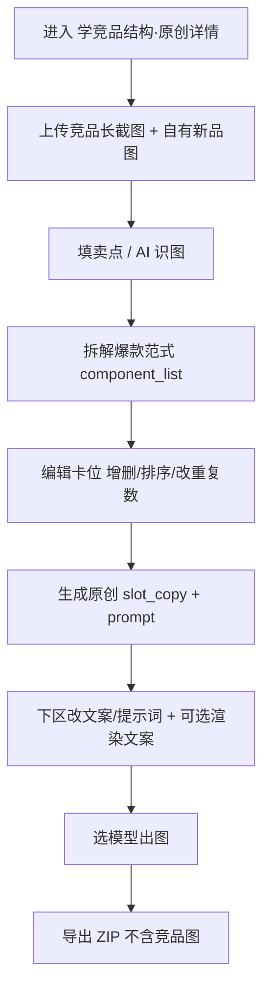

# 学竞品结构 · 原创详情 · 使用指南（竞品只学结构，文案画面全用自家）

> 这篇是写给**已经注册好、登录进去就能用**的你看的。不讲技术，只讲「点哪里、传什么、会出什么」。

---

## 这个功能是干嘛的？

一句话：你看到**淘宝/天猫等平台的爆款详情**，想学它的**叙事顺序、模块类型、视觉氛围**，用**自己的新品图 + 原创文案**做一套结构相近的详情素材。**不保存、不出图、不返回竞品原图与原文**；界面有合规提示，请只上传你有权分析的截图。

> 侧栏名字叫「**学竞品结构 · 原创详情**」，在「电商工具箱」下，认这个名字就能找到。

---

## 合规底线（请先看）

1. 竞品长图**仅用于结构/氛围分析**，系统**不会**把竞品图送进文生图模型。
2. 拆解结果是**抽象范式**（模块类型、排版、氛围形容词、卖点维度），**不是**竞品原句。
3. 最终 **slot_copy** 与 **positive_prompt** 由**原创重写**产生，你可再编辑。
4. 出图参考**只有 product / model**；别指望「还原竞品模特脸/竞品印花」。

---

## 开工前：准备这三样

1. **进对地方**：电商工具箱 → **学竞品结构 · 原创详情**。
2. **给竞品详情长截图**（拆解必填）。
3. **给自有新品产品图**（必填级建议）+ 可选模特图 + **可上架卖点**（可 AI 识图辅助，异步进度项目里可见）。

---

## 流程图（一眼看懂全流程）

---

## 第一步：上传 + 拆解范式

- 上传**竞品详情长截图** + **自有新品图**；新品卖点手填，或 **AI 识图卖点**（后台任务，页面轮询进度）。
- 点 **「拆解爆款范式」**（Vision 单次）：产出**卡位列表** `component_list`（类型如 full_banner、feature_card、scene_image…，含排版、重复张数）。
- 侧栏/面板展示**爆款洞察**（热卖维度、痛点、叙事顺序、文案口吻）与**视觉氛围七维**（光线、色调、构图等）——均可编辑后保存。

---

## 第二步：编辑卡位（可选）

- **增删卡位**、**上下移动**、改 **repeat_count**（各类型有上限，防一次生成过多）；改乱了可**重置为 AI 初次拆解快照**。

---

## 第三步：生成原创文案与 Prompt

- **未填卖点会被拦截**（避免空泛重写）。
- 文本模型按「爆款叙事结构 + 你的新品卖点 + 氛围七维」写 **slot_copy**（模块文案）与 **positive_prompt**（画面描述，默认不含详情排版字）。

---

## 第四步：出图 + 导出

- 每格可改模块文案与出图提示词；可选 **「出图时渲染模块文案」**：勾选后把文案并进出图 prompt（适合需图上短语的版式，模型仍可能错字，重要文案建议后期 PS）。
- 出图走模型选择器 + 后台 Dock；顶栏**素材打包导出 ZIP**（README + 你方出图），**不含**竞品原图。

---

## 几个贴心小贴士

- 卡位**数量不固定**，这是和「12 模块套图/复刻」的最大差异；常见类型含全屏海报、主商品图、卖点卡片、规格表、细节特写、场景图、对比图、售后块。
- 范式拆解为**单次** Vision；识图卖点另计。repeat_count 改很大系统会按类型截断上限并黄条 warning。
- 能用竞品图出图吗？**不能，也不应**——出图链路不接受竞品长图作 reference。
- 上传的其实是**自家详情**且只想进 12 模块？用**参考详情 → 标准套图**往往更省事。删项目需二次确认。
