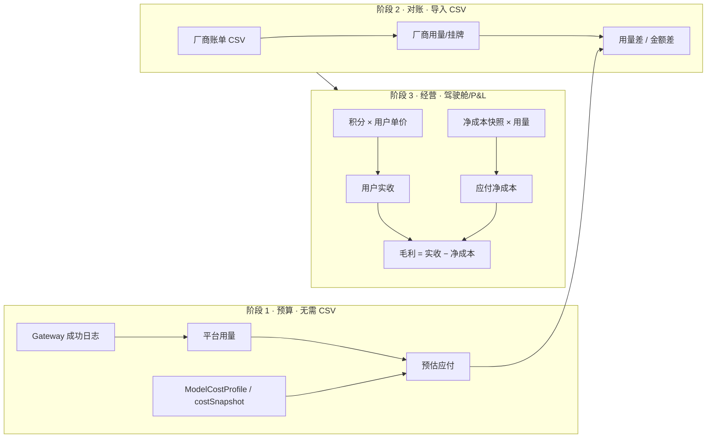

# 对账需求 · 产品规格（SSOT）

> **状态**：Phase 1 已落地（Gateway 底表 + 挂牌价对账 + 多厂商导入）；Phase 2 待完善（净成本预算 + 损益列 + UX）  
> **入口**：Finance [`/admin/reconciliation`](http://localhost:3002/admin/reconciliation) · Book 驾驶舱 [`/admin`](http://localhost:3000/admin)  
> **技术设计**：[`docs/阿里对账.md`](./阿里对账.md) · 代码 [`book-mall/lib/finance/reconciliation-v2/`](../book-mall/lib/finance/reconciliation-v2/)  
> **进度台账**：[`docs/财务2.0-实施跟踪.md`](./财务2.0-实施跟踪.md)（AR-*）  
> **测试**：[`docs/财务2.0-测试用例.md`](./财务2.0-测试用例.md) §TC-A6+

---

## 1. 业务目标

平台代付模式下，财务需要回答三类问题：

| # | 问题 | 用途 |
|---|------|------|
| **A** | 按 Gateway 用量 + 库内成本，**预估**该付厂商多少？ | 导入账单前的**预算** |
| **B** | 厂商 CSV 导入后，**用量/金额**与预算差多少？ | **对账核验**（核算有没有问题） |
| **C** | 用户实收多少、净成本多少、**真实毛利**多少？ | **经营收益** |

**A → B → C** 是固定顺序：**先预算，导入才是对账；对账通过后再看真实收益。**

---

## 2. 两阶段工作流



### 2.1 阶段 1：预算（刷新平台底表）

**触发**：对账总表选择日期区间 →「刷新」/ `POST .../master/refresh-platform`。

**输入**：

- `GatewayRequestLog`（`SUCCEEDED` + `PLATFORM_CREDIT` + 日历区间）
- `ModelCostProfile` 挂牌价（`listCostYuan` / input/output 分价）
- 每条日志的 `costSnapshotYuan`（结算时净成本单价快照）

**输出（每 joinKey 一行）**：

| 字段 | 含义 | 现网字段 |
|------|------|----------|
| 平台用量 | 张 / 秒 / 千 token 等 | `platformUnits` |
| 预估应付（挂牌） | 用量 × 挂牌单价 | `platformListYuan` ✅ |
| 预估应付（净成本） | 用量 × 净成本单价（或 Σ costSnapshot×用量） | **待增** `platformNetCostYuan` |
| 扣减积分 | Σ `creditsCharged` | `platformCredits` ✅ |
| 用户实收 | Σ 积分 × 用户 `pricePerCreditYuan` | `platformRevenueYuan`（**已算未展示**） |

**厂商侧**：无 CSV 时厂商列为空 /「待导入」；**此时金额差 ≠ 收益**，仅为平台侧预算占位。

### 2.2 阶段 2：对账（导入厂商 CSV）

**触发**：厂商导入 Tab 上传阿里云 / DeepSeek / KIE 账单（须与阶段 1 **同一日期区间**）。

**输出**：

| 字段 | 含义 |
|------|------|
| 厂商用量 | CSV 聚合 |
| 厂商挂牌 | CSV 目录总价或 用量×目录价 |
| 用量差 | `platformUnits − vendorUnits` |
| 金额差 | `platformListYuan − vendorListYuan`（挂牌口径一致） |
| 状态 | OK / OVER / UNDER / MISSING_* / PRICE_MISMATCH |

**目的**：验证 Gateway 计量与厂商账单是否一致；单价是否已与库内挂牌同步。

### 2.3 阶段 3：真实收益（驾驶舱 / P&L）

不与 CSV 逐行绑死，按账期汇总：

| 指标 | 口径 |
|------|------|
| 应付厂商（净成本） | `CreditLedger` + 日志 `costSnapshotYuan` × 用量 |
| 用户实收 | 消耗积分 × 各用户 ppc |
| 毛利 | 实收 − 净成本 |

入口：Book `/admin` 经营概览、Finance `/admin/pnl-report`。

---

## 3. 口径对照（避免误读）

| UI 名称 | 是什么 | 不是什么 |
|---------|--------|----------|
| **平台用量** | Gateway 计费单位数量 | 不是积分 |
| **平台挂牌** | 用量 × **挂牌**单价（目录价） | 不是用户实收 |
| **平台预估净成本**（待增） | 用量 × **净成本**（含渠道折扣） | 不是挂牌 |
| **积分** | 向用户扣的积分 | 需 × ppc 才是实收金额 |
| **用户实收** | 积分 × 用户单价 | 已在后端计算，总表待展示 |
| **厂商挂牌** | CSV 目录价总额 | 导入前为「待导入」 |
| **金额差** | 平台挂牌 − 厂商挂牌 | 导入前等于平台挂牌，**不能当毛利** |
| **行级毛利**（待增） | 用户实收 − 平台净成本 | 与金额差不同 |

---

## 4. 对账总表 UI 需求

### 4.1 已有

- 日期区间（与 CSV 导入窗口一致，`periodKey` = `YYYYMMDD_YYYYMMDD`）
- 按厂商分组（账单来源 / KIE / 阿里云 / DeepSeek…）
- 厂商导入 / 刷新平台底表
- 列：用量、厂商挂牌、平台挂牌、**预估净成本**、**用户实收**、**行级毛利**、对账差额、积分、状态
- 顶栏 KPI：预算净成本 / 已对账差额 / 实收 / 毛利
- 列头 tooltip 区分挂牌预算、净成本、实收、对账差额
- CSV 列：是否已导入该厂商账单
- 付少红 / 付多绿（行背景 + 差额字色）

### 4.2 待做（Phase 2）

| ID | 需求 | 状态 |
|----|------|------|
| AR-106 | 总表增加 **预估应付（净成本）** 列 + 汇总 | ✅ |
| AR-107 | 总表增加 **用户实收**、**行级毛利** 列 + 汇总 | ✅ |
| AR-108 | 列头/tooltip 区分「挂牌预算 / 净成本 / 实收 / 对账差额」 | ✅ |
| AR-109 | 顶栏 KPI：预算净成本、已对账厂商差额、实收、毛利（与驾驶舱口径一致） | ✅ |
| AR-105 | S2V 非 Gateway 缺口排查 | ✅ |
| AR-110 | 成本档改价 **关旧开新**（`upsertModelCostProfileVersioned`）全面接入 seed/导入脚本 | ✅ |

---

## 5. 数据与 joinKey

```
joinKey = vendor | modelKey | tierRaw | unitKind | tokenDirection | periodKey
```

- `vendor`：由 `ModelCatalog` + `inferVendorCodeFromModelKey` 推断（如 `lib-nano-pro-2k` → `kie`）
- `periodKey`：与 CSV / Gateway 过滤区间一致，**禁止**仅用 `YYYYMM` 跨月混对

---

## 6. 厂商导入

| 厂商 | 格式 | 状态 |
|------|------|------|
| 阿里云 | `consumedetailbill_v2` CSV/Excel | ✅ |
| DeepSeek | `cost-*.csv` / `amount-*.csv` | ✅ |
| KIE | usage_data（Credits Consumed） | ✅ |

导入后：同步挂牌价 → `ModelCostProfile`（关旧开新）→ 重发 `ModelCreditPrice`。

---

## 7. 验收标准

1. **预算**：不导入 CSV 即可看到按 Gateway 汇总的预估应付（挂牌 + 净成本）与积分。
2. **对账**：导入同区间 CSV 后，用量差/金额差可解释；OK 行占比可统计。
3. **收益**：总表或驾驶舱可读出同账期用户实收、净成本、毛利，与 P&L 一致。
4. **改价**：成本档历史保留；新请求按新积分扣减。
5. **按日 P&L**：usage-overview「按日 P&L」Tab 与 `/admin/pnl-report` 同账期合计一致。
6. **ASR/S2V 回填**：历史日志可经脚本补 `audioDurationSec` / `usage.duration`，对账 UNDER 收敛。

---

## 8. 变更记录

| 日期 | 说明 |
|------|------|
| 2026-08-22 | 初版：两阶段工作流、三问题框架、Phase 2 待办 AR-106～110 |
| 2026-08-22 | AR-110：`importModelCostProfileVersioned` 接入全部 seed/价目导入脚本 |
