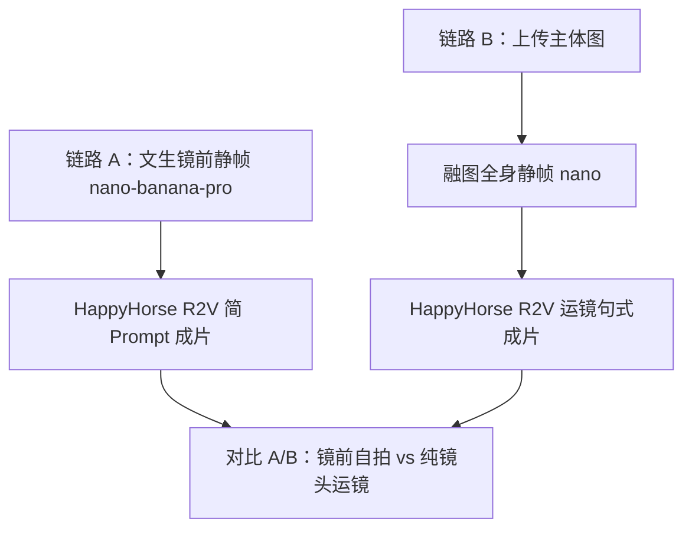
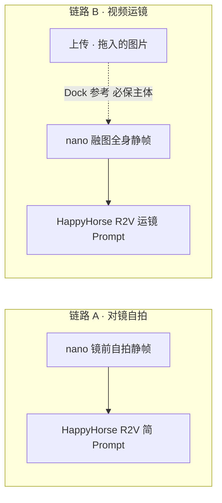

# 画布使用案例 · 户外对镜自拍 + 视频运镜

> **案例来源**：真实画布项目  
> **项目 ID**：`cmts2enxq005ljjpyc5vhf9ic`  
> **项目名称**：户外对镜自拍 视频运镜  
> **文档日期**：2026-10-04  
> **读者**：服装电商、需要 **「静帧穿搭图 → 人物微动/纯运镜成片」** 的创作者；可与电商工具箱 **「视频运镜」**、**「户外对镜自拍」** 对照学习  

本文依据 **`CanvasProject` 连线、节点 Prompt 与 `CanvasGenerationTask`** 还原数据流；不涉及计费。

**打开**：`/canvas/cmts2enxq005ljjpyc5vhf9ic`（需登录与权限）。

**相关电商一键工具**（表单式，非本画布）：《视频运镜 · 使用指南》（见「营销」）、《户外对镜自拍 OOTD · 使用指南》（见「营销」）。

---

## 流程总览

---

## 1. 案例在解决什么问题

画布上并排 **两条短链**，都是 **9:16 商业穿搭**，但成片气质不同：

| 链路 | 静帧怎么来 | 视频怎么来 | 成片气质 |
|------|------------|------------|----------|
| **A · 对镜自拍** | **文生图**（nano-banana-pro）：户外落地镜、手持手机对镜、巴黎街景 | **HappyHorse 1.1 R2V**：Prompt 仅「请根据 @参考图 生成视频」 | 镜前自拍场景 + 模型按参考图动效 |
| **B · 视频运镜** | **上传服装/主体图** → **融图生图**（nano + 上游 1 张必保主体）：无镜子、街景全身站姿 | **HappyHorse 1.1 R2V**：Prompt 写明 **缓慢推进、轻微环绕、展示版型面料** | **人物相对稳、镜头推拉环绕**（对齐电商「视频运镜」话术） |

无剧本中心、无剪辑节点；**5 节点、2 连线**，结构刻意保持 **可复制的最小模板**。

---

## 2. 结构一览

| 指标 | 本项目 |
|------|--------|
| 版本 | Pro2 图片 + **sbv1 视频合成** |
| 节点 | **5**（**3** 图 + **2** 视频） |
| 连线 | **2**（各「一图 → 一视频」） |
| 生成任务 | **5** 次登记；**4** 成功、**1** 失败后同节点 **重试成功** |
| 模型 | **nano-banana-pro**（静帧 ×2）、**happyhorse-1.1-r2v**（视频 ×3 含失败） |

**说明**：上传节点 **「拖入的图片」**（`n_I7dC0ebp`）**没有画线** 到融图节点；参考是在 **生成 `n_JxIpuP4v` 时** 通过 Dock **上游附带 1 张参考图** 送入（任务 payload 中有「第 1 张为产品主体（必保）」）。复制案例时须 **重新 @ 或连 `in_image`**，不要假设无连线也能融图。

---

## 3. 链路 A：户外对镜自拍静帧 → R2V

### 3.1 静帧节点 `n_iAmmbKR_`

- 模型：**nano-banana-pro**  
- Prompt 要点（摘要）：  
  - 9:16 商业穿搭摄影；欧美女模、棕发大卷、墨镜  
  - **街边户外落地木框全身镜、对镜自拍、手持手机**  
  - 黑双排扣长大衣、白衬衫、灰半裙、玛丽珍鞋、银色斜挎包  
  - 巴黎街景、阴天自然光、写实 8K 质感  

### 3.2 视频节点 `n_v7DZpmgx`

- 模型：**happyhorse-1.1-r2v**  
- **连线**：静帧 `image` → 视频 `in_ref`  
- 节点 Prompt：`请根据 @<sbv1-ref-n_iAmmbKR_> 生成视频`（极简，运镜交给模型默认）  
- 任务侧等价：`请根据 [Image 1] 生成视频`  

**用途**：快速验证 **「镜前 OOTD 静帧 → 参考生视频」** 是否成立；想强化推拉环绕时，应改写成链路 B 的 **运镜句式**。

---

## 4. 链路 B：上传主体 → 融图静帧 → 运镜 R2V

### 4.1 上传节点 `n_I7dC0ebp`（标签：拖入的图片）

- 模式：**upload**（用户拖入 OSS 图，非生成任务）  
- 角色：融图时的 **产品/服装主体（必保）**  

### 4.2 融图静帧 `n_JxIpuP4v`

- 模型：**nano-banana-pro**  
- Prompt：与链路 A **同款穿搭与街景**，但 **去掉镜子、对镜、手机** → 普通 **户外全身站姿** 展示  
- 生成时 **附带 1 张上游参考**（上传图），系统文案：**第 1 张为产品主体（必保），其余为风格/灵感参考**  

### 4.3 视频节点 `n_SJ7r3vOM`

- 模型：**happyhorse-1.1-r2v**  
- **连线**：融图静帧 → `in_ref`  
- 节点 Prompt（运镜核心）：  

  > 9:16竖屏，商业穿搭展示视频，高清真实，模特 @参考 展示，**镜头缓慢推进，轻微环绕**，展示服装版型、面料和整体穿搭效果，光线自然，画面稳定流畅  

- 任务记录：**1 次 FAILED → 1 次 SUCCEEDED**（复制时若失败，检查参考图是否有效、Prompt 是否仍 @ 到正确节点后 **重新生成**）。

**用途**：对齐电商 **「视频运镜」**——模特尽量稳，靠 **镜头推拉、轻微环绕、细节展示** 出片；静帧可先由 **平铺/挂拍图融图** 得到，不必先拍镜前照。

---

## 5. 与电商工具箱的差异（为什么要上画布）

| | 电商「视频运镜」一键页 | **本画布案例** |
|--|------------------------|----------------|
| 输入 | 表单：模特 + 场景 + 平铺图 | 自由：**文生镜前** 或 **上传 + 融图** |
| 融合 | 系统自动两步 | 你控制 **nano Prompt**（有无镜子、街景、姿势） |
| 视频 | 固定 6 秒、默认运镜文案 | **HappyHorse R2V**，Prompt **可简可详** |
| 并行 | 单条成片 | **两条链路同时试** A/B |

画布适合：**微调镜前 vs 纯运镜**、换模型、把成片 **再连下游**（高清、剪辑、多段拼接）。

节点顶栏、Dock、`@` 引用见 《AI 画布 · 图片与视频节点编辑 · 使用指南》（见本节点）。

---

## 6. 推荐复现步骤

1. **复制项目** 到「我的画布」，或按本节 **自建 5 节点**。  
2. **链路 A**：写镜前自拍 nano Prompt → 生成静帧 → 新建 **HappyHorse R2V** 视频节点，**连 ref**，Prompt 可先极简再迭代。  
3. **链路 B**：上传 **平铺/主体图** → 新建融图节点，**Dock 引用上传图 + 写无镜全身 Prompt** → 生成 → 连 **R2V**，粘贴 **§4.3 运镜句式**。  
4. **9:16**：静帧 Dock 参数与视频 Prompt 均保持竖屏。  
5. **失败重试**：参考本案例 `n_SJ7r3vOM` 一次失败记录；勿只改提示不查参考链。  
6. （可选）满意成片 **保存为资产** 或 **spawn 剪辑节点** 拼接 A/B。

---

## 7. 常见问题

**Q：为什么上传图没有线到融图节点？**  
A：本作者用 **Dock 附带参考** 完成融图；你复制后更稳妥做法是 **连 `in_image`** 或 Dock 里 **@ 上传节点**。

**Q：HappyHorse 和 wan3.0 怎么选？**  
A：本案例全程 **happyhorse-1.1-r2v**（参考生视频）；换 wan 需改视频节点模型并核对 **参考模式**（全能参考/首尾帧）。

**Q：和「户外对镜自拍」电商工具冲突吗？**  
A：不冲突。链路 A 接近 **镜前 OOTD** 静帧；链路 B 接近 **视频运镜** 成片逻辑；电商页是封装好的默认 Prompt，画布是 **可编辑版**。

---

## 8. 相关文档

- 《AI 画布 · 使用指南》（见本节点）  
- 《AI 画布 · 图片与视频节点编辑 · 使用指南》（见本节点）  
- 《视频运镜 · 使用指南》（见「营销」）  
- 《户外对镜自拍 OOTD · 使用指南》（见「营销」）  

---

## 9. 变更记录

| 日期 | 说明 |
|------|------|
| 2026-10-04 | 初版：基于 `cmts2enxq005ljjpyc5vhf9ic` 追踪 |
