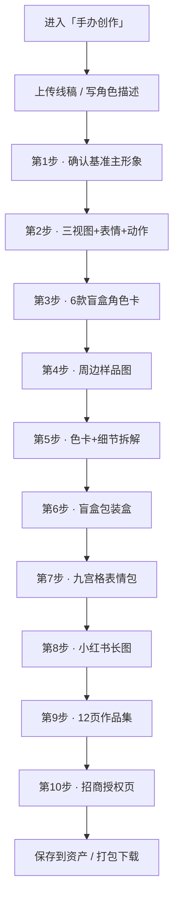

# 手办创作 · 使用指南（线稿变盲盒全案）

> 这篇是写给**已经注册好、登录进去就能用**的你看的。不讲技术，只讲「点哪里、传什么、会出什么」。

---

## 这个功能是干嘛的？

一句话：你上传一张手绘线稿（或者写段文字描述角色长啥样），系统一步一步帮你生成一整套**潮玩盲盒风格**的 IP 素材——从基准形象、三视图、盲盒卡片、周边样品，到包装盒、表情包、作品集长图、招商页，全给你做齐。

适合想做盲盒、周边实物，或者拿去招商合作的朋友。

---

## 开工前：准备这两样

1. **进对地方**：左边菜单点「电商」→「手办创作」。
2. **传图或写描述**：
   - 传一张角色线稿 / 参考图（手绘、立绘、头像都行，最多 3 张）；
   - 或者啥都不传，直接写一段角色描述，比如「扎卷发、戴星星发饰、穿波点裙的女孩」。

> 小提示：系统会 1:1 保留你线稿的样子，不会乱改你的角色。

---

## 流程图（一眼看懂全流程）

---

## 第一步：确认基准主形象（最关键的一步）

系统先生成一张**主形象图**——角色正面站好、干净白底。

- 觉得 OK → 点「确认」，这张图就定下来了，**后面所有图都照它来**，不会跑偏。
- 觉得光线 / 颜色想调 → 点「重画」，但只会调光影和配色，**不会改你的角色长相**。

---

## 第二步：生成基础规范三件套

点一下，系统一次性出三样：正面 / 侧面 / 背面三视图 + 4 个基础表情 + 5 个日常动作。

---

## 第三步：做 6 款盲盒角色卡

脸和发型不动，只换穿搭和场景主题（甜点、森系、居家、田园、假日、冬日），出 6 张盲盒卡片 + 一张合集预览图。

---

## 第四步：周边样品图

出一张整版样品图：钥匙扣、亚克力立牌、帆布包、马克杯、贴纸、手机壳、眼罩、笔记本，统统摆在一起，方便看效果。

---

## 第五步：品牌色卡和细节拆解

出一张规范页：主色 / 辅助色 / 点缀色色卡 + 头部、服装、肢体细节拆解，以后做物料好统一。

---

## 第六步：盲盒包装盒

出包装盒正面、背面、盒内卡片、腰封的效果图，能拿去打样做实物。

---

## 第七步：九宫格表情包

在 4 个基础表情上扩成 9 个（开心、呆萌、害羞、生气、撒娇、加油、犯困、探头、摆手），发微信、小红书都能用。

---

## 第八步：小红书长图

自动把前面的图拼成一张竖版长图，直接能发作品集、接单展示。

---

## 第九步：12 页作品集

按行业标准的页序，自动拼成 12 页完整作品集：封面 → 档案 → 三视图 → 表情 → 色卡 → 盲盒 → 单卡 → 周边 → 包装 → 九宫格 → 长图 → 版权封底。

---

## 第十步：招商授权页

最后出一张招商合作单页，写明能授权哪些方向（盲盒联名、文创、快闪、服饰、美妆、表情包商用），用来对接品牌方。

---

## 做完之后：保存和下载

- 每一步都能「保存到我的资产」；
- 全部做完，可以从项目菜单**打包下载**（会带一张交付清单）。

---

## 几个贴心小贴士

- 每一步出图后先确认再继续，别一口气全生成。
- 某一步不满意？只重画那一步，不会影响已经定好的基准图。
- 想换整体风格（比如从潮玩 3D 换成国潮）？会从头重新定基准，再来一遍。
- 换了全新线稿？整个流程自动重来。
- 如果你之前在「IP 母版」里存过这个角色的样子，可以直接导入，省去重新定基准。
