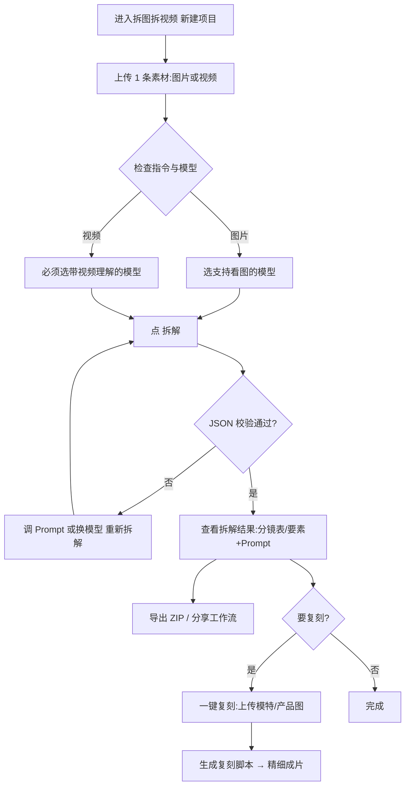

# 拆图拆视频·使用指南

把别人家「好看的图 / 好用的视频」拆明白的一条捷径：上传**一张图**或**一段视频**，AI 帮你反推成结构化的拆解表（分镜、台词、卡点、生图 Prompt 等），看懂别人怎么拍、怎么构图，还能一键换成你自己的模特和产品做复刻。适合想学结构、做轻量复刻的卖家和内容团队。

## 一、开始前准备

- 入口：电商工具箱 → 电商 → 拆解与拉片 → **拆图拆视频**
- 准备素材：一张图片（jpg/png/webp）**或**一段视频（mp4 等），二选一
- 可以本地上传、粘贴公网 HTTPS 链接，或从「我的资产」里选
- 一个项目**同时只绑 1 条素材**（图或视频，不能混绑）

## 二、操作步骤

**第一步：进入并新建项目**
点进「拆图拆视频」入口，点左上角「新建项目」，进入工作区。

**第二步：上传素材**
在素材区拖拽或选择本地文件，粘贴 HTTPS 链接，或从「我的资产」挑一条。上传后系统会自动识别是 image 还是 video。

**第三步：检查拆解指令和模型**
- 默认 Prompt 已按「图片 / 视频」自动切换好，一般不用改；若改请保留模型需要的 JSON 围栏格式。
- 图片拆解：选支持「看图」的模型即可。
- 视频拆解：**必须选带视频理解能力的模型**，否则提交不了或会失败。视频还会做语音识别（ASR）回填台词，口播以 ASR 为准，更准。

**第四步：点「拆解」**
点「拆解」后结果流式返回，界面会渲染成可读的表格 / 卡片。如果 JSON 校验失败会提示 parseError（不会把半拉子结果当成功），按提示调 Prompt 或换模型后重新拆解即可。

**第五步：使用和导出结果**
- 视频拆成功：能看到全片风格、钩子、完整台词、分镜表（镜号/时长/景别/运镜/构图/布光/口播/音效/BGM/转场等）、叙事逻辑、卡点要点、可复刻拍摄脚本。
- 图片拆成功：能看到画面要素（主体/场景/构图/布光/色彩/氛围）、正向/负向生图 Prompt、实拍复刻方案。
- 项目自动落库，可在「项目列表」继续打开；可「导出 ZIP」归档，或「分享工作流」生成 10 位码/链接发给同事（对方拿到的是副本）。

**第六步（可选）：一键复刻成片**
拆解成功且结构化通过后出现「一键复刻」：上传你的模特图、产品图 → 点「生成复刻脚本」 → 进入「精细成片」工作区按分镜生图 / 生视频，可改 Prompt 多次生成。复刻会关联一个种草视频格式的子项目存分镜与成片，在拆图拆视频页内就能完成。

## 三、流程图

## 四、小贴士 & 常见坑

- **一次只传一条素材**：想拆多张，请分项目或先拼成视频/长图再拆（长图按静态图路径）。
- **视频模型别选错**：视频素材务必选支持 video 理解的模型，否则无法提交。
- **台词更可信**：视频口播以 ASR + 模型分镜分配为准；ASR 失败就检查视频有没有人声、是不是太吵。
- **先拆解再复刻**：复刻依赖成功的 JSON，解析报错先解决拆解，别硬点复刻。
- **合规与计费**：拆解用于学结构/脚本，复刻只用你有权使用的素材和自有商品图；出图/出视频走 Gateway 调用，归属电商工具箱月费体系。
- 和「专业拉片」的区别：拆图拆视频输入是**图或视频**、分析较轻量；专业拉片只收**≤90 秒视频**、做 25 维逐镜 + 合成成片。只想快速反推选本工具即可。
