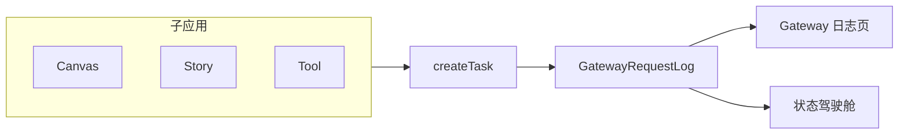

# AI 模型生成任务 · 状态驾驶舱

> **状态**：已对齐 Gateway 日志口径（实现见 `gateway-web/app/dashboard/status`、`book-mall/app/api/gateway/logs/stats`）  
> **原则**：数字、状态、失败原因 **仅** 取自 `GatewayRequestLog`，与 [Gateway 日志页](../gateway-web/app/dashboard/logs) 一致，**禁止**自造平行 taxonomy。

---

## 1. 功能概述

实时监控平台 AI 生成任务，支持 **主体归属 + 时间** 双重筛选：

- 全站 / 团队 / 个人 / 项目（Story `storyProjectId`）
- 团队 / 个人二级筛选：**手机号**（≥4 位自动匹配，结果展示手机号、昵称、用户名）
- 短时（1h～12h）、日、周月、自定义 UTC 日期
- **30 秒**轮询（页面可见时，仅「驾驶舱」视图）
- 统计卡片 + 六类计费柱状图 + 三 Tab 明细 + **表格**视图（可下载 CSV）

---

## 2. 数据真源（与 Gateway 日志对齐）



| 项 | 真源 |
|----|------|
| 表 | `GatewayRequestLog` |
| 查询范围 | [log-query-scope.ts](../book-mall/lib/gateway/log-query-scope.ts) |
| 列表字段 | [GET /api/gateway/logs](../book-mall/app/api/gateway/logs/route.ts) |
| 聚合统计 | [GET /api/gateway/logs/stats](../book-mall/app/api/gateway/logs/stats/route.ts) |
| CSV 导出 | [GET /api/gateway/logs/export](../book-mall/app/api/gateway/logs/export/route.ts) |
| 状态文案 | [gateway-log-display.ts](../gateway-web/lib/gateway-log-display.ts) |
| 耗时 / 进度 | [gateway-log-params.ts](../gateway-web/lib/gateway-log-params.ts) |
| 火山拆分 | [log-volcengine-timing.ts](../book-mall/lib/gateway/log-volcengine-timing.ts) |
| 模型分组 | [billing-category.ts](../book-mall/lib/billing/billing-category.ts) · 六类计费大类型（图表不含 OTHER） |

**禁止**单独统计 `CanvasGenerationTask` / `StoryGenerationTask` 作为驾驶舱计数来源。

---

## 3. 顶部筛选

### 3.1 主体归属（单选）

| 选项 | API 参数 | scope 实现 |
|------|----------|------------|
| 全站 / 平台（默认） | `scope=all` | `buildGatewayLogScopeForBookUser` |
| 团队 | `scope=team&tenantId=` | `buildGatewayLogWhereForTeamTenant` + 可选 `actorPhone` |
| 个人 | `scope=actor` | 默认当前用户；`actorPhone` 筛选成员 |
| 项目 | `scope=project&storyProjectId=` | `storyProjectId` + 基础 scope |

团队列表：`GET /api/gateway/logs/dashboard/meta`（已加入的 `type=TEAM` 团队；平台财务/超管另含全站团队列表）

### 3.2 时间

| 类型 | 参数 |
|------|------|
| 最近 N 小时 | `hours=1|3|6|12` |
| 日历日 | `from` / `to`（UTC，与日志页相同） |

---

## 4. 状态（三 Tab ↔ `GatewayRequestStatus`）

| 驾驶舱 | DB 枚举 | 日志 Status 列 |
|--------|---------|----------------|
| **生成中** | `PENDING`, `RUNNING` | pending / running |
| **成功** | `SUCCEEDED` | success |
| **失败** | `FAILED` | failed |
| （卡片附加） | `CANCELLED` | cancelled |

明细 Tab：`statuses=PENDING,RUNNING` / `SUCCEEDED` / `FAILED`。失败 Tab 展示 **失败码 + 失败原因**（`failCode` / `failMessage`）。

---

## 5. 分页（与 Gateway 日志页一致）

**凡列表型数据必须分页**，规则与 [logs-table.tsx](../gateway-web/components/logs/logs-table.tsx) / [gateway-log-pagination-config.ts](../gateway-web/lib/gateway-log-pagination-config.ts) 相同：

| 项 | 规范 |
|----|------|
| API | `GET /api/gateway/logs?page=&limit=` |
| 默认每页 | **20** 条 |
| 预设 | **20 / 50 / 100** |
| 自定义 | 1～**500** 条/页 |
| 本地记忆 | `localStorage` 键 `gw-logs-page-size`（与日志页 **共用**） |
| 响应字段 | `total`、`page`、`pageSize`、`totalPages`、`logs[]` |
| 页脚文案 | `共 N 条 · 第 P/T 页 · 本页 M 条` |
| 切换 Tab / 筛选 / 改每页 | **重置为第 1 页** |
| 加载中 | 有旧数据时半透明 + 遮罩，避免误读上一 Tab 数据 |

### 5.1 适用范围

| 视图 | 分页 |
|------|------|
| 驾驶舱 · 三 Tab 明细 | ✅ 同上 |
| 表格 · 全量明细 | ✅ 同上（`GET /api/gateway/logs`，无 status Tab 时查全状态） |
| 统计卡片 / 柱状图 | ❌ 聚合计数，不分页 |
| CSV 下载 | 当前筛选下最多 **2000** 条（`GET /api/gateway/logs/export?format=csv`），非分页翻页 |

### 5.2 组件

复用 [GatewayLogPaginationBar](../gateway-web/components/logs/gateway-log-pagination-bar.tsx)。

---

## 6. 图表 · 计费类型 + 模型

与财务 / BYOK 收费大类型对齐（**图表不展示 OTHER**；人像入库单独一行）：

1. 文生图（含试衣）`TEXT_TO_IMAGE`
2. **人像入库** `PORTRAIT_IMPORT`（`portrait:virtual` / `portrait:real`；财务用量归 **其他 · 次**）
3. 图生视频 `IMAGE_TO_VIDEO`
4. 视频生视频 `VIDEO_TO_VIDEO`
5. 视频理解 `VIDEO_UNDERSTANDING`
6. TTS / 语音 `TTS`
7. 文字 `TEXT`

另：**成功 · 按模型（Top 20）** — `byModel.succeeded`，与日志表 `canonicalModelKey ?? model` 一致。

解析：`resolveDashboardChartCategory`（`billing-category.ts`）  
计费单位规则：`.cursor/rules/gateway-billing-units.mdc`

---

## 7. 明细表格字段

与 logs API 一致，另含 `actorPhone` / `actorName` / `actorDisplayLabel`。字段对照：[logs-table.tsx](../gateway-web/components/logs/logs-table.tsx)

---

## 8. 数据口径

1. 主体 scope 优先，再叠时间与 filter  
2. 卡片、图表、列表 **共用同一 `where`**（stats 与 logs 列表）  
3. 列表 **必须** 走服务端分页，禁止前端一次拉全量再切片  
4. 轮询 30s；opportunistic `runGatewayPollWorker` + `expireStaleGatewayLogs`

---

## 9. 页面结构

```
1. 视图 Tab：驾驶舱 | 表格
2. 筛选：主体 + 手机号（团队/个人）+ 时间
3. [驾驶舱] 卡片 + 按类型双柱状图 + 按模型柱状图 + 三 Tab 明细分页列表
4. [表格] 全字段明细分页列表 + 下载 CSV
```

---

## 10. API 摘要

| 方法 | 路径 | 用途 |
|------|------|------|
| GET | `/api/gateway/logs/stats` | 卡片 + 图表（`parts=summary,categories,models` 或 `all`） |
| GET | `/api/gateway/logs/dashboard/meta` | 团队 / 当前用户 |
| GET | `/api/gateway/logs` | **分页**明细（`page` + `limit`） |
| GET | `/api/gateway/logs/export?format=csv` | CSV（最多 2000 条） |
