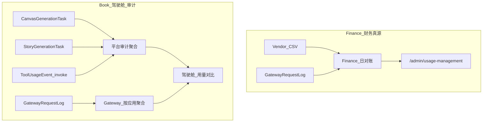

# 用量管理明细

> **状态**：SSOT · 2026-08-24 定稿  
> **管理入口**：Book `/admin/pending-features`（待处理 · UM-100～107）· Finance `/admin/usage-management`  
> **关联**：[`对账需求.md`](对账需求.md) · [`模型与应用管理.md`](模型与应用管理.md) · [`阿里对账.md`](阿里对账.md)

---

## 1. 背景与问题

2026-07-26～2026-08-24 DeepSeek 厂商账单与平台 Gateway 日志严重不一致：

| 侧 | 请求数（约） | 费用（约） | 说明 |
|---|---|---|---|
| 厂商 · **canvas** Key | 5,426 | ¥173.80 | **几乎无 Gateway 日志** → 直连 `api.deepseek.com` |
| 厂商 · **bilibili** Key | 114 | ¥12.07 | 与 Gateway 128 条 DEEPSEEK 日志吻合 |
| Gateway SUCCEEDED | 98 | ≈¥12 | Canvas story-pro 97 + 小智 1 |

**模糊根源**：

1. DeepSeek 控制台 **Key 名称**（canvas / bilibili）≠ 业务模块名，且 canvas Key 大量 **绕过 Gateway**。
2. 平台侧缺少 **按日、按应用、按 Key** 的统一汇总与 **厂商 vs Gateway 对比** 页面。
3. `clientPage` 粒度偏粗（如 `canvas/{id}/story-pro`），难以一眼看出功能点。

---

## 2. 三层真源与两条线

### 2.1 财务规则（强制）

**凡调用大模型（任意厂商、任意应用），必须经 Gateway → 必定在 `GatewayRequestLog` 留痕。**

因此：

| 场景 | 统计线 | 数据源 | 角色 |
|---|---|---|---|
| **Finance 用量对账 / 厂商 CSV 对账** | Gateway 线 | `GatewayRequestLog` + 厂商账单 | **财务真源** |
| **Book 驾驶舱 · 用量对比** | Gateway 线 + 平台审计线 | 见下 | 技术计数 vs 业务审查 |

Finance **只统计 Gateway 一条线即可**，不需要、也不应使用业务表入账。

### 2.2 三层真源（Vendor / Gateway / Platform 归因）

| 层 | 数据源 | 回答什么 | 财务对账角色 |
|---|---|---|---|
| **Vendor（厂商）** | DeepSeek / 百炼 CSV | 云账单认多少 | 最终裁判 |
| **Gateway（技术）** | `GatewayRequestLog` | 经代理实际打了多少 | 内部裁判（须 ≈ Vendor） |
| **Platform 归因** | Gateway 日志 + `clientPage` / 用户 | 哪个应用/模块/用户用了多少 | 运营归因（**Gateway 同源 rollup**，不另建财务计数器） |

### 2.3 平台审计线（监督 / 审查，非财务真源）

**平台线不是第二套账**，而是从业务表 **独立计数**，与 Gateway 线 **交叉验证**：

| | Gateway 线 | 平台审计线 |
|---|---|---|
| **目的** | 财务、对账、成本 | 监督、审查、抓漏网 |
| **数据源** | `GatewayRequestLog` SUCCEEDED | 业务表（见下表） |
| **不一致** | 以 Gateway + 厂商为准 | **报警**：可能直连、漏记、任务与日志不同步 |

**驾驶舱按应用审计源（2026-08-24 起）**：

| 应用 | 平台审计源 | Gateway 过滤 |
|---|---|---|
| Canvas | `CanvasGenerationTask` · SUCCEEDED | `clientSource=CANVAS` |
| Story | `StoryGenerationTask` · SUCCEEDED | `clientSource=STORY` |
| 工具站 | `ToolUsageEvent` · `action=invoke` | `clientSource=TOOL` 且非小智 clientPage |
| AI 小智 | 暂无独立业务计数 | `clientPage` 以 `platform-assistant/` 开头 |
| 电商 / QR 等 | 暂无 · 仅展示 Gateway | 对应 `clientSource` |

审计状态：`OK` · `MISSING_GATEWAY`（业务多、Gateway 少）· `ORPHAN_GATEWAY` · `GATEWAY_ONLY`（无审计源）。



**入口**：

- Book **`/admin`** 驾驶舱 → **用量对比 · 审计监督**（支持日期筛选）
- Book **`/admin/usage-audit`** → 用量管理 · 完整页
- 管理后台顶栏 **「用量管理」** 菜单（审计、对账、概览、积分流水等）

---

## 3. DeepSeek 多 Key 策略（已确认）

DeepSeek 控制台 Key 名 **必须** 与 Gateway 凭证 `channel` 一致：

| DeepSeek Key 名 | Gateway `channel` | 用途 |
|---|---|---|
| `gw-canvas-pro2` | `gw-canvas-pro2` | Canvas Pro2 / story-pro LLM |
| `gw-assistant` | `gw-assistant` | AI 小智 |
| `gw-tool` | `gw-tool` | 工具站客服等 |
| `gw-platform-pool` | `gw-platform-pool` | 兜底 / 其他 |

**历史 Key 迁移**：

| 旧名称 | 处置 |
|---|---|
| `canvas`（`sk-918f3…`） | **已于 2026-08-24 在 DeepSeek 控制台删除**；平台 DB / Gateway **从未绑定**此 Key |
| **`book mall`**（`sk-f9ddd…`，原 bilibili） | **现网 Gateway 唯一 DEEPSEEK 凭证**；CSV 对账归一为 `gw-platform-pool` |
| `bilibili` | 历史 CSV 行仍归并到 `gw-platform-pool` |

**禁止**：在 `book-mall/.env` 配置 `DEEPSEEK_API_KEY` 直连；凭证仅在 Gateway 控制台绑定。

---

## 4. 统计维度

| 维度 | Gateway 字段 | 展示 |
|---|---|---|
| 应用 | `clientSource` | CANVAS / TOOL / … |
| 模块 | `clientPage` → `clientPageToToolKey()` | 如 Canvas story-pro |
| 用户 | `actorBookUserId` | Book 用户 email |
| 模型 | `model` / canonical | deepseek-v4-flash 等 |
| 厂商 Key | `channelSnapshot` ↔ CSV `api_key_name` | 多 Key 对账 |
| 日 | CST `submittedAt` | 日对账主键 |

### clientPage 目标规范（UM-104 后续）

```
{app}/{feature}/{action}
```

示例：`canvas/story-pro2/script-hub/outline` · `platform-assistant/chat`

---

## 5. 日对账方法

| 状态 | 含义 |
|---|---|
| **OK** | 厂商与 Gateway 用量/费用在容差内一致 |
| **MISSING_PLATFORM** | 厂商有、Gateway 无 → **直连/泄漏**（典型：canvas Key） |
| **MISSING_VENDOR** | Gateway 有、厂商无 → 失败未计费或时间窗偏差 |
| **OVER_PLATFORM** / **UNDER_PLATFORM** | 用量偏差超容差 |

默认容差：请求数 ±5% 或 Token ±5%（可配置）。

---

## 6. 排查摘要（2026-07-26～08-24）

### 6.1 按厂商 Key

| api_key_name | 请求数 | 费用 | Gateway 可见 |
|---|---|---|---|
| canvas | 5,426 | ¥173.80 | 否（直连） |
| bilibili | 114 | ¥12.07 | 是（≈98 成功 + 失败） |

### 6.2 按日（峰值）

| 日期 | 厂商费用 | Gateway 成功次数 | 备注 |
|---|---|---|---|
| 8/21 | ¥117.86 | 38 | canvas Key 3,500+ 次不在 Gateway |
| 8/23 | ¥56.25 | 0 | canvas Key 仍消费，Gateway 无成功 |

### 6.3 Gateway 成功调用来源

| clientPage 模式 | 次数 |
|---|---|
| `canvas/…/story-pro` | 97 |
| `platform-assistant/ai-news-generate` | 1 |

### 6.4 已知行为（非 bug 循环）

- **Pro2 JSON 校验失败**：同一 `CanvasGenerationTask` 最多 **2 次** Gateway 调用（设计重试）。
- **同节点多次生成**：用户手动「重新生成」，非自动死循环。
- **小智 deepseek-chat 失败**：legacy 模型 ID，已归一为 `deepseek-v4-flash`（UM-107）。

### 6.5 代码侧 Gateway-only（8/23 起）

- `system:deepseek` + `DEEPSEEK_API_KEY` env 直连已移除。
- Canvas 生成统一 `canvasGwChat` → Gateway。

### 6.6 canvas Key 高用量根因（2026-08-24 实锤）

**结论：canvas Key 确实被大量调用，但不是现网 Gateway 路径，也无法用当前 Canvas 任务表解释全部次数。**

| 日期 | canvas Key 请求 | Canvas TEXT 任务 | Gateway DEEPSEEK 成功 |
|---|---|---|---|
| 8/21 | 3,549 | 38 | 38 |
| 8/23 | 1,877 | **0** | 0 |
| 8/24 | 1,010 | 12 | 2 |

**平台侧核查（2026-08-24）**

- Gateway `GatewayVendorCredential`（DEEPSEEK）共 3 条，**全部为 `sk-f9ddd…`（bilibili）**，**无 `sk-918f…`（canvas）** → Gateway 内无需再删。
- 本机 `book-mall/.env.local` **无** `DEEPSEEK_API_KEY`。
- 审计脚本：`book-mall/scripts/audit-legacy-deepseek-canvas-key.ts`。

**历史直连代码路径（Git 实锤，2026-05-23～05-27）**

`canvas-engine-runner` → `loadProviderForUser(system:deepseek)` → `resolveSystemProvider` 读 **`DEEPSEEK_API_KEY` env** → `OpenAiCompatGateway.chat()` **直连** `api.deepseek.com`（**不写** `GatewayRequestLog`）。

- **2026-05-27** 起 engine 改为 `canvasGwChat`（经 Gateway）。
- **2026-08-23** 起移除 env 直连与 `system:deepseek` 列表。

**为何次数远高于 Canvas 任务？**

1. **8/21**：Gateway bilibili **38 次 = TEXT 任务 38 次**（正常路径已迁 Gateway）；canvas Key **3,549 次为并行「幽灵直连」**，与任务表无关。
2. **8/23**：canvas Key **1,877 次** 但 **TEXT 任务 0** → **不可能是当前 `canvas-engine-runner`**（每次 LLM 必落 `CanvasGenerationTask`）。
3. 高用量最可能来自：**某处 runtime 仍配置 `DEEPSEEK_API_KEY=sk-918f…` 且跑旧逻辑或外部脚本**（如未重启的本地 `dev:all`、腾讯云 book-mall 旧容器 env、prompt-optimizer 独立 env 等），**不是** Gateway 里 bilibili 凭证。

**下午 15:00–16:00 实锤（与 DeepSeek 控制台 spike 同窗）**

| 时间 (CST) | 平台记录 | 说明 |
|---|---|---|
| 15:13 | TEXT 失败 · kimi-k3 · `gateway:moonshot` | 故事大纲 · story-pro |
| 15:22 | TEXT 失败 · kimi-k3 | 厂商过载 |
| 15:30–15:31 | TEXT 成功 · `deepseek-v4-flash` · **`gateway:deepseek`** | Gateway **2 次**（Pro2 JSON 校验重试） |
| 同期厂商 canvas Key | **~1,010 次 / ~13.9M tokens** | **零** Gateway 日志 · **零** `deepseek-v4-pro` 任务 |

代码路径（下午这次 **走 book mall Gateway，不是 canvas Key**）：

`runStoryProStarterThemeOutline` → `runStoryLlmEngineNode` → `canvasGwChatWithOverloadRetry` → Gateway → `GatewayRequestLog`（`clientPage=canvas/…/story-pro`）。

排查脚本：`pnpm exec dotenv -e .env.local -- tsx scripts/deepseek-forensics-hour.ts 2026-08-24 15`

**canvas Key 当日下午仍在用的结论**：**不是**上述 Gateway 代码路径；必为 **并行进程** 持 `sk-918f…` 直连（首推 **腾讯云 book-mall 容器 env 仍配 `DEEPSEEK_API_KEY=sk-918f…` 且未重启/未 redeploy**）。book-mall 启动时若 env 仍含 `DEEPSEEK_API_KEY` 会打 error（`instrumentation.ts`）。

### 6.7 事件后加固：平台可观测性与保险丝（2026-08-24 实施）

针对「3.5k 次调用平台无感知」暴露的三类缺口，新增以下机制（均落 `PlatformErrorLog`，`/admin/errors` 可见；`context.runtime` 统一带 host / commitSha / `APP_INSTANCE_LABEL` 实例指纹）：

| 机制 | code | 触发 | 开关 |
|---|---|---|---|
| **boot env 哨兵** | `LEGACY_VENDOR_ENV` | 进程启动检出废弃直连 env（当前清单：`DEEPSEEK_API_KEY`）→ ERROR 落库 + console.error，含 key sha256 指纹前 12 位 | 无（恒开） |
| **常驻用量对账** | `USAGE_RECON_MISMATCH` | 每 30min 检查；CST 01:00 后审计「昨日」平台业务表 vs Gateway 日志，应用级差异（MISSING_GATEWAY / ORPHAN_GATEWAY）落 WARN | **`/admin/settings`** 开关 / 间隔（env `USAGE_RECON_RESIDENT` 回退） |
| **CSV 对账即时告警** | `USAGE_RECON_MISMATCH` | `/admin/usage-management` 上传厂商 CSV 后，出现 MISSING_PLATFORM（直连嫌疑）/ UNDER_PLATFORM 等即落库 | 无 |
| **业务层直连出口审计** | `VENDOR_DIRECT_EGRESS` | `OpenAiCompatGateway` chat/image 命中已知厂商域名（deepseek / dashscope / moonshot / ark / kie / openai…）即落 WARN（模型 + host + key 指纹 + 调用栈） | **`/admin/settings`** 阻断名单（env `VENDOR_DIRECT_BLOCK_HOSTS` 回退） |
| **单模型日调用上限（保险丝）** | `MODEL_DAILY_LIMIT` | 同一 model 当日（CST）Gateway 请求数达上限 → `createRequestLog` 预检 429 拒绝 + ERROR 落库；计数含 FAILED（失败循环同样熔断） | **`/admin/settings`**（`PlatformConfig`；默认 **300**，`0` 关闭，可按模型覆盖）；env 仅作回退 |

配套：`GatewayRequestLog` 新增 `@@index([model, submittedAt])`（迁移 `20260824210000_gateway_log_model_submitted_idx`）；`PlatformConfig` 新增日志与保险丝字段（迁移 `20260824220000_platform_config_logging_fuse`）。

**配置已收管理后台**：`/admin/settings`（日志与保险丝配置）；上述开关在后台可视化修改，约 30s 生效，无需改 env / 重启。

**若 8/21 场景重现**：当日该模型达 300 次即熔断并告警；即使被绕过（env 直连），boot 哨兵 + 出口审计也会留下实例与 key 指纹；次日 01:00 对账兜底。

---

## 7. 实施清单（UM）

| ID | 标题 | 状态 |
|---|---|---|
| UM-100 | 用量管理 · 总规格 | 本文档 |
| UM-101 | 日聚合 · Gateway 用量 | 已实现 · `lib/finance/usage-daily/` |
| UM-102 | 日对账 · DeepSeek 厂商 vs Gateway | 已实现 · 同上 |
| UM-103 | Finance 用量对账中心 UI | 已实现 · `/admin/usage-management` |
| UM-104 | clientPage 标准化（Canvas 细分） | 待做 |
| UM-105 | Gateway 控制台 · 用量统计页 | 待做 |
| UM-106 | DeepSeek 多 Key 归口 + 禁用 canvas Key | canvas Key 已删；Gateway 仅 bilibili；见 §6.6 + `audit-legacy-deepseek-canvas-key.ts` |
| UM-107 | 小智 legacy 模型归一 | 已实现 |
| UM-108 | 驾驶舱 · 用量对比（平台审计 vs Gateway） | 已实现 · `/admin` |
| UM-109 | 可观测性：env 哨兵 + 实例指纹 + 直连出口审计 | 已实现 · 见 §6.7 |
| UM-110 | 用量对账自动化（常驻每日审计 + CSV 即时告警） | 已实现 · 见 §6.7 |
| UM-111 | 单模型日调用上限保险丝（默认 300，可关） | 已实现 · 见 §6.7 |

---

## 8. 使用说明

### 8.1 Finance 用量对账中心

1. 打开 Finance **`/admin/usage-management`**
2. 选择日期范围 → **Gateway 侧**按应用/Key/日自动加载
3. 上传 DeepSeek **cost + amount** CSV → **日对账** Tab 查看差异
4. 关注 **MISSING_PLATFORM** 行（厂商有、Gateway 无）

### 8.2 Book 用量审计对比

1. 打开 Book **`/admin/usage-audit`**（或驾驶舱内嵌区块）
2. 选择 **今日 / 近 7 日 / 本月** 或自定义 **起始日～结束日**
3. 左列 **平台审计**：业务表独立计数；右列 **Gateway**：`GatewayRequestLog` SUCCEEDED
4. 关注 **Gateway 偏少**：典型 bypass（如 canvas Key 直连）
5. 详细厂商 CSV 对账仍走 Finance 用量对账中心

### 8.3 管理后台「用量管理」菜单

| 入口 | 说明 |
|---|---|
| 用量审计对比 | Book `/admin/usage-audit` |
| 用量对账中心 | Finance · Gateway vs 厂商 CSV |
| 费用多维度概览 | Finance · 按工具/模型/用户 |
| 模型积分流水 | Finance |
| 账单明细（按用户） | Finance |
| 视频用量风控 | Finance |

### 8.4 导入厂商 CSV

- cost：`cost-YYYY-MM-DD_YYYY-MM-DD.csv`（含 `wallet_type,cost`）
- amount：`amount-*.csv`（含 `api_key_name,type,amount`）
- 建议成对上传，请求数以 amount 为准、费用以 cost 为准

### 8.5 凭证 channel 迁移

```bash
cd book-mall
pnpm exec dotenv -e .env.local -- tsx scripts/migrate-deepseek-credential-channels.ts        # 预览
pnpm exec dotenv -e .env.local -- tsx scripts/migrate-deepseek-credential-channels.ts --apply
```

### 8.6 登记待办

```bash
cd book-mall && pnpm exec dotenv -e .env.local -- tsx scripts/seed-admin-pending-features.ts
```

---

## 9. 变更记录

| 日期 | 说明 |
|---|---|
| 2026-08-24 | 用量管理独立菜单；审计对比支持日期筛选；`/admin/usage-audit` 完整页 |
| 2026-08-24 | 首版：DeepSeek 排查结论、三层真源、多 Key、日对账、UM 清单、用量对账中心 |
