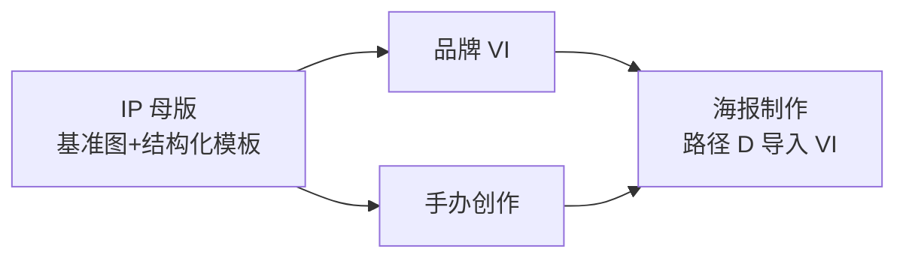

# 电商工具箱 · 品牌创作使用说明

> **读者**：运营、设计师、接单同学。  
> **工程 SSOT**：各模块 `book-mall/doc/ecom/*-requirements.md`；对话/Prompt 真源见下文「文档角色」表。  
> **本地入口**：电商工具箱默认 **http://localhost:3007**（`pnpm dev:all` 含 `:3007`）。

---

## 1. 能力地图

| 能力 | 侧栏位置 | 路由 | 产出入库 |
|------|----------|------|----------|
| **手办创作**（线稿 → 盲盒全案） | 电商 · 手办创作 | `/ecom/hand-craft` | 我的资产 · 手办 |
| **品牌 VI · 表情包** | 营销 · 品牌 VI | `/brand/vi` | 我的资产 · 品牌 VI |
| **IP 母版** | 营销 · IP 创作 | `/brand/ip` | **我的资产 · 母版库**（`/library?tab=ip-master-library`） |
| **海报制作** | 营销 · 海报制作 | `/brand/poster` | 海报项目 + 资产 |

**共用前提**

1. 使用 Book 账号 **SSO 登录** 工具箱；未登录会跳转主站登录或 silent re-enter。  
2. **AI 生图/生视频** 须已关联 **Gateway API Key**（`sk-gw`）；模型在页面内通过 **「选择 AI 模型」** 卡片弹层选取（与分镜工作台同一套选择器）。  
3. 工具 **月费/积分** 按 `toolKey` 扣点；厂商成本走 Gateway BYOK 或平台代付池（见 Gateway 控制台）。

**推荐工作流（减少「不像同一个 IP」）**

1. 有稳定角色时：先在 **IP 母版** 定基准图 + 刚性锚点/柔性项 → **保存进母版库**。  
2. **手办** 或 **品牌 VI** 参考区点 **「从母版库导入」**（带出基准图，生图 Prompt 自动追加母版约束）。  
3. 营销出图：在 **海报制作** 用傻瓜 **路径 D** 或专业模式导入品牌/VI 参考。

---

## 2. 文档角色（设计稿 vs 产品）

| 文档 | 用途 | 与产品的关系 |
|------|------|----------------|
| [`docs/手办.md`](./手办.md) | 10 步 **对话话术 + Prompt 兜底串** | 步骤语义与代码 **一致**；产品里是 **Studio 界面**，不是复制话术到外部 Chat |
| [`docs/品牌VI与表情包.md`](./品牌VI与表情包.md) | VI **Skill 全文 + 大量示例 Prompt** | 产品为 **8 步 + 5 种产出模式**；无「12 页 PDF / 招商页」独立步（手办才有第 10 步招商拼版） |
| [`docs/IP母版PRD.md`](./IP母版PRD.md) | 母版 **概念与 JSON 结构** | 已上线 Studio；**FR-6 冲突三选一弹窗** 尚未做（载入时 toast 提醒） |
| [`docs/AI 海报.md`](./AI%20海报.md) | 海报 PRD + POST 任务表 | 与 `/brand/poster` 行为对齐；见该文档 §10 界面说明 |

**代码里的「唯一事实源」**

- 手办 10 步：`book-mall/lib/ecom/ecom-hand-craft-steps.ts`  
- 品牌 VI 8 步：`book-mall/lib/ecom/ecom-brand-vi-steps.ts`  
- IP 母版 4 逻辑步：`book-mall/doc/ecom/ip-master-requirements.md`

---

## 3. IP 母版（`/brand/ip`）

### 3.1 做什么

把 **一张基准图** 和/或 **文字描述** 变成可复用的 **结构化模板**（刚性锚点、柔性可变项、特例放行、可选人设摘要），并 **保存进母版库**，供手办 / VI / 海报导入。

### 3.2 界面结构

- **左侧进度轨**（4 步，**无逐步解锁**，任意步可点）：输入 → 解析 → 校对 → 版本  
- **中栏**：上传基准图、Brief、Markdown 模板编辑、版本列表  
- **右侧**：助手（流式解析、引导；不阻塞跳步）

### 3.3 推荐操作顺序

1. **上传基准图**（线稿/立绘/已有产物）和/或填写 **Brief**。  
2. 在 **解析** 步通过助手或按钮触发 **图生/文生结构化**（LLM）。  
3. 在 **校对** 步直接改 Markdown，确认刚性/柔性划分。  
4. （可选）生成 **基准图** 定稿后，点 **「保存进母版库」** — 须 **同时有基准图 + 结构化模板**。  
5. 打开 **我的资产 → 母版库**，或在中栏 **「前往母版库」**。

### 3.4 版本规则

- 每次 **保存版本** 版本号 **+0.1**（如 V1.0 → V1.1）。  
- 项目内可选 **当前生效版本**；下游导入时可指定版本。

### 3.5 与 PRD 的差异（已知）

| PRD | 现网 |
|-----|------|
| 手办/VI 内嵌「基于当前图生成模板」按钮 | 以 **独立 IP 母版 Studio + 母版库导入** 为主 |
| 参考图与模板冲突 **三选一**（FR-6） | **未实现**；导入后若再改参考图，请自行核对是否一致 |
| 「工作流草稿 ip-master」 | 有；**正式交付条目在母版库 tab** |

---

## 4. 手办创作（`/ecom/hand-craft`）

### 4.1 做什么

从 **1～3 张线稿/参考图** 出发，按 **10 步** 生成潮玩盲盒向 **商用 IP 全案**（与 [`docs/手办.md`](./手办.md) 逐步对应）。

### 4.2 界面结构

- **进度轨**：10 步，**有依赖** — 拼版步需前序成图齐备  
- **中栏**：线稿上传、当前步 **槽位网格**、大图预览、**编辑 Prompt**、拼版预览  
- **右侧**：助手 **Choice 卡片**（选步、选风格；历史只读）

### 4.3 十步一览

| 步 | 名称 | 类型 | 要点 |
|----|------|------|------|
| 1 | 核心主形象 | 生图 1 槽 | 定稿后 **锁定 hero**，后续参考图第一张恒为基准 |
| 2 | 基础规范三件套 | 生图 12 槽 | 三视图 + 4 表情 + 5 动作 |
| 3 | 6 款盲盒角色卡 | 生图 7 槽 | 6 主题卡 + 合集预览 |
| 4 | 周边样机 | 生图 8 槽 | 钥匙扣～笔记本 |
| 5 | 色卡 + 细节拆解 | 生图 2 槽 | 品牌规范页素材 |
| 6 | 盲盒包装 | 生图 4 槽 | 正/背/内卡/腰封 |
| 7 | 九宫格表情包 | 生图 9 槽 | 社交商用 |
| 8 | 小红书长图 | **拼版** | 汇总前序成图 |
| 9 | 12 页作品集 | **拼版** | 固定页序（见代码 `PORTFOLIO_PAGES`） |
| 10 | 招商授权页 | **拼版** | 授权赛道文案 + 多场景图 |

### 4.4 风格与一致性

- 创建项目后可在助手选 **视觉风格预设**（潮玩 3D / Q 版 / 扁平 / 国潮 / 赛博 / 自定义）。  
- **更换风格** 会 **重置 hero 锁** 与后续产出，需从第 1 步重新定稿。  
- 服务端每条槽位 Prompt 拼接：**线稿锁定串 + 当前风格片段 + 槽位指令**（不再写死示例角色配饰）。

### 4.5 从 IP 母版导入

1. 中栏参考区 **「从母版库导入」**。  
2. 选择母版库条目与版本 → 基准图写入参考区，`settings.ipMasterProjectId` / 版本写入项目。  
3. 生图时服务端追加 **`buildIpMasterConstraintBlock`**（刚性锚点等）。

### 4.6 导出与资产

- 步内/项目 **保存到资产库**（module `hand-craft`）。  
- **ZIP 导出** 含交付清单（项目菜单/导出入口）。

### 4.7 与 [`docs/手办.md`](./手办.md) 的差异

| 文档（对话 SOP） | 产品 |
|------------------|------|
| 用户在外部 Chat **逐句复制话术** | 助手内置 **相同语义** 的 script；用户点卡片确认、点槽位生成 |
| 兜底 Prompt 含具体角色（卷发、星星发饰等） | 产品用 **动态风格 + 你的线稿/母版**；示例配饰仅出现在旧文档示例中 |
| 名称「手伴」 | 界面统一 **「手办创作」** |

---

## 5. 品牌 VI · 表情包（`/brand/vi`）

### 5.1 做什么

从 **参考图（1～3）和/或文字 Brief** 生成 **2D 品牌化 IP 物料**（偏平面/VI/表情包，**不是** 手办 3D 盲盒全案）。

### 5.2 产出模式（创建时单选）

| 模式 | 进度轨可见步骤 |
|------|----------------|
| **基础 IP** | 基准 → 三视图 → 九宫格 |
| **表情包专项** | 基准 → 九宫格 |
| **VI 专项** | 基准 → Logo → VI 规范页（拼版） |
| **文创专项** | 基准 → 周边 → 场景海报 |
| **完整全案** | 全部 8 步 |

隐藏步 **不可生成**；切换模式会过滤进度轨。

### 5.3 八步一览

| 步 | 名称 | 类型 |
|----|------|------|
| 1 | 基准 IP 形象 | 生图 |
| 2 | 三视图 | 生图 3 槽 |
| 3 | 九宫格表情包 | 生图 9 槽 |
| 4 | Logo | 生图 2 槽 |
| 5 | 周边样机 | 生图 8 槽 |
| 6 | 场景海报 | 生图 4 槽 |
| 7 | VI 规范页 | **拼版**（依赖 hero、logo、turnaround） |
| 8 | 作品集长图 | **拼版**（依赖 hero、emoji、merch；**不要求** 第 7 步完成） |

### 5.4 操作要点

- **无参考图** 仅凭 Brief 也可生成并确认基准形象。  
- 第 1 步定稿 → **`heroLockedUrl`**，后续生图参考图第一张恒为基准。  
- 助手可 **「进入下一步」**：只要 **下一步硬依赖** 的槽位已出图即可（不必当前步全部完成）。  
- 第 7 步拼版上传后，中栏应 **立即显示** 合成结果（项目快照 merge）。  
- **编辑 Prompt**：槽位与预览统一入口；弹层使用 **nativeOverlay**，避免与其它 Dialog 嵌套崩溃。  
- **从 IP 母版导入**：与手办相同入口与约束注入。

### 5.5 与 [`docs/品牌VI与表情包.md`](./品牌VI与表情包.md) 的差异

| 长文档 Skill | 产品 |
|--------------|------|
| 模块很多、含大量 **重复示例 Prompt** | 8 步槽位 + 服务端 **`buildBrandViSlotPrompt`** 拼装 |
| 可选「招商授权页」等 | **无** 独立招商步（手办第 10 步才有） |
| 12 页 PDF 作品集 | **1 张竖版作品集拼版**（第 8 步），非 12 页 PDF |
| 透明底 PNG、动态表情包、字体规范模块 | **非目标 / 后续迭代**（见 requirements §9） |

---

## 6. 海报制作（`/brand/poster`）

详细 PRD 见 [`docs/AI 海报.md`](./AI%20海报.md)。此处只列 **日常使用要点**。

### 6.1 模式

- **傻瓜出图**（默认 Tab）：路径 **A / B / C / D**（最少输入不同，系统自动策划 + 无字底图 + 默认排版）。  
- **专业模式**：文生 / 图生 / **模板 catalog**；完整参数 + 模型选择器。

### 6.2 图字分离（推荐）

- 默认 **字后加**：先出 **无字摄影底图**，再在 **「排版与出图」** 弹层调文案位置，**合成并保存**。  
- 改字再合成 **不重新走 Gateway 生图**（除非用户主动重出底图）。

### 6.3 界面（2026-10 现网）

- **左栏操作、右栏预览**（宽屏下右侧 **sticky**）；整页 **左对齐**，非居中窄栏。  
- 分块卡片：`PosterStepSection`（策划 / 素材 / 生成 / 排版等）。  
- **生成进度**（「海报生成中…」）显示在 **右侧「生成预览 · 排版与成图」** 区域。

### 6.4 项目与刷新

- 当前项目 id 写入 **localStorage**（`ecom-poster-active-project`）+ 最近项目 id。  
- 刷新页面：**上次项目 → 否则列表第一项 → 否则新建**。  
- 傻瓜路径、一句话 Brief 等会 **防抖写回** 项目。

### 6.5 品牌素材

- 参考位：模特 / 服装 / 场景 / 风格 / **品牌·VI**；支持 **资产库、上传、粘贴**。  
- 开关 **「本次使用品牌参考」** 关闭时不参与生成。  
- **无** 账号级「我的品牌库」表；品牌仅在 **单次创作** 中组合。

### 6.6 上游导入

- 从 **我的资产** 选 **品牌 VI / IP 母版 / 手办** 等分组（Picker 已做 module 分组）。  
- 傻瓜 **路径 D**：节日 + 至少一项 VI/品牌资产 → 偏创意/品牌向海报。

---

## 7. 我的资产 · 母版库

- 入口：**我的资产** → Tab **「母版库」**（URL：`/library?tab=ip-master-library`）。  
- 条目内容：**基准图 URL + 结构化模板（Markdown/JSON）+ 版本元数据**。  
- **手办 / 品牌 VI** 的「从母版库导入」列表与此 tab **同源**。  
- 与「工作流草稿」不同：母版库用于 **跨项目复用** 的角色约束包。

---

## 8. 常见问题

| 现象 | 排查 |
|------|------|
| 生图报 `url error` / 模型不对 | 确认 Gateway 登记的 **IMAGE** 模型；Seedream 类走火山分支（海报/电商生图已修路由） |
| 前后步骤 **脸不像** | 确认第 1 步 **hero 已锁定**；勿在未换风格时删掉 hero 参考；可先用 **IP 母版** 再导入 |
| VI 第 8 步灰了 | 检查 **hero、emoji、merch** 是否已有成图（**不需要** 先做第 7 步） |
| 拼版步空白 | 前序依赖步是否出图；VI 拼版后若未刷新，看是否已 fix 快照 merge |
| 刷新后海报空白 | 应自动恢复项目；若仍空，看是否登录用户变化或 localStorage 被清理 |
| 401 / 闪退登录 | SSO token 过期 → 重新从 Book 进入工具箱 |
| 数据库连不上 | 查 `DATABASE_URL` 连接池、`pnpm --dir book-mall db:ping`、安全组白名单（**不要** 用 VPN 作为方案） |

---

## 9. 变更记录

| 日期 | 说明 |
|------|------|
| 2026-10-03 | 首版：手办/VI/IP 母版/海报与 PRD 对照 + 操作说明 |
