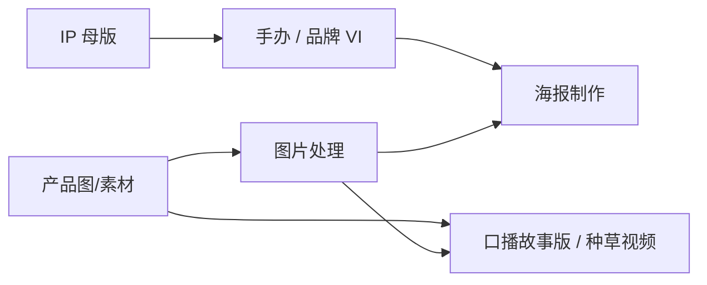

# 电商工具箱 · 营销与品牌创作 · 用户使用说明

> **读者**：运营、设计师、接单同学（**非**研发 PRD）。  
> **工程 SSOT**：各模块 `book-mall/doc/ecom/*-requirements.md`；对话/Prompt 真源见下文「文档角色」表。  
> **本地入口**：电商工具箱默认 **http://localhost:3007**（`pnpm dev:all` 含 `:3007`）。

---

## 1. 能力地图

| 能力 | 侧栏位置 | 路由 | 产出入库 |
|------|----------|------|----------|
| **电商口播故事版** | 营销 | `/ecom/storyboard/micro-drama` | 故事版项目 + 分镜表/成片 + 工作流草稿 |
| **图片处理** | 营销 | `/ecom/image-layer` | 图片处理项目 + 我的资产 |
| **图片生种草视频** | 营销 | `/ecom/seed-video` | 种草项目 + 视频资产 |
| **海报制作** | 营销 · 海报制作 | `/brand/poster` | 海报项目 + 资产 |
| **IP 母版** | 营销 · IP 创作 | `/brand/ip` | **我的资产 · 母版库**（`/library?tab=ip-master-library`） |
| **手办创作**（线稿 → 盲盒全案） | 营销 · IP 创作 | `/ecom/hand-craft` | 我的资产 · 手办 |
| **品牌 VI · 表情包** | 营销 · IP 创作 | `/brand/vi` | 我的资产 · 品牌 VI |

**共用前提**

1. 使用 Book 账号 **SSO 登录** 工具箱；未登录会跳转主站登录或 silent re-enter。  
2. **AI 生图/生视频** 须已关联 **Gateway API Key**（`sk-gw`）；模型在页面内通过 **「选择 AI 模型」** 卡片弹层选取（与分镜工作台同一套选择器）。  
3. 工具 **月费/积分** 按 `toolKey` 扣点；厂商成本走 Gateway BYOK 或平台代付池（见 Gateway 控制台）。

**推荐工作流（减少「不像同一个 IP」）**

1. 有稳定角色时：先在 **IP 母版** 定基准图 + 刚性锚点/柔性项 → **保存进母版库**。  
2. **手办** 或 **品牌 VI** 参考区点 **「从母版库导入」**（带出基准图，生图 Prompt 自动追加母版约束）。  
3. **海报** 用路径 D 或专业模式导入 VI/母版；**口播故事版 / 种草视频** 上传产品/场景参考图策划脚本与成片。  
4. **图片处理** 可抠图、换底、局部重绘后再进海报或视频链路。

---

## 2. 文档角色（设计稿 vs 产品）

| 文档 | 用途 | 与产品的关系 |
|------|------|----------------|
| [`docs/手办.md`](./手办.md) | 10 步 **对话话术 + Prompt 兜底串** | 步骤语义与代码 **一致**；产品里是 **Studio 界面**，不是复制话术到外部 Chat |
| [`docs/品牌VI与表情包.md`](./品牌VI与表情包.md) | VI **Skill 全文 + 大量示例 Prompt** | 产品为 **8 步 + 5 种产出模式**；无「12 页 PDF / 招商页」独立步（手办才有第 10 步招商拼版） |
| [`docs/IP母版PRD.md`](./IP母版PRD.md) | 母版 **概念与 JSON 结构** | 已上线 Studio；**FR-6 冲突三选一弹窗** 尚未做（载入时 toast 提醒） |
| [`docs/AI 海报.md`](./AI%20海报.md) | 海报 PRD + POST 任务表 | 与 `/brand/poster` 行为对齐；**用户操作见本文 §6** |
| [`docs/电商 包包口播故事版 发布版.md`](./电商%20包包口播故事版%20发布版.md) 等 | 品类口播 Skill | 助手话术与七维参数；入口统一为 **电商口播故事版** |
| [`docs/图片编辑功能.md`](./图片编辑功能.md) | 修图/重绘技术说明 | 与 **图片处理** 中 AI 重绘/擦除共用后端 |
| [`docs/种草视频-使用说明.md`](./种草视频-使用说明.md) | **图片生种草视频** 用户操作 | 入口 `/ecom/seed-video`；工程 Skill 见 `book-mall/doc/种草视频/` |

**代码里的「唯一事实源」**

- 手办 10 步：`book-mall/lib/ecom/ecom-hand-craft-steps.ts`  
- 品牌 VI 8 步：`book-mall/lib/ecom/ecom-brand-vi-steps.ts`  
- IP 母版 3 步进度轨：`e-commerce-toolkit/lib/ip-master-workflow.ts`（工程 PRD 仍写 4 逻辑步，见 `book-mall/doc/ecom/ip-master-requirements.md`）

---

## 3. IP 母版（`/brand/ip`）

### 3.1 做什么

把 **基准图** 和/或 **Brief** 变成可复用的 **结构化 IP 模板**（刚性锚点、柔性项、生图提示词等），**保存进母版库** 后供手办 / 品牌 VI 导入；海报等通过资产库参考图间接使用。

### 3.2 界面结构（现网 · 单栏工作区）

- **左侧进度轨**（**3 步**，无解锁，任意步可点）：**输入 → 校对 → 版本**（「解析」合并在输入/校对区按钮完成，无独立第 4 轨）。  
- **主工作区**（无右侧对话助手）：项目列表、保存工作流、跳转 **我的资产 · 母版库**。  
- **输入步**：四种 **输入模式**（见下表）、Brief、上传基准图、选择 **结构化解析模型**（有图时须 **VL 识图模型**）、按钮 **生成结构化模板**；模式 4 可先 **文生起基准图**。  
- **校对步**：结构化字段编辑器、**生图提示词** 正/负向、基准图预览、局部 **重生成**（仅提示词 / 仅模板 / 全部）。  
- **版本步**：历史版本列表、切换 **当前生效版本**。

| 模式 | 输入 | 典型场景 |
|------|------|----------|
| 1 · 仅基准图 | 只上传图 | 已有定稿立绘，AI 识图出模板 |
| 2 · 仅文字 | 只填 Brief | 先要规则文档、暂不出图 |
| 3 · 图文（推荐） | 图 + Brief | 文字约束优先于识图 |
| 4 · 文生起图 | Brief → 审阅提示词 → 生成基准图 | 从零起稿 |

### 3.3 推荐操作顺序

1. 选输入模式，填 Brief / 上传图（模式 4 在审阅页确认提示词后 **生成基准图**）。  
2. 点 **生成结构化模板**，在校对区改字段与生图提示词。  
3. 须 **已有基准图 URL** 后，点 **保存进母版库**（弹层填库内名称）→ 版本 **+0.1**。  
4. **保存工作流** 仅保留项目草稿；**跨项目复用** 以母版库为准。  
5. 项目 id：`localStorage` **`ecom-ip-master-active-project`**。

### 3.4 与 PRD 的差异（已知）

| PRD / 旧说明 | 现网 |
|--------------|------|
| 4 步含独立「解析」+ 右侧助手 | **3 步轨**；解析为按钮；**无** 常驻助手面板 |
| FR-6 冲突三选一 | **未实现** |
| 手办/VI 内嵌生成模板 | **母版库导入** 为主 |

---

## 4. 手办创作（`/ecom/hand-craft`）

### 4.1 做什么

从 **1～3 张线稿/参考图** 出发，按 **10 步** 生成潮玩盲盒向 **商用 IP 全案**（与 [`docs/手办.md`](./手办.md) 逐步对应）。

### 4.2 界面结构

- **进度轨**：10 步，**有依赖** — 拼版步需前序成图齐备  
- **中栏**：线稿上传、当前步 **槽位网格**、大图预览、**编辑 Prompt**、拼版预览  
- **右侧**：助手 **Choice 卡片**（选步、选风格；历史只读）

### 4.3 十步一览

| 步 | 名称 | 类型 | 要点 |
|----|------|------|------|
| 1 | 核心主形象 | 生图 1 槽 | 定稿后 **锁定 hero**，后续参考图第一张恒为基准 |
| 2 | 基础规范三件套 | 生图 12 槽 | 三视图 + 4 表情 + 5 动作 |
| 3 | 6 款盲盒角色卡 | 生图 7 槽 | 6 主题卡 + 合集预览 |
| 4 | 周边样机 | 生图 8 槽 | 钥匙扣～笔记本 |
| 5 | 色卡 + 细节拆解 | 生图 2 槽 | 品牌规范页素材 |
| 6 | 盲盒包装 | 生图 4 槽 | 正/背/内卡/腰封 |
| 7 | 九宫格表情包 | 生图 9 槽 | 社交商用 |
| 8 | 小红书长图 | **拼版** | 汇总前序成图 |
| 9 | 12 页作品集 | **拼版** | 固定页序（见代码 `PORTFOLIO_PAGES`） |
| 10 | 招商授权页 | **拼版** | 授权赛道文案 + 多场景图 |

### 4.4 风格与一致性

- 创建项目后可在助手选 **视觉风格预设**（潮玩 3D / Q 版 / 扁平 / 国潮 / 赛博 / 自定义）。  
- **更换风格** 会 **重置 hero 锁** 与后续产出，需从第 1 步重新定稿。  
- 服务端每条槽位 Prompt 拼接：**线稿锁定串 + 当前风格片段 + 槽位指令**（不再写死示例角色配饰）。

### 4.5 从 IP 母版导入

1. 中栏参考区 **「从母版库导入」**。  
2. 选择母版库条目与版本 → 基准图写入参考区，`settings.ipMasterProjectId` / 版本写入项目。  
3. 生图时服务端追加 **`buildIpMasterConstraintBlock`**（刚性锚点等）。

### 4.6 导出与资产

- 步内/项目 **保存到资产库**（module `hand-craft`）。  
- **ZIP 导出** 含交付清单（项目菜单/导出入口）。

### 4.7 与 [`docs/手办.md`](./手办.md) 的差异

| 文档（对话 SOP） | 产品 |
|------------------|------|
| 用户在外部 Chat **逐句复制话术** | 助手内置 **相同语义** 的 script；用户点卡片确认、点槽位生成 |
| 兜底 Prompt 含具体角色（卷发、星星发饰等） | 产品用 **动态风格 + 你的线稿/母版**；示例配饰仅出现在旧文档示例中 |
| 名称「手伴」 | 界面统一 **「手办创作」** |

---

## 5. 品牌 VI · 表情包（`/brand/vi`）

### 5.1 做什么

从 **参考图（1～3）和/或文字 Brief** 生成 **2D 品牌化 IP 物料**（偏平面/VI/表情包，**不是** 手办 3D 盲盒全案）。

### 5.2 产出模式（创建时单选）

| 模式 | 进度轨可见步骤 |
|------|----------------|
| **基础 IP** | 基准 → 三视图 → 九宫格 |
| **表情包专项** | 基准 → 九宫格 |
| **VI 专项** | 基准 → Logo → VI 规范页（拼版） |
| **文创专项** | 基准 → 周边 → 场景海报 |
| **完整全案** | 全部 8 步 |

隐藏步 **不可生成**；切换模式会过滤进度轨。

### 5.3 八步一览

| 步 | 名称 | 类型 |
|----|------|------|
| 1 | 基准 IP 形象 | 生图 |
| 2 | 三视图 | 生图 3 槽 |
| 3 | 九宫格表情包 | 生图 9 槽 |
| 4 | Logo | 生图 2 槽 |
| 5 | 周边样机 | 生图 8 槽 |
| 6 | 场景海报 | 生图 4 槽 |
| 7 | VI 规范页 | **拼版**（依赖 hero、logo、turnaround） |
| 8 | 作品集长图 | **拼版**（依赖 hero、emoji、merch；**不要求** 第 7 步完成） |

### 5.4 操作要点

- **无参考图** 仅凭 Brief 也可生成并确认基准形象。  
- 第 1 步定稿 → **`heroLockedUrl`**，后续生图参考图第一张恒为基准。  
- 助手可 **「进入下一步」**：只要 **下一步硬依赖** 的槽位已出图即可（不必当前步全部完成）。  
- 第 7 步拼版上传后，中栏应 **立即显示** 合成结果（项目快照 merge）。  
- **编辑 Prompt**：槽位与预览统一入口；弹层使用 **nativeOverlay**，避免与其它 Dialog 嵌套崩溃。  
- **从 IP 母版导入**：与手办相同入口与约束注入。

### 5.5 与 [`docs/品牌VI与表情包.md`](./品牌VI与表情包.md) 的差异

| 长文档 Skill | 产品 |
|--------------|------|
| 模块很多、含大量 **重复示例 Prompt** | 8 步槽位 + 服务端 **`buildBrandViSlotPrompt`** 拼装 |
| 可选「招商授权页」等 | **无** 独立招商步（手办第 10 步才有） |
| 12 页 PDF 作品集 | **1 张竖版作品集拼版**（第 8 步），非 12 页 PDF |
| 透明底 PNG、动态表情包、字体规范模块 | **非目标 / 后续迭代**（见 requirements §9） |

---

## 6. 海报制作（`/brand/poster`）

详细 PRD 见 [`docs/AI 海报.md`](./AI%20海报.md)。此处只列 **日常使用要点**。

### 6.1 模式

- **傻瓜出图**（默认 Tab，默认路径 **C**）：  
  - **A** 模特+服装+场景 + 节日 → 一键策划出图  
  - **B** 仅服装 → 系统补模特/场景  
  - **C** 一句话活动需求（可不传参考图）  
  - **D** 节日 + 品牌/VI 参考（需勾选 **使用品牌参考**）  
- **专业创作**：**文生营销海报** / **图生海报** / **模板重构**（电商模板 catalog）；**生图模型** 走 `StoryboardModelPickerDialog`。

### 6.2 图字分离（推荐）

- 默认 **无字底图 + 程序排版**；可选勾选 **字图一起生成**（`burnCopyInImage`，不推荐活动主 KV）。  
- 流程：左侧 **一键策划并出图**（傻瓜）或 **专业模式出图** → 右侧看候选底图 → **排版与出图** 全屏弹层 → **生成预览** → **保存并关闭**。  
- **多块文案**、对齐、字号/颜色、**字体预设**；字效：**投影 / 外发光 / 描边 / 字底衬底**。  
- 改字/改样式后须 **重新生成预览** 再保存；**不触发** 新底图 Gateway 任务（除非改无字提示词或重出底图）。  
- **批量出图（高级）**：展开「批量出图」，每行一条文案，批量出 **无字底图**（仍须逐张排版合成）。

### 6.3 界面（2026-10 现网）

- **主页面**：左栏步骤 1～4（+ 有参考槽时多一步素材），右栏 **生成预览 · 排版与成图**（sticky，含生成中扫光）。  
- 步骤 2：**节日/活动**、**使用品牌参考**、**字图一起生成**、风格、尺寸（1:1 / 3:4 / 9:16 等）。  
- **排版弹层**：左 **画布**（编辑/合成预览同尺寸）；顶栏 **编辑排版 | 合成预览**；右 **文案 / 样式 / 无字底图提示词**；底 **仅保存草稿 | 生成预览 | 保存并关闭**。

### 6.4 项目与刷新

- 当前项目 id 写入 **localStorage**（`ecom-poster-active-project`）+ 最近项目 id。  
- 刷新页面：**上次项目 → 否则列表第一项 → 否则新建**。  
- 傻瓜路径、一句话 Brief 等会 **防抖写回** 项目。

### 6.5 品牌素材

- 参考位：模特 / 服装 / 场景 / 风格 / **品牌·VI**；支持 **资产库、上传、粘贴**。  
- 开关 **「本次使用品牌参考」** 关闭时不参与生成。  
- **无** 账号级「我的品牌库」表；品牌仅在 **单次创作** 中组合。

### 6.6 上游导入

- 从 **我的资产** 选 **品牌 VI / IP 母版 / 手办** 等分组（Picker 已做 module 分组）。  
- 傻瓜 **路径 D**：节日 + 至少一项 VI/品牌资产 → 偏创意/品牌向海报。

---

## 7. 电商口播故事版（`/ecom/storyboard/micro-drama`）

页面标题：**电商口播故事版**。新建项目默认 **电商专业版**（`proMode: true`）。

### 7.1 做什么

**带货口播短视频策划 + 分镜表 + 分镜出图/成片**：上传产品等参考图，在 **右侧助手** 中按卡片选型，产出结构化交付物与可编辑分镜 sheet。

### 7.2 界面结构

| 区域 | 内容 |
|------|------|
| **左侧进度轨** | **产品图 → 策划 → 模特图 → 场景图 → 分镜脚本 → 分镜图 → 成片**（随完成情况高亮，可点跳转） |
| **中栏** | 参考图上传、专业版交付物表格 / 分镜 sheet、单镜预览、批量生图/生视频/合并 |
| **右侧助手** | 新建：**FashionAssistantPanel**（专业版七维 + 卖点 + 口播 + 分镜）；**老项目** 可能仍为旧版助手（只读） |
| **设置** | 对话 / 分镜 **IMAGE** / **VIDEO** 模型（`StoryboardModelPickerDialog`） |

### 7.3 助手内可选品类（电商专业版 · 部分）

在对话中选定 vertical 后，七维参数与六镜文案随品类变化（如 3C 可搜索级联大类/细项）：

服装专业版、包包专业版、3C 数码、鞋靴、珠宝饰品、户外装备、家居服、厨房用品、母婴等（代码：`book-mall/lib/ecom/pro-vertical/registry.ts`）。

### 7.4 推荐操作顺序（专业版）

1. 上传 **产品图**（`product`）；按需 **模特 / 场景** 参考（可跳过模特步）。  
2. 在助手卡片中完成 **品类/七维 → 卖点 → 6 套口播择一 → A–E 分镜版择一 → 确认分镜表**。  
3. （部分流程）**故事剧场** 选题；自建主题见 **剧情故事** `/ecom/story-theater-catalog`。  
4. 中栏 **分镜脚本** 定稿后：**批量分镜图** → **单镜或整片视频** → 必要时 **合并镜级视频**。  
5. **保存工作流** / **分享链接**；项目 id：`localStorage` **`ecom-storyboard-active-project`**。

### 7.5 产出

- `pro-v1` 交付 JSON + Markdown 表格（卖点、口播、分镜行、运营包等）。  
- **分镜 sheet**：每 panel 可单独生图、生视频；支持导出 PNG 板。  
- 旧 **微剧/非 pro** 项目仍打开，但新建一律走 **电商专业版**。

### 7.6 延伸阅读（品类 Skill，入口仍是本页）

| 文档 | 示例品类 |
|------|----------|
| [`docs/电商 包包口播故事版 发布版.md`](./电商%20包包口播故事版%20发布版.md) | 包包 |
| [`docs/电商 3C数码口播故事版 发布版.md`](./电商%203C数码口播故事版%20发布版.md) | 3C 数码 |

---

## 8. 图片生种草视频（`/ecom/seed-video`）

**完整说明见专文**：[`docs/种草视频-使用说明.md`](./种草视频-使用说明.md)。

摘要：侧栏 **图片生种草视频**；新建时选 **Skill**（种草 / 服装爆款 / 3C / 家居服）→ 上传 **1～9 张素材** + Prompt（`@图片N`）→ **开始策划** → **右侧助手** 点选脚本、**方案①直出** 或 **方案②逐镜+TTS+合成**、A/B 风格 → 中间工作区生成与预览。工程 Skill 与 JSON 契约：`book-mall/doc/种草视频/`。

---

## 9. 图片处理（`/ecom/image-layer`）

侧栏：**营销 → 图片处理**（`toolKey: ecom-toolkit__image-layer`）。副标题：**背景与主体 / 擦除 / 重绘 / 拆层**。

> 路由 **`/ecom/image-processing`**（多标签 AI 修图/生成器合集）**未** 出现在侧栏；与 **常用工具** 站部分能力同源 API，但 **营销日常请用本页**。

### 9.1 做什么

**项目制** 图片工作台：上传主图 → 换底 / 擦除 / 局部重绘 / **AI 图层分离** / 框选拆分 → 对比预览 → 导出 PNG 或 **保存到资产库**。  
`workspace` + **生成历史** 可恢复图层栈与参数（刷新不丢）。

### 9.2 顶栏工具（与侧栏助手联动）

| 按钮 | 模式 | 说明 |
|------|------|------|
| **背景与主体** | `bg-replace` | 抠图换背景（独立进度 UI） |
| **擦除** | `erase` | 局部擦除（需选区） |
| **局部重绘** | `retouch` | Qwen 蒙版 / 万相 painting 蒙版 / **万相 2.7 框选**（最多 2 框） |
| **图层编辑** | `layer-view` | 有图层栈时：排序、可见性、导出合成 |
| **框选拆分区域** | `decompose-bbox` | 框选后拆分子图层 |
| **AI 图层分离** | 一键 | 整图自动拆层（非模式切换） |

右侧 **助手** 在重绘/擦除时补充参数说明；模型来自 Gateway **IMAGE** 列表。

### 9.3 操作要点

1. **新建/打开项目**、上传或 **资产库** 带入；粘贴图自动 **`firstOrigin`**。  
2. 重绘/擦除：先 **笔刷/框选** 再提交；万相 2.7 与 Qwen **选区规则不同**（见顶栏提示）。  
3. **历史** 对话框回看步骤；**保存** 弹层写入我的图片库。  
4. `localStorage` **`ecom-image-layer-active-project`**。  
5. 营销 **海报** 请用 **`/brand/poster`**（POST-016 已收敛主入口）。

---

## 10. 我的资产 · 母版库

- 入口：**我的资产** → Tab **「母版库」**（URL：`/library?tab=ip-master-library`）。  
- 条目内容：**基准图 URL + 结构化模板（Markdown/JSON）+ 版本元数据**。  
- **手办 / 品牌 VI** 的「从母版库导入」列表与此 tab **同源**。  
- 与「工作流草稿」不同：母版库用于 **跨项目复用** 的角色约束包。

---

## 11. 常见问题

| 现象 | 排查 |
|------|------|
| 生图报 `url error` / 模型不对 | 确认 Gateway 登记的 **IMAGE** 模型；Seedream 类走火山分支（海报/电商生图已修路由） |
| 海报排版 **预览与编辑不一致** | 先 **生成预览** 再保存；改字/改字底后需重新生成预览；必要时重启 `:3007` 使排版组件更新 |
| 口播故事版 **助手不推进** | 看是否未选卡片选项；是否缺产品参考图；对话模型是否可用 |
| 种草视频 **直出失败** | 看时长是否超过直出上限；换 **逐镜** 或缩短 Prompt 目标秒数 |
| 图片处理 **重绘无选区** | Qwen/万相 painting 需 **笔刷蒙版**；万相 2.7 需 **框选** |
| 前后步骤 **脸不像** | 确认第 1 步 **hero 已锁定**；勿在未换风格时删掉 hero 参考；可先用 **IP 母版** 再导入 |
| VI 第 8 步灰了 | 检查 **hero、emoji、merch** 是否已有成图（**不需要** 先做第 7 步） |
| 拼版步空白 | 前序依赖步是否出图；VI 拼版后若未刷新，看是否已 fix 快照 merge |
| 刷新后项目空白 | 海报/种草/图片处理/故事版均有 **localStorage 最近项目**；若仍空，看登录用户是否变化 |
| 401 / 闪退登录 | SSO token 过期 → 重新从 Book 进入工具箱 |
| 数据库连不上 | 查 `DATABASE_URL` 连接池、`pnpm --dir book-mall db:ping`、安全组白名单（**不要** 用 VPN 作为方案） |

---

## 12. 变更记录

| 日期 | 说明 |
|------|------|
| 2026-10-04 | 新增 [`docs/种草视频-使用说明.md`](./种草视频-使用说明.md)；§8 改为链到专文 |
| 2026-10-03 | **对照代码复核**：IP 母版改为 3 步轨+四种输入模式（无右侧助手）；故事版进度轨七段+九品类专业版；种草四技能/直出 30s 上限；图片处理顶栏按钮与 `/ecom/image-processing` 区分；海报路径 A–D 与批量无字底图 |
| 2026-10-03 | 增补：口播故事版 / 种草视频 / 图片处理；海报全屏排版与字效 |
| 2026-10-03 | 首版：手办/VI/IP 母版/海报与 PRD 对照 + 操作说明 |
