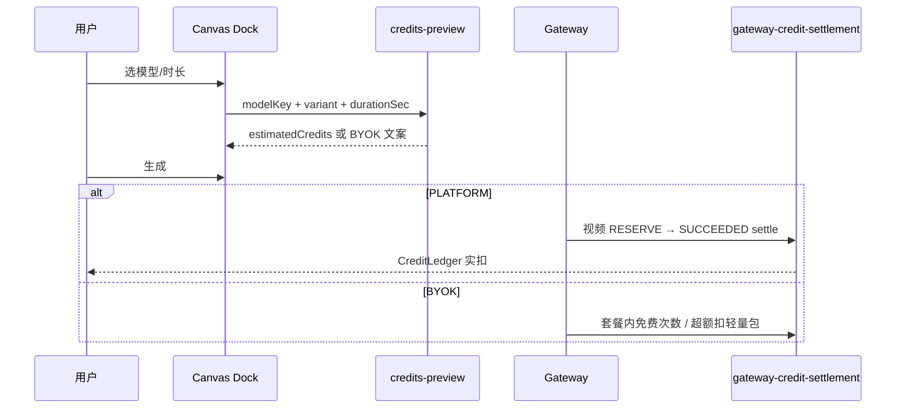

# 积分换算 1.0

> **版本**：1.0 · **生效**：2026-06-15  
> **状态**：已实施（2026-06-15）  
> **替代**：旧 Scheme A 扣点、`ToolBillablePrice`、BYOK 技术服务费月费  
> **关联**：`book-mall/lib/pricing/credit-pricing-formulas.ts`、`book-mall/lib/billing/gateway-credit-settlement.ts`

---

## 0. 产品定位（一句话）

用户只通过 **会员订阅（发积分）** 与 **轻量包充值** 向平台付费；每次 AI 生成按 **模型挂牌价 → 积分** 扣减。自带厂商 Key（BYOK）的用户 **不承担平台推理成本**，超额编排走 **轻量包积分**；**不再收取 BYOK 技术服务费**。

---

## 1. 计费轨道

| 轨道 | 身份 | 平台收什么 | AI 推理谁付 | Dock 展示 |
|------|------|-----------|------------|-----------|
| **平台代付** | `billingPersona = PLATFORM_CREDIT` | 订阅积分 + 轻量包 | 平台（经 Gateway） | ⚡ 预估积分 |
| **自带 Key** | `billingPersona = BYOK` | 订阅准入 + 轻量包（超额编排） | 用户厂商账单 | 「厂商 API 自理」 |

**不变量**

1. 同一 Gateway 请求 **不得** 既扣平台积分又记平台垫付厂商成本。  
2. **未发布 `ModelCreditPrice` 的模型不上架**（Gateway offering / 选模列表不可见）。  
3. 扣费真源只在 Book；子站只预览、不定价。

---

## 2. 定价公式

```
净成本 C   = listCost × (1 - discountRate)     // ModelCostProfile
挂牌价 P   = C × M                              // 分档 M 见 model-margin-policy.ts
积分/单位 U = round(P ÷ anchor)                 // anchor 默认 0.04 元/积分
用户实扣   = round(P × 单位数 ÷ 用户档位 pricePerCreditYuan)
```

**系数 M 分档（2026-06 定价 1.5 方案）**

| 类型 | 条件 | M |
|------|------|---|
| 视频 `PER_SEC` | 净成本 ≥ ¥0.75/秒 | **1.0** |
| 视频 `PER_SEC` | 其它 | **1.5** |
| 生图 `PER_IMAGE` | 净成本 ≥ ¥0.15/张 | **1.5** |
| 生图 `PER_IMAGE` | 其它 | **2.0** |
| LLM `PER_KTOKEN` | 默认 | **2.5** |

**计费单位**

| unit | 单位数 | 说明 |
|------|--------|------|
| `PER_SEC` | `min(实际秒数, 15)` | 视频封顶 15s |
| `PER_IMAGE` | 输出张数，最少 1 | 生图 / 试衣 |
| `PER_KTOKEN` | ceil(tokens/1000) | LLM |

**视频分档 canonical**（sbv1 Seedance 示例）

| 用户选项 | canonicalModelKey |
|----------|-------------------|
| Seedance 2.0 · 720P / 720P 有声 | `seedance-2.0-720p-real` |
| Seedance 2.0 Fast · 720P | `seedance-2.0-fast-720p-real` |
| Seedance 2.0 · 1080P | `seedance-2.0-1080p-real` |
| Seedance 1.5 Pro · 1080P | `seedance-pro-1080p` |

---

## 3. 数据真源

| 表 | 作用 |
|----|------|
| `ModelCostProfile` | 厂商成本档（公开价目 + 折扣） |
| `ModelCreditPrice` | 已发布挂牌价 + creditsPerUnit |
| `PlatformPricingConfig` | anchor、M、毛利护栏 |
| `MembershipPlan` | 订阅套餐、月发积分 |
| `CreditAccount` / `CreditLedger` | 余额与流水 |
| `GatewayRequestLog` | 审计：creditsCharged、costSnapshotYuan、marginSnapshot |
| `AppModelOffering` | 应用上架（须已发布价） |

**退役**

- `ToolBillablePrice`（已 drop）
- `ByokServiceConfig.techServiceFeeYuan`（1.0 删除业务路径）
- 独立 BYOK 技术服务费 Checkout

**保留**

- `ByokTaskQuota` + 轻量包超额扣分（编排/存储，非厂商推理）
- `ResourceMeterRate`（资源计量，如有）

---

## 4. 用户可感知链路



| 时机 | PLATFORM | BYOK |
|------|----------|------|
| 生成前 | Dock ⚡ 积分 | 「厂商 API 自理」 |
| 余额不足 | 402 + 充值引导 | 轻量包不足时 402 |
| 生成后 | 用量中心实扣明细 | 任务次数 + 超额积分 |

---

## 5. 财务后台

### 5.1 页面分工

| 路径 | 职责 |
|------|------|
| `/admin/model-cost` | 维护厂商成本档（公开价目） |
| `/admin/credit-pricing` | 全局 anchor/M/护栏 |
| **`/admin/model-credit-ledger`**（新建） | **积分换算工作台**：左测算 / 右可改 / 改后须重算 / 发布上架 |
| `/admin/pnl-report` | 账期 P&L |
| `/admin/usage-overview` | 调用量聚合 |

### 5.2 积分换算工作台（model-credit-ledger）

**布局**

- **左栏 · 系统测算**：选模型 → 自动读 `ModelCostProfile` → 实时算 C/P/U/毛利/15s 视频积分  
- **右栏 · 运营调整**：可改 M、displayName；**保存前必须点「重新测算」**；毛利低于护栏禁止发布  
- **底栏 · 模型清单**：全部成本档；状态「已发布 / 未发布 / 护栏未过」；一键发布 / 下架  

**发布规则**

1. 存在 active `ModelCostProfile`  
2. `marginPassesGuard` 通过  
3. 写入 `ModelCreditPrice` + 同步 `AppModelOffering.publishedCreditsPerUnit`  
4. 未发布模型 **不出现在** Gateway PLATFORM 选模

### 5.3 毛利再测算

```
理论毛利 g = 1 - C / (U × pricePerCreditYuan)
实际毛利   = (Σ 用户实付元 - Σ costSnapshotYuan) / Σ 用户实付元   // 来自 GatewayRequestLog + CreditLedger
```

运营每月：工作台调参 → P&L 看整体 → usage-overview 按模型下钻。

---

## 6. BYOK 1.0 简化

| 删除 | 保留 |
|------|------|
| BYOK 技术服务费 Checkout | 会员订阅（准入） |
| `ByokServiceConfig` 定价 UI | Gateway 绑 Key |
| `settleByokMonthly` 技术服务费 | `ByokTaskQuota` 含次额度 |
| 报价页 BYOK 月费档位 | 超额 → 轻量包积分 |

**BYOK 准入（新）**：有效 **会员订阅** + 已关联 **Gateway Key**（不再要求独立 `ByokSubscription` 月费）。

---

## 7. 实施任务拆分

### P0 · 文档与口径 ✅

- [x] 本文档 `docs/积分换算 1.0.md`

### P1 · 数据与预览 ✅

- [x] `sbv1VideoCanonicalKey()` variant → 分档 canonical  
- [x] `credits-preview` 支持 `variantId` / persona 分支  
- [x] Canvas Dock 显示积分或 BYOK 文案  
- [x] `pnpm seed:sbv1-video-credits` 脚本（成本档 + 自动发布）

### P2 · 财务后台 ✅

### P3 · 上架门禁 ✅

- [x] CI `gateway:audit-gaps` 含 sbv1 分档 ModelCreditPrice 检查

### P4 · BYOK 技术服务费移除 ✅

- [x] 清理 `ByokServiceConfig` 业务路径（表保留；seed 置 inactive）  
- [x] `settleByokMonthly` 技术服务费恒为 0

### P5 · Canvas UX ✅

- [x] 生成成功积分 toast（`CanvasCreditsToastHost`）

### P6 · 文档同步 ✅

- [x] 更新 `docs/全站架构图与配置表.md` §7 变更记录  
- [x] 标注 `13-tool-service-fee` 技术服务费段落为 **已退役**

---

## 8. 验收标准

- [ ] Seedance 2.0 · 真人 · 15s，PLATFORM 用户 Dock 显示固定预估积分；生成后 ledger 与预览一致（失败全退）（需本地联调确认）  
- [x] BYOK 用户 Dock 显示「厂商 API 自理」，无 ⚡ 积分  
- [x] 未发布价模型在 Gateway PLATFORM 选模中不可见（`listModelsForApp` 门禁）  
- [x] 财务 `/admin/model-credit-ledger` 可测算、改 M、发布、下架  
- [x] 无 BYOK 技术服务费 Checkout / 扣费路径（`techServiceFeeYuan` 恒 0）  
- [x] `pnpm gateway:audit-gaps` sbv1 分档 ModelCreditPrice 0 缺失

---

## 9. 修订记录

| 日期 | 说明 |
|------|------|
| 2026-06-15 | 1.0 首版：统一订阅+轻量包；删除 BYOK 技术服务费；分档 canonical；model-credit-ledger 工作台 |
