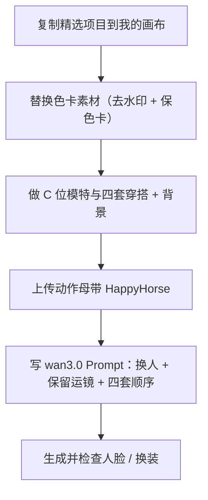
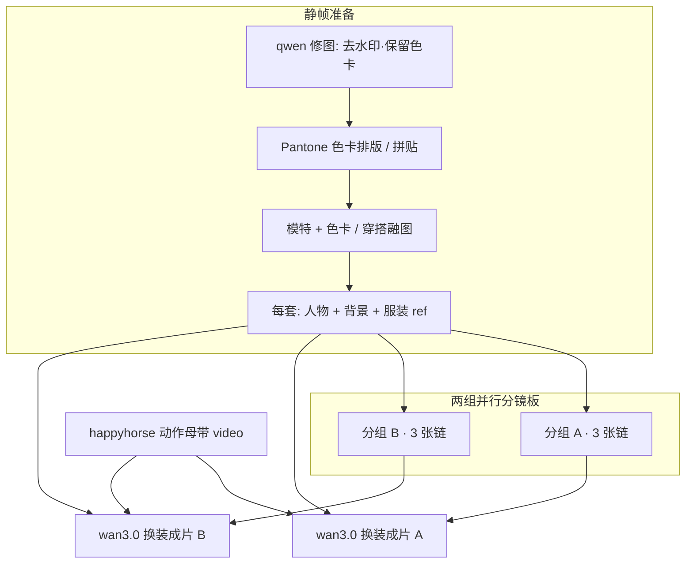

# 画布使用案例 · 色卡换装（动作迁移 + 四套造型）

> **案例来源**：真实画布项目  
> **项目 ID**：`cmu26dswd04e1wn01xx39hxzw`  
> **项目名称**：换装视频（色卡换装 / Pantone 灵感板 → 成片）  
> **文档日期**：2026-10-04  
> **读者**：服装电商、造型师、需要 **「色卡 + 穿搭静帧 → 沿用舞蹈/展示动作生成 9:16 换装视频」** 的创作者  

本文依据 **`CanvasProject` 连线、节点 Prompt 与 `CanvasGenerationTask`** 还原数据流；不涉及计费。

---

## 流程总览

---

## 1. 案例在解决什么问题

这是一套 **「色卡灵感板 + 多套穿搭静帧 + 动作视频换人/换衣」** 工作流：

1. **准备色卡与穿搭图**：用 **修图 / 融图 / 试穿类 IMAGE 模型** 做出 Pantone 风格色卡、模特拼贴、以及「模特 + 背景 + 每套衣服」的 **分镜静帧**。
2. **锁定一条动作母带**：用 **HappyHorse 1.1（t2v）** 节点提供 **@motion 参考视频**（人物刚入场黑白等效果写在 Prompt 里保留）。
3. **生成换装成片**：**wan3.0-video** 节点按 Prompt **替换母带中的人物** 为你的参考模特，并在一镜内按顺序换 **四套服装 + 对应背景**（9:16，一镜到底）。

画布上还有 **2 个打组区域**（各 3 张图），与组外主链 **并行**，用于 **两套成片方案**（两个 wan3.0-video 节点）。

项目为 **门户「精选」**（`portalFeatured`），可在首页精选区复制学习。

**打开**：`/canvas/cmu26dswd04e1wn01xx39hxzw`（需登录与权限）。

---

## 2. 结构一览

| 指标 | 本项目 |
|------|--------|
| 版本 | Pro2 画布 + **sbv1 视频合成** |
| 节点 | **26**（1 文本起点 + **20** 图 + **3** 视频 + **2** 组） |
| 连线 | **40** |
| 生成任务 | **20** 次 IMAGE 类任务，**全部成功** |
| 常用模型 | **nano-banana-pro**、**gpt-image-2**、**qwen-image-edit / edit-max**、**wan2.7-image-pro**、**wan3.0-video**、**happyhorse-1.1-t2v** |

---

## 3. 静帧层：色卡与穿搭数据怎么流

### 3.1 色卡清洗（修图链）

- **根节点** → **qwen-image-edit** → **qwen-image-edit-max**（单链，无分组）。
- 任务 Prompt 要点：**去除「豆包AI生成」水印**、**保留原图尺寸与细节**、**色卡要完整**。
- **用途**：上游色卡素材干净后，再参与融图/排版，避免水印进成片。

### 3.2 Pantone 色卡与灵感拼贴（nano-banana-pro）

任务与节点 Prompt 显示典型两步：

1. **生成色板构图**：例如「3 张锯齿波浪裁边潘通 TCX 色卡、竖版白底、底部扇形小色卡」；并 **从参考服装提取配色**（任务文案中有「自动提取【参考服装鞋…」）。
2. **模特 + 色卡拼贴**：  
   - 输入：**已穿好目标服装的模特图** + **色卡素材图**。  
   - 要求：**不改模特脸与服装**、**不重新生成色卡内容**，只做 **平面拼贴**（灵感板/造型板效果）。  
   - 代表节点引用：**`n_Bx3DACPa`**（后续作 **C 位主角** 视频 ref）。

### 3.3 穿搭试穿（gpt-image-2 / wan2.7-image-pro）

- 多处以 **「模特图1 穿上图2 的套装/上装裙子 + 袜子鞋」** 类 Prompt 出现（双参考图入模）。
- **nano-banana-pro** 与 **gpt-image-2** 交替出现在 **图 → 图** 链上，用于 **同一构图下换模型出图或细化**。

### 3.4 两个「分镜板」分组

- 组 **「未命名分组 13:32」** 与 **「未命名分组 13:34」**（`frame-board`），各 **3** 张 `story-pro2-image`。
- 数据流模式（两组对称）：  
  **组外 nano 根节点** → 组内 **nano-banana-pro** / **gpt-image-2** → 组内再 **nano** 迭代。  
- 多个 **组内成图** 直接连到 **wan3.0-video**，作为 **分镜 ref 或背景 ref**。

### 3.5 多个根节点（并行素材入口）

约 **7** 张 **无上游** 的图片节点（多为 **nano-banana-pro**），分别向 **两个分组** 和 **组外主链** 扇出，对应 **多套色卡/多套穿搭方案** 同时准备，而不是严格单线串行。

---

## 4. 视频层：动作母带 + 两套 wan3.0 换装

### 4.1 动作母带 · HappyHorse

- 节点 **`n_78sNtwpV`**：`sbv1-video-engine`，模型 **happyhorse-1.1-t2v**。
- **无上游静帧边**（动作来自该节点自身配置/参考视频，Prompt 在数据里为空字符串，以画布 UI 内上传为准）。
- **出边** 连到 **两个 wan3.0-video** 节点 → 在 Prompt 里写作 **`@<sbv1-motion-n_78sNtwpV>`**。

### 4.2 成片 A · 四套造型 + 四套背景（`n_zrVciIfn`）

**核心 Prompt 逻辑（摘要）：**

- 将 **动作母带** 中的主体，替换为 **`@<sbv1-ref-n_BZnjogFU>`** 的人物。
- **严格保留** 原视频的背景、运镜、节奏、光线、色调、音频；**人物刚入场黑白** 保持不变。
- **服装出场顺序**（一镜内四套）：  
  | 顺序 | 服装 ref | 背景 ref |
  |------|----------|----------|
  | 第一套 | `n_BZnjogFU` | `n_yTnYC29W` |
  | 第二套 | `n_4XCuCXtq` | `n_dmj-haA-` |
  | 第三套 | `n_9AkMWfu2` | `n_wcEZn8AT` |
  | 第四套 | `n_30SQmHGy` | `n_RLfRqoVU` |
- **要求**：脸、发型、体型、服装与对应参考一致；**每套背景** 严格跟对应背景 ref；透视贴合；**一镜到底 9:16**。

### 4.3 成片 B · C 位主角 + 四套服装（`n_tayYDvTX`）

- 人物主 ref：**`n_Bx3DACPa`**（色卡拼贴后的 C 位模特）。
- 同样 **@motion** 母带 + 保留运镜/音频/入场黑白。
- **服装出场顺序**：第一、二套 **`n_AAadmeu4`**，第三套 **`n_01rfTkUM`**，第四套 **`n_mOoMKARf`**（本项目中第二套与第一套共用同一 ref 节点，复制案例时可改成四套各不同）。

---

## 5. 文本起点节点

- 存在 **`story-pro2-starter`**（`purpose: general`），**无正文**，**未参与** 剧本定稿链。
- 本案例 **不依赖** script-hub；业务 Prompt 都在 **图片 / 视频节点** 上。

---

## 6. 推荐复现步骤（色卡换装模板）

1. **复制精选项目**  
   首页 **精选** → 本项目 → **复制到我的画布**；或索取 **工作流 10 位分享码**。

2. **替换色卡素材**  
   - 走 **qwen-image-edit → edit-max** 链去水印并 **保色卡完整**。  
   - 用 **nano-banana-pro** 按 Prompt 模板生成 **Pantone 排版** 或贴入 **自有色卡图**。

3. **做 C 位模特与四套穿搭 + 背景**  
   - 每个「套」至少：**人物穿搭静帧** + **背景静帧**（本案例用 **gpt-image-2 / nano** 双参考试穿）。  
   - 建议 **两个分组各维护一套方案**，或只保留一条 wan 链做 MVP。

4. **上传动作母带**  
   - 在 **HappyHorse** 视频节点配置 **参考舞蹈/换装展示视频**（9:16）。  
   - 确认下游 Prompt 中 **`@<sbv1-motion-…>`** 指向该节点。

5. **写 wan3.0 Prompt**  
   - 固定句式：**换人 + 保留运镜/音频/入场效果 + 四套顺序 @ref**。  
   - 复制案例后 **必须在 UI 里重新 @ 选参考**（节点 id 会变）。

6. **生成与检查**  
   - 本案例静帧 **20/20** 成功；视频任务在任务表中也记为 IMAGE + **wan3.0-video**。  
   - 检查人脸是否漂移、四套切换是否与 ref 一致。

7. **（可选）自动剪辑**  
   本案例 **未接** `jianying-auto-render-pro2`；若有多条 wan 成片，可自行加剪辑节点拼接。

---

## 7. 与其他案例的对比

| | 融图配饰案例 | 香水 TVC | **本案例（色卡换装）** |
|--|--------------|----------|------------------------|
| 目标 | 多组静帧实验 | 4 镜广告 + 剪辑 | **动作母带 + 4 套穿搭一镜到底** |
| 视频 | 少/无 | wan3.0 ×4 + 剪辑 | **HappyHorse 母带 + wan3.0 ×2** |
| 色卡 | 标签长 Prompt | 无 | **Pantone 拼贴 + 修图保色卡** |
| 门户 | 案例 | 案例 | **精选** |

---

## 8. 常见问题

**Q：为什么有两个 wan 成片节点？**  
A：对应 **两套静帧分组 + 不同主角/穿搭 ref**（`BZnjogFU` 线 vs `Bx3DACPa` 线），可只保留一条。

**Q：HappyHorse 和 wan3.0 怎么分工？**  
A：**HappyHorse** 提供 **动作/节奏母带**；**wan3.0** 在 Prompt 里做 **人物/服装/背景替换**，并保留母带运镜。

**Q：分组名字是「未命名」？**  
A：复制后建议在组顶栏 **改名** 为「方案 A / 方案 B」或「春/夏色卡」，便于协作。

**Q：Prompt 写在节点里但导出为空？**  
A：部分 Prompt 存在 **视频节点 `videoPrompt` 字段** 或 **任务 `inputPayload`**；以 **打开画布右侧/底部面板** 为准。

---

## 9. 相关文档

- 《AI 画布 · 使用指南》（见本节点）  
- 《香水专业级TVC广告 · 使用指南》（见本节点）（分镜 I2V + 剪辑，无动作母带）  
- 《分享功能 · 使用指南》（见本节点）  

---

## 10. 变更记录

| 日期 | 说明 |
|------|------|
| 2026-10-04 | 初版：基于 `cmu26dswd04e1wn01xx39hxzw` 追踪 |
