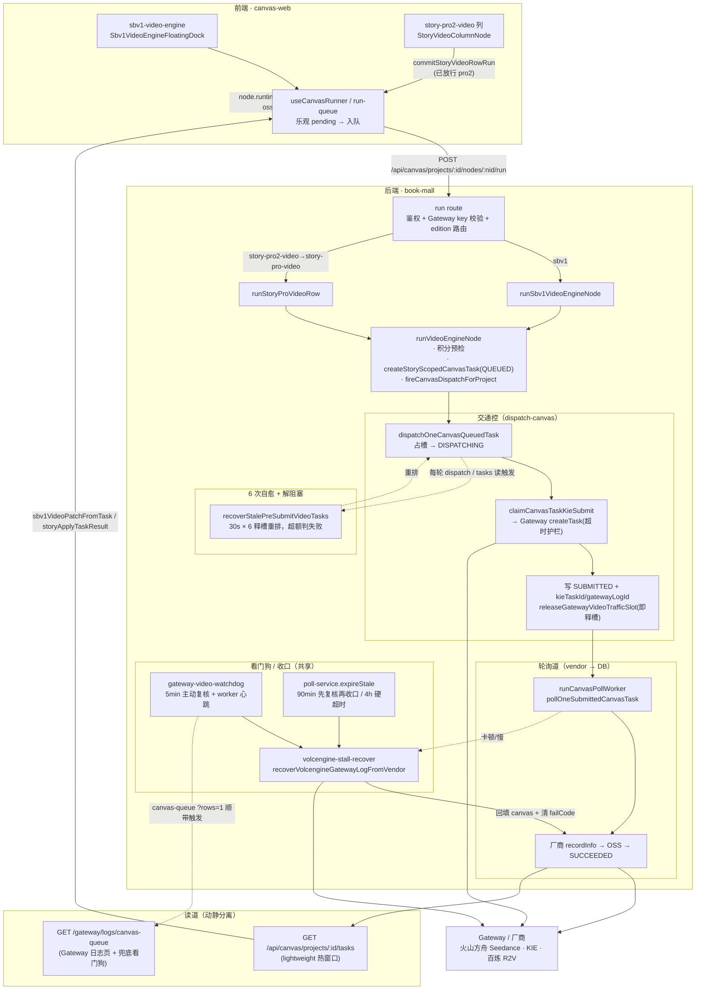

# 视频生成架构（现状图）

> 状态：基于当前代码实现的「快照」，用于看清 **分镜视频 1.0（sbv1）** 与 **影视专业版 2.0（Pro2）** 视频生成的真实链路。
> 调控规则（状态机/并发/自愈/解阻塞）以 `docs/视频生成自动调控-1.0.md` 为权威；本文只画「现状架构 + 谁走哪条路」。
> 关键结论：**sbv1 与 Pro2 的生视频，前端入口不同，但在 `runVideoEngineNode` 处汇流，之后共用同一套交通控 / 动静分离 / 6 次自愈 / 解阻塞 / 看门狗后端。**

---

## 1. 入口对照（前端节点 → 提交）

| 维度 | 分镜视频 1.0（sbv1） | 影视专业 2.0（Pro2）流水线列 | Pro2 画布复用 sbv1 |
|---|---|---|---|
| 节点类型 | `sbv1-video-engine`（LibTV 媒体卡） | `story-pro2-video`（流水线列，逐镜一行） | `sbv1-video-engine` |
| UI 组件 | `Sbv1VideoEngineFloatingDock` | `StoryVideoColumnNode`（挂在 `Pro2ColumnInspector`） | 同 sbv1 |
| 前端提交 | `useCanvasRunner.runOne` → `runCanvasNode` | `runRowVideo` → `commitStoryVideoRowRun` | 同 sbv1 |
| 后端 runner | `runSbv1VideoEngineNode` | run route 映射 `story-pro2-video → story-pro-video` → `runStoryProVideoRow` | `runSbv1VideoEngineNode` |
| `clientPage` | `canvas/{id}/sbv1` | `canvas/{id}/story-pro2` | `canvas/{id}/sbv1` |
| 汇流点 | **`runVideoEngineNode`** | **`runVideoEngineNode`** | **`runVideoEngineNode`** |

> 之前 `story-pro2-video` 在前端 `commitStoryVideoRowRun` 的内层守卫里被拒（只放行 `story-video-column` / `story-pro-video`），导致 Pro2 流水线生视频**提交不进后端**。已改为 `isAnyStoryVideoColumnType(...)`，三类视频列统一放行，Pro2 流水线视频自此接入共享后端。

---

## 2. 现状架构图（Mermaid）

---

## 3. 五大机制对齐核查（现状结论）

| 机制 | sbv1 | Pro2 流水线 | 实现位置（共享） |
|---|---|---|---|
| 交通控制 | ✅ | ✅ | `runVideoEngineNode` → `createStoryScopedCanvasTask(QUEUED)` → `fireCanvasDispatchForProject` → `dispatchOneCanvasQueuedTask` |
| 动静分离（读道/轮询道） | ✅ | ✅ | 读道 `GET /tasks`（lightweight 热窗口）；轮询道 `runCanvasPollWorker`，前端不直连厂商 |
| 6 次重试并释放（pre-submit 自愈） | ✅ | ✅ | `recover-stale-dispatching.ts` + `pre-submit-retry.ts`（30s × 6，`DISPATCHING_STALE_SEC` / `DISPATCH_STALE_RETRY_MAX`） |
| 阻塞释放 | ✅ | ✅ | `SUBMITTED` 即 `releaseGatewayVideoTrafficSlotIfOccupying`；stale 释槽；≥10min RUNNING 转后台生成 |
| 看门狗 / 收口 | ✅ | ✅ | `gateway-video-watchdog`（worker tick + canvas-queue 兜底）；`volcengine-stall-recover`；`poll-service.expireStale` 先复核再收口 |

> 因为两条入口都汇流到 `runVideoEngineNode`，`inputPayload.kind = "video-engine"`，五大机制对 Pro2 与 sbv1 **完全等价**，无需为 Pro2 另写一套调度。

---

## 4. 关键文件索引

| 层 | 文件 |
|---|---|
| 前端入队 | `canvas-web/lib/canvas/run-queue.ts`、`story-video-run.ts`、`sbv1/sbv1-video-engine-floating-dock.tsx` |
| run route | `book-mall/app/api/canvas/projects/[id]/nodes/[nodeId]/run/route.ts` |
| runner 汇流 | `book-mall/lib/canvas/sbv1-video-engine-runner.ts`、`story-pro-workspace-runner.ts`、`canvas-engine-runner.ts`（`runVideoEngineNode`） |
| 交通控 | `book-mall/lib/generation/traffic-control/dispatch-canvas.ts`、`fire-canvas-dispatch.ts`、`recover-stale-dispatching.ts`、`pre-submit-retry.ts`、`release-gateway-video-traffic-slot.ts` |
| 轮询/收口 | `book-mall/lib/canvas/canvas-task-service.ts`、`lib/gateway/poll-service.ts`、`volcengine-stall-recover.ts`、`gateway-video-watchdog.ts` |
| 读道 | `book-mall/app/api/canvas/projects/[id]/tasks/route.ts`、`app/api/gateway/logs/canvas-queue/route.ts` |
