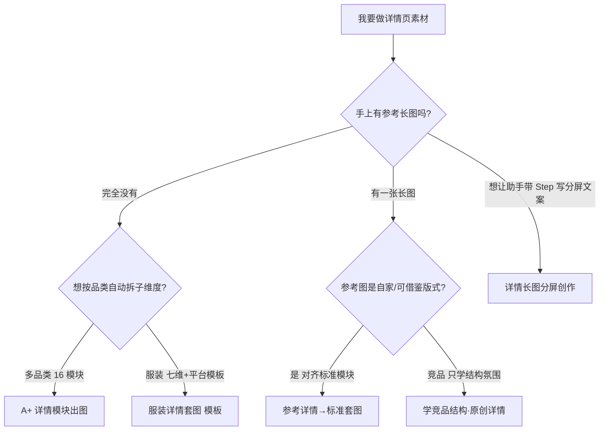

# 详情页工具怎么选 · 使用指南（5 个入口，一眼选对不混用）

> 这篇是写给**已经注册好、登录进去就能用**的你看的。不讲技术，只讲「点哪里、传什么、会出什么」。

---

## 这个功能是干嘛的？

一句话：电商工具箱里跟「详情页」相关的入口有 **5 个**，它们**产出形态不一样，别混着用**。一个项目一旦建好属于哪个工具就固定了，**中途改不了**另一种。这篇帮你用最短时间选对那个入口。

> 侧栏都在「**电商工具箱**」下面，挨个对照 tagline 就能认出来。

---

## 流程图（一眼看懂怎么选）

---

## 第一步：看 tagline（最省事）

5 个入口名字和一句话卖点如下，对着你手上的东西选：

| 工具名称 | Tagline | 你手上有… | 你更想要… |
| --- | --- | --- | --- |
| **A+ 详情模块出图** | 无参考图 · 16 模块 · 9 品类 · 自动子维度 | 产品实拍 + 卖点文案 | 按 A+ 模块批量写 Prompt、出图（含尺码/参数表程序化图） |
| **详情长图分屏创作** | 架构 + 分屏文案 · 助手 Step · 可接主图策略 | 产品图；可选详情长图参考 | 助手带 Step、分屏文案 + 每条 Prompt 对应一屏的详情长图 |
| **服装详情套图（模板）** | 无参考图 · 七维 + 平台模板 · 12 模块最多 49 张 | 服装产品图 + 七维偏好 | 按平台模板勾选 12 大模块/子维度，批量摄影套图 |
| **参考详情 → 标准套图** | 上传参考长图 · 拆入固定 12 模块 · 自家卖点出图 | 自家参考详情长图 + 产品图 | 学参考版式节奏，拆进标准 12 模块再出图（非像素级抄图） |
| **学竞品结构 · 原创详情** | 竞品只学结构/氛围 · 卡位可调 · 文案原创、只用自家图 | 竞品详情长截图 + 自有新品图 | 学爆款叙事与卡位，文案重写，出图只用自家商品/模特 |

---

## 第二步：分清最容易混的两对

### 「参考详情 → 标准套图」 vs 「学竞品结构 · 原创详情」

两者都能传一张很长的详情截图，但目的不同：

| | 参考详情 → 标准套图 | 学竞品结构 · 原创详情 |
| --- | --- | --- |
| 框架 | 固定 **12 大模块** | **卡位数量不固定**，可增删、排序、改重复张数 |
| 参考图角色 | 自家/可借鉴的详情版式 | 明确为竞品，只学结构/氛围，**禁止**照抄原文原图 |
| 文案 | 卖点来自你填的 sellPoints | AI **原创重写**，界面有合规提示 |
| 典型用户 | 「我就照着这张参考详情模块节奏做自家款」 | 「这张淘宝爆款结构好，我要用自家新品做类似叙事」 |

### 「A+ 详情模块出图」 vs 「服装详情套图（模板）」

| | A+ 详情模块出图 | 服装详情套图（模板） |
| --- | --- | --- |
| 模块体系 | **16 个 A+ 模块** | **12 个服装大模块** |
| 品类 | **9 品类**（含母婴、鞋靴、户外等），自动匹配子维度 | 首期以**服装七维 + 平台模板**为主 |
| 七维逐步采集 | 无（选品类 + 卖点即可） | 有（与口播故事版同一套七维选项） |

---

## 第三步：记入口路径（侧栏顺序对照）

1. A+ 详情模块出图 → 电商工具箱 → **A+ 详情模块出图**
2. 详情长图分屏创作 → 电商工具箱 → **详情长图分屏创作**（与主图创作并列，不在套图三件套里）
3. 服装详情套图（模板） → 电商工具箱 → **服装详情套图（模板）**
4. 参考详情 → 标准套图 → 电商工具箱 → **参考详情 → 标准套图**
5. 学竞品结构 · 原创详情 → 电商工具箱 → **学竞品结构 · 原创详情**

选对入口再开工，套图三条（3～5）中栏长得像，但新建项目、上传区、拆解按钮各不相同。

---

## 几个贴心小贴士

- 五个工具都归**同一套月费**（`e-commerce-toolkit`），具体扣费以生成时模型调用为准。
- 项目自动存云端，刷新页面能接着做；出图进**我的资产 / 生成历史**（按来源模块筛选）。
- 删项目要**二次确认**才生效；导出 ZIP（部分套图工具顶栏）只打包**你方**出图与文案，不含竞品原图。
- 已经用「电商产品主图创作」做完策略的，可在**详情长图分屏创作**里「从主图项目导入」，不用重填一遍。
