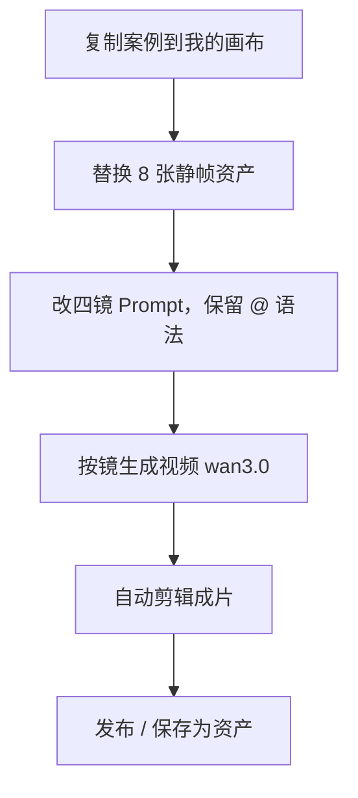
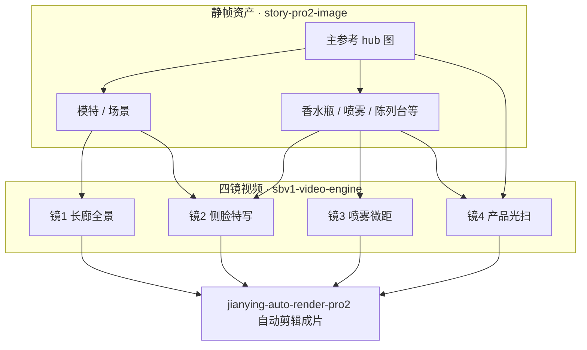

# 画布使用案例 · 香水专业级 TVC 广告

> **案例来源**：真实画布项目  
> **项目 ID**：`cmu4x48sk003ji6qr80k2qkga`  
> **项目名称**：香水专业级TVC广告  
> **文档日期**：2026-10-04  
> **读者**：需要做 **奢侈品/香水 TVC**、「分镜静帧 → 分镜视频 → 自动剪辑成片」的创作者  

本文根据 **`CanvasProject` 画布结构、连线与 `CanvasGenerationTask` 记录** 整理数据流与操作路径；不涉及计费细节。

---

## 流程总览

---

## 1. 案例在做什么

这是一条 **香水 TVC 短片** 工作流，特点如下：

- **不做** 完整 Pro2 剧本中心（无 script-hub / 角色表 / 分镜表列节点）。
- **先做资产静帧**：8 个 **Pro2 图片节点**，统一用 **nano-banana-pro** 出 **产品、模特、场景、喷雾** 等参考图。
- **再做 4 镜视频**：4 个 **分镜视频 1.0 · 视频合成节点**（`sbv1-video-engine`），模型 **wan3.0-video**，Prompt 里用 `@<sbv1-ref-节点id>` **点名引用** 上游静帧。
- **最后合成一条成片**：4 路视频全部连到 **1 个「自动剪辑成片」节点**（`jianying-auto-render-pro2`），节点上已有 **成片 video**。

项目已上 **门户案例墙**（`portalCase`），可在发现区「案例」中学习或 **复制到我的画布**。

**打开路径**（需登录且有权限）：`/canvas/cmu4x48sk003ji6qr80k2qkga`。

---

## 2. 画布结构一览

| 指标 | 本项目 |
|------|--------|
| 版本 | Pro2 画布 + **sbv1 视频合成** 混排 |
| 节点数 | **13**（8 图 + 4 视频 + 1 剪辑） |
| 连线 | **18** 条 |
| 打组 | 无（全部在 **同一画布** 平铺） |
| 静帧生成 | **13** 条任务登记为 IMAGE；其中 **9** 次 **nano-banana-pro**（8 张资产 + 1 次失败重试），**4** 次 **wan3.0-video**（对应 4 镜 I2V） |
| 任务结果 | **12** 成功、**1** 失败（上游超时后同节点已成功重跑） |

---

## 3. 静帧层：8 张参考图怎么分工

所有 **图片节点** 配置为 **nano-banana-pro**，且 **均已出图**（`ossUrl` 已写入）。从 **连线 + 视频 Prompt 引用** 可还原资产角色：

| 角色（推断） | 在视频 Prompt 中的引用 | 作用 |
|--------------|------------------------|------|
| **主产品瓶（清水瓶）** | `@<sbv1-ref-n_PaVBITJ0>` | 镜 4 陈列台主瓶、多路 hub 的 **中心参考** |
| **名模 / 人物** | `@<sbv1-ref-n_NwXOAB92>` | 镜 1 长廊背影、镜 2 侧脸、镜 3 颈部特写 |
| **长廊 / 场景** | `@<sbv1-ref-n_iIuNDuu1>` | 镜 1 极简冷灰大理石长廊 |
| **香水瓶身（手持）** | `@<sbv1-ref-n_7j74Do5g>` | 镜 2 手指抚瓶 |
| **喷雾画面** | `@<sbv1-ref-n_qTRGmWNx>` | 镜 3 超慢动作喷雾（该节点曾 **超时失败一次**，重试后成功） |
| **陈列台** | `@<sbv1-ref-n_xRuJG7E7>` | 镜 4 中央展台 |
| 其他静帧 | 由 **hub 图** 再连出 2 张下游图 | 丰富参考，供多镜 @ 引用 |

**数据流习惯：**

1. 先建 **1～2 个无上游** 的图片节点（本案例有 **2 个根节点** 和 **1 个 hub**：`n_PaVBITJ0` 向 **5 个下游** 连边）。
2. **hub → 多下游**：同一产品/场景拆成 **瓶、台、人、雾** 多张静帧，方便视频节点 **只 @ 需要的 ref**。
3. 每条 **图片 → 图片** 边表示「参考上一张再出一版资产」（本案例共 **5** 条图→图边）。

---

## 4. 视频层：四镜 TVC 脚本（来自节点 Prompt）

四个 **视频合成节点** 均使用 **wan3.0-video**，Prompt 为 **中文 + 运镜术语 + @ 引用**。摘要如下（保留原意，便于你对照画布）：

### 镜 1 · 长廊全景

- **画面**：极简冷灰大理石长廊；名模身着白色轻盈丝绸长裙，**背对镜头**向深处走；高机位俯拍，Sl（Slide/滑轨类运镜，以节点完整 Prompt 为准）。
- **引用**：长廊 `@n_iIuNDuu1`、模特 `@n_NwXOAB92`。

### 镜 2 · 侧脸与瓶身

- **画面**：中景切特写；模特清冷侧脸、低垂眼神；手指轻抚香水瓶；**Slow Zoom In** 向瓶盖；侧逆光。
- **引用**：模特 `@n_NwXOAB92`、瓶身 `@n_7j74Do5g`。

### 镜 3 · 喷雾微距

- **画面**：极致微距、丁达尔光束；香水喷雾 **Super Slow-Motion**；水珠飘散；快切至模特颈部特写。
- **引用**：喷雾 `@n_qTRGmWNx`、模特 `@n_NwXOAB92`。

### 镜 4 · 产品英雄镜头

- **画面**：陈列台中央；产品瓶 **静态直立**；**Light Sweep** 聚光从左扫至右，点亮金色字标。
- **引用**：陈列台 `@n_xRuJG7E7`、主瓶 `@n_PaVBITJ0`。

**操作要点：**

- 在 **视频合成节点** 底部 Dock 写 Prompt 时，用 **`@<sbv1-ref-图片节点id>`** 锁定资产，避免脸/瓶漂移。
- 每个视频节点 **incoming** 2～3 条来自不同静帧（本案例最多 **3** 条入边到同一视频节点）。

---

## 5. 成片层：自动剪辑

- **1 个** `jianying-auto-render-pro2` 节点。
- **4 条** 边：每个 **sbv1-video-engine** → 剪辑节点。
- 节点状态：**已有成片 video**（`videoUrl`），即 **四镜拼接/剪辑后的 TVC**。

**你怎么做：**

1. 四镜视频均 **生成成功** 后再点剪辑节点 **自动剪辑成片**（具体按钮以 Pro2 剪辑节点 UI 为准）。
2. 等待 **Media Render** 类任务完成，在节点上预览或下载。

---

## 6. 推荐复现步骤（香水 TVC 模板）

1. **复制案例**  
   发现区「案例」→ 本项目 → **复制到我的画布**；或向作者要 **工作流 10 位分享码**（见 《分享功能 · 使用指南》（见本节点））。

2. **替换静帧（8 张图）**  
   - 保留 **hub 结构**：1 张主瓶/主视觉 → 连到模特、场景、瓶、喷雾、展台等节点。  
   - 逐节点 **上传或重生成**（nano-banana-pro），保证每个 `@sbv1-ref-*` 指向的图已是 **你的品牌资产**。

3. **改四镜 Prompt，保留 @ 语法**  
   - 只改 **文案与运镜**；**不要删** `@<sbv1-ref-…>`，除非你也改了对应静帧节点 id（复制项目后 id 会变，需 **在 UI 里重新 @ 选参考**）。

4. **按镜生成视频**  
   - 模型：**wan3.0-video**（或 Gateway 中等效 I2V）。  
   - 若遇 **上游超时**（本案例 `n_qTRGmWNx` 曾失败一次），**同节点重试** 即可。

5. **自动剪辑**  
   - 确认四镜均有可播视频 → 运行 **jianying-auto-render-pro2** → 导出成片。

6. **可选后续**  
   - 一键发布到社交平台（与画布分享不同，见一键发布门户）。  
   - 保存静帧为 **项目资产**，下一支 TVC 复用同一模特/瓶型。

---

## 7. 和「标准 Pro2 影视线」的对比

| 标准 Pro2 长片 | 本香水 TVC 案例 |
|----------------|-----------------|
| script-hub 定稿 → 分镜表 | **跳过** 剧本中心，Prompt 直接写在 **视频合成节点** |
| story-pro2-frame 分镜静帧 | 用 **story-pro2-image** 当 **广告资产板** |
| story-pro2-video | 用 **sbv1-video-engine**（分镜视频 1.0 合成） |
| 剪映包 | 用 **jianying-auto-render-pro2** 直接 **自动剪辑 MP4** |

适合 **15～30 秒奢侈品 TVC**、镜头数固定、**资产驱动 + 分镜 I2V** 的团队。

---

## 8. 常见问题

**Q：为什么任务表里视频也是 `kind: IMAGE`？**  
A：当前实现里 **wan3.0-video** 等 I2V 任务在 `CanvasGenerationTask` 中可能仍记为 IMAGE；以节点上是否出现 **可播视频** 为准。

**Q：视频节点上暂时看不到 videoUrl？**  
A：数据库快照时视频 URL 可能在 **剪辑节点** 或 **任务完成后** 才回写；打开 live 画布以 UI 为准。本案例 **剪辑节点已有成片**。

**Q：只有 13 个节点，能扩成 6 镜吗？**  
A：可以 **复制 sbv1-video-engine** 节点，连到新静帧与新 Prompt，再 **全部接入** 同一剪辑节点（注意平台剪辑时长与并发限制，见产品说明）。

**Q：和上一个「融图配饰」案例有何不同？**  
A：上一案例是 **多组静帧实验**；本案例是 **静帧 → 四镜 I2V → 一条 TVC 成片** 的 **广告成片线**。

---

## 9. 相关文档

- 《AI 画布 · 使用指南》（见本节点）  
- 《图片编辑·涂鸦·融图·配饰 · 使用指南》（见本节点）（静帧实验型案例）  
- 节点交互与分镜视频 1.0 工作流：以画布内右侧面板与节点菜单为准。
---

## 10. 变更记录

| 日期 | 说明 |
|------|------|
| 2026-10-04 | 初版：基于项目 `cmu4x48sk003ji6qr80k2qkga` 数据流追踪 |
