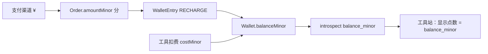

# 学习端 · 点数与主站钱包 / 充值对齐方案

> 与 `learning-pricing-requirements.md`、`learning-pricing-solution.md` 配套。  
> 目标：若 **学习端 / 工具站 UI 使用「点数」**，与 **主站充值、钱包、扣费** **同一套账本、同一套数值**，避免双轨余额。

---

## 1. 现状（主站事实源）

| 概念 | 实现 | 说明 |
|------|------|------|
| 余额 | `Wallet.balanceMinor`（`book-mall/prisma/schema.prisma`） | 整数，单位为 **人民币「分」**（1 元 = 100）。 |
| 充值 | `Order.type = WALLET_TOPUP`，`amountMinor` 与 `WalletEntry` 入账 | 支付渠道展示「元」，入账持久化为 **分**。 |
| 工具扣费 | `recordToolUsageAndConsumeWallet` → 扣减 `balanceMinor`，写入 `ToolUsageEvent.costMinor` | 与标价表 `ToolBillablePrice.priceMinor` 一致（分）。 |
| 会话可见余额 | `GET /api/sso/tools/introspect` 等返回 `balance_minor` | 工具站据此展示水位，单位仍为 **分**。 |

**结论**：主站没有独立的「点数字段」；**分（minor）就是唯一账本单位**。学习端若要「点数」，应定义为该单位的 **产品别名**，而不是第二套货币。

---

## 2. 推荐约定：点数 = 分（1:1）

| 条款 | 约定 |
|------|------|
| **定义** | **1 点 = 1 分人民币**（0.01 元）。 |
| **余额** | `balanceMinor` = 可用点数（数值相等，文案可称「点」）。 |
| **充值** | 用户支付 **¥N** → 到账 **N × 100 点**（与 `amountMinor` 入账一致）。 |
| **扣费** | 单次工具消费 **P 点** ↔ `costMinor = P`，与现有 `POST /api/sso/tools/usage` 不变。 |
| **×2.0 零售单价** | 内部成本（元）→ 零售（元）→ **换算为分** → 即 **标价点数**（若需整数点，四舍五入到整数分）。 |

这样 **无需** 在主站新加「点数池」表，也 **无需** 工具站维护私有余额；两边天然一致。

---

## 3. 与零售价系数的关系（简要）

1. 官方中国内地 **成本**（元）经内部表或 catalog 确定。  
2. **零售（元）** = 成本 × `RETAIL_MULTIPLIER`（2.0）。  
3. **标价（分/点）** = `round(零售元 × 100)`，写入 `ToolBillablePrice.priceMinor`（或由运营按公式填）。  
4. 用户侧文案示例：「本操作约消费 **{priceMinor} 点**（约 ¥{(priceMinor/100).toFixed(2)}）」— 后一半可选，用于降低理解成本。

---

## 4. 充值与展示链路（须一致）

- **禁止**：工具站 LocalStorage 或独立服务存「余额点数」作为扣费依据。  
- **必须**：一切以主站钱包 + SSO 上报结果为准；点数仅为 **同一数值的展示名**。

---

## 5. 文案与合规

- 用户协议 / 充值页可写：「**点数与账户余额（分）一一对应，100 点 = 1 元人民币**」或等价表述。  
- 若未来改为「1 点 = 1 元」等其它比例，须 **迁移脚本** 调整 `balanceMinor` 与所有历史 `WalletEntry`/`ToolUsageEvent` 口径（不推荐首期做）。

---

## 6. 新平台复制清单（在 `learning-pricing-solution.md` §8 基础上补充）

- [ ] 明确 **点数定义**（推荐 1 点 = 1 分）并写入产品 / 法务可见文档  
- [ ] 钱包字段是否仍为 `*Minor`（分）或等价物  
- [ ] `introspect` / 余额 API 是否暴露同一单位  
- [ ] 工具标价表是否仍为 **整数 minor**  
- [ ] 前端「点」与「元」换算仅用于展示，**单笔扣费仍以 API 为准**

---

## 7. 修订记录

| 版本 | 日期 | 变更摘要 |
|------|------|----------|
| 0.1 | 2026-05-13 | 首版：点数=分 1:1、与充值/扣费/introspect 对齐、禁止双轨余额 |

---

*路径：`tool-web/doc/product/learning-pricing-wallet-points.md`*
